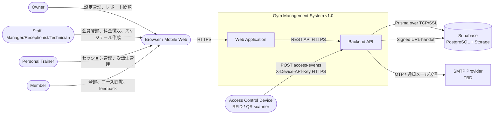
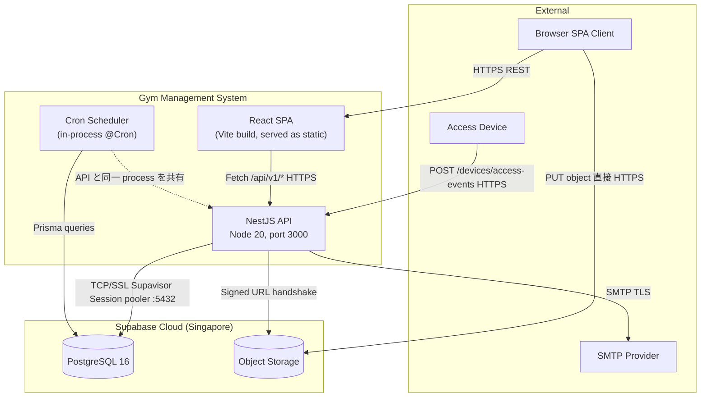
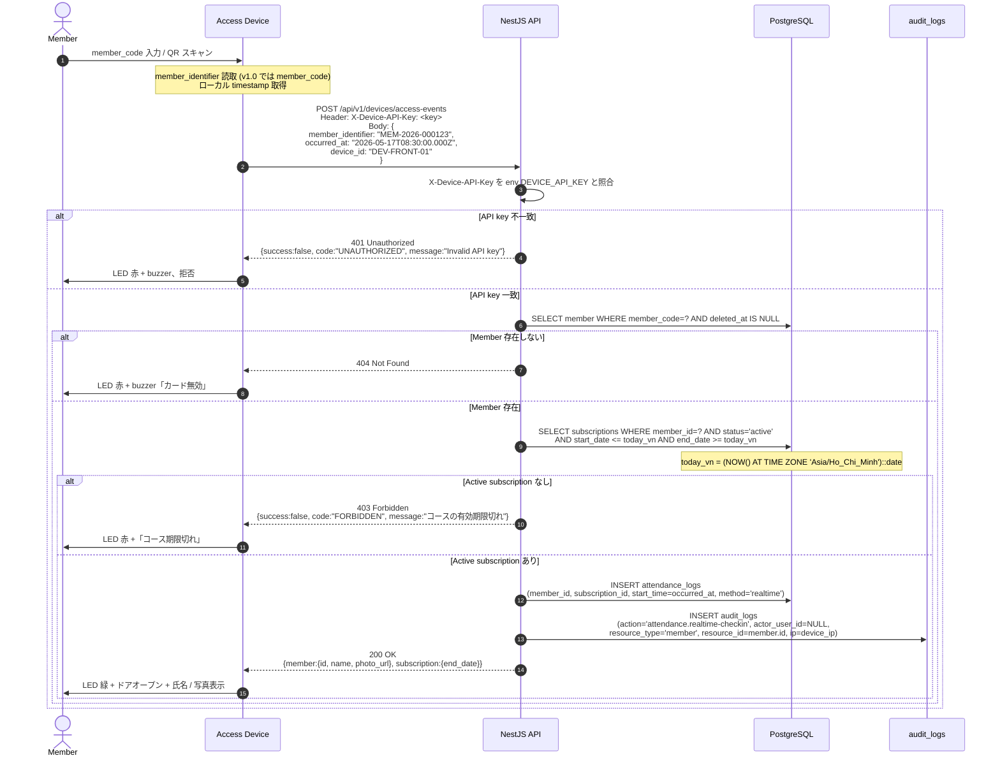
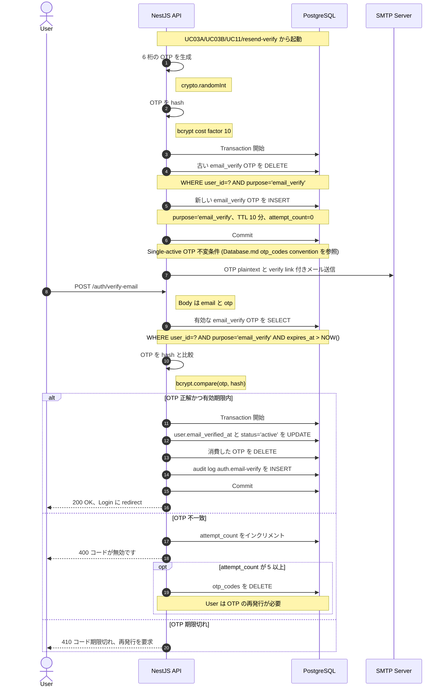
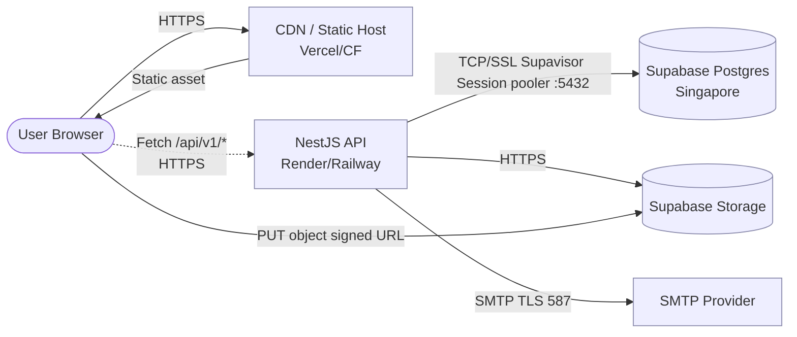

# Architecture & High-Level Design

| Field | Value |
|---|---|
| Document ID | GMS-ARCH-001 |
| Version | 1.1.5 |
| Status | Draft |
| Author | Lê Thanh An (initial draft 2026-05-16) |
| Reviewers | TBD — チーム編成時に backend lead 1名 + DBA 1名 + DevOps 1名以上 |
| Last Updated | 2026-05-17 |
| Related docs | [`docs/VI/SRS_VI.md`](../VI/SRS_VI.md), [`docs/Design/Database.md`](./Database.md), [`server/README.md`](../../server/README.md) |

---

## 1. Document Info

### 1.1 目的

本書は、Gym Management System v1.0 のアーキテクチャおよび High-Level Design を規定する。マクロからミクロへの構成で記述する: system context, tech stack, container boundary から cross-cutting concerns, operations, NFR, decision log まで。

### 1.2 範囲

In-scope:
- System context (C4 Level 1) と container diagram (C4 Level 2)。
- Technology stack と採用理由。
- Backend (NestJS) と frontend (React) の module boundary。
- Cross-cutting: authentication, RBAC, API convention, error handling, audit, timezone, currency, SLA。
- Operations: deployment topology, background jobs, CI/CD, secrets, observability, backup/DR。
- Non-functional requirements (performance, availability, security/threat model)。
- Architectural Decision Records (ADR) を inline で記載。
- v1.1+ に延期される Roadmap items。

Out-of-scope:
- 業務要件 ([`SRS_VI.md`](../VI/SRS_VI.md) を参照)。
- 詳細な schema entity ([`Database.md`](./Database.md) を参照)。
- Endpoint 単位の API spec (本書が安定した後に作成)。
- Component-level design (C4 Level 3) — 代わりに §3.1+3.2 の module list を使用。

### 1.3 想定読者

Backend developer, frontend developer, architect, DevOps, QA, security reviewer。§2-3 を順に読めばシステム全体を把握できる。§4-6 は operations 実装担当者向け、§7-8 は architect の意思決定者向け。

---

## 2. System Overview

### 2.1 System Context (C4 Level 1)

システム境界と、相互作用する actor / external system。



Actor と external system:

| Entity | 種類 | 役割 |
|---|---|---|
| Owner | Actor (primary user) | システム設定、KPI レポート閲覧、スタッフ管理。 |
| Staff | Actor (primary user) | カウンターでの会員登録、料金徴収、スケジュール、feedback 対応。Sub-position: manager (staff 全権限)、receptionist (受付)、technician (機器保守)。 |
| Trainer (PT) | Actor (primary user) | セッションのスケジュール作成、受講生の進捗記録、自身が担当する会員の閲覧 (`primary_trainer_id`)。 |
| Member | Actor (primary user) | オンライン登録 (UC03B)、コース閲覧、feedback 送信、進捗閲覧。 |
| Access Control Device | Actor (system) | 入口の card / QR スキャナー。API key 経由でリアルタイム check-in API を呼ぶ。 |
| Supabase | External system | Managed PostgreSQL 16 (transaction pooler + session pooler) + ファイル用 Object Storage。 |
| SMTP Provider | External system | OTP メール (verify, reset password)、subscription キャンセル通知の送信。v1.0 では provider 未確定 — dev 用 placeholder として OTP を stdout にログ出力。 |
| Browser | External | ユーザの web browser (Chrome/Firefox/Edge desktop および mobile web)。v1.0 では native app なし。 |

### 2.2 Tech Stack と採用理由

| Layer | Technology | Version | 採用理由 | 不採用となった代替案 |
|---|---|---|---|---|
| Backend framework | NestJS | 10.x | TypeScript first。DI container + decorator + module system は OOP/Java/.NET 背景のチームに適合。ecosystem が成熟 (Passport, class-validator, Prisma integration)。 | Express 単体 (multi-dev チーム向けの構造不足)。Fastify (RBAC/auth パターンのドキュメント不足)。 |
| ORM | Prisma | 5.x | Schema-as-code、type-safe query、migration UX が良い、generated client。Supabase の `db push` workflow に適合。 | TypeORM (decorator が重く migration drift が発生しやすい)。Drizzle (2026 Q2 時点で feature parity が未安定)。 |
| Database | PostgreSQL | 16 (Supabase) | Open-source RDBMS の標準。Supabase が managed Postgres + Auth + Storage + dashboard を pooler 付きで提供。チームは既に `BIGSERIAL` PK パターンを使用済み。 | MySQL/MariaDB (transactional DDL が弱い)。MongoDB (RBAC + JOIN 多用の reporting に不向き)。 |
| Storage | Supabase Storage | S3-compatible | Supabase project を既に保有。signed URL handoff により API 経由のバイト proxy を回避。1 オブジェクト max 10MB で avatar/document に適合。 | AWS S3 を直接利用 (アカウント追加と IAM が煩雑)。Local filesystem (horizontal scale 不可)。 |
| Frontend bundler | Vite | 5.x | Dev server が高速 (ESM HMR)、production build は Rollup で安定。`proxy /api → localhost:3000` の設定が単純。 | Webpack (dev start が遅い)。CRA (deprecated)。 |
| Frontend framework | React | 18 | Component ecosystem が広い。チームが習熟済み。concurrent features (Suspense) が list view に有用。 | Vue 3 (チームの経験不足)。Svelte (ecosystem が小さい)。 |
| Client state | Zustand + TanStack Query | Zustand 4, TQ 5 | Zustand は軽量な client state (auth, UI preference) 用。TanStack Query は cache + retry + stale time 付きで server state 用。 | Redux Toolkit (MVP 規模に対し boilerplate 過多)。SWR (TQ の機能の方が豊富)。 |
| Auth | JWT + Passport | jsonwebtoken 9 | Stateless で、session store なしで horizontal scale 可能。Passport strategy は NestJS の標準。 | Session cookie + Redis (依存追加)。Auth0 (コストと vendor lock-in)。 |
| Validation | class-validator + class-transformer | Latest | NestJS の `ValidationPipe` global と統合。decorator を DTO に直接付与。 | Zod (custom pipe が必要)。Joi (NestJS の慣習に合わない)。 |
| Styling | Tailwind CSS + Material Design 3 tokens | TW 3.x | Utility-first で UI 構築が高速。MD3 token により theme の一貫性確保。 | CSS Modules (冗長)。Styled Components (runtime overhead)。 |

Stack に付随する architectural な決定は §7 の ADR-001..ADR-014 を参照。

### 2.3 Container Diagram (C4 Level 2)

GMS の system boundary 内で独立して実行される container と、相互間の protocol。



| Container | 責務 | 言語 / Runtime | Port |
|---|---|---|---|
| React SPA | UI rendering、client routing、auth state、optimistic UI。Build artifact `client/dist/` を CDN / static host で配信。 | TypeScript + React 18 | 5173 dev / 443 prod |
| NestJS API | Business logic、validation、RBAC enforcement、JWT 発行、Prisma queries、audit interceptor。 | TypeScript + Node 20 | 3000 |
| Cron Scheduler | 9 個の background job (§5.2 参照)。v1.0 は NestJS API と同一 process 内で動作 (1 instance)。 | TypeScript (NestJS `@Cron`) | — |
| PostgreSQL | 業務データと audit log を永続化。21 テーブル (業務 20 + `otp_codes`)。 | Postgres 16 | 5432 / 6543 (pooler) |
| Object Storage | File 永続化: avatar, document, equipment doc。1 ファイル max 10MB。 | Supabase Storage (S3) | 443 |
| SMTP Provider | Outbound メール (OTP, 通知)。Provider 未確定 — dev placeholder。 | TBD (候補: Resend, SendGrid, AWS SES) | 587 / 465 |

Container 境界: SPA と API は別々に deploy (SPA は static、API は stateful)。DB と Storage は managed service (self-host しない)。Cron は v1.0 では独立した container ではなく API と同一 process。Job runner を別 process に分離するのは v1.1 で延期 (§5.2 multi-instance を参照)。

---

## 3. Module Architecture

### 3.1 Backend modules (NestJS)

```
server/src/
  auth/          JWT、OTP、password reset、email verify (lockout は v1.1 に延期 — §8 R20 を参照)
  users/         User CRUD と role 解決 (findByEmailWithRoles)
  members/       Member profile、subscription view、trainer 割り当て
  staff/         Staff profile、schedule、position
  groups/        RBAC groups と permissions 割り当て
  packages/      Package CRUD、time-based pricing
  subscriptions/ Subscription lifecycle、cron trigger
  payments/      Payment record、決済ゲートウェイ連携 (v1.0 では mock)
  sessions/      Training session (UC05A schedule + UC05B real-time)
  attendance/    attendance_logs、device callback endpoint
  rooms/         gym_rooms CRUD
  equipment/     Equipment と maintenance logs
  feedback/      Feedback 受付と SLA tracking
  reports/       UC12 用の集計 query
  audit/         Audit interceptor と query endpoint (owner)
  files/         Supabase Storage アップロード用の signed URL handshake
  health/        GET /health (prefix /api/v1 を通らない)
  common/        共有の filters, decorators, pipes, interceptors
  prisma/        PrismaService を包む @Global() の PrismaModule
  config/        Environment validation (class-validator)
```

各 module は独立しており、`app.module.ts` で import する。`PrismaModule` は `@Global()` — 他 module は `PrismaService` を直接 inject できる。

Convention: file 名は `kebab-case.ts` + 種別 suffix (`.controller`, `.service`, `.module`, `.guard`, `.decorator`, `.dto`, `.interface`, `.filter`)。Comment はベトナム語、identifier と log message は英語。

### 3.2 Frontend layers

```
client/src/
  pages/        Route component、role-aware (RoleDashboardPage が owner/staff/trainer/member をルーティング)
  components/   再利用 UI (Material Design 3 tokens、btn-primary、input-base、card)
  hooks/        Custom hooks (useAuth、useMembers、…)
  services/     Axios instance + module 単位の API client (api.ts → auth.service.ts → ...)
  stores/       Zustand stores (authStore は user/token/isAuthenticated を partialize)
  router/       React Router 6 + ProtectedRoute (JWT + role check)
```

Convention: components/pages は `PascalCase.tsx`、hooks/stores/services は `camelCase.ts`。Path alias `@/` → `src/`。Vite dev proxy `/api → http://localhost:3000` により dev 環境の CORS を排除。

### 3.3 Data Flow Example — UC05B Real-time Check-in (E2E)

データが各 container をどう通るかを理解する end-to-end の例。Device → API → DB → audit log を貫く check-in pattern の代表例。



各 hop における data shape:

- **Device → API request**: 3 field — `member_identifier` (string。v1.0 では必ず `member_code`。`members` テーブルに `card_id` カラムはまだない。RFID card_id と QR payload は v1.1 に延期、§8 Roadmap を参照)、`occurred_at` (ISO 8601 UTC)、`device_id` (string、debug 用に device を識別)。
- **API key validate**: timing attack を避けるため `crypto.timingSafeEqual` で比較する。
- **Subscription check**: 境界判定には `today_vn` を使う (§4.5 timezone を参照)。理由: VN 時刻 23:59 に check-in した member が翌日として扱われない。
- **attendance_logs row**: `start_time = occurred_at` (UTC)、`end_time = NULL` (real-time は終了時刻なし)、`method = 'realtime'` で UC05A の manual check-in と区別。
- **audit_logs row**: `actor_user_id = NULL` (device は user ではないため)、`resource_type/resource_id` は member を指す、`before_data = NULL`、`after_data = {attendance_log_id}`。
- **API → Device response (200)**: `member.photo_url` (Supabase Storage の signed URL、TTL 5 分) と `subscription.end_date` を返し、device 側で更新が近い場合にリマインダーを表示する。実装: server で `users.avatar_file_id → files.storage_path` (`files` テーブル) を resolve し、`supabase.storage.from(bucket).createSignedUrl(path, 300)` を呼ぶ。`bucket = process.env.SUPABASE_STORAGE_BUCKET` (default `gym-media`)。Member に avatar が無い場合 (`avatar_file_id = NULL`) は `photo_url = null` を返す。

Retry と idempotency: device は network fail 時に backoff (1s, 4s, 16s) で 3 回まで自動 retry。Idempotency key は `(device_id, occurred_at)` で、同じ event を再送した場合 server 側で dedupe できる。v1.0 では application logic で dedupe。UNIQUE constraint は未追加 — duplicate rate が観測された時点で延期検討。

---

## 4. Cross-Cutting Concerns

### 4.1 Authentication & Authorization

#### 4.1.1 JWT

- Payload: `{ sub: string, email: string, roles: Role[] }`。`sub` は string (BigInt PK を cast — ADR-002 を参照)。
- TTL: 7 日。v1.0 では refresh token なし (ADR-008 を参照)。
- Algorithm: HS256。env `JWT_SECRET` (最小 32 文字)。
- Header: `Authorization: Bearer <token>`。

#### 4.1.2 RBAC

- 主要 role 4 種: `owner`、`staff` (position `manager`/`receptionist`/`technician` を含む)、`pt` (trainer)、`member`。
- 関係: `users ↔ groups` を `user_groups` 経由、`groups ↔ permissions` を `group_permissions` 経由 ([Database.md §3](./Database.md) を参照)。
- Login 時に解決: `UsersService.findByEmailWithRoles()` が `user_groups → groups → group_permissions` を join し `Role[]` を返す。
- Guards: `JwtAuthGuard` は global (デフォルトで有効)、`RolesGuard` は route 単位。`@Public()` で auth 不要の endpoint を opt-out、`@Roles('owner', 'staff')` で role を whitelist。
- `RolesGuard` は `roles.some()` を使う — `roles[0]` の equality に変えない (multi-role support が壊れる、`.claude/rules/security.md` を参照)。

#### 4.1.3 Email Verification Flow

新規 user 全員に適用: UC03A/UC03B 経由の会員、UC11 経由の staff。

前提条件: `users.status='pending_verification'`、`users.email_verified_at IS NULL`。



Endpoints:

| Method | Path | Body | Response |
|---|---|---|---|
| POST | `/api/v1/auth/verify-email` | `{ email, otp }` | 200/400/410 |
| POST | `/api/v1/auth/resend-verify` | `{ email }` | 200 (rate-limit 3 リクエスト / 時 / email — `/auth/forgot-password` §4.1.4 と統一) |

#### 4.1.4 Password Reset Flow

SRS UC02 を参照。仕組みは Email Verification と同じ: 6 桁 OTP、bcrypt hash、TTL 10 分、`purpose='password_reset'`。

- **Single-active OTP 不変条件:** User が `/auth/forgot-password` または `/auth/resend-verify` を resend する場合、新しい OTP を INSERT する前に同一 `$transaction` 内で `DELETE FROM otp_codes WHERE user_id=? AND purpose=?` を実行する。理由: 複数の OTP が共存すると security gap が生じる (古い OTP も expire まで有効、attacker が 2 つの OTP を race で取得、attempt_count counter が bypass される)。Application 層で enforce — DB の UNIQUE constraint は追加しない。OTP は lifecycle を持つため (used → DELETE)。[Database.md otp_codes convention](./Database.md#otp_codes) を参照。
- Rate limit: 1 email 当たり 1 時間に 3 リクエスト (abuse 防止)。v1.0 の実装: `AuthService` 内の in-memory `Map<email, timestamp[]>` (process 単位、restart でリセット — single-instance API v1.0 では許容)。リクエストごとに `Date.now()` を push し、1 時間ウィンドウ内の timestamps だけ残す。length ≥ 3 なら同一の anti-enumeration 200 response を返す (実際にメール送信しない)。Redis-backed は v1.1 に延期 (§8 R12 global rate limiter を参照)。
- Login lockout: **v1.1+ に延期** (§8 R20 を参照)。v1.0 では各 failed login は 401 Unauthorized のみで、counter 加算も account lock も行わない。Trade-off: brute-force リスクがある。Mitigation は上記 `/forgot-password` の rate limit と、pre-production で global WAF (Cloudflare) を入れる。v1.1 で有効化するには `users.failed_login_count` + `users.last_failed_login_at` カラム + unlock cron + audit action `auth.lockout`/`auth.unlock`/`auth.admin-unlock` の追加が必要。
- `reset-password` における atomic transaction: `$transaction` 内で password_hash の UPDATE と otp_codes の DELETE を同時に行う — 一方が fail すれば両方 rollback。
- Anti-enumeration: `/forgot-password` の response は email の存在に関係なく常に 200 OK を返し、存在 leak を防ぐ。

#### 4.1.5 Device Authentication (UC05B)

Access Control Device は member check-in のたびに backend を呼ぶ。認証は header `X-Device-API-Key` と env `DEVICE_API_KEY` の比較で行う。

Endpoint:

| Method | Path | Auth | Body | Response |
|---|---|---|---|---|
| POST | `/api/v1/devices/access-events` | `X-Device-API-Key` | `{ member_identifier: string, occurred_at: ISO8601, device_id: string }` (v1.0: `member_identifier` = `member_code`) | 200/401/403/404 |

Device API key rotation:

- v1.0: env `DEVICE_API_KEY` で固定。Rotation は手動: 新 env を deploy → API server を restart → device firmware に key を更新 → check-in を verify。Downtime: 約 5 分 (ADR-007 を参照)。
- Trade-off: 1 key を全 device で共有するため、1 台 device が leak すると全体が compromise される。v1.0 は gym あたり 1-2 device で controlled deploy のため許容。
- v1.1+: テーブル `devices(device_id, api_key_hash, last_seen_at, rotated_at)` で per-device key と月次 rotation cron を導入。§8 Roadmap を参照。

Retry と idempotency: §3.3 (Data Flow E2E) を参照。

### 4.2 API Conventions

| 項目 | 規約 |
|---|---|
| Versioning | Path-based `/api/v1`。Breaking change は `/v2` に bump。header-based ではない。 |
| Pagination | Query `?page=1&pageSize=20`。Default `pageSize=20`、max `100`。Cursor 形式 `?cursor=<id>` は v1.1 に延期 (§8 を参照)。 |
| Sort | Default `created_at DESC`。Param `?sort=field:asc` または `?sort=field:desc`。 |
| Filter | Flat な query string: `?status=active&from=2026-01-01&to=2026-12-31`。 |
| Response (list) | `{ data: [...], meta: { page, pageSize, total } }` |
| Response (single) | Resource object を直接返す |
| Error response | `{ success: false, code, message, details? }` — `HttpExceptionFilter` で標準化 (`server/src/common/filters/http-exception.filter.ts` を参照)。Validation の場合は `details: string[]` に field エラーリスト。 |
| HTTP status mapping | P2002 (UNIQUE) → 409、P2025 (not found) → 404、ValidationError → 400、JwtAuthGuard fail → 401、RolesGuard fail → 403。 |
| Datetime format | ISO 8601 UTC、例 `2026-04-28T10:30:00.000Z`。Client は Asia/Ho_Chi_Minh で display。 |
| ID serialization | BigInt PK → string (`main.ts` で `BigInt.prototype.toJSON` を patch)。 |
| Auth | `@Public()` 無しの全 endpoint で `Authorization: Bearer <JWT>` を要求。 |

#### 4.2.1 Real-time pattern (2 つの仕組みを明確に区別)

v1.0 には 2 つの distinct な仕組みがある。混同しないこと:

1. **Device push** (UC05B): Access Device が check-in event のたびに `/devices/access-events` を能動的に POST する。Server 側は受信 endpoint のみで、SSE/WebSocket は不要。Tap から response までの latency target: <500ms。
2. **Client polling**: PT/staff/owner の UI dashboard が 30 秒ごとに list endpoint を `GET` で poll して状態を refresh (例: 実施中の session 一覧、最新の attendance log)。TanStack Query の `refetchInterval: 30000`。WebSocket / SSE は v1.1 に延期。

#### 4.2.2 Idempotency

v1.0 は mutation endpoint に idempotency header を enforce しない。理由: v1.0 stack に storage substrate がない (PostgreSQL のみ、Redis なし、cache layer なし)。稀な retry のために `idempotency_keys` テーブルを追加するのは MVP として over-engineering。v1.1+ に延期 (§8 Roadmap を参照)。

現在の double-action リスクに対する mitigation:

- `POST /api/v1/payments` — client UI が初回 click 後に submit button を disable し、response が返るまで spinner を表示。Server 側: `payments` record の `transaction_reference` に UNIQUE constraint (同一 reference を 2 回送ると P2002 → 409 Conflict)。client が `transaction_reference` を渡さない場合 (例: カウンターでの現金決済)、稀な double-charge は許容し audit log で manual に検出・refund する。
- `POST /api/v1/devices/access-events` (UC05B) — application logic で `(device_id, occurred_at)` のペア dedup を行う。`attendance_logs` を INSERT する前に同一ペアの既存 log を 60 秒ウィンドウで query し、存在すれば INSERT を skip して 200 OK と既存 attendance_log を返す。v1.0 では UNIQUE constraint を追加しない (duplicate rate の観測待ち)。§3.3 の Retry policy を参照。
- その他の mutation: HTTP semantics に基づく retry 動作を許容 (POST → 200/4xx → client の retry は client の責任)。

許容する trade-off: client が network timeout を retry し、かつ server 処理が完了していた場合に稀な double-write が起こり得る。v1.0 規模 (5-10 gym、決済量 < 100/日) では mitigation で十分。v1.1+ で `POST /payments` の `Idempotency-Key` 完全対応と generic interceptor を追加 (§8 を参照)。

#### 4.2.3 Error envelope の詳細

Source-of-truth: `server/src/common/filters/http-exception.filter.ts` (lines 12-17 が envelope shape、105-152 が code mapping)。

```json
{
  "success": false,
  "code": "DUPLICATE_VALUE",
  "message": "メールアドレスは既に存在します"
}
```

Validation (`code: "VALIDATION_ERROR"`、HTTP 400):

```json
{
  "success": false,
  "code": "VALIDATION_ERROR",
  "message": "入力データが無効です",
  "details": ["email は有効である必要があります", "password は 8 文字以上である必要があります"]
}
```

固定 field:

- `success: false` — success envelope `{ success: true, data, meta? }` と区別。
- `code: string` — domain error code (UPPER_SNAKE_CASE)。9 種の standard code (`VALIDATION_ERROR`, `FK_CONSTRAINT`, `UNAUTHORIZED`, `FORBIDDEN`, `NOT_FOUND`, `DUPLICATE_VALUE`, `RATE_LIMIT_EXCEEDED`, `INTERNAL_SERVER_ERROR`, `PRISMA_<P-code>`) と module ごとの domain-specific code (`docs/Design/API/<Module>.md` の appendix を参照)。
- `message: string` — UI 表示用の human-readable Vietnamese 文。
- `details?: string[] | object` — validation エラーや structured context 用、optional。

Prisma エラーは必ず `HttpExceptionFilter` で catch し business message に map する。Raw な Prisma エラー文を client に漏らしてはならない (schema 情報の leak)。

### 4.3 Error Handling Standards

#### 4.3.1 Prisma error map

| Prisma code | HTTP | Message 規約 |
|---|---|---|
| P2002 | 409 | "X は既に存在します" (X = unique field 名) |
| P2025 | 404 | "Resource が見つかりません" |
| P2003 | 400 | "FK constraint 違反" |
| P1001 | 503 | "DB に接続できません" |

実装: `common/filters/HttpExceptionFilter` が Prisma エラーを catch し、対応する `HttpException` に map する。

#### 4.3.2 Race condition の取り扱い

- **UC03B email UNIQUE**: step 2 の validate check は best-effort。Step 3 の INSERT は同時 2 リクエストで P2002 fail する可能性 → filter で catch して 409「メールアドレスは既に存在します」を返す (raw error ではなく)。
- **UC05A schedule overlap**: INSERT と同一 transaction 内で overlap check (`SELECT ... FOR UPDATE` を PT の `staff_schedules` に対して) して atomic を保証。
- **Subscription expire と cancel の競合**: cancel 時は row-level lock `SELECT ... FOR UPDATE`。Cron `subscription:expire` は idempotent (`WHERE status='active'`) のため lock 不要。
- **OTP reuse**: `$transaction` 内で password UPDATE と OTP DELETE をまとめる — 一方が fail すれば両方 rollback。OTP 消費済みかつ password 未変更の状態を防ぐ。

#### 4.3.3 Cascade transaction — active cancel + pending activate (UC04B)

Member が `active` subscription を cancel し、同時に支払済 `pending` subscription (prepaid renewal) を保有している場合、2 つの update は atomic でなければならない。SRS UC04B step 4 が business 仕様を規定する。本 section は実装パターンを確定する。

必須 `$transaction`:

```typescript
await prisma.$transaction(async (tx) => {
  // Step 1: active を cancel
  await tx.subscription.update({
    where: { id: activeSubId },
    data: { status: 'cancelled', cancelledAt: new Date() },
  });

  // Step 2: prepaid pending があれば即時 activate
  const pending = await tx.subscription.findFirst({
    where: { memberId, status: 'pending' },
    include: { package: true, payments: { where: { status: 'success' } } },
  });

  if (pending && pending.payments.length > 0) {
    const todayVn = dayjs().tz('Asia/Ho_Chi_Minh').startOf('day').toDate();
    const endDate = dayjs(todayVn).add(pending.package.durationDays, 'day').toDate();
    await tx.subscription.update({
      where: { id: pending.id },
      data: { status: 'active', startDate: todayVn, endDate },
    });
  }

  // Step 3: audit logs (一貫性のため同一 transaction)
  await tx.auditLog.create({ data: { action: 'subscription.cancel', ... } });
  if (pending) {
    await tx.auditLog.create({ data: { action: 'subscription.activate', ... } });
  }
});
```

規約:

- `start_date`/`end_date` には `today_vn` (§4.5.2 を参照) を使う。生の `new Date()` を使わない — UTC になり、VN の深夜帯に cancel すると 1 日ずれる。
- `pending` prepaid の判定は `payments.status='success'` (cron `subscription:activate-pending` §5.2 と同じパターン)。
- 同一 `active` を 2 user が concurrent に cancel した場合、2 回目の step 1 は P2025 NotFoundError → filter で 409 を返す。Trade-off: `SELECT FOR UPDATE` は使わない。status filter で十分稀。
- Audit log 2 行を同一 transaction 内で書き、Owner が cause-effect を trace できるようにする (「X を cancel → HH:mm:ss.fff に Y を activate」)。

Cascade しない (cancel のみ activate なし) ケース:

- Member が `pending` subscription を保有していない。
- `pending` はあるが未払い (`NOT EXISTS payments WHERE status='success'`) → cron `subscription:cancel-unpaid-pending` が 24-48h 後に cancel する (§5.2)。

### 4.4 Audit Logging

#### 4.4.1 Scope (v1.0)

| Module | Action codes |
|---|---|
| Auth | `auth.login` (success と failed の両方を記録 — payload `{success: boolean, reason?: 'invalid_credentials'\|'email_not_verified'\|'user_deleted'}`)、`auth.password-reset`、`auth.email-verify` (`auth.lockout`/`auth.unlock`/`auth.admin-unlock` は v1.1 R20 と共に延期) |
| Member | `member.create`、`member.update`、`member.delete`、`member.assign-trainer` |
| Subscription | `subscription.create`、`subscription.renew`、`subscription.activate` (UC04B cancel cascade または daily cron activate-pending から発火 — payload `{subscription_id, activated_from: 'cron' \| 'cascade_cancel'}`)、`subscription.cancel`、`subscription.expire` |
| Payment | `payment.success`、`payment.fail` |
| Staff | `staff.create`、`staff.update`、`staff.delete`、`staff.assign-group` |
| Equipment | `equipment.create`、`equipment.delete`、`maintenance.create`、`maintenance.resolve` |
| Permission | `group.create`、`group.update`、`group.delete`、`group.assign-permission` |
| Attendance | `attendance.realtime-checkin`、`attendance.manual-checkin` |
| Training | `training.cancel` (PT が能動的に cancel)、`training.no_show` (cron auto-close が attendance なしを検出) |

#### 4.4.2 実装

- NestJS interceptor が controller の mutation request (POST/PUT/PATCH/DELETE) を capture。Route 単位で `@Audit('action.code')` decorator で宣言。
- 保存項目: `before_data` (create では NULL)、`after_data` (delete では NULL)、`ip_address`、`user_agent`、`actor_user_id`。
- GET request は log しない (storage explosion を回避)。
- **Failed login の例外**: `auth.login` は 401 Unauthorized (password 不一致 / email 未 verify / user disabled) も記録する。Interceptor は handler の throw を propagate する前に必ず catch する。Credential がどの user とも一致しない場合 `actor_user_id` は NULL とし、`payload.email_attempted` を保存して forensics に使う。理由: login lockout の代替 (v1.1 R20 に延期) として、Owner が brute-force パターンを audit query で観測できるようにする。
- Retention 1 年。cron `audit:cleanup` が古い records を削除 (§5.2 を参照)。
- `audit_logs` テーブルは append-only — API 経由の UPDATE/DELETE は許可しない。DB レベルでは、v1.1 で RLS を enable する際に application role から UPDATE/DELETE 権限を revoke する。

#### 4.4.3 Query

- Owner は audit log 閲覧用 dashboard を持つ。
- Filter: `actor_user_id`、`action`、`resource_type`、`resource_id`、time range。
- Endpoint `GET /api/v1/audit-logs` (`@Roles('owner')` で `owner` role のみ)。

### 4.5 Currency と Timezone Conventions

#### 4.5.1 Currency

- DB 格納: `DECIMAL(12,2)`。v1.0 は VND のみで、値は常に整数 (小数部 `.00`)。
- API validate: 小数部が 0 以外の入力は reject。
- v1.0 に discount/coupon なし → rounding rule 不要。v1.1 で追加する場合は banker's rounding (`ROUND_HALF_EVEN`) を保存前に適用。
- 多通貨対応は v1.1 に延期 — `currency_code` カラムと conversion table が必要で、単なる data type 変更ではない (ADR-005 および §8 Roadmap を参照)。

#### 4.5.2 Timezone

- DB session: `SET timezone = 'UTC';` (Supabase default)。
- v1.0 DDL は `TIMESTAMP WITHOUT TIME ZONE` を使い、格納値は常に UTC とする規約。変換は application 側の責任 (ADR-003 を参照)。
- TIMESTAMPTZ は v1.1+ に延期 — v1.0 の single-timezone 運用で re-migrate を回避 ([Database.md "Timezone Convention"](./Database.md#timezone-convention) を参照)。
- Application は DB から datetime (UTC) を読み取って display 時に `Asia/Ho_Chi_Minh` に変換する。DB に書く際は逆方向で UTC に変換する。
- **Helper `today_vn` (named convention):** 業務上の日付比較すべてで使用する。
  - SQL: `today_vn = (NOW() AT TIME ZONE 'Asia/Ho_Chi_Minh')::date`
  - App 側 (NestJS): `dayjs().tz('Asia/Ho_Chi_Minh').startOf('day').format('YYYY-MM-DD')`
  - `CURRENT_DATE` を直接使わない (UTC 日付になり、VN 深夜帯で 1 日ずれる)。
  - 適用範囲: subscription `start_date`/`end_date`、staff_schedules `work_date`、cron `subscription:expire`/`activate-pending`、UC05B check-in の subscription 有効性、UC04 cancel cascade の recompute、UC03A/B activate flow。
  - SRS reference: Glossary `today_vn` (docs/VI/SRS_VI.md §1.3)。Database.md `Timezone Convention` section。

### 4.6 Feedback SLA

`feedback.created_at` からの calendar day (営業日ではない) で計算:

| Severity | 期限 | 期限超過時の動作 (v1.0) |
|---|---|---|
| `high` | 24 時間 | UI badge 赤「期限超過」 |
| `medium` | 48 時間 | UI badge オレンジ「期限超過」 |
| `low` | 7 日 | UI badge 黄「期限超過」 |

- Cron `feedback:sla-check` が毎時 badge を再計算 (§5.2 を参照)。
- v1.0 では auto-escalate も manager への alert メール送信も行わない (v1.1 の email integration と共に延期)。
- `status='resolved'` または `status='rejected'` の feedback は SLA 計算対象外。

---

## 5. Operations

### 5.1 Deployment Topology

v1.0 では 3 環境を deploy する。Provider は pre-production で確定する。

| Environment | 目的 | Hosting (TBD) | DB | 備考 |
|---|---|---|---|---|
| Dev local | 個人の開発と smoke test | localhost:5173 (Vite) + localhost:3000 (Nest) | Local Postgres 16 または Supabase dev project | `.env.local` は commit せず、`.env.example` のみ commit。 |
| Staging | UAT、社内 demo、integration test | TBD — 候補: Render / Railway / Fly.io (API) + Vercel/Netlify (SPA) | 専用 Supabase project (free tier) | `main` branch から auto-deploy (CI 設定は延期)。 |
| Production | 実顧客 | TBD — 候補: Render/Railway (API) + Vercel/Cloudflare Pages (SPA) | Supabase production project (Singapore region) | v1.0 deploy 前に manual approval gate。 |

Production の network flow (高レベル):



DNS / TLS: provider 管理の cert (hosting platform 経由の Let's Encrypt)。Custom domain: TBD。SPA と API は subdomain を分ける (例: SPA `app.gms.example`、API `api.gms.example`) — cache policy を別にするため。

### 5.2 Background Jobs (Cron / Scheduled Tasks)

v1.0 は NestJS の `@Cron` decorator で実装 (API server と同一 process 内)。8 job (cron `auth:unlock-expired-lockout` は R20 と共に v1.1 に延期 — §4.1.4 を参照):

| Job ID | 頻度 | 動作 | Module |
|---|---|---|---|
| `subscription:expire` | Daily 00:05 | `subscriptions` で `status='active'` かつ `end_date < today_vn` を検索 → `status='expired'` にセット、audit log を記録。 | Membership |
| `subscription:activate-pending` | Daily 00:10 | `subscriptions` で `status='pending'` かつ `start_date <= today_vn` かつ `EXISTS (SELECT 1 FROM payments WHERE subscription_id = sub.subscription_id AND status='success')` を検索 → `status='active'` にセット。**Index 要件**: EXISTS query が `payments(subscription_id, status)` をスキャンする — composite index `@@index([subscriptionId, status])` は Module 4 Subscription を実装する時点で `schema.prisma` に追加する。phase 8 で延期 (design-stability-first パターン、doc-only phase では Prisma schema に手を入れない)。 | Membership |
| `subscription:cancel-unpaid-pending` | Daily 00:15 | `subscriptions` で `status='pending'` かつ `created_at < NOW() - INTERVAL '24 hours'` かつ `NOT EXISTS (SELECT 1 FROM payments WHERE subscription_id = sub.subscription_id AND status='success')` を検索 → `status='cancelled'` にセット、audit log を記録。**実際のウィンドウは 24–48 時間** (daily cron のため): 日 D 00:14 作成の sub は D+1 の 00:15 に cancel (~24h)。日 D 00:16 作成の sub は D+1 の cron を 1 分逃して D+2 の 00:15 に cancel (~48h)。SRS UC03B step 8a は「24 時間」ではなく「24-48 時間」と同期する必要あり。Hourly cron への変更は v1.1+ に延期 (より厳密な window が business で必要な場合)。(「Payment success」 = `payments.status='success'`、`payment_status` enum の値は `success`/`failed`。) | Membership |
| `training-session:auto-close` | 15 分ごと | `training_sessions` で `status IN ('scheduled','in_progress')` かつ `end_time < NOW() - INTERVAL '15 minutes'` の各 session に対し `EXISTS (SELECT 1 FROM attendance_logs WHERE session_id = ts.id)` を query: **(a)** EXISTS = attendance あり → `status='completed'`。**(b)** NOT EXISTS → `status='cancelled'` + `audit_logs` action `training.no_show` (reason=auto) を記録。Session ごとに atomic。Status-based ではなく query-based にした理由: UC05B/UC05A が `in_progress` 遷移を更新するかへの依存を避けるため (v1.0 ではこの遷移は必須ではない)。UC12 KPI の `completed` 件数 = 実際に attendance がある session 数 — 正確。 | Training |
| `otp:cleanup` | Hourly | `otp_codes` で `expires_at < NOW()` を削除。 | Auth |
| `feedback:sla-check` | Hourly | Metric を log: `status IN ('open','in_progress')` で SLA 期限超過 (§4.6 を参照) の feedback 件数を集計し、v1.1 の dashboard/alert に提供。**Overdue ステータスは query 時に derive** する (API list endpoint で `NOW() - created_at` を `priority` ごとの threshold と比較)、stored field ではない。v1.0 で auto-escalate なし。 | Engagement |
| `audit:cleanup` | Weekly (Sun 03:00) | `audit_logs` で `created_at < NOW() - INTERVAL '1 year'` を削除。 | Audit |
| `files:cleanup` | Weekly (Sun 03:30) | `deleted_at < NOW() - INTERVAL '30 days'` の file → Supabase Storage object を削除し metadata を hard delete。Orphan check も同時に実行: hard-deleted resource (equipment) に属する file → soft delete し周期的に削除。 | Files |

`today_vn = (NOW() AT TIME ZONE 'Asia/Ho_Chi_Minh')::date` (§4.5 を参照)。

#### 5.2.1 共通要件

- Idempotent: 複数回実行しても副作用が重複しない。例: `subscription:expire` は `WHERE status='active'` で絞るので 2 回目は match しない。
- Application log (NestJS Logger stdout) に十分な情報を log する。data 変更がある場合は `audit_logs` に INSERT。
- Job ごとの timeout: 5 分。超過時は warning を log し、次の cron interval で retry。v1.0 では dead-letter queue なし。

#### 5.2.2 Daily window ordering

00:05–00:15 のウィンドウ内で動く 3 job は依存関係があり、race を防ぐため順序を厳守:

1. `00:05 subscription:expire` — `end_date` に基づき `active → expired` に遷移。Pending が後で activate されるよう先に実行。
2. `00:10 subscription:activate-pending` — 支払済かつ `start_date <= today_vn` の subscription を `pending → active` に。Expire の後に実行することで、member は古いコースを終え、新コースを正しい日付で開始できる。
3. `00:15 subscription:cancel-unpaid-pending` — 24h 経過し未払の pending を cancel。`created_at < NOW() - 24h` で絞るため上 2 job と衝突しない。最後に実行。

Job 間 10 分のウィンドウは 5 分 timeout に対する余裕。v1.1+ で external scheduler に scale する際も同じ offset を維持する。

#### 5.2.3 Multi-instance strategy

v1.0 は single-instance NestJS — 問題なし。v1.1+ で horizontal scale する際は **option (a) designated cron instance** を採用: env `RUN_CRON=true` を持つ 1 pod のみが `@Cron` を実行し、他 pod は skip する。理由: 単純で DB-level lock に依存しない。Trade-off: cron instance が scheduler の single point of failure — job は critical ではない (idempotent で次回実行で復旧可能) ため許容。

Option (b) Postgres advisory lock (`pg_try_advisory_lock`) は multi-pod cron が必要になった時の fallback。Traffic がそれを正当化するまで延期。

### 5.3 CI/CD Pipeline

#### 5.3.1 現状

CLAUDE.md の記録: CI workflow は `npm test` を呼ぶが、v1.0 では `client/` にも `server/` にも test file が存在しない。`.github/workflows/` はまだ無い (verify が必要)。本 section は v1.0 → v1.1 の **plan** を記述する。

#### 5.3.2 Pipeline stages (target)

```text
┌──────────┐    ┌──────┐    ┌──────┐    ┌────────┐    ┌────────┐
│ checkout │ -> │ lint │ -> │ test │ -> │  build │ -> │ deploy │
└──────────┘    └──────┘    └──────┘    └────────┘    └────────┘
                                                          │
                                          manual approval ┘
```

| Stage | Tool | v1.0 status | v1.1 plan |
|---|---|---|---|
| Checkout | `actions/checkout@v4` | Placeholder workflow | Active |
| Setup Node | `actions/setup-node@v4` (Node 20) | Placeholder | Active |
| Install | `npm ci` (server + client を別々に) | Placeholder | Active |
| Lint | `npm run lint` (両 project の ESLint) | Active | Active |
| Type check | `tsc --noEmit` | Active (build job) | Active |
| Test | `npm test` | **v1.0 では skip — test 無し** | `auth.service` の test (qa-tester agent) 作成後に Active |
| Build | `npm run build` (server: tsc + nest build; client: tsc + vite build) | Active | Active |
| Deploy staging | Manual trigger | v1.0 は manual | `main` から auto-deploy |
| Deploy production | Manual trigger + approval | Manual | Manual approval gate |

#### 5.3.3 CI service: PostgreSQL

CLAUDE.md によると、CI server job は PostgreSQL 16 service が必要 (localhost:5432、user/pass/db: `gym/gym/gym_test`)。Integration test を書く時点で local にも同等の DB を用意する:

```yaml
services:
  postgres:
    image: postgres:16
    env:
      POSTGRES_USER: gym
      POSTGRES_PASSWORD: gym
      POSTGRES_DB: gym_test
    ports: ['5432:5432']
```

### 5.4 Configuration & Secrets Management

#### 5.4.1 Env var inventory

Source-of-truth: `server/src/config/configuration.ts` (boot 時に class-validator で validate)。`.env.example` を同期させる必要がある。

| Variable | Required | Default | Source | 備考 / Rotation |
|---|---|---|---|---|
| `NODE_ENV` | No | `development` | Process env | `development` / `production` / `test`。 |
| `PORT` | No | `3000` | Process env | NestJS の internal port。Provider 側で map し得る。 |
| `CLIENT_URL` | No | `http://localhost:5173` | Process env | CORS whitelist 用。Production では実際の SPA ドメイン。 |
| `DATABASE_URL` | **Yes** | — | Supabase | 長時間稼働する NestJS runtime 用 Supavisor Session pooler `:5432`（または direct `:5432`）。`sslmode=require`、`connection_limit=5`、`application_name` を付与し、`pgbouncer=true` は禁止。**Commit 禁止。** |
| `DIRECT_URL` | No (Prisma では yes) | — | Supabase | DDL 用 direct connection `:5432`（IPv6 不可の場合は Session pooler `:5432`）。Schema change 時は必須。 |
| `JWT_SECRET` | **Yes** | — | 手動生成 | Random で最小 32 文字。**Rotation: restart 必須。** Leak 疑いがあれば rotate — 全 user が logout 状態になる。 |
| `JWT_EXPIRES_IN` | No | `7d` | Config | jsonwebtoken の format (例 `7d`、`12h`)。 |
| `SMTP_HOST` | No (メール送信時 yes) | — | Provider | Provider 未確定。 |
| `SMTP_PORT` | No | — | Provider | 通常 `587` (TLS) または `465` (SSL)。 |
| `SMTP_USER` | No | — | Provider | Credentials。 |
| `SMTP_PASS` | No | — | Provider | Credentials。**Rotation: provider dashboard で実施。** |
| `DEVICE_API_KEY` | No (UC05B enable 時 yes) | — | 手動生成 | Random で最小 32 文字。2026-05-17 に optional `@IsOptional() @IsString()` として `configuration.ts` に追加 (commit `348f641`)。**Rotation: restart 必須 + device firmware の更新。** |

#### 5.4.2 Rotation policy v1.0

- `JWT_SECRET`: leak 疑いで rotate。全 user が logout (古い token は verify 失敗)。Downtime: 0 (user の再 login のみ必要)。
- `DEVICE_API_KEY`: 四半期ごと、または device の compromise 疑いで rotate。Downtime: 約 5 分 (restart + device firmware 更新)。
- `DATABASE_URL` / `DIRECT_URL`: Supabase project 変更や DB password reset 時に rotate。Restart 必須。
- `SMTP_PASS`: Provider dashboard で rotate、downtime なし。

#### 5.4.3 Secret storage

- **Dev local**: `.env.local` (gitignored)。Template は `.env.example`。
- **Staging/Production**: Hosting platform の secret manager (Render env、Railway secret、Vercel env)。`.env*` は commit しない (`.gitignore` 済み)。
- **Forbidden files** (`.gitignore` チェック): `.env*`、`*.pem`、`*.key`、`*secret*`、`*credential*`、`*.token`、`id_rsa*`、`*.kdbx`。

### 5.5 Observability

#### 5.5.1 Logging

v1.0:
- NestJS Logger → stdout (unstructured text)。Hosting platform (Render/Railway) が stdout を dashboard log viewer に集約。
- Log level: `log` / `error` / `warn` / `debug` / `verbose`。Production では level `log` に設定 (`debug`/`verbose` を除外)。
- Format: `[Nest] {timestamp} {context} {level}: {message}`。
- **App log は v1.0 では persist しない** — hosting platform の log retention は通常 7 日、backup 無し。Log aggregation (Loki/Datadog) は v1.1+ に延期。

v1.1+:
- Query / filter のしやすさのため structured JSON logging (Pino または Winston)。
- Log aggregation: Grafana Loki (self-host) または managed (Datadog/Better Stack)。
- Correlation ID: middleware で `X-Request-Id` を生成し、interceptor 経由で cross-module trace に伝播。

#### 5.5.2 Metrics

v1.0: **dedicated な metrics 無し**。Health endpoint `GET /health` が `{ status: "ok", db: "ok|down" }` を返す — 外部 uptime monitoring (UptimeRobot、Pingdom) には十分。

v1.1+:
- NestJS 用の Prometheus exporter (`@willsoto/nestjs-prometheus`)。
- Grafana dashboard: endpoint 別の P50/P95/P99 latency、QPS、error rate、DB connection pool 使用率。

#### 5.5.3 Alerting

v1.0:
- DB 問題 (CPU > 80%、connection cap 到達、error rate spike) は Supabase dashboard alert email。
- API down は hosting platform alert (uptime check 経由)。
- User report 時は **manual review log**。On-call rotation 無し。

v1.1+: PagerDuty/Opsgenie で on-call。Threshold ベース alert (P95 latency > 1s、error rate > 5%、queue depth)。

#### 5.5.4 Tracing

v1.0: distributed tracing 無し (single-instance NestJS、分散していない)。

v1.1+: Microservice 分割時や多 layer の request path debug が必要な時に OpenTelemetry SDK + Jaeger/Tempo。

### 5.6 Backup & Disaster Recovery

#### 5.6.1 目標

- **RTO**: 4 時間以内 (検知から restore 完了までの最大 downtime)。
- **RPO**: 1 時間以内 (障害発生時点から直前 backup までの最大データ損失)。

#### 5.6.2 Backup の範囲

| Asset | Backup mechanism | Retention | 備考 |
|---|---|---|---|
| PostgreSQL DB | Supabase managed: daily full + WAL 継続 | Full 30 日、WAL 7 日 | 過去 7 日の任意の point-in-time に復旧可能。 |
| Supabase Storage (files) | Supabase managed で replicate | Supabase default (tier 選択時に SLA を verify) | v1.0 では独自 backup なし — Supabase outage リスクを許容。v1.1: offsite backup。 |
| Application log (NestJS stdout) | v1.0 では **persist しない** | Hosting platform retention (~7 日) | Log aggregation は v1.1+ に延期 (§5.5.1 を参照)。 |
| Offsite snapshot (DB) | Manual export + Supabase 外の S3 にアップロード | Weekly 90 日 | v1.0 は pre-production で実装。 |

#### 5.6.3 復旧手順

1. **検知**: monitoring の自動 alert (Supabase dashboard / uptime check) または user report。
2. **Triage**: 軽度 (server restart) → 中度 (直前 point-in-time から DB restore) → 重度 (offsite snapshot に failover、DNS を manual switch)。
3. **Restore**: Supabase dashboard (PITR) または CLI で直前 backup から実行。Data integrity を verify (seed user の login、sample query などの smoke test)。
4. **Verify**: smoke test (owner login、members list、test subscription 作成) → trafic を primary に切り戻し → email で user に通知。
5. **Postmortem**: 原因、root cause、action item を runbook に記録。Gap があれば backup strategy を review。

#### 5.6.4 検証

- **Restore drill**: Staging で weekly (DevOps の cron task、v1.0 では自動化しない)。
- **Full DR drill**: Quarterly (手動、結果を document)。
- **Runbook**: pipeline 変更 (host provider、Supabase tier、network topology) のたびに更新。

---

## 6. Non-Functional Requirements (NFR)

### 6.1 Performance & Scale

| Metric | Target v1.0 | 計測方法 |
|---|---|---|
| API latency P50 | < 100ms | Endpoint 単位、user network を除く |
| API latency P95 | < 300ms (read)、< 500ms (write) | Health check + sample endpoint |
| Device check-in latency (UC05B) | < 500ms (tap → LED 緑) | End-to-end manual test |
| QPS sustained | 10 req/s | Pre-production の load test |
| QPS burst | 50 req/s (5 秒) | Load test |
| Concurrent users | 100 active session | JWT verify + 1 query each |
| Storage 増加量 | 約 100 MB / 月 (1 gym、200 members) | Audit log と attendance_log の volume に基づく estimate |
| DB connection pool | API あたり最大 5 connection（Session pooler `:5432`） | `DATABASE_URL` の `connection_limit=5`。scale 時は Supabase の接続上限を確認。 |

Scale 前提: v1.0 は 5-10 gym owner を target、1 gym 当たり 50-200 member。総 concurrent: 約 100-200 user。NestJS 1 instance で十分。これを超えたら NestJS を 2 instance + cron 分離 (§5.2.3) または Supabase tier upgrade。

### 6.2 Availability & Reliability

| Metric | Target v1.0 |
|---|---|
| Uptime SLO | 99% (月あたり downtime 約 7 時間) |
| Error budget | 1% / 月 |
| MTTR (Mean Time To Recover) | 4 時間以内 (= RTO) |
| Data loss 許容 | 1 時間以内 (= RPO) |

MVP の single-region (Singapore Supabase) では 99% で許容。v1.1+ で必要なら 99.9% に引き上げ (multi-AZ Supabase tier + multi-instance API + failover DNS)。

Reliability tactics:
- Idempotent な cron job (再実行 OK)。
- DB connection retry: Prisma は backoff で 3 回 auto-retry。
- Health check `/health` を hosting platform に渡し、fail で container restart。
- Graceful shutdown: NestJS lifecycle hook で exit 前に DB connection を close。

### 6.3 Security Architecture & Threat Model

v1.0 では STRIDE-lite を適用:

| Threat (STRIDE) | 説明 | Mitigation v1.0 | Gap / v1.1 に延期 |
|---|---|---|---|
| **S**poofing | User、device の偽装 | JWT 署名 HS256 (署名 verify)、bcrypt password (cost 10)、6 桁 OTP の bcrypt hash、login の anti-enumeration、device API key の constant-time compare | Refresh token rotation (ADR-008)、per-device API key (ADR-007)、owner 向け MFA (延期) |
| **T**ampering | データの不正改ざん | DB constraint (FK、UNIQUE、CHECK)、Prisma transaction、append-only `audit_logs`、server 側で RBAC enforce | Supabase RLS は v1.0 で未有効 (全 query が application logic + service role 経由) — v1.1 で RLS enable |
| **R**epudiation | User による行為否認 | `audit_logs` に actor + ip + user-agent + before/after を記録、retention 1 年 | Hash chain / signed audit (延期) |
| **I**nformation disclosure | PII、password、token の leak | bcrypt password、OTP hash、JWT に sensitive PII 含めない、Helmet middleware (X-Frame-Options、basic CSP)、production は HTTPS のみ | RLS 未 enable、secret rotation 手動、保存時の PII 暗号化は Supabase default (audit 要) |
| **D**enial of Service | リクエスト flood、login brute-force | Forgot-password と resend-verify の rate limit 各 endpoint 3/時/email、ValidationPipe で oversize body を reject | Login lockout は v1.1 (R20) に延期 — brute-force は pre-production で WAF (Cloudflare) に依存。Global rate limit (Nest throttler) は v1.1 (R12) に延期 |
| **E**levation of privilege | User の role 昇格 | Server 側で RBAC RolesGuard (全 mutation で check)、JWT は login 時に DB から取得した `roles[]` のみ含む、`@CurrentUser()` は JWT payload のみ信頼 (body を信頼しない) | Permission per-field check は延期、token cache stale が 7 日 (role 再取得を定期化) |

#### 6.3.1 Trust boundary

```text
┌─────────────────┐         ┌─────────────────────────────────────────┐
│  Untrusted zone │         │             Trusted zone                │
│                 │  HTTPS  │                                         │
│ Browser / Device├────────►│  NestJS API (JWT validate、RBAC check)  │
│                 │         │                  │                      │
└─────────────────┘         │                  ▼                      │
                            │      ┌─────────────────────┐            │
                            │      │ PostgreSQL (private)│            │
                            │      │   Storage           │            │
                            │      └─────────────────────┘            │
                            └─────────────────────────────────────────┘
```

- **Untrusted input**: HTTP request の body、query、header (verify 済 JWT を除く)。`ValidationPipe` + DTO で validate。
- **Trusted internal**: Guard + pipe + service layer を通った後のデータ。
- **Service role**: API は Supabase service role を使用 (RLS bypass)。v1.1 で RLS を enable し defense in depth の layer を追加。

#### 6.3.2 OWASP Top 10 checklist v1.0

| OWASP | Status |
|---|---|
| A01 Broken Access Control | RBAC + RolesGuard ✓ |
| A02 Cryptographic Failures | bcrypt + JWT HS256 + HTTPS ✓ |
| A03 Injection | Prisma の parameterized query ✓ |
| A04 Insecure Design | RBAC + audit + STRIDE ✓ |
| A05 Security Misconfiguration | Helmet + ConfigService validate ✓ |
| A06 Vulnerable Components | `npm audit` を手動で、Dependabot は v1.1 に延期 |
| A07 Auth Failures | OTP + anti-enumeration + bcrypt + forgot-password rate limit ✓。**Lockout は v1.1 (R20) に延期 — v1.0 では brute-force リスクを許容 + pre-production で WAF mitigation** |
| A08 Data Integrity Failures | Audit log + transaction ✓ |
| A09 Logging Failures | Stdout への app log + `audit_logs` ✓ (aggregation は延期) |
| A10 SSRF | User input から URL を呼び出さない ✓ |

---

## 7. Architectural Decisions (ADR)

v1.0 用の簡略 format。完全な ADR (Michael Nygard's template) では Context → Decision → Consequences。

### ADR-001: Supabase に対しては Prisma `db push` を使う (`migrate` 不使用)

- **Status**: Accepted | **Date**: 2026-05-14
- **Context**: Supabase は `public` schema/extensions が既に存在するため、`prisma migrate deploy` が `P3005` を返す。`migrate dev` 用の shadow DB も Supabase pooler では使えない。
- **Decision**: `prisma db push` を schema sync の唯一の手段とする。`prisma/migrations/` フォルダを削除。Source-of-truth = `server/prisma/schema.prisma`。
- **Consequences**: DB に migration rollback history が残らない。Rollback は Supabase backup 経由。Workflow: schema 編集 → `prisma:push` → `prisma:generate`。

### ADR-002: BIGSERIAL PK (UUID 不採用)

- **Status**: Accepted | **Date**: 2026-05-12
- **Context**: 20 以上のテーブルで PK type を選定。UUID v4 は index 断片化、UUID v7 は extension が標準搭載ではない。
- **Decision**: 全 PK で `BIGINT GENERATED BY DEFAULT AS IDENTITY` (BIGSERIAL)。JWT `sub` は string に cast。`main.ts` で `BigInt.prototype.toJSON` を patch。
- **Consequences**: Index 断片化を最小化。ID から生成順 / volume が leak する (v1.0 internal では許容)。Multi-tenant の分散 insert で UUID が必要になれば v1.1 で対応。

### ADR-003: TIMESTAMP + UTC 規約 (TIMESTAMPTZ は延期)

- **Status**: Accepted | **Date**: 2026-05-16
- **Context**: v1.0 は single-timezone (Asia/Ho_Chi_Minh)。TIMESTAMPTZ への移行は全 DDL の re-migrate と application logic の修正が必要。
- **Decision**: v1.0 DDL は `TIMESTAMP WITHOUT TIME ZONE` + 「session は UTC、app で convert」規約。ローカル日付は `AT TIME ZONE 'Asia/Ho_Chi_Minh'` で算出。
- **Consequences**: Application が一貫して変換する必要あり。v1.0 で multi-timezone deploy は未対応。TIMESTAMPTZ への移行は v1.1 に延期 (§8 を参照)。

### ADR-004: Single-tenant v1.0 (`branch_id` なし)

- **Status**: Accepted | **Date**: 2026-05-14
- **Context**: MVP scope は 1 gym / 1 deploy。Multi-branch は routing、FK、RBAC scope が複雑化する。
- **Decision**: Schema に `branch_id` を入れない。Multi-tenant への refactor は v1.2+ で schema-per-tenant または row-level `tenant_id` で対応。
- **Consequences**: 1 owner / 1 deploy。拡張時はかなりの data migration が必要。代わりに schema と code は単純。

### ADR-005: Time-based packages のみ (session-based 不採用)

- **Status**: Accepted | **Date**: 2026-05-14
- **Context**: Gym subscription の一般モデルは月/四半期/年単位。Session-based (「PT 10 回」) は `remaining_sessions` と複雑な business logic を要する。
- **Decision**: v1.0 は `duration_days` (time-based) のみ。`session_limit`、`remaining_sessions` を排除。
- **Consequences**: 「10 回券」は未対応。Subscription logic が単純。Future: 必要なら `pt_sessions` の count を別管理。

### ADR-006: Email-only OTP (SMS なし)

- **Status**: Accepted | **Date**: 2026-05-14
- **Context**: SMS gateway は provider 統合が追加で必要、email より cost が高い。
- **Decision**: v1.0 は email 経由 OTP のみ (UC02 reset、UC13 verify)。SMS は延期。
- **Consequences**: Email を持たない user は reset/verify 不可。SMTP の deliverability に依存。Production 前に SMTP provider が必要。

### ADR-007: Device API key を 1 つに固定 (per-device は延期)

- **Status**: Accepted | **Date**: 2026-05-15
- **Context**: v1.0 は gym あたり 1-2 device。Per-device key は `devices` テーブルと rotation cron を要する。
- **Decision**: Env `DEVICE_API_KEY` を定数とする。Rotation は手動 (restart + firmware 更新)。
- **Consequences**: 1 device leak で全体 compromise。Deploy が controlled のため許容。v1.1 で per-device key。

### ADR-008: Refresh token なし (JWT 7 日)

- **Status**: Accepted | **Date**: 2026-05-12
- **Context**: Refresh token は rotation テーブルや revocation list、blacklist が必要。
- **Decision**: v1.0 は access token のみ、TTL 7 日。Logout は client 側のみ (localStorage の token を削除)。
- **Consequences**: Token leak 時、7 日まで有効。Mitigation: 緊急時に JWT_SECRET を rotate。v1.1 で refresh token + blacklist。

### ADR-009: Audit log は専用テーブル (per-table column 不採用)

- **Status**: Accepted | **Date**: 2026-05-15
- **Context**: Compliance と debug のため「誰がいつ何をしたか」を追跡する必要がある。選択肢: per-table の `created_by`/`updated_by` か、専用 `audit_logs` テーブル。
- **Decision**: 専用 `audit_logs(actor, action, resource_type, resource_id, before, after, ip, ua)`。NestJS interceptor で mutation を capture。
- **Consequences**: データテーブルに紐付かない auth event (login/permission) も追跡可能。Storage cost が増える (retention 1 年)。Query は逆 JOIN が必要 — 利用頻度低。

### ADR-010: File upload は Supabase Storage signed URL 経由

- **Status**: Accepted | **Date**: 2026-05-15
- **Context**: Client からの avatar、document upload。選択肢: NestJS でバイト proxy か signed URL で直接。
- **Decision**: Server が TTL 5 分の signed URL を発行し、client が Supabase Storage に直接 PUT。Server は metadata を `files` テーブルに保存。
- **Consequences**: NestJS の負荷軽減 (バイト stream 不要)。Client は 2 step (URL request → upload) を扱う必要あり。Storage max 10MB (CHECK constraint)。

### ADR-011: rooms/equipment/maintenance_logs/payments/attendance_logs は hard delete

- **Status**: Accepted | **Date**: 2026-05-15
- **Context**: Soft delete は query 複雑化 (全 WHERE に `deleted_at IS NULL`)。一部の log/immutable テーブルでは soft delete 不要。
- **Decision**: 11 テーブルは soft delete (user 向け entity)、9 テーブルは hard delete (log、immutable、junction)。
- **Consequences**: Code は hard か soft かを認識する必要あり。Soft delete の cascade は Prisma `$transaction` 経由 (ADR-013)。Equipment を「非表示」にしたい場合は delete ではなく `status='retired'`。

### ADR-012: PT 固定 1:N (primary_trainer_id)

- **Status**: Accepted | **Date**: 2026-05-14
- **Context**: PT-member モデル: 1 member が複数 PT (M:N) か、PT 固定 1 人 (1:N) か。
- **Decision**: `members.primary_trainer_id` (FK staff)。1 member は固定 PT が 0 または 1 人。PT は UC06 で「自分の担当顧客」のみ閲覧可能。
- **Consequences**: RBAC が単純。1 member が複数 PT を学ぶケース (短期 refer) は未対応。v1.1 で必要なら M:N の `member_trainers` テーブルを追加。

### ADR-013: Soft delete の cascade は Prisma `$transaction` 経由

- **Status**: Accepted | **Date**: 2026-05-16
- **Context**: User を soft delete する際、child (member、staff、subscriptions、files) を同期する必要がある。DB レベルの `ON DELETE CASCADE` は soft delete では発火しない。
- **Decision**: Application 層で Prisma `$transaction` 内に cascade を実装。Parent → child マッピングは Database.md「Cascade Soft Delete Convention」に記述。
- **Consequences**: Code 側でマッピングを保守する必要あり。Transaction が漏れると不整合になる。Database.md にパターンの参照がある。

### ADR-014: destructive database commands are removed

- **Status**: Superseded | **Date**: 2026-07-24
- **Context**: Reset and sample-data scripts can erase production records when pointed at the wrong database.
- **Decision**: The repository provides no seed or reset command. Schema changes require a backup or clone, review, and the database-safety CI check.
- **Consequences**: Development fixtures must be created in isolated local test setup; production recovery uses Supabase backup/PITR.

---

## 8. Roadmap & Open Questions

上の section から v1.1+ に延期される項目をまとめる。Format: trigger = 実施に踏み切る条件、effort = 概算 (S/M/L)、depends = 阻害要因。

| # | Item | Trigger | Effort | Depends |
|---|---|---|---|---|
| R1 | Refresh token + blacklist (JWT revoke) | User の token leak 報告、または compliance による revocation 要件 | M | ADR-008 |
| R2 | Per-device API key (テーブル `devices`) | Gym あたり device > 5 台、または 1 台 leak | M | ADR-007 |
| R3 | 全 DDL を TIMESTAMP → TIMESTAMPTZ に migrate | Multi-timezone 拡張 (別タイムゾーンの支店) | L | ADR-003、down-time または shadow DB |
| R4 | Multi-instance cron (designated instance) | API を 1 pod 超で scale | S | §5.2.3 |
| R5 | `public` schema で Supabase RLS を enable | Compliance audit、または third-party API が DB アクセス | L | テーブル単位の policy audit |
| R6 | Log aggregation (Loki / Datadog) | App log retention が 7 日超必要、cross-time debug 必要 | M | §5.5.1 |
| R7 | Observability stack (Prometheus + Grafana) | Latency / error rate threshold alert が必要 | M | §5.5.2 |
| R8 | Distributed tracing (OpenTelemetry) | Microservice 分割、request path debug | M | §5.5.4 |
| R9 | 多通貨対応 | 海外展開 | L | ADR-005、`currency_code` + conversion 要 |
| R10 | Multi-tenant / multi-branch (`branch_id`) | Owner が複数支店を保有 | L | ADR-004 |
| R11 | Session-based packages (PT 回数) | 「PT 10 回券」を business が要求 | M | ADR-005、`pt_sessions` テーブル要 |
| R12 | Global rate limiting (Nest throttler / WAF) | Flood / abuse 発生 | S | §6.3 STRIDE D |
| R13 | Cursor pagination (大 list) | List endpoint > 10k rows | S | §4.2 |
| R14 | Real-time UI 用の WebSocket / SSE | 30s poll では UX 不足 (例: PT が member check-in を即時に見たい) | M | §4.2.1 |
| R15 | Owner role 向け MFA | Compliance または owner 要望 | M | ADR-006 (SMS / TOTP) |
| R16 | Feedback auto-escalate メール | SLA 期限超過時に manager 通知 | S | §4.6、SMTP 依存 |
| R17 | Offsite backup (Supabase 外 S3) | Pre-production または Supabase incident | S | §5.6.2 |
| R18 | In-app notification (v1.0 phase 2 で除外) | MVP 後の business 要求 | L | Notification dropdown UI と push channel の構築要 |
| R19 | Mutation endpoint (`POST /payments` 等) 向け `Idempotency-Key` header | Double-charge incident 観測、または client の retry policy が aggressive | M | `idempotency_keys` テーブル または Redis cache layer |
| R20 | Login lockout (5 回連続失敗 / 15 分 → 30 分 lock) + admin unlock endpoint | Brute-force attack 観測、または compliance による account lockout 要件 | M | `users.failed_login_count`、`users.last_failed_login_at`、action codes `auth.unlock`/`auth.admin-unlock`、endpoint `PATCH /users/:id/unlock` (Owner role) |
| R21 | UC05B device authentication で RFID `card_id` + QR payload | Phase 2 で hardware reader deploy、または物理カード要望の member feedback | M | `members.card_id VARCHAR(50) UNIQUE NULLABLE`、UC05B sequence diagram + firmware spec の更新 |

### 8.1 Open questions (未決定)

- **SMTP provider**: Resend / SendGrid / AWS SES — pre-production で確定。
- **Hosting**: API は Render / Railway / Fly.io、SPA は Vercel / Cloudflare Pages — pre-production で確定。
- **Custom domain**: 未取得。Subdomain 分割 (`app.` SPA、`api.` API) が必要。
- **Supabase tier**: Free tier は dev に十分。Pre-production で paid tier を確定 (PITR 7 日、connection pool > 20 が必要)。
- **Multi-instance cron strategy 詳細**: option (a) を採用済だが `RUN_CRON=true` の実装は未実施 — scale 時に延期。

---

## 9. Glossary

| 用語 | 定義 |
|---|---|
| ADR | Architecture Decision Record — context と consequences と共に architectural な決定を記録 |
| C4 | Simon Brown の 4 階層 diagram モデル (Context / Container / Component / Code) |
| DDL | Data Definition Language (CREATE/ALTER/DROP) |
| FK | Foreign Key |
| HLD | High-Level Design — 高レベル設計ドキュメント |
| JWT | JSON Web Token — user identity と roles を含む暗号化文字列 |
| MFA | Multi-Factor Authentication |
| MTTR | Mean Time To Recover — 障害後にサービス復旧までの平均時間 |
| NFR | Non-Functional Requirement — 非機能要件 (performance、scale、security 等) |
| OTP | One-Time Password — verify/reset 用の 6 桁ワンタイムコード |
| PII | Personally Identifiable Information |
| PITR | Point-In-Time Recovery — 任意時点への DB 復旧 |
| PK | Primary Key |
| QPS | Queries Per Second |
| RBAC | Role-Based Access Control — グループ / role による権限管理 |
| RLS | Row-Level Security (Postgres) — user によって row を filter する policy |
| RPO | Recovery Point Objective — 許容データ損失量の上限 |
| RTO | Recovery Time Objective — 障害後の最大 downtime |
| SLA | Service Level Agreement — 処理時間の対外コミット |
| SLO | Service Level Objective — 社内目標 (例: uptime 99%) |
| SPA | Single-Page Application |
| SSE | Server-Sent Events — HTTP 経由の server push |
| STRIDE | Threat model フレームワーク: Spoofing/Tampering/Repudiation/Info disclosure/DoS/Elevation |
| TTL | Time-To-Live — 有効期限 |
| UC | Use Case (SRS_VI.md を参照) |
| WAL | Write-Ahead Log (Postgres replication 機構) |

---

## 10. Changelog

| Version | Date | Author | Changes |
|---|---|---|---|
| 1.0.0 | 2026-05-16 | Lê Thanh An | Initial — SRS_VI.md §2.5/§4.8/§4.9/§4.10/§4.11/UC13 から抽出。3 cron jobs (auth:unlock-expired-lockout、subscription:cancel-unpaid-pending、training-session:auto-close) を追加。Timezone convention (UTC + Asia/Ho_Chi_Minh) を追加。Error handling section を追加。 |
| 1.1.0 | 2026-05-17 | Lê Thanh An | 完全な HLD に再構成: Document Info / System Overview / Module Architecture / Cross-Cutting / Operations / NFR / ADR / Roadmap の cluster を追加。System Context (C4 L1) + Container Diagram (C4 L2) + Deployment topology + Data Flow E2E (新規 Mermaid diagram 4 個)、Tech Stack Rationale table、CI/CD Pipeline section、Configuration & Secrets Management section、Observability section、NFR section (performance / availability / security threat model STRIDE-lite)、14 ADR を inline (ADR-001..ADR-014)、Roadmap 18 items + Open Questions を追加。Fix: API conventions で polling と device push を明確化、idempotency scope (v1.0 は /payments のみ enforce) を確定、backup scope (v1.0 で app log は persist しない) を確定、DEVICE_API_KEY が configuration.ts に未定義の gap を flag (UC05B 実装時に fix 要)。Glossary を 11 → 26 用語に拡張。 |
| 1.1.1 | 2026-05-17 | Lê Thanh An | Round-2 Logic review fix 3 CRITICAL: (LOG-C01) UC05B §3.3 sequence query を `card_id=?` → `member_code=?` に変更。Data shape note は v1.0 で `member_code` のみ (RFID/QR は v1.1 R21 に延期)。(LOG-C02) §4.2.2 Idempotency: 「POST /payments で Idempotency-Key enforce」を削除 (storage 不在)、client 側 button disable + UNIQUE `transaction_reference` constraint + UC05B dedup `(device_id, occurred_at)` に置換。完全な `Idempotency-Key` は v1.1 R19 に延期。(LOG-C03) Login lockout v1.1 R20 に延期: §4.1.4 を rewrite、§4.4.1 の `auth.lockout`/`auth.unlock` を v1.0 scope から削除、§5.2 で cron `auth:unlock-expired-lockout` を削除 (9→8 job)、§6.3 STRIDE D + OWASP A07 を更新。Database.md §External Device Authentication body は member_code に同期。Round-3 Reader quick-fix HIGH risk 3 gap: (READ-M01) §3.3 で photo_url 用の SDK pattern `supabase.storage.from(bucket).createSignedUrl(path, 300)` を追加。(READ-M02) §4.1.4 で rate limit 実装 = v1.0 では in-memory `Map<email, timestamp[]>` を明記。(READ-M03) §5.2 cron `subscription:cancel-unpaid-pending` + `:activate-pending` で曖昧な「payment success」を `EXISTS/NOT EXISTS payments WHERE status='success'` (enum values `success`/`failed`) に明示化。残る 9 件の READ-N/M finding は OPEN — `docs/reviews/Architecture-review-2026-05-17-round3.md` を参照。 |
| 1.1.2 | 2026-05-17 | Lê Thanh An | Phase 7 Module 4/7 unblock — surgical doc-only で 3 BLOCKING MAJOR を fix: (LOG-M01) §4.5.2 を「CURRENT_DATE 不使用」ルールから named helper convention `today_vn` (SQL + app side の formula) に変更。適用範囲: UC03A/B activate、UC04 cancel cascade、UC05B subscription validity。SRS Glossary に `today_vn` 追加。4 UC (UC03A/UC03B/UC04B/UC05B) で `CURRENT_DATE` → `today_vn` に置換。Database.md Timezone Convention を named helper に格上げ。(LOG-M02) §4.1.3 Email Verification sequence + §4.1.4 Password Reset に「Single-active OTP invariant」を追加 — 同一 `(user_id, purpose)` の OTP を `$transaction` 内で INSERT 前に DELETE。Database.md に `otp_codes` convention section 追加。SRS UC02 step 5 に note 追加。(LOG-M05) §5.2 cron `training-session:auto-close` を「all → completed」から query-based split (`EXISTS attendance_logs` → `completed`、NOT EXISTS → `cancelled` + audit `training.no_show`) に rewrite。§4.4.1 audit scope に Module Training 追加。SRS UC12 KPI formula を明確化。Database.md `training_session_status` note を enum + audit action 区別を反映するよう rewrite。Phase 7 cleanup: SRS UC00 step 4b-4e (`failed_login_count`、`auth.lockout`、`status='locked'`) を v1.1 R20 に延期。UC02 step 8 で「unlock locked user」 branch を削除。 |
| 1.1.3 | 2026-05-17 | Lê Thanh An | Phase 8 で 4 MAJOR OPEN findings (round 2 + round 3) を解消 — Module 1 Auth + Module 4 Subscription API spec を unblock。(READ-M04) §4.4.1 audit row `auth.login` で success と failed の両方を payload `{success: boolean, reason?: 'invalid_credentials'\|'email_not_verified'\|'user_deleted'}` 付きで記録すると明確化。§4.4.2 に「Failed login exception」を追加 — interceptor は propagate 前に 401 を catch、credential 不一致時は `actor_user_id=NULL`、`payload.email_attempted` を保存して brute-force forensics に活用 (R20 延期の lockout を代替)。(LOG-M03) §5.2 cron `subscription:cancel-unpaid-pending` で daily cron による「実際のウィンドウは 24-48 時間」を明示 — 00:14 作成は ~24h、00:16 作成は ~48h。SRS UC03B step 8a に同期。Cron hourly 化は v1.1+ に延期。(LOG-M04) §4.3.3 を新設 — UC04B の active cancel + prepaid pending activate に対する cascade transaction を document: `today_vn` helper 付きの必須 `$transaction`、同一 tx 内で audit `subscription.cancel` + `subscription.activate`、P2025 NotFoundError 経由の race handling。(LOG-M07) §5.2 cron `subscription:activate-pending` に index 要件 note を追加 — `payments` の composite index `@@index([subscriptionId, status])` は Module 4 実装時に追加 (phase 8 doc-only では Prisma schema に触れない)。 |
| 1.1.4 | 2026-05-17 | Lê Thanh An | Phase 10 で API spec Module 1 + 4 (phase 9) が flag した 3 drift を sync: (Drift 1) §4.2 + §4.2.3 error envelope — NestJS default `{statusCode, message, error}` を実 `HttpExceptionFilter` shape `{success: false, code, message, details?}` に変更 (`http-exception.filter.ts:12-17, 105-152` を参照)。UC05B §3.3 sequence の 2 ヶ所 (line 223, 234) も更新。Standard codes 9 種 + module appendix での domain codes を列挙。(Drift 2) §4.4.1 audit table — Subscription 行に `subscription.activate` を追加。Trigger は「UC04B cascade または daily cron activate-pending」、payload `{subscription_id, activated_from: 'cron' \| 'cascade_cancel'}`。理由: `subscription.create` (member 作成 pending) と semantic を区別し、audit filter で「Owner が sub 作成」と「system が prepaid を activate」を分離可能に。(Drift 3) §4.1.3 で `/auth/resend-verify` の rate limit を 1 req/60s/email → 3 req/時/email に変更し、`/auth/forgot-password` §4.1.4 と統一。理由: 初回 email 入力ミスで 60 秒内 resend が必要、3/時でも reasonable な limit。§6.3 STRIDE 行 D も同期。 |
| 1.1.5 | 2026-05-17 | Lê Thanh An | Phase 10 SRS Round 2 Logic で LOG2-C01 fix: §4.4.1 audit payload `auth.login` の reason を `'user_disabled'` → `'user_deleted'` に変更 (`users.deleted_at IS NOT NULL` に対応)。理由: `user_disabled` は phantom state — `user_status` enum に対応する値が存在しない。`user_deleted` は UC00 step 4 の既存 check `deleted_at IS NULL` に正しく対応。`deleted_at`-based block (v1.0 で UC10 soft-delete user 経由で到達可能) と `status='locked'` (v1.1 R20) を区別。 |
