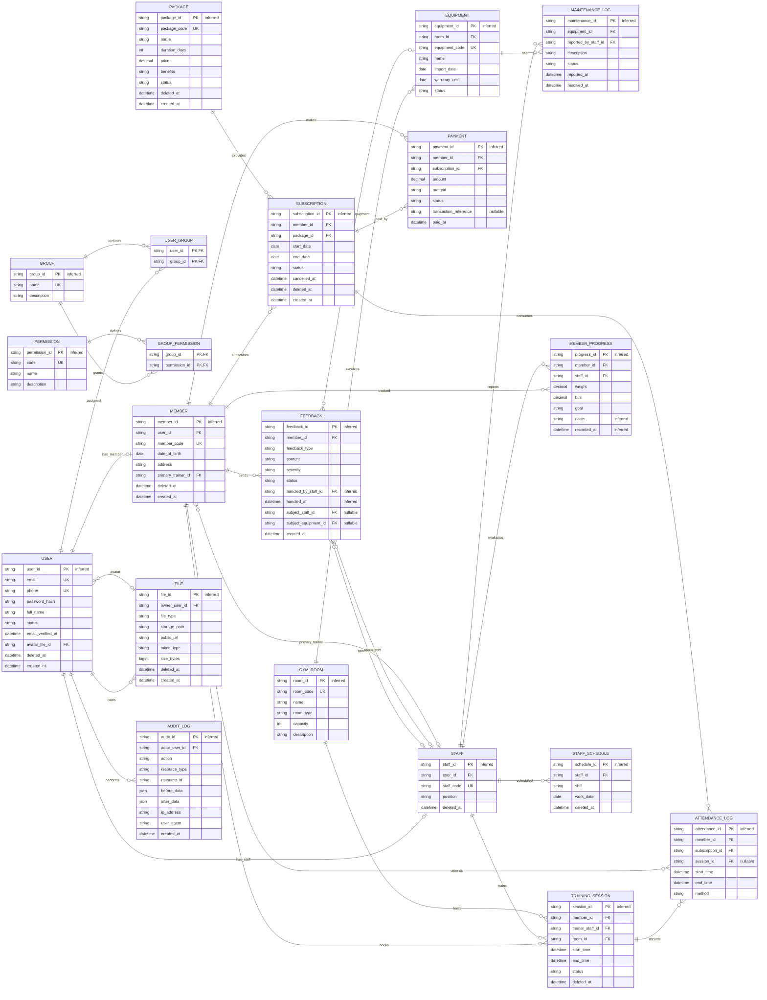

# Database Design — Gym Management System

| Field | Value |
|---|---|
| Document ID | `GMS-DB-DESIGN-001` |
| Related docs | `SRS_VI.md`, `Architecture.md` |

## Overview

本書は gym 管理システム (v1.0) のための PostgreSQL データベース設計を記述する。範囲: 業務テーブル 20 + 補助テーブル `otp_codes` 1 (schema は Prisma codebase で管理)。目的は backend チームが Prisma schema を実装できるよう ERD、entity 記述、constraint、最終 DDL を提供すること。

## Glossary

| Term | 定義 |
|---|---|
| BIGSERIAL | PostgreSQL の 64-bit auto-increment 型、`BIGINT GENERATED BY DEFAULT AS IDENTITY` と等価。本 project は全 PK で使用、Prisma が `BigInt` に map。 |
| PK | Primary Key — 主キー、テーブル内のレコードを一意に識別。 |
| FK | Foreign Key — 外部キー、他テーブルの PK を参照。 |
| UK | Unique Key — UNIQUE 制約。カラムが nullable なら複数 NULL を許容。 |
| ERD | Entity Relationship Diagram — エンティティ関係図。 |
| DDL | Data Definition Language — schema を定義する SQL (`CREATE TABLE`、`ALTER TABLE` 等)。 |
| RBAC | Role-Based Access Control — グループ単位の権限管理 (`groups`、`permissions` テーブルを参照)。 |
| OTP | One-Time Password — 1 回限りの認証コード、TTL 10 分 (`Architecture.md §3.x` を参照)。 |
| RLS | Row Level Security — PostgreSQL/Supabase の行単位の権限機構。 |
| JSONB | PostgreSQL の binary JSON 型 — index 可能、`JSON` より query が高速。 |
| Soft delete | `deleted_at IS NOT NULL` でマーク、DB から実際には削除しない。 |
| Hard delete | `DELETE FROM` による物理削除。Immutable な log と junction/catalog で使用。 |

## Table of Contents

- [ERD (Mermaid)](#erd-mermaid)
- [Entities (mo ta ngan)](#entities-mo-ta-ngan)
- [Relationships (1:N, N:N)](#relationships-1n-nn)
- [Enum types (PostgreSQL)](#enum-types-postgresql)
- [ALTER TABLE (migrate to enum types)](#alter-table-migrate-to-enum-types)
- [SQL schema (DDL)](#sql-schema-ddl)


## ERD (Mermaid)



## エンティティと関係の記述

### 1. テーブル一覧

システムは下記の **業務テーブル 20 個** と、**補助テーブル `otp_codes` 1 個** (password reset / email verify 用の OTP を保存。TTL 10 分、使用後 hard delete) で構成される。`otp_codes` は internal のため本 §1 の ERD には含めない — schema 詳細は Prisma codebase (`server/prisma/schema.prisma`) で直接管理する。

| No | グループ | テーブル (DDL) | エンティティ (ERD) | 意味 |
|----:|------|------------|----------------|---------|
| 1 | アカウント | `users` | `USER` | ログインと権限管理に使用するシステム アカウント。 |
| 2 | アカウント | `members` | `MEMBER` | 会員プロファイル。`USER` と 1-1 で紐付く。 |
| 3 | アカウント | `staff` | `STAFF` | スタッフ / トレーナー (PT) プロファイル。`USER` と 1-1 で紐付く。 |
| 4 | 権限 | `groups` | `GROUP` | システムの権限グループ (role)。 |
| 5 | 権限 | `permissions` | `PERMISSION` | 機能 / 権限のカタログ。 |
| 6 | 権限 | `user_groups` | `USER_GROUP` | User と権限グループの N:N 中間テーブル。 |
| 7 | 権限 | `group_permissions` | `GROUP_PERMISSION` | 権限グループと permission の N:N 中間テーブル。 |
| 8 | コース & 支払い | `packages` | `PACKAGE` | コース / サービスのカタログ。 |
| 9 | コース & 支払い | `subscriptions` | `SUBSCRIPTION` | 会員によるコース申込 / 更新。 |
| 10 | コース & 支払い | `payments` | `PAYMENT` | コースに対する支払い取引。 |
| 11 | 施設 | `gym_rooms` | `GYM_ROOM` | gym のトレーニング ルーム。 |
| 12 | 施設 | `equipment` | `EQUIPMENT` | 各ルームに属する機器。 |
| 13 | 施設 | `maintenance_logs` | `MAINTENANCE_LOG` | 機器の保守 / 修理ログ。 |
| 14 | スケジュール & 記録 | `training_sessions` | `TRAINING_SESSION` | 会員と PT のトレーニング セッション。 |
| 15 | スケジュール & 記録 | `attendance_logs` | `ATTENDANCE_LOG` | 会員の check-in / check-out 記録。 |
| 16 | スケジュール & 記録 | `member_progress` | `MEMBER_PROGRESS` | PT が記録する会員のトレーニング進捗指標。 |
| 17 | その他 | `feedback` | `FEEDBACK` | サービス / スタッフ / 機器に関する会員の feedback。 |
| 18 | その他 | `staff_schedules` | `STAFF_SCHEDULE` | スタッフのシフト勤務スケジュール。 |
| 19 | その他 | `audit_logs` | `AUDIT_LOG` | 監査ログ — 重要な resource に対し誰がいつ何をしたか。 |
| 20 | その他 | `files` | `FILE` | Supabase Storage に保存される upload file の metadata (avatar、document)。 |

### 2. エンティティと属性

本節は各エンティティを詳述する。`Key` 列の規約: `PK` = primary key、`FK` = foreign key、`UK` = UNIQUE 制約。`Type` 列は下の DDL の PostgreSQL 型に従う。

**共通 convention (全テーブルに適用、各テーブルでは繰り返さない):**

- PK `<entity>_id` は `BIGINT GENERATED BY DEFAULT AS IDENTITY` (BIGSERIAL)、server 側で自動採番。
- `created_at` は `TIMESTAMP NOT NULL DEFAULT NOW()` (UTC、Timezone Convention を参照)。
- Soft delete のあるテーブル: `deleted_at TIMESTAMP NULL` (Soft Delete Convention を参照)。

以下の属性表は **業務上の属性** のみを列挙する — 上の boilerplate カラムは noise を減らすため繰り返さない。一部のテーブルでは業務的意味を持つ `created_at`/`deleted_at` を残す (例: `feedback.created_at` は SLA 計算に使用、`audit_logs.created_at` は action 時刻)。

#### 2.1. アカウント グループ

##### `USER` (`users`)

| 属性 | 型 | Key | 意味 |
|------------|------|------|---------|
| `user_id` | `BIGINT` | PK | アカウントの一意識別子。 |
| `email` | `VARCHAR(255)` | UK | メールアドレス、login に使用。 |
| `phone` | `VARCHAR(20)` | UK | 連絡先電話番号。Nullable だが値があれば UNIQUE (PostgreSQL は複数 NULL を別物として扱う)。 |
| `password_hash` | `VARCHAR(255)` |  | hash 済 password (bcrypt/Argon2)。 |
| `full_name` | `VARCHAR(200)` |  | User の氏名。 |
| `status` | `user_status` |  | アカウント status: `pending_verification` (email 未 verify)、`active`、`locked`。Default `pending_verification`。 |
| `email_verified_at` | `TIMESTAMP` |  | Email verify 完了時刻。未 verify なら `NULL`。 |
| `avatar_file_id` | `BIGINT` | FK → `files.file_id` (nullable) | User のアバター画像 (`FILE` テーブルを参照)。 |
| `deleted_at` | `TIMESTAMP` |  | Soft delete。`NULL` = active、値あり = 論理削除済。 |
| `created_at` | `TIMESTAMP` |  | レコード作成時刻。 |

##### `MEMBER` (`members`)

| 属性 | 型 | Key | 意味 |
|------------|------|------|---------|
| `member_id` | `BIGINT` | PK | 会員の一意識別子。 |
| `user_id` | `BIGINT` | FK → `users.user_id`、UK | アカウントへの 1-1 リンク。 |
| `member_code` | `VARCHAR(30)` | UK | 内部会員コード。Server が `MEM-{YYYY}-{6 digits}` 形式で自動生成。 |
| `date_of_birth` | `DATE` |  | 会員の生年月日。 |
| `address` | `VARCHAR(200)` |  | 連絡先住所。 |
| `primary_trainer_id` | `BIGINT` | FK → `staff.staff_id` (nullable) | 担当 PT (固定)。未割当なら `NULL`。 |
| `deleted_at` | `TIMESTAMP` |  | Soft delete。 |
| `created_at` | `TIMESTAMP` |  | レコード作成時刻。 |

##### `STAFF` (`staff`)

| 属性 | 型 | Key | 意味 |
|------------|------|------|---------|
| `staff_id` | `BIGINT` | PK | スタッフの一意識別子。 |
| `user_id` | `BIGINT` | FK → `users.user_id`、UK | アカウントへの 1-1 リンク。 |
| `staff_code` | `VARCHAR(30)` | UK | 内部スタッフ コード。Server が `STF-{YYYY}-{6 digits}` 形式で自動生成。 |
| `position` | `VARCHAR(50)` |  | 役職: `pt` (trainer)、`manager` (管理者)、`receptionist` (受付)、`technician` (保守技術者)。 |
| `deleted_at` | `TIMESTAMP` |  | Soft delete。 |

#### 2.2. 権限グループ

##### `GROUP` (`groups`)

| 属性 | 型 | Key | 意味 |
|------------|------|------|---------|
| `group_id` | `BIGINT` | PK | 権限グループの識別子。 |
| `name` | `VARCHAR(100)` | UK | グループ名。デフォルト seed: `owner`、`staff`、`trainer`、`member`。 |
| `description` | `VARCHAR(255)` |  | グループの説明。 |
| `deleted_at` | `TIMESTAMP` |  | Soft delete。Seed されたデフォルト グループは削除不可。 |

##### `PERMISSION` (`permissions`)

| 属性 | 型 | Key | 意味 |
|------------|------|------|---------|
| `permission_id` | `BIGINT` | PK | Permission の識別子。 |
| `code` | `VARCHAR(50)` | UK | コード内で使用する permission コード (例: `member.create`)。 |
| `name` | `VARCHAR(100)` |  | 表示用 permission 名。 |
| `description` | `VARCHAR(255)` |  | Permission の説明。 |

##### `USER_GROUP` (`user_groups`)

| 属性 | 型 | Key | 意味 |
|------------|------|------|---------|
| `user_id` | `BIGINT` | PK、FK → `users.user_id` | User への参照。 |
| `group_id` | `BIGINT` | PK、FK → `groups.group_id` | 権限グループへの参照。 |

##### `GROUP_PERMISSION` (`group_permissions`)

| 属性 | 型 | Key | 意味 |
|------------|------|------|---------|
| `group_id` | `BIGINT` | PK、FK → `groups.group_id` | 権限グループへの参照。 |
| `permission_id` | `BIGINT` | PK、FK → `permissions.permission_id` | Permission への参照。 |

#### 2.3. コース & 支払いグループ

##### `PACKAGE` (`packages`)

| 属性 | 型 | Key | 意味 |
|------------|------|------|---------|
| `package_id` | `BIGINT` | PK | コースの識別子。 |
| `package_code` | `VARCHAR(30)` | UK | コース コード。Server が `PKG-{4 digits}` 形式で自動生成。 |
| `name` | `VARCHAR(100)` |  | コース名。 |
| `duration_days` | `INT` |  | コースの有効日数。必ず `> 0`。 |
| `price` | `DECIMAL(12,2)` |  | VND 単価 (小数部は使わない —「Currency Convention」を参照)。 |
| `benefits` | `VARCHAR(255)` |  | 付帯特典 (短い説明)。 |
| `status` | `package_status` |  | `active` (申込画面に表示)、`inactive` (論理的に無効化 — 非表示だが既存 subscription は維持)。 |
| `deleted_at` | `TIMESTAMP` |  | Soft delete (`status='inactive'` とは異なり、一覧から完全に消す)。 |
| `created_at` | `TIMESTAMP` |  | レコード作成時刻。 |

**備考:** v1.0 は time-based packages のみ対応。`session_limit` フィールドは削除済。PT セッション回数を追跡する必要がある場合は `training_sessions` を別途カウントする。

##### `SUBSCRIPTION` (`subscriptions`)

| 属性 | 型 | Key | 意味 |
|------------|------|------|---------|
| `subscription_id` | `BIGINT` | PK | コース申込の識別子。 |
| `member_id` | `BIGINT` | FK → `members.member_id` | 申込所有者の会員。 |
| `package_id` | `BIGINT` | FK → `packages.package_id` | 申し込まれたコース。 |
| `start_date` | `DATE` |  | 有効開始日。 |
| `end_date` | `DATE` |  | 有効終了日。必ず `>= start_date`。 |
| `status` | `subscription_status` |  | `pending` (支払待ち)、`active`、`expired` (`end_date < NOW()` で cron が自動遷移)、`cancelled` (member が能動的に解約)。 |
| `cancelled_at` | `TIMESTAMP` |  | 解約時刻。`status = 'cancelled'` の場合のみ値を持つ。 |
| `deleted_at` | `TIMESTAMP` |  | Soft delete。 |
| `created_at` | `TIMESTAMP` |  | レコード作成時刻。 |

**備考:**
- `remaining_sessions` フィールドは削除済 — v1.0 ではセッション数を track しない (`PACKAGE` を参照)。
- Lifecycle ルール: `pending` → `active` (payment 成功時)、`active` → `expired` (daily cron)、`active` → `cancelled` (user 操作)。
- 1 member は同時に `active` subscription を 1 つしか持てない。事前購入 (prepaid) は現コース expire まで `pending` で保留される。

##### `PAYMENT` (`payments`)

| 属性 | 型 | Key | 意味 |
|------------|------|------|---------|
| `payment_id` | `BIGINT` | PK | 支払取引の識別子。 |
| `member_id` | `BIGINT` | FK → `members.member_id` | 支払を行った会員。 |
| `subscription_id` | `BIGINT` | FK → `subscriptions.subscription_id` | 取引が適用される subscription。 |
| `amount` | `DECIMAL(12,2)` |  | 取引金額。 |
| `method` | `payment_method` |  | 支払方法: `cash`、`bank_card`、`ewallet`。 |
| `status` | `payment_status` |  | Status: `success`、`failed`。 |
| `transaction_reference` | `VARCHAR(100)` |  | 決済ゲートウェイ発行の取引コード。現金の場合は `NULL`。 |
| `paid_at` | `TIMESTAMP` |  | 支払時刻。 |

#### 2.4. 施設グループ

##### `GYM_ROOM` (`gym_rooms`)

| 属性 | 型 | Key | 意味 |
|------------|------|------|---------|
| `room_id` | `BIGINT` | PK | ルームの識別子。 |
| `room_code` | `VARCHAR(30)` | UK | ルーム コード。Server が `RM-{3 digits}` 形式で自動生成。 |
| `name` | `VARCHAR(100)` |  | ルーム名。 |
| `room_type` | `VARCHAR(50)` |  | ルーム種別 (例: cardio、yoga、free weight)。 |
| `capacity` | `INT` |  | 最大収容人数。 |
| `description` | `VARCHAR(255)` |  | 追加説明。 |

**備考:** `gym_rooms` は **hard delete** (SRS UC08 に従う)。削除には確認を要し、equipment/training_session から参照されている間は block する。

##### `EQUIPMENT` (`equipment`)

| 属性 | 型 | Key | 意味 |
|------------|------|------|---------|
| `equipment_id` | `BIGINT` | PK | 機器の識別子。 |
| `room_id` | `BIGINT` | FK → `gym_rooms.room_id` | 機器を含むルーム。 |
| `equipment_code` | `VARCHAR(30)` | UK | 機器コード。Server が `EQ-{6 digits}` 形式で自動生成。 |
| `name` | `VARCHAR(100)` |  | 機器名。 |
| `import_date` | `DATE` |  | 機器の入荷日。 |
| `warranty_until` | `DATE` |  | 保証期限日。 |
| `status` | `equipment_status` |  | `active`、`broken`、`repairing`、`retired` (処分済)。 |

**備考:** `equipment` は **hard delete** (SRS UC09 に従う)。処分時は削除ではなく `status='retired'` をセットし、保守履歴は保持する。

##### `MAINTENANCE_LOG` (`maintenance_logs`)

| 属性 | 型 | Key | 意味 |
|------------|------|------|---------|
| `maintenance_id` | `BIGINT` | PK | 保守票の識別子。 |
| `equipment_id` | `BIGINT` | FK → `equipment.equipment_id` | 保守対象の機器。 |
| `reported_by_staff_id` | `BIGINT` | FK → `staff.staff_id` | 報告 / 起票したスタッフ。 |
| `description` | `TEXT` |  | 不具合 / 保守内容の記述。 |
| `status` | `maintenance_status` |  | Status: `reported`、`repairing`、`resolved`、`failed`。 |
| `reported_at` | `TIMESTAMP` |  | 不具合報告時刻。 |
| `resolved_at` | `TIMESTAMP` |  | 解決時刻 (空でも良い)。 |

#### 2.5. スケジュール & 記録グループ

##### `TRAINING_SESSION` (`training_sessions`)

| 属性 | 型 | Key | 意味 |
|------------|------|------|---------|
| `session_id` | `BIGINT` | PK | セッションの識別子。 |
| `member_id` | `BIGINT` | FK → `members.member_id` | セッション参加会員。 |
| `trainer_staff_id` | `BIGINT` | FK → `staff.staff_id` | 担当 PT (通常 member の `primary_trainer_id`)。 |
| `room_id` | `BIGINT` | FK → `gym_rooms.room_id` | セッションが行われるルーム。 |
| `start_time` | `TIMESTAMP` |  | スケジュール上の開始時刻。 |
| `end_time` | `TIMESTAMP` |  | スケジュール上の終了時刻。必ず `> start_time`。 |
| `status` | `training_session_status` |  | `scheduled` → `in_progress` (時刻到達時) → `completed` (終了時)。PT は 2h 前まで `cancelled` に変更可能。 |
| `deleted_at` | `TIMESTAMP` |  | Soft delete。 |

**備考:** Overlap 検出 (同一 `room_id` で時間重複) は PT がセッション作成する際に application 層で validate する。

##### `ATTENDANCE_LOG` (`attendance_logs`)

| 属性 | 型 | Key | 意味 |
|------------|------|------|---------|
| `attendance_id` | `BIGINT` | PK | 出席ログの識別子。 |
| `member_id` | `BIGINT` | FK → `members.member_id` | Check-in した会員。 |
| `subscription_id` | `BIGINT` | FK → `subscriptions.subscription_id` | 消費される subscription。 |
| `session_id` | `BIGINT` | FK → `training_sessions.session_id` (nullable) | PT 予約がある場合の対応セッション。フリートレーニング時は `NULL`。 |
| `start_time` | `TIMESTAMP` |  | Check-in 時刻。 |
| `end_time` | `TIMESTAMP` |  | Check-out 時刻 (空でも良い)。 |
| `qr_checkin_date` | `DATE` | `member_id` と UK (nullable) | QR セルフ check-in のベトナム日付。`qr` ログだけが値を持ち、会員ごとに 1 日 1 回に制限する。 |
| `method` | `attendance_method` |  | 記録方法: `realtime`、`manual`、`qr`。 |

##### `MEMBER_PROGRESS` (`member_progress`)

| 属性 | 型 | Key | 意味 |
|------------|------|------|---------|
| `progress_id` | `BIGINT` | PK | 進捗ログの識別子。 |
| `member_id` | `BIGINT` | FK → `members.member_id` | 評価対象の会員。 |
| `staff_id` | `BIGINT` | FK → `staff.staff_id` | 評価を行う PT。Authorization: PT は `primary_trainer_id = self.staff_id` の member に対してのみ記録可能。 |
| `weight` | `DECIMAL(6,2)` |  | 計測時の体重 (kg)。 |
| `bmi` | `DECIMAL(5,2)` |  | Body Mass Index (BMI)。 |
| `goal` | `VARCHAR(255)` |  | トレーニング目標。 |
| `notes` | `TEXT` |  | PT の追加メモ。 |
| `recorded_at` | `TIMESTAMP` |  | 指標記録時刻。 |
| `deleted_at` | `TIMESTAMP` |  | Soft delete。 |

#### 2.6. その他グループ

##### `FEEDBACK` (`feedback`)

| 属性 | 型 | Key | 意味 |
|------------|------|------|---------|
| `feedback_id` | `BIGINT` | PK | Feedback の識別子。 |
| `member_id` | `BIGINT` | FK → `members.member_id` | Feedback 送信会員。 |
| `feedback_type` | `feedback_type` |  | 種別: `staff`、`equipment`、`service`。 |
| `content` | `TEXT` |  | Feedback 本文。 |
| `severity` | `feedback_severity` |  | 重要度: `low`、`medium`、`high`。Default `low`。 |
| `status` | `feedback_status` |  | 処理 status: `open`、`in_progress`、`resolved`、`rejected`。Default `open`。 |
| `handled_by_staff_id` | `BIGINT` | FK → `staff.staff_id` | 対応スタッフ (空でも良い)。 |
| `handled_at` | `TIMESTAMP` |  | 対応完了時刻 (空でも良い)。 |
| `subject_staff_id` | `BIGINT` | FK → `staff.staff_id` (nullable) | Feedback 対象のスタッフ (`feedback_type = 'staff'` の場合のみ)。 |
| `subject_equipment_id` | `BIGINT` | FK → `equipment.equipment_id` (nullable) | Feedback 対象の機器 (`feedback_type = 'equipment'` の場合のみ)。 |
| `deleted_at` | `TIMESTAMP` |  | Soft delete。 |
| `created_at` | `TIMESTAMP` |  | 会員の feedback 送信時刻。`severity` に応じた SLA 計算に使用 (SRS 4.10 を参照)。 |

DB の CHECK 制約により `subject_staff_id` / `subject_equipment_id` が `feedback_type` と整合することを保証する (`staff` 種別は `subject_staff_id` 必須、`equipment` 種別は `subject_equipment_id` 必須、`service` 種別は両方 NULL)。

##### `STAFF_SCHEDULE` (`staff_schedules`)

| 属性 | 型 | Key | 意味 |
|------------|------|------|---------|
| `schedule_id` | `BIGINT` | PK | スケジュール行の識別子。 |
| `staff_id` | `BIGINT` | FK → `staff.staff_id` | シフトを割り当てられたスタッフ。 |
| `shift` | `staff_shift` |  | シフト: `morning`、`afternoon`、`evening`。 |
| `work_date` | `DATE` |  | 勤務日。 |
| `deleted_at` | `TIMESTAMP` |  | Soft delete (シフト変更時に manager が削除)。 |

**制約:** Partial UNIQUE INDEX `(staff_id, shift, work_date) WHERE deleted_at IS NULL` により、同じスタッフが同じシフト・同じ日付の active 行を重複登録するのを防ぐ。古い行を soft delete してから同じシフトを再登録するのは衝突しない。

##### `AUDIT_LOG` (`audit_logs`)

| 属性 | 型 | Key | 意味 |
|------------|------|------|---------|
| `audit_id` | `BIGINT` | PK | Log の識別子。 |
| `actor_user_id` | `BIGINT` | FK → `users.user_id` (nullable) | Action を行った user。System action (cron、webhook) は `NULL`。 |
| `action` | `VARCHAR(100)` |  | Action code。format `resource.verb` (例: `member.create`、`subscription.cancel`、`auth.login`)。 |
| `resource_type` | `VARCHAR(50)` |  | Resource 種別: `member`、`payment`、`subscription` 等。 |
| `resource_id` | `VARCHAR(50)` |  | 操作対象 resource の ID (BIGINT → string に cast し generic 化。Composite key は `id1:id2`)。 |
| `before_data` | `JSONB` |  | 変更前 snapshot (create action では nullable)。 |
| `after_data` | `JSONB` |  | 変更後 snapshot (delete action では nullable)。 |
| `ip_address` | `VARCHAR(45)` |  | Request の IPv4/IPv6。 |
| `user_agent` | `VARCHAR(500)` |  | User-Agent header。 |
| `created_at` | `TIMESTAMP` |  | Action 時刻。Append-only、絶対 update しない。 |

**備考:** Audit log は **append-only** で soft delete しない。Retention policy 推奨: 1 年保持し、cron job で cleanup。

##### `FILE` (`files`)

| 属性 | 型 | Key | 意味 |
|------------|------|------|---------|
| `file_id` | `BIGINT` | PK | File の識別子。 |
| `owner_user_id` | `BIGINT` | FK → `users.user_id` | File 所有 user。 |
| `file_type` | `file_type` |  | 分類: `avatar`、`document`、`equipment_doc`。 |
| `storage_path` | `VARCHAR(500)` |  | Supabase Storage の object path (例: `avatars/2026/abc.jpg`)。 |
| `public_url` | `VARCHAR(1000)` |  | 公開 URL の cache (nullable)。Private file は signed URL を使う。 |
| `mime_type` | `VARCHAR(100)` |  | MIME type。 |
| `size_bytes` | `BIGINT` |  | File サイズ、max 10MB (constraint)。 |
| `deleted_at` | `TIMESTAMP` |  | Soft delete。Storage object の cleanup は cron job で行う。 |
| `created_at` | `TIMESTAMP` |  | Upload 時刻。 |

**Upload flow:** Client が `POST /api/v1/files/upload` を呼ぶ → server が Supabase Storage の signed URL を返す → client が直接 upload → server が metadata を記録。Server はファイルのバイトを proxy しない。

### 3. エンティティ間の関係

下表は ERD の全関係をまとめたもの。Cardinality 記法は ERD 標準に従う: `1 : 0..1` (1 対 0 または 1)、`1 : N` (1 対多)、`N : 0..1` (多対 0 または 1)、`N : N` (多対多)。

| # | エンティティ A | エンティティ B | 外部キー / 中間テーブル | 関係種別 | 説明 |
|--:|------------|------------|-----------------------|--------------|-------|
| 1 | `USER` | `MEMBER` | `members.user_id` (UNIQUE) | 1 : 0..1 | 各 `USER` は最大 1 件の `MEMBER` プロファイルを持つ。 |
| 2 | `USER` | `STAFF` | `staff.user_id` (UNIQUE) | 1 : 0..1 | 各 `USER` は最大 1 件の `STAFF` プロファイルを持つ。 |
| 3 | `USER` | `GROUP` | `user_groups` | N : N | 1 user は複数グループに所属、1 グループは複数 user を含む。 |
| 4 | `GROUP` | `PERMISSION` | `group_permissions` | N : N | 1 グループは複数 permission を持ち、1 permission は複数グループに属する。 |
| 5 | `MEMBER` | `SUBSCRIPTION` | `subscriptions.member_id` | 1 : N | 1 会員は複数のコース申込を持つ。 |
| 6 | `PACKAGE` | `SUBSCRIPTION` | `subscriptions.package_id` | 1 : N | 1 コースは複数会員に申し込まれる。 |
| 7 | `SUBSCRIPTION` | `PAYMENT` | `payments.subscription_id` | 1 : N | 1 申込に対し複数の支払取引が発生し得る。 |
| 8 | `MEMBER` | `PAYMENT` | `payments.member_id` | 1 : N | 1 会員は複数の支払取引を持つ。 |
| 9 | `GYM_ROOM` | `EQUIPMENT` | `equipment.room_id` | 1 : N | 1 ルームは複数の機器を含む。 |
| 10 | `EQUIPMENT` | `MAINTENANCE_LOG` | `maintenance_logs.equipment_id` | 1 : N | 1 機器は複数回の保守履歴を持つ。 |
| 11 | `STAFF` | `MAINTENANCE_LOG` | `maintenance_logs.reported_by_staff_id` | 1 : N | 1 スタッフは複数の保守票を起票できる。 |
| 12 | `MEMBER` | `TRAINING_SESSION` | `training_sessions.member_id` | 1 : N | 1 会員は複数のセッションに参加する。 |
| 13 | `STAFF` | `TRAINING_SESSION` | `training_sessions.trainer_staff_id` | 1 : N | 1 PT は複数のセッションを担当する。 |
| 14 | `GYM_ROOM` | `TRAINING_SESSION` | `training_sessions.room_id` | 1 : N | 1 ルームで複数のセッションが行われる。 |
| 15 | `TRAINING_SESSION` | `ATTENDANCE_LOG` | `attendance_logs.session_id` (nullable) | 1 : 0..N | 1 セッションに複数の出席ログが対応し得る。フリートレーニングのログはセッションに紐付かない (`session_id` = NULL)。 |
| 16 | `MEMBER` | `ATTENDANCE_LOG` | `attendance_logs.member_id` | 1 : N | 1 会員は複数の出席ログを持つ。 |
| 17 | `SUBSCRIPTION` | `ATTENDANCE_LOG` | `attendance_logs.subscription_id` | 1 : N | 1 subscription は複数ログで消費される。 |
| 18 | `MEMBER` | `MEMBER_PROGRESS` | `member_progress.member_id` | 1 : N | 1 会員は複数回の進捗評価を持つ。 |
| 19 | `STAFF` | `MEMBER_PROGRESS` | `member_progress.staff_id` | 1 : N | 1 PT は複数会員の進捗を記録する。 |
| 20 | `MEMBER` | `FEEDBACK` | `feedback.member_id` | 1 : N | 1 会員は複数の feedback を送信する。 |
| 21 | `FEEDBACK` | `STAFF` | `feedback.handled_by_staff_id` (nullable) | N : 0..1 | 1 件の feedback は最大 1 スタッフが対応、未対応もあり得る。 |
| 22 | `FEEDBACK` | `STAFF` | `feedback.subject_staff_id` (nullable) | N : 0..1 | スタッフが `staff` 種別 feedback の対象になる。 |
| 23 | `FEEDBACK` | `EQUIPMENT` | `feedback.subject_equipment_id` (nullable) | N : 0..1 | 機器が `equipment` 種別 feedback の対象になる。 |
| 24 | `STAFF` | `STAFF_SCHEDULE` | `staff_schedules.staff_id` | 1 : N | 1 スタッフは複数のシフト行を持つ。 |
| 25 | `MEMBER` | `STAFF` | `members.primary_trainer_id` (nullable) | N : 0..1 | 各会員は最大 1 名の固定 PT を持つ。 |
| 26 | `USER` | `FILE` | `files.owner_user_id` | 1 : N | 1 user は複数ファイル (avatar、document) を upload し得る。 |
| 27 | `USER` | `FILE` | `users.avatar_file_id` (nullable) | 1 : 0..1 | User は現行のアバター file を最大 1 個保有 (`files` への逆参照)。 |
| 28 | `USER` | `AUDIT_LOG` | `audit_logs.actor_user_id` (nullable) | 1 : N | 1 user は複数 audit log を発生させる。System action は actor `NULL`。 |

## Code Generation Rules

Server はレコード作成時に UNIQUE code を自動生成する。標準形式:

| Field | Format | 例 |
|-------|--------|-------|
| `members.member_code` | `MEM-{YYYY}-{6 digits}` | `MEM-2026-000123` |
| `staff.staff_code` | `STF-{YYYY}-{6 digits}` | `STF-2026-000045` |
| `packages.package_code` | `PKG-{4 digits}` | `PKG-0012` |
| `gym_rooms.room_code` | `RM-{3 digits}` | `RM-101` |
| `equipment.equipment_code` | `EQ-{6 digits}` | `EQ-000789` |

Logic: server が namespace ごとに `MAX(numeric_suffix)` を query し `+ 1` する。Concurrency-safe には PostgreSQL sequence または create transaction を囲む `pg_advisory_xact_lock` を使う。POST 時に client から code を渡すことは許容しない。

## Soft Delete Convention

**Soft と hard を分ける理由:** 業務 resource (user、member、subscription、feedback…) は report + audit + 復旧のため履歴を残す必要がある — soft delete。Log テーブル (`attendance_logs`、`maintenance_logs`、`payments`、`audit_logs`) は定義上 immutable — hard delete は意味を持たない。Junction/catalog (`user_groups`、`group_permissions`、`permissions`) は parent 削除で自動的に refresh される — soft delete は orphan logic を生む。

**UUID ではなく BIGSERIAL を採る理由:** Sequential PK + 小さい index + 高速な JOIN + serialization 用に `BigInt.prototype.toJSON` の patch を既に保有。UUID v4 は index 断片化を起こす。UUID v7 は extension `pg_uuidv7` が必要で未 setup。Trade-off: PK が予測可能 (`id+1` を guess し得る) — authorization 層で不正アクセスを遮るため許容。

**Soft delete のルール:**

`deleted_at TIMESTAMP NULL` を持つテーブル:

- `deleted_at IS NULL` → active レコード
- `deleted_at IS NOT NULL` → 論理削除済、デフォルト一覧には表示しない
- 全 default query は `WHERE deleted_at IS NULL` を持つ。Prisma では middleware か Prisma extension で auto-filter する
- Code (member_code、staff_code…) の UNIQUE 制約は依然有効 → soft delete されたコードは永久に「予約済」 (再利用しない、許容範囲)

**Soft delete 対象テーブル** (11 個): `users`、`members`、`staff`、`groups`、`packages`、`subscriptions`、`training_sessions`、`member_progress`、`feedback`、`staff_schedules`、`files`。

**Hard delete 対象テーブル** (immutable または SRS で物理削除と規定):

- `gym_rooms` — SRS UC08 (hard delete、FK 参照中は block)
- `equipment` — SRS UC09 (hard delete。処分は `status='retired'`)
- `maintenance_logs` — immutable history
- `attendance_logs` — immutable check-in log
- `payments` — immutable financial record
- `audit_logs` — append-only
- `permissions`、`user_groups`、`group_permissions` — junction/catalog
- `otp_codes` — TTL-based cleanup

## otp_codes

OTP flow (UC02 password reset、UC13 verify email) 用の補助テーブル。完全な schema は `server/prisma/schema.prisma`。業務上の convention:

- **`(user_id, purpose)` ごとに single-active OTP:** 1 user は 1 purpose につき同時に 1 個の active OTP のみを持つ。Resend (`/auth/forgot-password` または `/auth/resend-verify`) 時、application は新 OTP の INSERT 前に `DELETE FROM otp_codes WHERE user_id=? AND purpose=?` を実行する必要があり、これを `$transaction` で囲む。
- **`(user_id, purpose)` に DB の UNIQUE 制約を追加しない** 理由: OTP は lifecycle を持つ。Reset/verify endpoint で正常終了後に DELETE される。UNIQUE 制約は、resend 2 リクエストが近接した race condition で「古い OTP は DELETE → 新規 INSERT」という正当な flow を block してしまう。
- **TTL 10 分** (`expires_at = NOW() + INTERVAL '10 minutes'`)。Expire 済 OTP は自動 DELETE されない — daily cron `auth:cleanup-expired-otp` (`Architecture.md §5.2` を参照) または verify query 内で `expires_at > NOW()` を check する。
- **attempt_count** は verify 失敗のたびにインクリメント。≥ 5 で行を DELETE、user は再発行が必要。
- **OTP は bcrypt hash** (cost 10) — plaintext は保存しない。Plaintext は email 本文と dev の server log にのみ存在する (`.claude/rules/security.md` を参照)。
- 相互参照: `Architecture.md §4.1.3` (verify-email flow)、`§4.1.4` (password reset flow)。

## Cascade Soft Delete Convention

PostgreSQL の `ON DELETE CASCADE` 付き FK は hard delete のみに適用される。Soft delete (`deleted_at` をセット) は DB が自動 propagate しない — application 層で対応する必要がある。

**ルール:** 行を soft delete する際、service は `$transaction` で囲み、下表に従って依存テーブルにも `deleted_at` をセットする。

| Soft delete 対象 | Cascade で `deleted_at` をセットすべき対象 |
|---|---|
| `users` | `members` (1:1)、`staff` (1:1)、`subscriptions` (member 経由)、`files` (owner) |
| `members` | member の `subscriptions` |
| `staff` | staff の `staff_schedules`。`training_sessions` は cascade しない (履歴保持のため)。Staff が固定 PT なら `members.primary_trainer_id → NULL`。 |
| `packages` | Cascade しない — 既存 `subscriptions` は report のため `package_id` を保持。 |

**Implementation pattern (Prisma):**

```typescript
await prisma.$transaction(async (tx) => {
  const now = new Date();
  await tx.user.update({ where: { id }, data: { deletedAt: now } });
  await tx.member.updateMany({ where: { userId: id, deletedAt: null }, data: { deletedAt: now } });
  await tx.staff.updateMany({ where: { userId: id, deletedAt: null }, data: { deletedAt: now } });
  await tx.subscription.updateMany({
    where: { member: { userId: id }, deletedAt: null },
    data: { deletedAt: now },
  });
  await tx.file.updateMany({ where: { ownerUserId: id, deletedAt: null }, data: { deletedAt: now } });
});
```

この convention は `.claude/rules/db.md` (transaction + lock ordering) で codify されている。DB では enforce しない — application 層が全責任を負う。

## External Device Authentication

SRS UC05 の入退館 device (Access Control Devices) は v1.0 では専用テーブルを持たない:

- Authentication: env `DEVICE_API_KEY` に保存された固定 API key
- Endpoint: header `X-Device-API-Key` 付きの `POST /api/v1/devices/access-events`
- Body: `{ "member_identifier": "<member_code>", "occurred_at": "<ISO 8601>", "device_id": "<string>" }` (v1.0 は `member_code` のみ。RFID `card_id` と QR payload は v1.1 に延期 — `members` テーブルに `card_id` カラムはまだない)
- Server が API key を validate、`members WHERE member_code = ? AND deleted_at IS NULL` を query、`method = 'realtime'` の `attendance_logs` を作成
- Retry policy: request fail 時に device は exponential backoff (1s、4s、16s) で最大 3 回 retry
- v1.1+ roadmap: per-device key と rotation policy を持つ `devices` テーブルに昇格

## Currency Convention

- 唯一の通貨: **VND** (Vietnamese Dong)
- VND は実務上小数部を持たない — 価格は全て整数 (例: 500K VND は 500000)
- Schema は `DECIMAL(12,2)` を使う: `.2` は scale buffer であり、**多通貨サポートの機構ではない**。真の多通貨対応には `currency_code` カラム + `exchange_rates` テーブル + conversion logic が必要 — v1.1+ に延期。V1.0 は整数価格のみ保存 (小数部は常に `.00`)。
- API 層での validation: 小数部 `> 0` の入力は reject。
- 表示価格は VAT 込み (tax を split しない)。

## Timezone Convention

- DB session は `SET timezone = 'UTC'` で初期化。`NOW()`、`CURRENT_DATE` は全て UTC。
- 現在の DDL の `TIMESTAMP` カラムは `WITH TIME ZONE` を付けない (`TIMESTAMP WITHOUT TIME ZONE`)。規約: 保存値は常に UTC、application が読み書き時に変換する。
- Application が datetime を読む → display 用に `Asia/Ho_Chi_Minh` に変換。DB に書く → 逆に UTC に変換。
- ローカル日付 (例: `start_date` 用の「今日」) の計算は named helper **`today_vn`** = `(NOW() AT TIME ZONE 'Asia/Ho_Chi_Minh')::date` を使う。`CURRENT_DATE` を直接使わない (UTC 日付になり、VN 深夜帯で 1 日ずれる)。全 date 比較に適用: subscription `start_date`/`end_date`、staff_schedules `work_date`、cron `subscription:expire`/`activate-pending`、UC05B check-in の subscription 有効性。`Architecture.md §4.5.2` (helper 定義) と `SRS_VI.md §1.3` Glossary を参照。
- Application 層での timezone handling 詳細は `Architecture.md §4.5.2` を参照。
- TBD v1.1+: DB が変換を自動処理するよう `TIMESTAMPTZ` に全面移行。延期理由: v1.0 single-tenant single-timezone での re-migrate を避ける。

## Phone UNIQUE + NULL

`users.phone` は `UNIQUE` だが `NULL` 可。PostgreSQL は SQL 標準に従い複数 `NULL` を別物として扱う → phone を持たない user が複数共存できる。「phone NULL の user は最大 1 件」という制約が必要なら partial index を使う — v1.0 では不要。

## Enum types (PostgreSQL)

```sql
CREATE TYPE user_status AS ENUM ('pending_verification', 'active', 'locked');
CREATE TYPE package_status AS ENUM ('active', 'inactive');
CREATE TYPE payment_method AS ENUM ('cash', 'bank_card', 'ewallet');
CREATE TYPE payment_status AS ENUM ('success', 'failed');
CREATE TYPE equipment_status AS ENUM ('active', 'broken', 'repairing', 'retired');
CREATE TYPE maintenance_status AS ENUM ('reported', 'repairing', 'resolved', 'failed');
CREATE TYPE feedback_type AS ENUM ('staff', 'equipment', 'service');
CREATE TYPE feedback_severity AS ENUM ('low', 'medium', 'high');
CREATE TYPE feedback_status AS ENUM ('open', 'in_progress', 'resolved', 'rejected');
CREATE TYPE attendance_method AS ENUM ('realtime', 'manual', 'qr');
CREATE TYPE staff_shift AS ENUM ('morning', 'afternoon', 'evening');
CREATE TYPE subscription_status AS ENUM ('pending', 'active', 'expired', 'cancelled');
CREATE TYPE training_session_status AS ENUM ('scheduled', 'in_progress', 'completed', 'cancelled');
CREATE TYPE file_type AS ENUM ('avatar', 'document', 'equipment_doc');
```

**Lifecycle に関する備考:**

- `subscription_status`: v1.0 は `paused` をサポートしない。Member が一時的にトレーニングを停止 (骨折、長期旅行) する場合は `cancel` し、復帰時に新コースを購入する必要がある。理由: cron expire/cancel-unpaid (`Architecture.md` background jobs を参照) は paused branch が無い方が単純。v1.0 では business case が未確立。
- `training_session_status`: v1.0 は `no_show` enum を独立で持たない。Cron `training-session:auto-close` (`Architecture.md §5.2` を参照) が end_time 経過済の 2 ケースを区別する:
  - `attendance_logs` あり (session_id 一致) → `completed`
  - Attendance なし → `cancelled` + `audit_logs.action='training.no_show'` (reason=auto) を記録

  PT が 2h 前までに能動的にキャンセルした場合も → `cancelled` + `audit_logs.action='training.cancel'`。UC12 では `audit_logs.action` で 2 種のキャンセル原因を区別。Trade-off: 2 つの原因が同じ enum `cancelled` を共有する。No-show 用の stored field が必要なら v1.1+ で `no_show` enum を追加。

## ALTER TABLE (migrate to enum types)

```sql
-- 既存の値が既に enum label と一致していることを前提とする。
ALTER TABLE users ALTER COLUMN status TYPE user_status USING status::user_status;

ALTER TABLE packages ALTER COLUMN status TYPE package_status USING status::package_status;

ALTER TABLE payments
    ALTER COLUMN method TYPE payment_method USING method::payment_method,
    ALTER COLUMN status TYPE payment_status USING status::payment_status;

ALTER TABLE equipment ALTER COLUMN status TYPE equipment_status USING status::equipment_status;

ALTER TABLE maintenance_logs
    ALTER COLUMN status TYPE maintenance_status USING status::maintenance_status;

ALTER TABLE attendance_logs
    ALTER COLUMN method TYPE attendance_method USING method::attendance_method;

ALTER TABLE feedback
    ALTER COLUMN feedback_type TYPE feedback_type USING feedback_type::feedback_type,
    ALTER COLUMN severity TYPE feedback_severity USING severity::feedback_severity,
    ALTER COLUMN status TYPE feedback_status USING status::feedback_status;

ALTER TABLE subscriptions
    ALTER COLUMN status TYPE subscription_status USING status::subscription_status;

ALTER TABLE training_sessions
    ALTER COLUMN status TYPE training_session_status USING status::training_session_status;

ALTER TABLE files
    ALTER COLUMN file_type TYPE file_type USING file_type::file_type;

ALTER TABLE staff_schedules
    ALTER COLUMN shift TYPE staff_shift USING shift::staff_shift;
```

## SQL schema (DDL)

Table 名は snake_case を使い、ERD の entity 名から map。下記 DDL は PostgreSQL 方言。

> **Note:** これは **design reference** — intent + ERD + 採用理由を理解するために読む。**実行上の source-of-truth** は [`server/prisma/schema.prisma`](../../server/prisma/schema.prisma) で、`npm run prisma:push` で DB に apply する。Schema 変更時は両方 (Prisma + Database.md) を同期する。`prisma/migrations/` フォルダは廃止 — project は migration-based workflow を使わない。

```sql
CREATE TABLE users (
    user_id BIGINT GENERATED BY DEFAULT AS IDENTITY PRIMARY KEY,
    email VARCHAR(255) NOT NULL UNIQUE,
    phone VARCHAR(20) UNIQUE,
    password_hash VARCHAR(255) NOT NULL,
    full_name VARCHAR(200) NOT NULL,
    status user_status NOT NULL DEFAULT 'pending_verification',
    email_verified_at TIMESTAMP NULL,
    avatar_file_id BIGINT NULL,
    deleted_at TIMESTAMP NULL,
    created_at TIMESTAMP NOT NULL DEFAULT NOW()
    -- FK fk_users_avatar_file は files テーブル作成後に追加 (下の ALTER TABLE を参照)
);
CREATE INDEX idx_users_deleted ON users(deleted_at);

CREATE TABLE members (
    member_id BIGINT GENERATED BY DEFAULT AS IDENTITY PRIMARY KEY,
    user_id BIGINT NOT NULL UNIQUE,
    member_code VARCHAR(30) NOT NULL UNIQUE,
    date_of_birth DATE NOT NULL,
    address VARCHAR(200),
    primary_trainer_id BIGINT NULL,
    deleted_at TIMESTAMP NULL,
    created_at TIMESTAMP NOT NULL DEFAULT NOW(),
    CONSTRAINT fk_members_user
        FOREIGN KEY (user_id) REFERENCES users(user_id)
    -- FK fk_members_primary_trainer は staff テーブル作成後に追加 (ファイル末尾の ALTER TABLE を参照)
);
CREATE INDEX idx_members_primary_trainer ON members(primary_trainer_id);
CREATE INDEX idx_members_deleted ON members(deleted_at);

CREATE TABLE staff (
    staff_id BIGINT GENERATED BY DEFAULT AS IDENTITY PRIMARY KEY,
    user_id BIGINT NOT NULL UNIQUE,
    staff_code VARCHAR(30) NOT NULL UNIQUE,
    position VARCHAR(50) NOT NULL,
    deleted_at TIMESTAMP NULL,
    CONSTRAINT fk_staff_user
        FOREIGN KEY (user_id) REFERENCES users(user_id)
);
CREATE INDEX idx_staff_deleted ON staff(deleted_at);

CREATE TABLE groups (
    group_id BIGINT GENERATED BY DEFAULT AS IDENTITY PRIMARY KEY,
    name VARCHAR(100) NOT NULL UNIQUE,
    description VARCHAR(255),
    deleted_at TIMESTAMP NULL
);
CREATE INDEX idx_groups_deleted ON groups(deleted_at);

CREATE TABLE permissions (
    permission_id BIGINT GENERATED BY DEFAULT AS IDENTITY PRIMARY KEY,
    code VARCHAR(50) NOT NULL UNIQUE,
    name VARCHAR(100) NOT NULL,
    description VARCHAR(255)
);

CREATE TABLE user_groups (
    user_id BIGINT NOT NULL,
    group_id BIGINT NOT NULL,
    PRIMARY KEY (user_id, group_id),
    CONSTRAINT fk_user_groups_user
        FOREIGN KEY (user_id) REFERENCES users(user_id) ON DELETE CASCADE,
    CONSTRAINT fk_user_groups_group
        FOREIGN KEY (group_id) REFERENCES groups(group_id) ON DELETE CASCADE
);

CREATE TABLE group_permissions (
    group_id BIGINT NOT NULL,
    permission_id BIGINT NOT NULL,
    PRIMARY KEY (group_id, permission_id),
    CONSTRAINT fk_group_permissions_group
        FOREIGN KEY (group_id) REFERENCES groups(group_id) ON DELETE CASCADE,
    CONSTRAINT fk_group_permissions_permission
        FOREIGN KEY (permission_id) REFERENCES permissions(permission_id) ON DELETE CASCADE
);

CREATE TABLE packages (
    package_id BIGINT GENERATED BY DEFAULT AS IDENTITY PRIMARY KEY,
    package_code VARCHAR(30) NOT NULL UNIQUE,
    name VARCHAR(100) NOT NULL,
    duration_days INT NOT NULL,
    -- session_limit: 削除済。v1.0 は time-based のみで、回数は track しない。
    price DECIMAL(12,2) NOT NULL,
    benefits VARCHAR(255),
    status package_status NOT NULL DEFAULT 'active',
    deleted_at TIMESTAMP NULL,
    created_at TIMESTAMP NOT NULL DEFAULT NOW(),
    CONSTRAINT chk_packages_duration CHECK (duration_days > 0),
    CONSTRAINT chk_packages_price CHECK (price >= 0)
);
CREATE INDEX idx_packages_status ON packages(status, deleted_at);

CREATE TABLE subscriptions (
    subscription_id BIGINT GENERATED BY DEFAULT AS IDENTITY PRIMARY KEY,
    member_id BIGINT NOT NULL,
    package_id BIGINT NOT NULL,
    start_date DATE NOT NULL,
    end_date DATE NOT NULL,
    -- remaining_sessions: 削除済。v1.0 は time-based のみのため (packages を参照)。
    status subscription_status NOT NULL DEFAULT 'pending',
    cancelled_at TIMESTAMP NULL,
    deleted_at TIMESTAMP NULL,
    created_at TIMESTAMP NOT NULL DEFAULT NOW(),
    CONSTRAINT fk_subscriptions_member
        FOREIGN KEY (member_id) REFERENCES members(member_id),
    CONSTRAINT fk_subscriptions_package
        FOREIGN KEY (package_id) REFERENCES packages(package_id),
    CONSTRAINT chk_subscriptions_dates CHECK (end_date >= start_date)
);
CREATE INDEX idx_subscriptions_member_status ON subscriptions(member_id, status, deleted_at);
CREATE INDEX idx_subscriptions_end_date ON subscriptions(end_date) WHERE status = 'active';

CREATE TABLE payments (
    payment_id BIGINT GENERATED BY DEFAULT AS IDENTITY PRIMARY KEY,
    member_id BIGINT NOT NULL,
    subscription_id BIGINT NOT NULL,
    amount DECIMAL(12,2) NOT NULL,
    method payment_method NOT NULL,
    status payment_status NOT NULL,
    transaction_reference VARCHAR(100),
    paid_at TIMESTAMP NOT NULL,
    CONSTRAINT fk_payments_member
        FOREIGN KEY (member_id) REFERENCES members(member_id),
    CONSTRAINT fk_payments_subscription
        FOREIGN KEY (subscription_id) REFERENCES subscriptions(subscription_id),
    CONSTRAINT chk_payments_amount CHECK (amount > 0)
);
CREATE INDEX idx_payments_member ON payments(member_id, paid_at DESC);
CREATE INDEX idx_payments_subscription ON payments(subscription_id);
CREATE INDEX idx_payments_status ON payments(status, paid_at DESC);

CREATE TABLE gym_rooms (
    room_id BIGINT GENERATED BY DEFAULT AS IDENTITY PRIMARY KEY,
    room_code VARCHAR(30) NOT NULL UNIQUE,
    name VARCHAR(100) NOT NULL,
    room_type VARCHAR(50),
    capacity INT NOT NULL,
    description VARCHAR(255)
);

CREATE TABLE equipment (
    equipment_id BIGINT GENERATED BY DEFAULT AS IDENTITY PRIMARY KEY,
    room_id BIGINT NOT NULL,
    equipment_code VARCHAR(30) NOT NULL UNIQUE,
    name VARCHAR(100) NOT NULL,
    import_date DATE NOT NULL,
    warranty_until DATE,
    status equipment_status NOT NULL,
    CONSTRAINT fk_equipment_room
        FOREIGN KEY (room_id) REFERENCES gym_rooms(room_id)
);

CREATE TABLE maintenance_logs (
    maintenance_id BIGINT GENERATED BY DEFAULT AS IDENTITY PRIMARY KEY,
    equipment_id BIGINT NOT NULL,
    reported_by_staff_id BIGINT NOT NULL,
    description TEXT NOT NULL,
    status maintenance_status NOT NULL,
    reported_at TIMESTAMP NOT NULL,
    resolved_at TIMESTAMP,
    CONSTRAINT fk_maintenance_equipment
        FOREIGN KEY (equipment_id) REFERENCES equipment(equipment_id),
    CONSTRAINT fk_maintenance_staff
        FOREIGN KEY (reported_by_staff_id) REFERENCES staff(staff_id)
);

CREATE TABLE training_sessions (
    session_id BIGINT GENERATED BY DEFAULT AS IDENTITY PRIMARY KEY,
    member_id BIGINT NOT NULL,
    trainer_staff_id BIGINT NOT NULL,
    room_id BIGINT NOT NULL,
    start_time TIMESTAMP NOT NULL,
    end_time TIMESTAMP NOT NULL,
    status training_session_status NOT NULL DEFAULT 'scheduled',
    deleted_at TIMESTAMP NULL,
    CONSTRAINT fk_sessions_member
        FOREIGN KEY (member_id) REFERENCES members(member_id),
    CONSTRAINT fk_sessions_trainer
        FOREIGN KEY (trainer_staff_id) REFERENCES staff(staff_id),
    CONSTRAINT fk_sessions_room
        FOREIGN KEY (room_id) REFERENCES gym_rooms(room_id),
    CONSTRAINT chk_sessions_time CHECK (end_time > start_time)
);
CREATE INDEX idx_sessions_member ON training_sessions(member_id, start_time DESC) WHERE deleted_at IS NULL;
CREATE INDEX idx_sessions_trainer ON training_sessions(trainer_staff_id, start_time DESC) WHERE deleted_at IS NULL;
CREATE INDEX idx_sessions_room_time ON training_sessions(room_id, start_time, end_time) WHERE status != 'cancelled' AND deleted_at IS NULL;
-- (room_id, start_time, end_time) の overlap 検出は app 層のみで行う
-- PostgreSQL の EXCLUDE constraint は extension btree_gist が必要。必要になれば拡張。

CREATE TABLE attendance_logs (
    attendance_id BIGINT GENERATED BY DEFAULT AS IDENTITY PRIMARY KEY,
    member_id BIGINT NOT NULL,
    subscription_id BIGINT NOT NULL,
    session_id BIGINT,
    start_time TIMESTAMP NOT NULL,
    end_time TIMESTAMP,
    qr_checkin_date DATE,
    method attendance_method NOT NULL,
    CONSTRAINT uq_attendance_member_qr_checkin_date UNIQUE (member_id, qr_checkin_date),
    CONSTRAINT fk_attendance_member
        FOREIGN KEY (member_id) REFERENCES members(member_id),
    CONSTRAINT fk_attendance_subscription
        FOREIGN KEY (subscription_id) REFERENCES subscriptions(subscription_id),
    CONSTRAINT fk_attendance_session
        FOREIGN KEY (session_id) REFERENCES training_sessions(session_id)
);
CREATE INDEX idx_attendance_member_time ON attendance_logs(member_id, start_time DESC);
CREATE INDEX idx_attendance_subscription ON attendance_logs(subscription_id);
CREATE INDEX idx_attendance_session ON attendance_logs(session_id) WHERE session_id IS NOT NULL;

CREATE TABLE member_progress (
    progress_id BIGINT GENERATED BY DEFAULT AS IDENTITY PRIMARY KEY,
    member_id BIGINT NOT NULL,
    staff_id BIGINT NOT NULL,
    weight DECIMAL(6,2),
    bmi DECIMAL(5,2),
    goal VARCHAR(255),
    notes TEXT,
    recorded_at TIMESTAMP NOT NULL,
    deleted_at TIMESTAMP NULL,
    CONSTRAINT fk_progress_member
        FOREIGN KEY (member_id) REFERENCES members(member_id),
    CONSTRAINT fk_progress_staff
        FOREIGN KEY (staff_id) REFERENCES staff(staff_id)
);
CREATE INDEX idx_progress_member ON member_progress(member_id, recorded_at DESC) WHERE deleted_at IS NULL;

CREATE TABLE feedback (
    feedback_id BIGINT GENERATED BY DEFAULT AS IDENTITY PRIMARY KEY,
    member_id BIGINT NOT NULL,
    feedback_type feedback_type NOT NULL,
    content TEXT NOT NULL,
    severity feedback_severity NOT NULL DEFAULT 'low',
    status feedback_status NOT NULL DEFAULT 'open',
    handled_by_staff_id BIGINT,
    handled_at TIMESTAMP,
    subject_staff_id BIGINT,
    subject_equipment_id BIGINT,
    deleted_at TIMESTAMP NULL,
    created_at TIMESTAMP NOT NULL DEFAULT NOW(),
    CONSTRAINT fk_feedback_member
        FOREIGN KEY (member_id) REFERENCES members(member_id),
    CONSTRAINT fk_feedback_staff
        FOREIGN KEY (handled_by_staff_id) REFERENCES staff(staff_id),
    CONSTRAINT fk_feedback_subject_staff
        FOREIGN KEY (subject_staff_id) REFERENCES staff(staff_id),
    CONSTRAINT fk_feedback_subject_equipment
        FOREIGN KEY (subject_equipment_id) REFERENCES equipment(equipment_id),
    CONSTRAINT chk_feedback_subject
        CHECK (
            (feedback_type = 'staff'     AND subject_staff_id IS NOT NULL AND subject_equipment_id IS NULL)
         OR (feedback_type = 'equipment' AND subject_equipment_id IS NOT NULL AND subject_staff_id IS NULL)
         OR (feedback_type = 'service'   AND subject_staff_id IS NULL AND subject_equipment_id IS NULL)
        )
);
CREATE INDEX idx_feedback_status ON feedback(status, severity, created_at DESC) WHERE deleted_at IS NULL;
CREATE INDEX idx_feedback_member ON feedback(member_id, created_at DESC);
CREATE INDEX idx_feedback_handler ON feedback(handled_by_staff_id) WHERE status IN ('in_progress', 'open');

CREATE TABLE staff_schedules (
    schedule_id BIGINT GENERATED BY DEFAULT AS IDENTITY PRIMARY KEY,
    staff_id BIGINT NOT NULL,
    shift staff_shift NOT NULL,
    work_date DATE NOT NULL,
    deleted_at TIMESTAMP NULL,
    CONSTRAINT fk_schedules_staff
        FOREIGN KEY (staff_id) REFERENCES staff(staff_id)
);
-- Partial UNIQUE: 旧行が soft-delete された後に同じ (staff, shift, date) を再 assign できる。
CREATE UNIQUE INDEX uq_schedules_staff_shift_date
    ON staff_schedules(staff_id, shift, work_date)
    WHERE deleted_at IS NULL;
CREATE INDEX idx_schedules_date ON staff_schedules(work_date, shift) WHERE deleted_at IS NULL;

CREATE TABLE audit_logs (
    audit_id BIGINT GENERATED BY DEFAULT AS IDENTITY PRIMARY KEY,
    actor_user_id BIGINT NULL,             -- nullable: system action (cron、webhook) は NULL
    action VARCHAR(100) NOT NULL,          -- 例: 'member.create'、'subscription.cancel'、'auth.login'
    resource_type VARCHAR(50) NOT NULL,    -- 例: 'member'、'payment'
    resource_id VARCHAR(50),               -- BIGINT を string に cast。Composite key 用に generic な VARCHAR
    before_data JSONB,
    after_data JSONB,
    ip_address VARCHAR(45),                -- IPv6 は最大 45 文字
    user_agent VARCHAR(500),
    created_at TIMESTAMP NOT NULL DEFAULT NOW(),
    CONSTRAINT fk_audit_actor
        FOREIGN KEY (actor_user_id) REFERENCES users(user_id) ON DELETE SET NULL
);
CREATE INDEX idx_audit_actor ON audit_logs(actor_user_id, created_at DESC);
CREATE INDEX idx_audit_resource ON audit_logs(resource_type, resource_id, created_at DESC);
CREATE INDEX idx_audit_action_time ON audit_logs(action, created_at DESC);
-- Audit logs は append-only、soft delete しない。Retention policy (例: 1 年) で cleanup。

CREATE TABLE files (
    file_id BIGINT GENERATED BY DEFAULT AS IDENTITY PRIMARY KEY,
    owner_user_id BIGINT NOT NULL,
    file_type file_type NOT NULL,
    storage_path VARCHAR(500) NOT NULL,    -- Supabase Storage の object path (例: 'avatars/2026/abc.jpg')
    public_url VARCHAR(1000),              -- 毎リクエストの sign を避けるための URL cache。Private なら NULL
    mime_type VARCHAR(100) NOT NULL,       -- 例: 'image/jpeg'、'application/pdf'
    size_bytes BIGINT NOT NULL,
    deleted_at TIMESTAMP NULL,
    created_at TIMESTAMP NOT NULL DEFAULT NOW(),
    CONSTRAINT fk_files_owner
        FOREIGN KEY (owner_user_id) REFERENCES users(user_id),
    CONSTRAINT chk_files_size CHECK (size_bytes > 0 AND size_bytes <= 10485760)  -- max 10MB
);
CREATE INDEX idx_files_owner_type ON files(owner_user_id, file_type) WHERE deleted_at IS NULL;

-- FK 前方参照: users.avatar_file_id → files.file_id
-- users は files より先に作られるため ALTER TABLE で追加する。
ALTER TABLE users
    ADD CONSTRAINT fk_users_avatar_file
    FOREIGN KEY (avatar_file_id) REFERENCES files(file_id) ON DELETE SET NULL;

-- FK 前方参照: members.primary_trainer_id → staff.staff_id
-- members は staff より先に作られるため ALTER TABLE で追加する。
ALTER TABLE members
    ADD CONSTRAINT fk_members_primary_trainer
    FOREIGN KEY (primary_trainer_id) REFERENCES staff(staff_id) ON DELETE SET NULL;
```
