# ソフトウェア要件定義書
## ジム管理システム

**版数:** 1.0  
**日付:** 2026年4月28日  
**学校:** ハノイ工科大学  

---

## 目次

### 1. [はじめに](#1-はじめに)
  - 1.1 [目的](#11-目的)
  - 1.2 [範囲](#12-範囲)
  - 1.3 [用語集](#13-用語集)
  - 1.4 [参考資料](#14-参考資料)

### 2. [全体概要](#2-全体概要)
  - 2.1 [アクター](#21-アクター)
  - 2.2 [全体ユースケース図](#22-全体ユースケース図)
  - 2.3 [ユースケース分解図](#23-ユースケース分解図)
    - 2.3.1 [システムとアカウントの分解](#231-システムとアカウントの分解)
    - 2.3.2 [会員管理と取引の分解](#232-会員管理と取引の分解)
    - 2.3.3 [トレーニング運用の分解（リアルタイム）](#233-トレーニング運用の分解リアルタイム)
    - 2.3.4 [施設管理の分解](#234-施設管理の分解)
    - 2.3.5 [管理・報告の分解](#235-管理報告の分解)
  - 2.4 [業務フロー](#24-業務フロー)
    - 2.4.1 [会員登録と更新の流れ（決済連携）](#241-会員登録と更新の流れ決済連携)
    - 2.4.2 [トレーニング履歴の追跡と自動記録（リアルタイム）](#242-トレーニング履歴の追跡と自動記録リアルタイム)
    - 2.4.3 [設備管理と保守の流れ（連携）](#243-設備管理と保守の流れ連携)
    - 2.4.4 [人事管理と評価の流れ](#244-人事管理と評価の流れ)
    - 2.4.5 [フィードバック受付と処理の流れ](#245-フィードバック受付と処理の流れ)
    - 2.4.6 [権限管理とグループ管理の流れ](#246-権限管理とグループ管理の流れ)
      - 2.4.6.1 [ユーザーへのグループ割り当て](#2461-ユーザーへのグループ割り当て)
      - 2.4.6.2 [グループへのユーザー管理](#2462-グループへのユーザー管理)
      - 2.4.6.3 [グループの機能管理](#2463-グループの機能管理)
    - 2.4.7 [統計レポートの流れ](#247-統計レポートの流れ)

### 3. [機能仕様](#3-機能仕様)
  - 3.1 [UC00 - ログイン](#31-uc00--ログイン)
  - 3.2 [UC01 - ログアウト](#32-uc01--ログアウト)
  - 3.3 [UC02 - パスワードを忘れた場合](#33-uc02--パスワードを忘れた場合)
  - 3.4 [UC03 - 新規会員登録](#34-uc03--新規会員登録)
  - 3.5 [UC04 - プラン更新](#35-uc04--プラン更新)
  - 3.6 [UC05 - トレーニング履歴の追跡と自動記録（リアルタイム）](#36-uc05--トレーニング履歴の追跡と自動記録リアルタイム)
  - 3.7 [UC06 - 進捗の確認と評価](#37-uc06--進捗の確認と評価)
  - 3.8 [UC07 - フィードバック送信](#38-uc07--フィードバック送信)
  - 3.9 [UC08 - ジム情報の管理](#39-uc08--ジム情報の管理)
  - 3.10 [UC09 - 設備の管理と保守](#310-uc09--設備の管理と保守)
  - 3.11 [UC10 - プラン設定](#311-uc10--プラン設定)
  - 3.12 [UC11 - 人事管理](#312-uc11--人事管理)
  - 3.13 [UC12 - 統計レポートの表示](#313-uc12--統計レポートの表示)

### 4. [その他の要件](#4-その他の要件)
  - 4.1 [機能要件](#41-機能要件)
  - 4.2 [使いやすさ](#42-使いやすさ)
  - 4.3 [性能](#43-性能)
  - 4.4 [セキュリティ](#44-セキュリティ)
  - 4.5 [信頼性](#45-信頼性)
  - 4.6 [拡張性](#46-拡張性)
  - 4.7 [保守性](#47-保守性)
  - 4.8 [バックアップと災害復旧](#48-バックアップと災害復旧)

---

# 1. はじめに

## 1.1 目的

この文書は、**ジム管理システム**の要件を詳しく説明するためのものです。内容は次の通りです。
- 主な機能
- 利用者
- 業務フロー
- 制約条件

現在、多くのジムは規模が大きくなり、会員数も急増しています。手作業やばらばらのツールで管理すると、次のような問題が起きやすくなります。
- データのミス
- トレーニング履歴の追跡が難しい
- 情報の一貫性が低い

そのため、**中央集約型のソフトウェア**を作ることが必要です。

この文書は、ジムオーナー、運営スタッフ、開発チームなどの関係者の間をつなぐ資料です。要件を正しく理解し、システムを円滑に作るために使います。

## 1.2 範囲

ジム管理システムは、ジム内の運営を広く支えるためのものです。会員管理、人事、設備、売上の管理を対象にします。

### 具体的には、次のことができます。

- トレーニング設備と保守状況の管理
- 人事と作業分担の管理
- ジム情報の管理
- 会員からのフィードバック受付と処理
- 会員の個人情報とアカウント管理
- 会員登録、プラン設定、プラン更新の管理
- トレーニング履歴と参加状況の追跡
- プランと登録、決済の管理
- 売上や業務効率の統計レポート作成

### 主な利用者
- ジムオーナー
- 管理スタッフ
- トレーナー
- 会員

## 1.3 用語集

| 用語 | 説明 |
|------|------|
| **会員** | サービスを利用する人 |
| **プラン** | トレーニングサービス |
| **PT** | トレーナー |
| **設備** | トレーニング機器 |
| **更新** | プランを続けること |

## 1.4 参考資料

この文書は次の資料を元に作成しています。
- ITSS準拠のジム管理システム課題
- 標準的なSRSサンプル資料
- 実際のジム管理システムの参考資料

---

# 2. 全体概要

## 2.1 アクター

### 人のアクター

- **会員:** プラン、予約、フィードバックを確認・利用する人
- **トレーナー（PT）:** 会員の一覧を管理し、指導内容を作り、進捗を評価する人
- **管理スタッフ:** 会員登録、プラン確認、フィードバック処理などの業務を行う人
- **ジムオーナー:** 売上、人事、報告を含む全体業務を管理する人

### システムのアクター

- **決済システム:** オンライン決済の結果を確認するための外部システム（銀行、電子ウォレットなど）

## 2.2 全体ユースケース図

この図は、システムの範囲と外部アクターの関係を表します。

### アクター
- **主なアクター（利用者）:** 会員、管理スタッフ、トレーナー（PT）、ジムオーナー
- **補助アクター（システム/機器）:** 決済システム（銀行、電子ウォレットなど）

### システム内の主な機能群
- **ログインと権限管理:** 認証とアクセス制御
- **会員と決済の管理:** 登録、更新、金銭取引
- **トレーニングと評価の管理:** 予約、進捗、フィードバック
- **ジムと設備の管理:** ジム、設備、保守
- **システム管理と報告:** 設定、人事、レポート

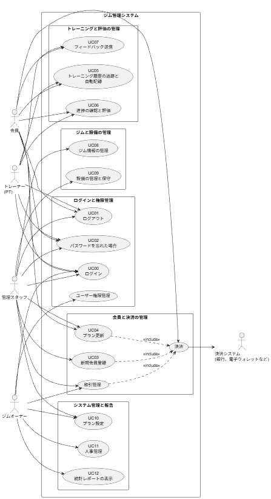

---

## 2.3 ユースケース分解図

### 2.3.1 システムとアカウントの分解

このグループは、システムへのアクセスと安全性を扱います。

**ユースケース:**
- UC00（ログイン）
- UC01（ログアウト）
- UC02（パスワードを忘れた場合）

**関係:**
- UC00（ログイン）は、他のすべての機能の前提条件です。

**注:** 権限管理は 2.4.6 の業務フローで説明します。3章には独立したユースケースとして置きません。

**注:** 権限管理は 2.4.6 で詳しく説明します。3章には独立したユースケースはありません。

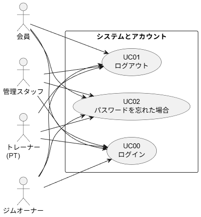

### 2.3.2 会員管理と取引の分解

このグループは、売上につながる重要な機能です。

**ユースケース:**
- UC03（新規会員登録）
- UC04（プラン更新）

**詳しい説明:**
- UC03 と UC04 はどちらも、決済と領収書発行を主な流れに含みます。
- アクターは、受付で処理する管理スタッフ、またはオンラインで操作する会員です（UC04 の場合）。
- 決済システムは、決済の受付と結果返却を行う補助アクターです。

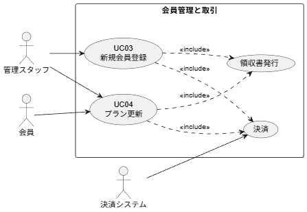

### 2.3.3 トレーニング運用の分解（リアルタイム）

このグループは、会員とトレーナーの日常利用を扱います。

**ユースケース:**
- UC05（トレーニング履歴の追跡と自動記録）
- UC06（進捗の確認と評価）
- UC07（フィードバック送信）

**詳しい説明:**
- UC05 は、手動チェックインではなく、リアルタイムで自動記録する仕組みです。
- UC06 は、PT が入力し、会員が結果を見る流れです。
- UC07 は、会員が人事や設備について評価でき、その結果は UC11（人事管理）に使われます。

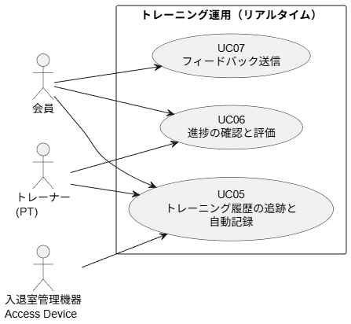

### 2.3.4 施設管理の分解

このグループは、ジムが常に使える状態を保つためのものです。

**ユースケース:**
- UC08（ジム情報の管理）
- UC09（設備の管理と保守）

**詳しい説明:**
- UC09 は、設備一覧の管理と、故障報告・修理の流れをまとめたものです。
- 入退室管理機器（Access Device）は、会員の出入り情報を UC05 に渡します。

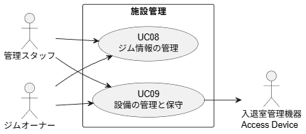

### 2.3.5 管理・報告の分解

このグループは、ジムオーナー向けの管理と経営確認を扱います。

**ユースケース:**
- UC10（プラン設定）
- UC11（人事管理）
- UC12（統計レポートの表示）

**詳しい説明:**
- UC11 は、社員情報、権限、勤務時間を管理し、UC07 の評価結果も使います。
- UC12 は、UC03、UC04、UC05、UC06、UC07 のデータをまとめて、売上、効率、人事の統計を出します。
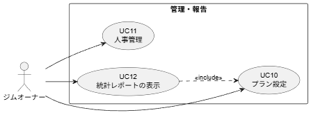
---

## 2.4 業務フロー

### 2.4.1 会員登録と更新の流れ（決済連携）

この流れは、新規登録とプラン更新の両方に使います。

**ステップ1: 受付**
- 会員は、登録時は個人情報、更新時は会員番号を出します。
- 希望するプラン（3か月、6か月、VIP など）を選びます。

**ステップ2: 確認と準備**
- 新規登録なら、電話番号とメールの重複を確認します。
- 更新なら、前のプランの状態を確認します。
- 管理スタッフがデータを入力または更新します。

**ステップ3: 決済**
- システムは、プラン料金と割引から支払額を計算します。
- 会員は次の方法で支払います。
  - 現金
  - 銀行カード
  - 電子ウォレット
- **エラー時:** 電子決済が失敗した場合は、別の方法を選ぶか、申請を中止できます。

**ステップ4: 反映と完了**
- システムは、決済成功を確認します。
- 開始日と終了日をデータベースに保存します。
- 領収書を自動で出します。
- 会員の利用権限を更新します。

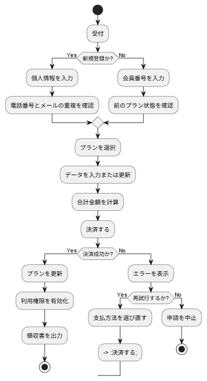

### 2.4.2 トレーニング履歴の追跡と自動記録（リアルタイム）

この流れは、手動チェックインの代わりにリアルタイムで記録します。

**ステップ1: 来館確認**
- 会員がジムに入ります。
- 入退室管理機器は、会員の到着信号をシステムに送ります（入口ですぐに記録するとは限りません）。

**ステップ2: 状態確認**
- システムは、プランの有効期限を確認します。
- 会員の予約もリアルタイムで確認します。

**ステップ3: 自動記録**
- 実際の利用時間または PT 予約に基づいて、1回のセッションを自動記録します。
- セッション終了後、またはプラン設定に応じて、回数を自動で減らします。

**ステップ4: 履歴更新**
- 利用履歴を保存します。
- 会員とスタッフは、いつでも確認できます。

### 2.4.3 設備管理と保守の流れ（連携）

この流れは、設備の導入から廃棄までを管理します。

**ステップ1: 設備管理**
- 管理スタッフは、新しい設備の情報（コード、名前、導入日、保証）を入力します。
- 既存設備も一覧に追加します。

**ステップ2: 問題報告**
- 定期点検や会員の報告で不具合を見つけたら、スタッフが内容を登録します。

**ステップ3: 保守状態へ変更**
- システムは、設備を「修理中」にします。
- 技術担当へ通知します。

**ステップ4: 修理処理**
- **成功:** 修理完了後、状態を「正常稼働」に戻します。
- **失敗:** 修理できない場合は、廃棄して「停止」にします。

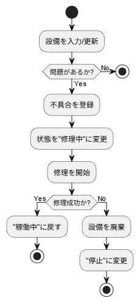

### 2.4.4 人事管理と評価の流れ

**ステップ1: 人事設定**
- ジムオーナーが社員情報を作ります。
- 権限グループ（PT、Sales、管理）を分けます。
- 勤務時間を設定します。

**ステップ2: 実績確認**
- システムは、次の情報を集めます。
  - PT の実際の指導回数
  - 会員からのフィードバック

**ステップ3: 評価**
- 定期的に、オーナーが実績レポートを見ます。
- それぞれの社員の働き具合を評価します。

### 2.4.5 フィードバック受付と処理の流れ

**ステップ1: 送信**
- 会員は、設備、スタッフ、サービスについてアプリから評価を送ります。

**ステップ2: 受付と分類**
- 管理スタッフが受け取ります。
- 重要度を分けます。
- 関係部署へ回します。

**ステップ3: 処理と返答**
- 修理や注意などの対応後、結果をシステムに登録します。
- 会員へ結果を知らせます。

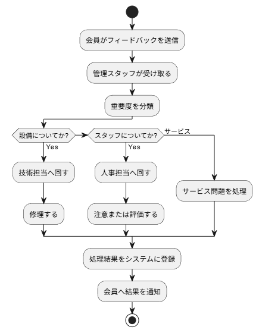

### 2.4.6 権限管理とグループ管理の流れ

この流れは、システムの安全性と役割管理を守るためのものです。

#### 2.4.6.1 ユーザーへのグループ割り当て

**説明:** 1人のユーザーを1つ以上の権限グループに入れます。

**手順:**
1. ジムオーナーが対象ユーザーを選びます。
2. 既存グループ（例: Admin、Sales）を選びます。
3. 「グループ割り当て」を押して反映します。

#### 2.4.6.2 グループへのユーザー管理

**説明:** ある権限グループに所属するメンバーを管理します。

**手順:**
1. ジムオーナーがグループを選びます。
2. システムは現在のメンバー一覧を出します。
3. オーナーは次を行います。
   - 「メンバー追加」（社員番号で検索）
   - 「削除」

#### 2.4.6.3 グループの機能管理

**説明:** あるグループに許可する機能を設定します。

**手順:**
1. ジムオーナーが設定したいグループを選びます。
2. システムは機能一覧（売上確認、設備削除、会員登録など）を表示します。
3. オーナーは必要な権限を選びます。
4. 「保存」を押すと、メンバー全員にすぐ反映されます。

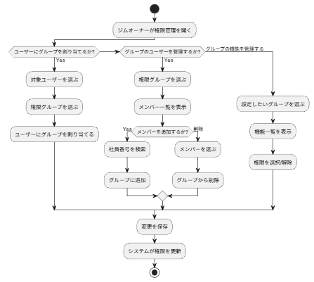

### 2.4.7 統計レポートの流れ

**ステップ1: 条件を選ぶ**
- ジムオーナーは、次のレポートを選べます。
  - 売上
  - 新規登録
  - 更新率
- 期間も選びます。

**ステップ2: データ集計**
- システムは次のデータを取ります。
  - 決済記録
  - トレーニング履歴

**ステップ3: 表示**
- システムは、次の形で結果を出します。
  - グラフ
  - 詳細表
- これは経営判断に使います。

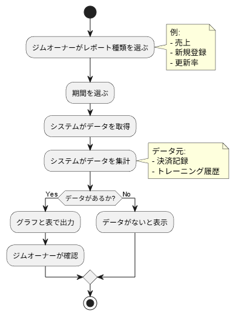

---

# 3. 機能仕様

**重要な注記:**
- **権限管理** は **2.4.6 の業務フロー** で説明します。3章には独立したユースケースとして置きません。
- **UC03（3章内）** は「新規会員登録」です。3.4 で詳しく説明します。
- 「hộ gia đình」という表現はすべて「会員」に統一しています。

---

## 3.1 UC00 - ログイン

| 項目 | 内容 |
|------|------|
| **ユースケース番号** | UC00 |
| **ユースケース名** | ログイン |
| **アクター** | 会員、管理スタッフ、トレーナー、ジムオーナー |
| **前提条件** | ユーザーはすでにシステムにアカウントを持っている |

### 主成功シナリオ

| No. | 実行者 | 操作 |
|-----|--------|------|
| 1 | 会員、管理スタッフ、トレーナー、ジムオーナー | ログイン機能を選ぶ |
| 2 | システム | ログイン画面を表示する |
| 3 | 会員、管理スタッフ、トレーナー、ジムオーナー | メールアドレスとパスワードを入力する |
| 4 | 利用者 | ログイン要求を送る |
| 5 | システム | ログイン情報を認証する |
| 6 | システム | 権限（Role）を確認する |
| 7 | システム | 対応する画面へ移動する |

### 代替シナリオ

| No. | 実行者 | 操作 |
|-----|--------|------|
| 5a | システム | 必須項目が足りないとき、エラーを表示する |
| 5b | システム | メールアドレスまたはパスワードが違うとき、エラーを表示する |
| 5c | システム | アカウントが管理者によりロックされている場合、エラーを表示する |
| 5d | システム | ユーザーがパスワードを忘れた場合、UC02「パスワードを忘れた場合」を呼ぶ |
| 5e | システム | パスワード変更用のメールを送る |

### 入力データ

| No. | 項目 | 説明 | 必須? | 有効条件 | 例 |
|-----|------|------|------|----------|----|
| 1 | Email | メールアドレス | はい | 形式: `^[a-zA-Z0-9._%+-]+@[a-zA-Z0-9.-]+\.[a-zA-Z]{2,}$`、255文字以下 | h.anh@gmail.com |
| 2 | パスワード | ログイン用パスワード | はい | 8文字以上、英大文字1つ以上、英小文字1つ以上、数字1つ以上、特殊文字1つ以上 | ToiLa12#$ |

### 事後条件
ユーザーは自分の権限に合う機能を使える。ログイン履歴はタイムスタンプとIPアドレス付きで記録する。

---

## 3.2 UC01 - ログアウト

| 項目 | 内容 |
|------|------|
| **ユースケース番号** | UC01 |
| **ユースケース名** | ログアウト |
| **アクター** | すべてのユーザー |
| **前提条件** | ユーザーはログイン状態である |

### 主成功シナリオ

| No. | 実行者 | 操作 |
|-----|--------|------|
| 1 | ユーザー | ログアウトを選ぶ |
| 2 | システム | セッションを終了し、ログイン画面へ戻る |

### 代替シナリオ
なし

### 事後条件
ログインし直すまで、システムの操作はできない。

---

## 3.3 UC02 - パスワードを忘れた場合

| 項目 | 内容 |
|------|------|
| **ユースケース番号** | UC02 |
| **ユースケース名** | パスワードを忘れた場合 |
| **アクター** | 会員、管理スタッフ、トレーナー、ジムオーナー |
| **前提条件** | ユーザーはアカウントを持ち、登録時に正しい連絡先（メールまたは電話番号）を入れている |

### 主成功シナリオ

| No. | 実行者 | 操作 |
|-----|--------|------|
| 1 | ユーザー | ログイン画面で「パスワードを忘れた場合」を選ぶ |
| 2 | システム | 登録済みのメールアドレスまたは電話番号の入力画面を出す |
| 3 | ユーザー | 個人情報を入力する |
| 4 | 利用者 | 情報を入れて「送信」を押す |
| 5 | システム | データベースに情報があるか確認する |
| 6 | システム | OTP または再設定リンクをメール/SMS で送る |
| 7 | ユーザー | OTP と新しいパスワードを入力する |
| 8 | システム | OTP の正しさを確認し、新しいパスワードを保存する |
| 9 | システム | 成功メッセージを表示し、ログイン画面へ戻す |

### 代替シナリオ

| No. | 実行者 | 操作 |
|-----|--------|------|
| 5a | システム | 情報が見つからない場合、「該当するアカウントがありません」と表示する |
| 8a | システム | OTP が違う、または期限切れの場合、エラーを表示し再送を許可する |

### 入力データ

| No. | 項目 | 説明 | 必須? | 有効条件 | 例 |
|-----|------|------|------|----------|----|
| 1 | Email/SĐT | メールアドレスまたは電話番号 | はい | Email 形式: `^[a-zA-Z0-9._%+-]+@[a-zA-Z0-9.-]+\.[a-zA-Z]{2,}$`、電話番号: `^\d{10}$` | h.anh@gmail.com / 0987654321 |
| 2 | 新しいパスワード | 新しいパスワード | はい | 8文字以上、英大文字1つ以上、英小文字1つ以上、数字1つ以上、特殊文字1つ以上 | NewPass123!@# |

### 事後条件
パスワードが更新され、OTP は無効になる。新しいパスワードでログインできる。変更履歴はログに残す。

---

## 3.4 UC03 - 新規会員登録

| 項目 | 内容 |
|------|------|
| **ユースケース番号** | UC03 |
| **ユースケース名** | 新規会員登録 |
| **アクター** | 管理スタッフ（主）、決済システム（補助） |
| **前提条件** | スタッフはログインしている |

### 主成功シナリオ

| No. | 実行者 | 操作 |
|-----|--------|------|
| 1 | スタッフ | 顧客の個人情報（氏名、電話番号、メール、指紋など）を入力する |
| 2 | スタッフ | 希望プランを選ぶ |
| 3 | スタッフ | 決済成功を確認する |
| 4 | システム | 会員コードを作成し、記録を保存し、領収書を出す |

### 代替シナリオ

| No. | 実行者 | 操作 |
|-----|--------|------|
| 4a | システム | 情報の重複、または決済失敗があった場合、エラーを表示し、下書き状態を保持する |

### 入力データ

| No. | 項目 | 説明 | 必須? | 有効条件 | 例 |
|-----|------|------|------|----------|----|
| 1 | 姓 | 会員の姓 | はい | 2～50文字、文字と空白のみ | Lê Thành |
| 2 | 名 | 会員の名 | はい | 2～50文字、文字と空白のみ | An |
| 3 | パスワード | パスワード | はい | 8文字以上、英大文字1つ以上、英小文字1つ以上、数字1つ以上、特殊文字1つ以上 | Gym123!@ |
| 4 | 出身地 | 出身地 | いいえ | 0～100文字 | Bắc Ninh |
| 5 | プランコード | プランコード | はい | Package テーブルにあり、利用中であること | PKG001 |
| 6 | 生年月日 | 生年月日 | はい | 形式: YYYY-MM-DD、16歳以上 | 2005-06-15 |
| 7 | 電話番号 | 電話番号 | はい | 形式: `^\d{10}$` | 0987654321 |
| 8 | メール | メールアドレス | はい | 形式: `^[a-zA-Z0-9._%+-]+@[a-zA-Z0-9.-]+\.[a-zA-Z]{2,}$`、システム内で一意 | user@email.com |
| 9 | 指紋 | 指紋データ | はい | fingerprint template（256 bytes）、システム内で一意 | [binary data] |

### 事後条件
新しい会員アカウントが有効になる。会員コードが自動作成される。確認メールを送る。領収書は保存される。

---

## 3.5 UC04 - プラン更新

| 項目 | 内容 |
|------|------|
| **ユースケース番号** | UC04 |
| **ユースケース名** | プラン更新 |
| **アクター** | 会員（オンライン）、管理スタッフ（受付）、決済システム |
| **前提条件** | 会員はアカウントを持っている |

### 主成功シナリオ

| No. | 実行者 | 操作 |
|-----|--------|------|
| 1 | 会員 | 自分のアカウントへログインする |
| 2 | 会員 | 更新または上位プランを選ぶ |
| 3 | 会員 | 決済処理を行う |
| 4 | 決済システム | 決済成功を返す |
| 5 | システム | 期限を更新し、回数を追加する |

### 代替シナリオ

| No. | 実行者 | 操作 |
|-----|--------|------|
| 4a | 決済システム | 決済失敗を返す |
| 5a | システム | 支払い失敗を知らせ、再決済を求める |

### 事後条件
利用期限が更新され、回数が追加される。確認メールと領収書を保存する。

---

## 3.6 UC05 - トレーニング履歴の追跡と自動記録（リアルタイム）

| 項目 | 内容 |
|------|------|
| **ユースケース番号** | UC05 |
| **ユースケース名** | トレーニング履歴の追跡と自動記録 |
| **アクター** | 会員、トレーナー |
| **前提条件** | 会員のプランが有効である |

### 主成功シナリオ

| No. | 実行者 | 操作 |
|-----|--------|------|
| 1 | システム | プラン残回数を自動で計算する |
| 2 | 会員とPT | アプリで予約と現在のプラン状態を見る |
| 3 | システム | トレーニング開始/終了時に自動で回数を減らし、履歴を記録する |

### 代替シナリオ

| No. | 実行者 | 操作 |
|-----|--------|------|
| 1a | システム | 今日の予約がない場合、「今日は予約なし」と表示する |
| 2a | システム | プラン期限切れなら利用を拒否し、更新を案内する |
| 2b | システム | 残回数がない場合、更新を求める |
| 3a | システム | 記録中にネットワーク障害が出たら、キューに保存し、復旧後に再記録する |
| 3b | システム | 入退室管理機器が会員を認識できない場合、手動チェックインまたはQRコードを求める |

### 事後条件
利用データはリアルタイムで正しく更新される。開始/終了時刻つきの履歴が残る。セッション終了時に通知を送る。

---

## 3.7 UC06 - 進捗の確認と評価

| 項目 | 内容 |
|------|------|
| **ユースケース番号** | UC06 |
| **ユースケース名** | 進捗の確認 |
| **アクター** | トレーナー、会員 |
| **前提条件** | 会員はトレーニング中である |

### 主成功シナリオ

| No. | 実行者 | 操作 |
|-----|--------|------|
| 1 | トレーナー | 「進捗管理」を選び、対象会員を選ぶ |
| 2 | システム | 体重、BMI、目標などを入力する画面を表示する |
| 3 | トレーナー | 実際の数値と評価を入力する |
| 4 | システム | データを保存し、会員の進捗グラフを更新する |
| 5 | 会員 | アプリにログインして評価結果を見る |

### 代替シナリオ

| No. | 実行者 | 操作 |
|-----|--------|------|
| 1a | トレーナー | 会員が一覧に見つからない場合、会員コードの確認を求める |
| 3a | トレーナー | 前の記録と重複した場合、システムが警告し、修正を許可する |
| 4a | システム | 入力値が不正（負の値、上限超えなど）の場合、再入力を求める |
| 4b | システム | データベース保存に失敗した場合、再試行または管理者連絡を案内する |
| 5a | 会員 | ログインしていない場合、ログインを求める |

### 事後条件
トレーニング結果は数値化され、進捗履歴に保存される。グラフが自動更新される。評価結果の通知を送る。

---

## 3.8 UC07 - フィードバック送信

| 項目 | 内容 |
|------|------|
| **ユースケース番号** | UC07 |
| **ユースケース名** | フィードバック送信 |
| **アクター** | 会員（オンライン）、管理スタッフ（受付） |
| **前提条件** | 会員はアカウントを持っている |

### 主成功シナリオ

| No. | 実行者 | 操作 |
|-----|--------|------|
| 1 | 会員 | アプリで「フィードバック送信」を選ぶ |
| 2 | システム | 種別（人事、設備、サービス）と内容のフォームを表示する |
| 3 | 会員 | 種別を選び、内容を入力して送信する |
| 4 | システム | データベースに保存し、管理者/オーナーへ通知する |

### 代替シナリオ

| No. | 実行者 | 操作 |
|-----|--------|------|
| 3a | 会員 | 内容が空の場合、入力を求める |
| 3b | システム | エラーを出し、再入力を求める |

### 事後条件
フィードバックは記録され、関連部署へ送られる。会員には確認通知が届く。チケットを作成し、処理部署に割り当てる。対応期限は重要度に応じて決まる。

---

## 3.9 UC08 - ジム情報の管理

| 項目 | 内容 |
|------|------|
| **ユースケース番号** | UC08 |
| **ユースケース名** | ジム情報の管理 |
| **アクター** | 管理スタッフ、ジムオーナー |
| **前提条件** | なし |

### 主成功シナリオ

| No. | 実行者 | 操作 |
|-----|--------|------|
| 1 | 管理スタッフ | 「ジム管理」を選ぶ |
| 2 | システム | 既存のジム一覧（Gym、Yoga、Fitness など）を表示する |
| 3 | システム | ジムコードの重複を確認し、変更を保存する |

### 代替シナリオ

| No. | 実行者 | 操作 |
|-----|--------|------|
| 2a | 管理スタッフ | 初回利用で一覧が空の場合、新規作成を案内する |
| 3a | システム | すでにあるジムコードなら、変更を求める |
| 3b | 管理スタッフ | 収容人数や設備を更新する |
| 3c | 管理スタッフ | 使わないジムを削除する。設備がある場合は確認を求める |

### 事後条件
ジム一覧が更新される。新しいジムは設備や PT 予約に使える。変更通知をスタッフへ送る。

---

## 3.10 UC09 - 設備の管理と保守

| 項目 | 内容 |
|------|------|
| **ユースケース番号** | UC09 |
| **ユースケース名** | 設備の管理と保守 |
| **アクター** | 管理スタッフ、ジムオーナー |
| **前提条件** | なし |

### 主成功シナリオ

| No. | 実行者 | 操作 |
|-----|--------|------|
| 1 | 管理スタッフ | 「設備管理」を選ぶ |
| 2 | システム | 設備一覧を表示し、コード、名称、導入日、保証、状態を見せる |
| 3 | 管理スタッフ | 1件を選んで更新するか、「新規追加」で設備を登録する |
| 4 | 管理スタッフ | 故障が見つかったら、不具合内容を入力し、状態を「修理中」にする |
| 5 | システム | 変更を保存し、修理履歴を残し、技術担当へ通知する |
| 6 | 技術担当 | 実際に修理し、結果をシステムへ返す |
| 7 | システム | 状態を「正常稼働」に戻し、最終保守日を更新する |

### 代替シナリオ

| No. | 実行者 | 操作 |
|-----|--------|------|
| 2a | システム | 設備がない場合、新規追加を案内する |
| 3a | 管理スタッフ | 必須項目不足や日付形式ミスがあれば、再入力を求める |
| 3b | 管理スタッフ | コードや名前で検索する |
| 4a | 管理スタッフ | 古い設備を削除する。削除前に確認を出す |
| 5a | システム | 技術担当へ送れない場合、再送を行う |
| 6a | 技術担当 | 修理できない場合、廃棄し「停止」にする |
| 7a | システム | 設備を停止扱いにして、関連予約から外す |

### 事後条件
設備一覧が更新される。状態変更と保守履歴が保存される。関係部署へ通知し、保守レポートを自動作成する。

---

## 3.11 UC10 - プラン設定

| 項目 | 内容 |
|------|------|
| **ユースケース番号** | UC10 |
| **ユースケース名** | プラン設定 |
| **アクター** | 管理スタッフ、ジムオーナー |
| **前提条件** | なし |

### 主成功シナリオ

| No. | 実行者 | 操作 |
|-----|--------|------|
| 1 | ジムオーナー | 「プラン設定」を選ぶ |
| 2 | システム | プラン名、期間、回数、料金、特典の入力画面を表示する |
| 3 | ジムオーナー | 新しいプラン情報を入力して保存する |
| 4 | システム | そのプランをスタッフの登録画面に表示する |

### 代替シナリオ

| No. | 実行者 | 操作 |
|-----|--------|------|
| 2a | システム | プランがまだない場合、新規作成を案内する |
| 3a | システム | 同じ名前のプランがある場合、名前変更を求める |
| 3b | ジムオーナー | 既存プランの価格、回数、特典を更新する |
| 3c | ジムオーナー | 使わないプランを無効化し、一覧から隠す |
| 4a | システム | 金額が負の値や回数が不正なら、再入力を求める |

### 事後条件
新しいプランが保存される。スタッフの登録画面に表示され、会員登録に使える。

---

## 3.12 UC11 - 人事管理

| 項目 | 内容 |
|------|------|
| **ユースケース番号** | UC11 |
| **ユースケース名** | 人事管理 |
| **アクター** | ジムオーナー |
| **前提条件** | ジムオーナーはログインしている |

### 主成功シナリオ

| No. | 実行者 | 操作 |
|-----|--------|------|
| 1 | ジムオーナー | 「人事管理」を選ぶ |
| 2 | システム | 現在の社員一覧を表示する |
| 3 | ジムオーナー | 詳細を見るか、「新規追加」を選ぶ |
| 4 | ジムオーナー | 社員情報（氏名、メール、電話、役職）を入力する |
| 5 | ジムオーナー | 権限グループ（PT、Sales、管理）を分ける |
| 6 | ジムオーナー | 勤務時間（朝、昼、夜）を設定する |
| 7 | システム | 保存し、確認メールを送る |

### 代替シナリオ

| No. | 実行者 | 操作 |
|-----|--------|------|
| 4a | ジムオーナー | 社員のメールがすでにある場合、エラーを表示する |
| 6a | ジムオーナー | 勤務時間が重なった場合、警告を出す |

### 事後条件
社員情報が保存される。アクセス権が付与され、勤務時間が更新される。社員へアカウント有効化の通知を送る。

---

## 3.13 UC12 - 統計レポートの表示

| 項目 | 内容 |
|------|------|
| **ユースケース番号** | UC12 |
| **ユースケース名** | 統計レポートの表示 |
| **アクター** | ジムオーナー |
| **前提条件** | ジムオーナーはログインしている |

### 主成功シナリオ

| No. | 実行者 | 操作 |
|-----|--------|------|
| 1 | ジムオーナー | 「統計レポート」を選ぶ |
| 2 | システム | 売上、新規会員、更新率、社員効率などのレポート種別を表示する |
| 3 | ジムオーナー | レポート種別と期間を選ぶ |
| 4 | システム | データベースからデータを取得する |
| 5 | システム | データを集計する |
| 6 | システム | グラフ（棒、円、折れ線）を作る |
| 7 | システム | 詳細表を表示する |

### 代替シナリオ

| No. | 実行者 | 操作 |
|-----|--------|------|
| 4a | システム | 指定期間にデータがない場合、「データなし」と表示する |
| 5a | システム | 計算エラーが出た場合、エラーを表示し、管理者へ連絡するよう案内する |

### 事後条件
レポートが正常に作成される。PDF/Excel への出力ができる。履歴に保存され、数値はリアルタイムで更新される。

---

# 4. その他の要件

## 4.1 機能要件

システムは、ユースケースで説明したすべての機能を正しく実行しなければなりません。内容は次の通りです。
- 会員管理
- プラン管理
- 設備管理
- 統計レポート

### 具体要件
- CRUD 操作はデータの整合性を保つこと
- ユーザー種別ごとの権限を明確に分けること
- 重要データに関する操作では、確認を求めること

## 4.2 使いやすさ

システムは、技術に詳しくない人でも使いやすい画面にしなければなりません。

### 具体要件
- 機能を見つけやすく配置すること
- エラーは具体的に表示し、利用者が対処しやすくすること
- 会員登録やプラン更新など、よく使う操作はすばやくできること

## 4.3 性能

システムは、安定して速く動かなければなりません。

- **応答時間:** ログインや検索などの基本操作は 2 秒以下、レポートは 5 秒以下
- **同時利用:** 少なくとも 100 人が同時に使えること
- **可用性:** 稼働率は 99%以上
- **データ処理:** データベースは 1000 件/秒以上の取引を処理できること
- **拡張性:** データが増えたら、メモリや保存領域を増やせること
- **監視:** New Relic や Grafana などの APM で性能を監視すること

## 4.4 セキュリティ

このシステムは、個人情報とお金の情報を扱うため、安全対策が必要です。

- **パスワード暗号化:** Bcrypt または Argon2 を使い、平文では保存しない
- **強いパスワード:** 8文字以上で、大文字、小文字、数字、特殊文字を含める
- **アカウント保護:** 5回失敗したらロックし、メール/SMSでパスワード再設定をできるようにする
- **権限管理:** Role-Based Access Control（Admin、Manager、Trainer、Member）を使い、最小権限の原則を守る
- **通信の暗号化:** すべての通信で HTTPS/TLS 1.2+ を使う
- **保存データの暗号化:** email、電話番号、指紋、決済情報などの重要データは AES-256 で守る
- **セッションタイムアウト:** 30分何も操作しないと終了し、1アカウント3セッションまでにする
- **セキュリティログ:** ログイン、パスワード変更、機密データへのアクセスを記録し、1年間保管する
- **Web防御:** SQL Injection、XSS、CSRF を入力チェックと Prepared Statement で防ぐ
- **更新:** セキュリティパッチは24時間以内に入れ、週1回は脆弱性確認をする

## 4.5 信頼性

- システムは安定して動作すること
- 定期バックアップを行うこと
- 障害時に復旧できること

## 4.6 拡張性

- 会員が増えても拡張できること
- 複数店舗に展開できること

## 4.7 保守性

- コードを整理して書くこと
- 更新や修正をしやすくすること
- 開発者向けの説明資料を用意すること

## 4.8 バックアップと災害復旧

### 目標
- **RTO（Recovery Time Objective）:** 4時間以内
- **RPO（Recovery Point Objective）:** 1時間以内

### バックアップ戦略
- **Full Backup:** 毎日1回、30日保存
- **Incremental Backup:** 4時間ごと、7日保存
- **Offsite Backup:** 毎週クラウドへ保存、90日保存

### 復旧手順
- **障害検知:** ダウンやデータ破損を自動監視で検知する
- **判断:** 軽い障害は再起動、中くらいの障害はバックアップ復元、重い障害は DR サイトへ切替える
- **復旧:** 最新バックアップから戻し、データ確認後にアプリを復旧する
- **確認:** 機能テストを行い、トラフィックを本番へ戻し、利用者へ通知する
- **分析:** 原因を記録し、手順を更新し、バックアップ方法を見直す

### ツールと方式
- Database backup: PostgreSQL native tools または Percona XtraBackup
- Cloud backup: AWS Backup、Azure Backup
- Monitoring: Prometheus、Grafana
- Disaster Recovery: Database replication（Master-Slave）

### 確認
- 毎週 restore test をする
- 四半期ごとに DR drill をする
- 復旧資料を常に更新する

---

> **注記:** この文書は ITSS 標準を元に作成し、ソフトウェア要件管理の流れに従っています。要件は開発中に関係者の意見で更新されることがあります。

---

**発行日:** 2026年4月28日

**版数:** 1.0  
**状態:** 完了
