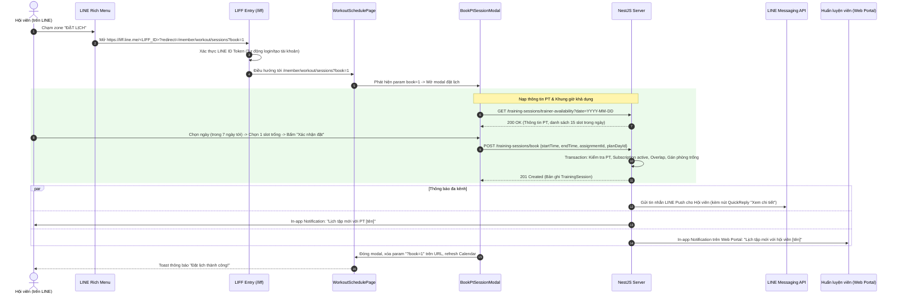
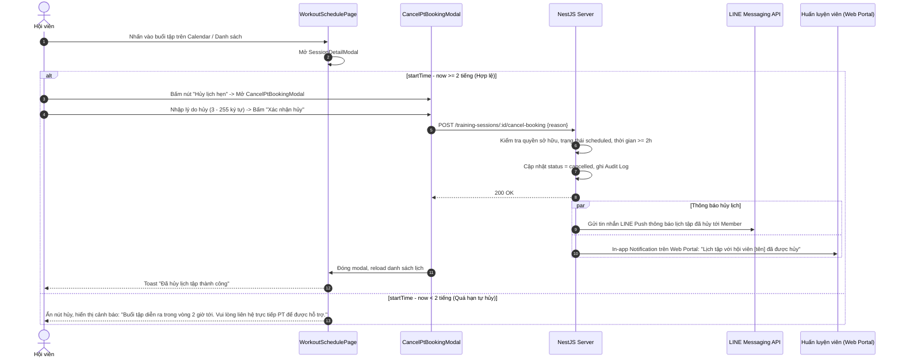
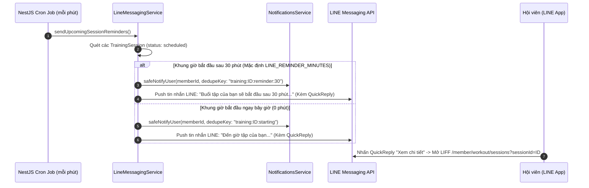

# ĐẶC TẢ NGHIỆP VỤ: ĐẶT LỊCH TẬP VỚI PT QUA LINE RICH MENU

- **Tác giả:** Đội ngũ phát triển Gym Management System
- **Trạng thái:** Hoàn thiện & Chuẩn hóa (Aligned & Approved)
- **Phiên bản:** 1.1.0
- **Ngày cập nhật:** 18/08/2026

---

## 1. MỤC ĐÍCH & BỐI CẢNH

Đặc tả nghiệp vụ cho luồng **đặt lịch tập với Huấn luyện viên cá nhân (PT - Personal Trainer)** được truy cập trực tiếp thông qua **LINE Rich Menu** và **LINE Front-end Framework (LIFF)** trên ứng dụng LINE.

Tài liệu này chuẩn hóa toàn bộ trải nghiệm người dùng trên kênh LINE, cơ chế điều hướng Deep Link, quy tắc nghiệp vụ, luồng thông báo đa kênh và cách thức tích hợp với hệ thống backend hiện có (tham chiếu giải pháp kỹ thuật tại [member-pt-booking-design.md](member-pt-booking-design.md)).

---

## 2. GIỚI HẠN TÍNH NĂNG (SCOPE)

### 2.1. Bảng phân định phạm vi

| Hạng mục | Bao gồm | Không bao gồm |
| :--- | :--- | :--- |
| **Rich Menu Layout** | Thiết kế 4 vùng chạm toàn chiều cao (full-height), điều hướng LIFF Canonical URL | Tùy biến layout động theo role (dùng chung 1 layout chuẩn cho Member) |
| **LIFF Pages & Routing** | Điều hướng tự động qua `LiffEntryPage`, tự mở modal đặt lịch (`?book=1`), mở chi tiết buổi tập (`?sessionId=X`), xem điểm danh (`/member/attendance`) | Xây dựng lại giao diện mới — tái sử dụng toàn bộ các màn hình hiện có |
| **Thao tác lịch tập** | Đặt lịch mới (`POST /book`), Tự hủy lịch (`POST /:id/cancel-booking`) trước giờ tập >= 2h | Member tự bấm "Đổi lịch" trực tiếp (Member tự hủy rồi đặt mới, hoặc PT/Manager đổi lịch từ CMS) |
| **Thông báo (Notifications)** | LINE Push Message cho Member (Đặt/Hủy/Đổi/Nhắc lịch); In-app Notification cho cả Member và Trainer | LINE Push cho Trainer (Trainer chỉ nhận In-app Notification trên Web Portal vì không dùng LINE Bot) |
| **Onboarding LINE** | Tự động tạo tài khoản Member khi đăng nhập LIFF lần đầu; Hiển thị hướng dẫn mua gói/gán PT khi chưa đủ điều kiện | Tự động gán PT ngẫu nhiên hoặc kích hoạt gói tập dùng thử |

### 2.2. Đối tượng người dùng & Kênh tương tác

- **Hội viên (Member):** Tương tác chính qua ứng dụng LINE (Rich Menu, LIFF Webview, LINE Push Message).
- **Huấn luyện viên (Personal Trainer - PT):** Tương tác qua **Web Portal** quản trị, nhận In-app Notification khi có hội viên đặt/hủy lịch.
- **Ban quản lý (Owner / Manager):** Quản lý lịch tập và phân công PT phụ trách cho hội viên trên Web Portal.

### 2.3. Giả định & Cơ chế tài khoản

- **Tự động liên kết tài khoản (Auto-provisioning):** Người dùng khi bấm vào Rich Menu sẽ mở LIFF. Nếu chưa có tài khoản trong hệ thống, `LineOAuthService` tự động khởi tạo bản ghi `User` (role: `member`) và `Member` tương ứng, gắn `lineId`.
- **Điều kiện đặt lịch hợp lệ:** Hội viên phải có **Primary Trainer** được gán và có ít nhất 1 **Subscription** ở trạng thái `active` có hiệu lực vào ngày tập.
- **Cấu hình LINE:** Rich Menu và LIFF App đã được tạo và kích hoạt trên LINE Developers Console.

---

## 3. THIẾT KẾ LINE RICH MENU

### 3.1. Cấu trúc Rich Menu

Rich Menu hiển thị cố định ở phần đáy của màn hình chat LINE Official Account (thay thế bàn phím mặc định), kích thước tiêu chuẩn **2500 x 843 px**, chia đều thành **4 vùng chạm (Tap Zones) toàn chiều cao** (`width: 625px, height: 843px`).

```
┌─────────────────┬─────────────────┬─────────────────┬─────────────────┐
│                 │                 │                 │                 │
│     LỊCH TẬP    │     ĐẶT LỊCH    │     CHECK-IN    │      HỒ SƠ      │
│                 │                 │                 │                 │
│    (Calendar)   │   (Calendar+)   │    (Scan QR)    │     (Profile)   │
│                 │                 │                 │                 │
│   Zone 1 (0px)  │  Zone 2 (625px) │ Zone 3 (1250px) │ Zone 4 (1875px) │
└─────────────────┴─────────────────┴─────────────────┴─────────────────┘
 <─── 625 px ────><─── 625 px ────><─── 625 px ────><─── 625 px ────>
 <───────────────────────────── 2500 px ─────────────────────────────>
```

### 3.2. Bảng cấu hình vùng nhấn (Tap Zones)

| Zone | Tọa độ (x, y, w, h) | Canonical URI Action | Đích đến & Hành vi trải nghiệm |
| :--- | :--- | :--- | :--- |
| **1. Lịch tập** | `0, 0, 625, 843` | `https://liff.line.me/<LIFF_ID>?redirect=/member/workout/sessions` | Mở trang Lịch tập (`WorkoutSchedulePage`), hiển thị lịch dạng Calendar và danh sách buổi tập sắp tới. |
| **2. Đặt lịch** | `625, 0, 625, 843` | `https://liff.line.me/<LIFF_ID>?redirect=/member/workout/sessions?book=1` | Mở trang Lịch tập kèm tham số `book=1`, tự động bung modal đặt lịch (`BookPtSessionModal`). |
| **3. Check-in** | `1250, 0, 625, 843` | `https://liff.line.me/<LIFF_ID>?redirect=/member/attendance` | Mở trang Điểm danh (`AttendancePage`), hiển thị mã QR hội viên để quét tại quầy lễ tân hoặc quét thiết bị phòng tập. |
| **4. Hồ sơ** | `1875, 0, 625, 843` | `https://liff.line.me/<LIFF_ID>?redirect=/member/profile` | Mở trang Thông tin cá nhân (`ProfilePage`), xem chi tiết gói tập, thông tin PT phụ trách và cài đặt tài khoản. |

> [!NOTE]
> - **Canonical URI:** Khuyến nghị dùng định dạng chuẩn `https://liff.line.me/<LIFF_ID>?redirect=...` để đảm bảo tương thích tốt trên cả ứng dụng LINE di động lẫn trình duyệt web ngoài.
> - Trong môi trường LINE Mock / Test nội bộ, hệ thống hỗ trợ tương đương URL `liff://mock-liff/...` hoặc `http://localhost:5173/liff?redirect=...`.

---

## 4. LUỒNG NGHIỆP VỤ CHÍNH

### 4.1. Luồng Đặt lịch tập (Instant Booking Flow)



---

### 4.2. Luồng Xem & Quản lý lịch tập (Deep Linking & Detail View)

Hội viên có thể truy cập danh sách và chi tiết lịch tập thông qua các cách sau:
1. **Từ Rich Menu "Lịch tập":** Mở `/member/workout/sessions`.
2. **Từ nút QuickReply trong tin nhắn LINE:** Mở `/member/workout/sessions?sessionId=<ID>`.
   - Trang sẽ tự động fetch chi tiết buổi tập qua `GET /training-sessions/:id` và mở `SessionDetailModal`.
   - Khi đóng modal, URL tự động được làm sạch (xóa `sessionId` khỏi query param).

---

### 4.3. Luồng Hủy lịch tập (Member Cancellation Flow)



---

### 4.4. Luồng Đổi lịch tập (Reschedule Handling)

> [!IMPORTANT]
> **Quy định đổi lịch:**
> - Hệ thống **không cung cấp API đổi lịch riêng lẻ cho Hội viên** trên LIFF. 
> - Nếu Hội viên muốn đổi giờ tập:
>   - **Cách 1 (Tự thao tác):** Hội viên tự Hủy buổi tập hiện tại (nếu trước giờ tập >= 2h), sau đó thực hiện Đặt lịch mới vào khung giờ mong muốn.
>   - **Cách 2 (Thông qua PT/Quản lý):** Hội viên liên hệ PT/Lễ tân. PT hoặc Quản lý sẽ thực hiện đổi giờ trên Web Portal (`PUT /training-sessions/:id`).
> - Khi PT/Quản lý đổi lịch trên Web Portal, hệ thống tự động kích hoạt:
>   - Gửi **LINE Push Message** báo giờ tập mới cho Hội viên (kèm nút mở chi tiết LIFF).
>   - Gửi **In-app Notification** cho Hội viên và PT.

---

### 4.5. Luồng Tự động nhắc lịch tập (Automated Reminders)

Hệ thống chạy Cron Job mỗi phút (`@Cron('* * * * *')` theo múi giờ `Asia/Ho_Chi_Minh`):



---

## 5. CẤU HÌNH KỸ THUẬT & MÃ NGUỒN LIÊN QUAN

### 5.1. Backend Services & Endpoints

| Thành phần | Đường dẫn file | Trách nhiệm chính |
| :--- | :--- | :--- |
| `MemberSessionBookingService` | `server/src/training/member-session-booking.service.ts` | Xử lý `getTrainerAvailability()`, `bookSessionByMember()`, `cancelBookingByMember()` trong Prisma Transaction. |
| `LineMessagingService` | `server/src/line-messaging/line-messaging.service.ts` | Gửi LINE Push Message (`created`, `updated`, `cancelled`, `reminder`, `starting`), xử lý Webhook, Cron nhắc lịch. |
| `LineOAuthService` | `server/src/auth/line-oauth.service.ts` | Xác thực LINE ID Token, Auto-provisioning tài khoản Member mới từ LINE. |
| `TrainingSessionNotificationService` | `server/src/training/training-session-notification.service.ts` | Điều phối bắn In-app Notification và kích hoạt gửi tin nhắn LINE. |
| `TrainingController` | `server/src/training/training.controller.ts` | Endpoints: `GET /training-sessions/trainer-availability`, `POST /training-sessions/book`, `POST /training-sessions/:id/cancel-booking`. |

### 5.2. Frontend Components & LIFF Helpers

| Thành phần | Đường dẫn file | Trách nhiệm chính |
| :--- | :--- | :--- |
| `WorkoutSchedulePage` | `client/src/pages/member/workout/WorkoutSchedulePage.tsx` | Hiển thị Calendar, quản lý state `bookModalOpen`, xử lý deep link `?book=1` và `?sessionId=X`, dọn dẹp searchParams khi đóng modal. |
| `BookPtSessionModal` | `client/src/pages/member/workout/BookPtSessionModal.tsx` | Thanh trượt chọn 7 ngày, lưới 15 khung giờ, chọn bài tập giáo án, bắt lỗi 409 Race Condition để auto-refresh slot. |
| `CancelPtBookingModal` | `client/src/pages/member/workout/CancelPtBookingModal.tsx` | Modal nhập lý do hủy lịch (3-255 ký tự) và kiểm tra điều kiện 2 giờ. |
| `LiffEntryPage` | `client/src/pages/liff/LiffEntryPage.tsx` | Xử lý vòng đời đăng nhập LIFF SDK, refresh ID token hết hạn, đồng bộ ngôn ngữ (vi/ja), điều hướng an toàn. |
| `liff-redirect.ts` | `client/src/pages/liff/liff-redirect.ts` | Validate whitelist đường dẫn chuyển hướng sau login (bảo toàn query params và hash). |

---

## 6. BẢNG QUY TẮC NGHIỆP VỤ (BUSINESS RULES)

| Mã quy tắc | Tên quy tắc | Nội dung chi tiết |
| :--- | :--- | :--- |
| **BR-01** | **Xác nhận tức thì (Instant Booking)** | Lịch tập được hệ thống tự động xác nhận ngay lập tức khi gửi yêu cầu thành công, không cần PT duyệt thủ công. |
| **BR-02** | **Phạm vi PT** | Hội viên chỉ được đặt lịch với **Primary Trainer** được gán cho mình (`member.primaryTrainerId`). Nếu chưa có PT, không cho phép đặt lịch. |
| **BR-03** | **Khung giờ & Múi giờ** | Cố định **60 phút/buổi**, gồm 15 slot trong ngày từ `06:00 - 07:00` đến `20:00 - 21:00` theo múi giờ phòng tập (`Asia/Ho_Chi_Minh - UTC+7`). Mọi dữ liệu API trao đổi theo chuẩn ISO 8601 (UTC). |
| **BR-04** | **Hạn mức thời gian đặt** | Đặt trước tối đa **7 ngày** tính từ ngày hiện tại, và tối thiểu **5 phút** trước giờ bắt đầu của slot. |
| **BR-05** | **Giới hạn số lịch chờ** | Tối đa **3 lịch tập ở trạng thái `scheduled`** trong tương lai cho mỗi hội viên để ngăn chặn spam giữ chỗ. |
| **BR-06** | **Điều kiện Gói tập** | Phải có ít nhất 1 `Subscription` ở trạng thái `active` có hiệu lực tại ngày diễn ra buổi tập (không giới hạn số buổi trong thời hạn gói). |
| **BR-07** | **Tự động phân bổ phòng** | Hệ thống tự động gán một phòng tập trống (`findAvailableRoom`). Nếu toàn bộ phòng đều kín chỗ trong khung giờ đó, trả về lỗi `NO_ROOM_AVAILABLE`. |
| **BR-08** | **Liên kết giáo án (Tùy chọn)** | Hội viên có thể tùy chọn liên kết buổi tập với 1 ngày tập cụ thể (`planDayId`) trong giáo án đang kích hoạt (`MemberWorkoutPlan`). |
| **BR-09** | **Chính sách hủy lịch** | Hội viên chỉ được tự hủy lịch trước giờ tập **tối thiểu 2 tiếng** (`startTime - now >= 2h`) và **bắt buộc nhập lý do** (3 đến 255 ký tự). Dưới 2 tiếng, hệ thống khóa thao tác hủy. |
| **BR-10** | **Kênh thông báo chuẩn** | - **Hội viên:** Nhận In-app Notification + LINE Push Message.<br>- **Huấn luyện viên (PT):** Nhận In-app Notification trên Web Portal. |

---

## 7. TÌNH HUỐNG NGOẠI LỆ & TRẢI NGHIỆM ONBOARDING (EDGE CASES & ONBOARDING UX)

| Tình huống | Hành vi hệ thống & Phản hồi UX |
| :--- | :--- |
| **Hội viên mới từ LINE chưa có PT** | `BookPtSessionModal` hiển thị banner cảnh báo: *"Bạn chưa được phân công PT phụ trách. Vui lòng liên hệ quầy lễ tân hoặc hotline để chọn PT."* Vô hiệu hóa nút chọn slot. |
| **Hội viên chưa có Gói tập Active** | Backend trả về mã lỗi `409 MEMBER_HAS_NO_ACTIVE_SUBSCRIPTION`. Giao diện hiển thị modal/thông báo: *"Bạn cần có gói tập đang hoạt động để đặt lịch"* kèm nút CTA dẫn trực tiếp sang trang Gói tập (`/member/membership`) hoặc liên hệ lễ tân. |
| **Xung đột khung giờ (Race Condition)** | Khi 2 hội viên cùng đặt 1 khung giờ sát nút, người đến sau nhận lỗi `409 TRAINER_TIME_OVERLAP`. Frontend hiển thị Toast thân thiện: *"Khung giờ này vừa được người khác đặt trước ít giây"* và tự động kích hoạt nạp lại bảng slot trống. |
| **Hội viên trùng lịch khác** | Backend trả về `409 MEMBER_TIME_OVERLAP`. Frontend thông báo: *"Bạn đã có lịch tập khác trong khung giờ này"*. |
| **Hết phòng tập khả dụng** | Backend trả về `409 NO_ROOM_AVAILABLE`. Frontend thông báo: *"Tất cả phòng tập đã kín chỗ trong khung giờ này. Vui lòng chọn giờ khác"*. |
| **Hủy lịch trễ (< 2 tiếng)** | `WorkoutSchedulePage` và `SessionDetailModal` ẩn nút Hủy, hiển thị thông báo màu vàng: *"Buổi tập diễn ra trong vòng 2 giờ tới. Để đổi hoặc hủy lịch, vui lòng liên hệ trực tiếp PT."* |
| **LINE ID Token hết hạn khi mở lại webview** | `LiffEntryPage` kiểm tra `decoded.exp`, nếu còn dưới 30 giây hoặc đã hết hạn thì tự động `liff.logout()` và `liff.login()` lại một cách mượt mà. |
| **Dọn dẹp Deep Link Param sau thao tác** | Khi người dùng đóng `BookPtSessionModal` hoặc `SessionDetailModal`, Frontend tự động xóa `book` / `sessionId` khỏi URL thông qua `setSearchParams(..., { replace: true })` để tránh tự mở lại modal khi người dùng F5 / reload. |

---

## 8. CHỈ SỐ ĐO LƯỜNG HIỆU QUẢ (KEY METRICS)

| Chỉ số (Metric) | Phương thức đo lường | Mục tiêu kỳ vọng |
| :--- | :--- | :--- |
| **Tỷ lệ đặt lịch qua LINE/LIFF** | Tỷ lệ bản ghi `AuditLog` có `action = 'training.member_book'` phát sinh từ user-agent LIFF / LINE | >= 65% tổng số lượt đặt lịch |
| **Thời gian hoàn tất đặt lịch** | Thời gian từ lúc mở `BookPtSessionModal` đến khi nhận response 201 | < 25 giây |
| **Tỷ lệ xung đột Race Condition được phục hồi** | Tỷ lệ user gặp 409 Overlap tiếp tục chọn slot khác thành công trong phiên | >= 80% |
| **Tỷ lệ gửi LINE Push thành công** | Tỷ lệ `safePushTrainingSessionEvent` trả về `true` cho các hội viên có `lineId` | >= 98% |
| **Tỷ lệ hủy lịch đúng hạn** | Tỷ lệ các lượt hủy lịch tự phục vụ qua LIFF thỏa mãn điều kiện trước >= 2h | 100% (do hệ thống chặn < 2h) |

---

## 9. PHỤ LỤC

### 9.1. Mẫu tin nhắn LINE Push đa ngôn ngữ (LINE Message Templates)

#### 1. Đặt lịch thành công (`created`)
- **Tiếng Việt (`vi`):**
  ```
  Bạn đã đặt lịch tập thành công.
  Thời gian: {datetime}
  PT: {trainerName}
  Phòng: {roomName}
  ```
- **Tiếng Nhật (`ja`):**
  ```
  トレーニング予約が完了しました。
  日時: {when}
  PT: {trainerName}
  ルーム: {roomName}
  ```

#### 2. Lịch tập được cập nhật (`updated`)
- **Tiếng Việt (`vi`):**
  ```
  Lịch tập của bạn đã được cập nhật.
  Thời gian mới: {datetime}
  PT: {trainerName}
  Phòng: {roomName}
  ```
- **Tiếng Nhật (`ja`):**
  ```
  トレーニング予約が更新されました。
  新しい日時: {when}
  PT: {trainerName}
  ルーム: {roomName}
  ```

#### 3. Hủy lịch tập (`cancelled`)
- **Tiếng Việt (`vi`):**
  ```
  Lịch tập với PT {trainerName} vào {datetime} đã bị hủy.
  ```
- **Tiếng Nhật (`ja`):**
  ```
  PT {trainerName} との {when} のトレーニング予約はキャンセルされました。
  ```

#### 4. Nhắc lịch tập trước 30 phút (`reminder`)
- **Tiếng Việt (`vi`):**
  ```
  Buổi tập của bạn sẽ bắt đầu sau {reminderMinutes} phút.
  Thời gian: {datetime}
  PT: {trainerName}
  Phòng: {roomName}
  ```
- **Tiếng Nhật (`ja`):**
  ```
  トレーニング開始まであと{reminderMinutes}分です。
  日時: {when}
  PT: {trainerName}
  ルーム: {roomName}
  ```

#### 5. Đến giờ tập (`starting`)
- **Tiếng Việt (`vi`):**
  ```
  Đến giờ tập của bạn.
  Thời gian: {datetime}
  PT: {trainerName}
  Phòng: {roomName}
  ```
- **Tiếng Nhật (`ja`):**
  ```
  トレーニング開始時間です。
  日時: {when}
  PT: {trainerName}
  ルーム: {roomName}
  ```

> Tất cả các tin nhắn LINE Push trên đều đính kèm **QuickReply Button**: *"Xem chi tiết"* (vi) / *"詳細を見る"* (ja) dẫn trực tiếp đến LIFF URL: `https://liff.line.me/<LIFF_ID>?redirect=/member/workout/sessions?sessionId=<ID>`.

---

### 9.2. Bảng mã lỗi API & Xử lý giao diện (Error Catalog)

| HTTP Status | Mã lỗi (Error Code) | Ý nghĩa nghiệp vụ | Phản hồi giao diện người dùng |
| :---: | :--- | :--- | :--- |
| `400` | `NO_PRIMARY_TRAINER` | Hội viên chưa được gán PT phụ trách | Banner cảnh báo + Vô hiệu hóa chọn slot + Hướng dẫn liên hệ lễ tân |
| `400` | `INVALID_DURATION` | Thời lượng buổi tập khác 60 phút | Chặn từ giao diện (chỉ cho phép đặt slot cố định 60 phút) |
| `400` | `INVALID_BOOKING_TIME` | Thời gian đặt ngoài khoảng (5 phút - 7 ngày) | Toast cảnh báo thời gian đặt không hợp lệ |
| `400` | `BOOKING_LIMIT_EXCEEDED` | Đã có >= 3 lịch hẹn `scheduled` trong tương lai | Toast thông báo: *"Bạn đã đạt giới hạn tối đa 3 lịch hẹn đang chờ"* |
| `400` | `LATE_CANCELLATION` | Hủy lịch trước giờ tập < 2 tiếng | Ẩn nút hủy + Hiển thị thông báo liên hệ trực tiếp PT |
| `403` | `FORBIDDEN` | Thao tác trên lịch tập của hội viên khác | Toast thông báo: *"Bạn không có quyền thực hiện thao tác này"* |
| `404` | `NOT_FOUND` | Buổi tập không tồn tại hoặc đã bị xóa | Toast thông báo: *"Không tìm thấy thông tin buổi tập"* |
| `409` | `MEMBER_HAS_NO_ACTIVE_SUBSCRIPTION` | Không có gói tập active vào ngày tập | Modal/Toast yêu cầu gia hạn gói tập + Nút dẫn tới `/member/membership` |
| `409` | `TRAINER_TIME_OVERLAP` | PT bị trùng lịch (Race condition) | Toast thông báo khung giờ vừa bị người khác đặt + Tự động làm mới bảng slot |
| `409` | `MEMBER_TIME_OVERLAP` | Hội viên bị trùng lịch khác trong khung giờ | Toast thông báo hội viên đã có lịch tập khác vào giờ này |
| `409` | `NO_ROOM_AVAILABLE` | Toàn bộ phòng tập đều kín chỗ | Toast thông báo: *"Không còn phòng tập trống trong khung giờ này"* |
| `409` | `SESSION_NOT_CANCELLABLE` | Buổi tập không ở trạng thái `scheduled` | Toast thông báo: *"Chỉ có thể hủy buổi tập đang ở trạng thái chờ diễn ra"* |
