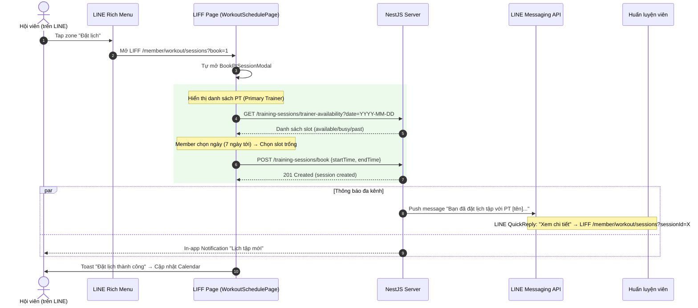
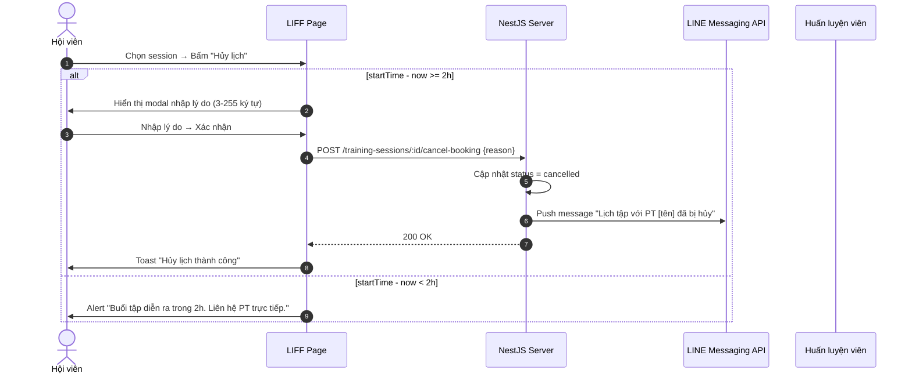
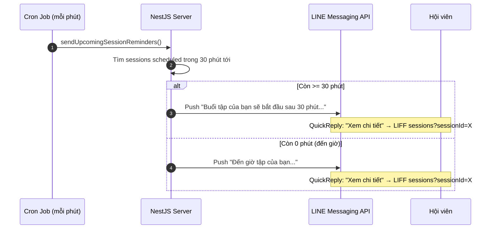

# ĐẶC TÁ NGHIỆP VỤ: ĐẶT LỊCH TẬP VỚI PT QUA LINE RICH MENU

- **Tác giả:** Đội ngũ phát triển Gym Management System
- **Trạng thái:** Hoàn thiện & Triển khai
- **Phiên bản:** 1.0.0
- **Ngày cập nhật:** 18/08/2026

---

## 1. MỤC ĐÍCH

Đặc tả nghiệp vụ cho luồng **đặt lịch tập với Huấn luyện viên (PT)** được truy cập thông qua **LINE Rich Menu** trên ứng dụng LINE, hướng đến đối tượng hội viên sử dụng LINE như kênh chính.

Tài liệu này tập trung vào phần trải nghiệm người dùng trên LINE (Rich Menu + LIFF) và cách nó kết nối với các API backend đã có. **Không giải thích lại logic backend** — tham chiếu đến tài liệu thiết kế hiện tại: [member-pt-booking-design.md](member-pt-booking-design.md).

---

## 2. GIỚI HẠN TÍNH NĂNG (SCOPE)

### 2.1. Phạm vi

| Hạng mục | Bao gồm | Không bao gồm |
| :--- | :--- | :--- |
| Rich Menu layout | Thiết kế zone, vùng nhấn, hành động | Tùy chỉnh theo user role (chỉ dùng 1 layout cho member) |
| LIFF Pages | Trang đặt lịch (đã có), trang xem lịch, trang chi tiết session | Xây LIFF page mới hoàn toàn — tái sử dụng page hiện có |
| Push Notification | Thông báo đặt/hủy/đổi lịch, nhắc lịch tập | Broadcast marketing, tin nhắn khuyến mãi |
| Hủy lịch | Hủy từ LIFF page qua Rich Menu | Hủy từ chatbot keyword |

### 2.2. Đối tượng người dùng

- **Hội viên (Member)** đã liên kết tài khoản LINE (có `lineId` trong hệ thống).
- **Huấn luyện viên (Trainer)** nhận thông báo khi member đặt/hủy lịch (qua LINE Push hoặc In-app Notification).

### 2.3. Giả định tiên quyết

- Hội viên đã **đăng nhập LIFF** ít nhất 1 lần (đã có `lineId` linked).
- Hệ thống đã có **Primary Trainer** gán cho member.
- Gói tập (subscription) đang active.
- Rich Menu đã được cấu hình trên LINE Developers Console, LIFF App đã tạo.

---

## 3. THIẾT KẾ LINE RICH MENU

### 3.1. Cấu trúc Rich Menu

Rich Menu là vùng chạm (tap zone) hiển thị ở cuối màn hình chat, thay thế bàn phím mặc định. Layout giữ nguyên cho tất cả member.

```
┌──────────────────────────────────────────────────┐
│                                                    │
│                  [Khu vực hình ảnh]                │
│            (Hình nền theo branding RoGym)          │
│                                                    │
├────────────┬────────────┬────────────┬────────────┤
│   LỊCH TẬP  │  ĐẶT LỊCH    │   CHECK-IN    │  HỒ SƠ     │
│  (calendar)  │  (calendar+) │  (scan-qr)    │  (user)     │
└────────────┴────────────┴────────────┴────────────┘
```

### 3.2. Bảng vùng nhấn (Tap Zones)

| Zone | Vị trí | Hành động (URI Action) | Mô tả |
| :--- | :--- | :--- | :--- |
| **Lịch tập** | Góc trái | `liff://<LIFF_ID>/member/workout/sessions` | Xem danh sách lịch tập sắp tới và đã qua |
| **Đặt lịch** | Giữa trái | `liff://<LIFF_ID>/member/workout/sessions?book=1` | Mở trang lịch tập kèm modal đặt lịch tự mở |
| **Check-in** | Giữa phải | `liff://<LIFF_ID>/member/workout/sessions` | Mở trang lịch tập (member chọn session để check-in) |
| **Hồ sơ** | Góc phải | `liff://<LIFF_ID>/member/profile` | Xem thông tin cá nhân |

### 3.3. Cấu hình Rich Menu (LINE Developers Console)

| Thuộc tính | Giá trị |
| :--- | :--- |
| Menu size | 2500 x 843 px |
| Active area | Toàn bộ (full-tile) |
| Selected mode | hi-alt (phím bếp / bàn phím) ở chế độ mặc định |
| Actions | URI → LIFF URL (xem bảng zone ở trên) |

> **Lưu ý:** URI scheme `liff://` mở LIFF page trực tiếp trong app LINE. Nếu dùng `https://` + LIFF URL đầy đủ cũng hoạt động, nhưng `liff://` ngắn hơn và ổn định hơn.

---

## 4. LUỒNG NGHIỆP VỤ CHÍNH

### 4.1. Đặt lịch tập (Instant Booking)



### 4.2. Xem và quản lý lịch tập

| Hành động | Từ Rich Menu | Kịch bản |
| :--- | :--- | :--- |
| Xem lịch sắp tới | Tap "Lịch tập" | Calendar view + danh sách sidebar (đã có tại `WorkoutSchedulePage`) |
| Xem chi tiết session | Tap vào session trên Calendar | Modal chi tiết: thời gian, PT, phòng, bài tập giáo án |
| Hủy lịch | Tap session → nút "Hủy" | Mở `CancelPtBookingModal` (lý do + kiểm tra 2h rule) |
| Bắt đầu buổi tập | Tap session → nút "Bắt đầu" | Chuyển sang trang `CreateWorkoutSessionPage` |

### 4.3. Hủy lịch tập



### 4.4. Nhắc lịch tập (Reminder Push)



---

## 5. CẤU HÌNH HIỆN TẠI (CODE REFERENCE)

### 5.1. Backend — Các service liên quan

| Service | File | Nhiệm vụ |
| :--- | :--- | :--- |
| `MemberSessionBookingService` | `server/src/training/member-session-booking.service.ts` | `bookSessionByMember()`, `cancelBookingByMember()`, `getTrainerAvailability()` |
| `TrainingSessionNotificationService` | `server/src/training/training-session-notification.service.ts` | `notifyCreated()`, `notifyCancelled()`, `notifyUpdated()` |
| `TrainingSessionSchedulingService` | `server/src/training/training-session-scheduling.service.ts` | `checkOverlap()`, `findAvailableRoom()`, `resolveSessionPlanLink()` |
| `LineMessagingService` | `server/src/line-messaging/line-messaging.service.ts` | `safePushTrainingSessionEvent()`, `safePushAttendanceCheckin()`, `sendUpcomingSessionReminders()` (cron) |
| `TrainingController` | `server/src/training/training.controller.ts` | Endpoints: `GET trainer-availability`, `POST book`, `POST :id/cancel-booking` |

### 5.2. Frontend — Các page/component liên quan

| Component | File | Nhiệm vụ |
| :--- | :--- | :--- |
| `WorkoutSchedulePage` | `client/src/pages/member/workout/WorkoutSchedulePage.tsx` | Calendar view + sidebar + modal chi tiết session |
| `BookPtSessionModal` | `client/src/pages/member/workout/BookPtSessionModal.tsx` | Chọn ngày → slot grid → xác nhận đặt lịch |
| `CancelPtBookingModal` | `client/src/pages/member/workout/CancelPtBookingModal.tsx` | Nhập lý do hủy → xác nhận |
| `LiffEntryPage` | `client/src/pages/liff/LiffEntryPage.tsx` | Đăng nhập LIFF → auto-redirect tới `/member` |
| `liff.ts` | `client/src/lib/liff.ts` | `initLiff()`, mock mode, LIFF SDK wrapper |

### 5.3. LIFF Routes hiện có

```
/liff                          → LiffEntryPage (auto-login + redirect)
/member/workout/sessions       → WorkoutSchedulePage (Calendar + Booking)
/member/workout/sessions?sessionId=X  → WorkoutSchedulePage (deep link mở chi tiết session)
/member/profile                → ProfilePage
```

### 5.4. Rich Menu URI mapping

Rich Menu tap → LIFF URL scheme:

```
"Lịch tập"      → liff://<LIFF_ID>/member/workout/sessions
"Đặt lịch"      → liff://<LIFF_ID>/member/workout/sessions?book=1
"Check-in"      → liff://<LIFF_ID>/member/workout/sessions
"Hồ sơ"         → liff://<LIFF_ID>/member/profile
```

> **Về tham số `book=1`:** Hiện tại `WorkoutSchedulePage` có state `bookModalOpen` nhưng chưa đọc từ URL param. Cần bổ sung logic: nếu URL có `?book=1` thì tự mở `BookPtSessionModal` khi page load. Đây là thay đổi nhỏ, 1-2 dòng code.

---

## 6. QUY TẮC NGHIỆP VỤ (TÓM TẮT)

| Mã | Quy tắc | Giá trị hiện tại |
| :--- | :--- | :--- |
| BR-01 | Thời lượng mỗi buổi | Cố định **60 phút** |
| BR-02 | Phạm vi PT | Chỉ Primary Trainer (`member.primaryTrainerId`) |
| BR-03 | Khung giờ khả dụng | **06:00 - 21:00** (UTC+7), 15 slot/ngày |
| BR-04 | Hạn mức đặt trước | Tối đa **7 ngày** trước, tối thiểu **5 phút** trước giờ tập |
| BR-05 | Giới hạn slot đặt | Tối đa **3 lịch scheduled** đang chờ |
| BR-06 | Điều kiện gói tập | Phải có subscription `active` tại ngày tập |
| BR-07 | Phân bổ phòng | Auto-assign phòng trống (`findAvailableRoom`) |
| BR-08 | Liên kết giáo án | Tùy chọn — chọn WorkoutPlanDay trong assignment đang active |
| BR-09 | Chính sách hủy | Trước giờ tập **>= 2 tiếng**; bắt buộc nhập lý do (3-255 ký tự) |
| BR-10 | Thông báo | 2 chiều: In-app Notification + LINE Push (cho cả member và trainer) |

---

## 7. TÌNH HUỐNG NGOẠI LỆ (EDGE CASES)

| Tình huống | Xử lý |
| :--- | :--- |
| Member chưa có Primary Trainer | `BookPtSessionModal` hiển thị warning "Chưa được gán PT" + nút bị disable |
| Member chưa có subscription active | Backend trả `409 MEMBER_HAS_NO_ACTIVE_SUBSCRIPTION`. Frontend toast lỗi |
| Slot bị chiếm khi member đang chọn (race condition) | Backend trả `409 TRAINER_TIME_OVERLAP` hoặc `MEMBER_TIME_OVERLAP`. Frontend toast cảnh báo → auto-refresh slot grid |
| Hủy lịch < 2 tiếng | `CancelPtBookingModal` hiển thị warning + ẩn nút hủy. Member liên hệ PT trực tiếp |
| PT hủy/sửa lịch (từ hệ thống) | LINE Push message "Lịch tập đã được cập nhật/hủy" → QuickReply dẫn LIFF sessions |
| LIFF token hết hạn | `LiffEntryPage` detect token exp → logout + re-login tự động |
| Member mở LIFF mà chưa đăng nhập LINE | `liff.login()` redirect sang LINE OAuth flow |

---

## 8. ĐO LƯỢNG (METRICS)

| Metric | Cách đo | Mục tiêu |
| :--- | :--- | :--- |
| Tỷ lệ đặt lịch từ LINE/LIFF | `action: 'training.member_book'` trong AuditLog có `userAgent` chứa `LIFF` | >= 60% total bookings |
| Thời gian đặt lịch (từ mở modal đến xác nhận) | Frontend timing (UX metric) | < 30 giây |
| Tỷ lệ hủy lịch < 2h | `action: 'training.member_cancel'` where `session.startTime - auditLog.createdAt < 2h` | < 10% |
| LINE Push delivery rate | `safePushTrainingSessionEvent` return `true` | >= 95% |
| Daily Active Users trên LIFF | LiffEntryPage completions per day | Theo dõi trend |

---

## 9. PHỤ LỤC

### 9.1. LINE Message Template (hiện tại)

**Khi đặt lịch thành công (vi):**
```
Bạn đã đặt lịch tập thành công.
Thời gian: {datetime}
PT: {trainerName}
Phòng: {roomName}
```

**Khi hủy lịch (vi):**
```
Lịch tập với PT {trainerName} vào {datetime} đã bị hủy.
```

**Nhắc lịch tập (vi):**
```
Buổi tập của bạn sẽ bắt đầu sau {reminderMinutes} phút.
Thời gian: {datetime}
PT: {trainerName}
Phòng: {roomName}
```

Tất cả message đều có **QuickReply button** "Xem chi tiết" dẫn tới LIFF page.

### 9.2. Error Codes tham chiếu

| HTTP | Code | Ý nghĩa | Xử lý UI |
| :--- | :--- | :--- | :--- |
| 400 | `NO_PRIMARY_TRAINER` | Chưa có PT phụ trách | Alert + disable booking |
| 400 | `INVALID_DURATION` | Thời lượng != 60 phút | Không xảy ra (frontend set đúng) |
| 400 | `INVALID_BOOKING_TIME` | Ngoài khoảng 5 phút - 7 ngày | Toast lỗi |
| 400 | `BOOKING_LIMIT_EXCEEDED` | Đã đặt >= 3 lịch scheduled | Toast "Đã đạt giới hạn" |
| 409 | `MEMBER_HAS_NO_ACTIVE_SUBSCRIPTION` | Không có gói active | Toast "Cần gia hạn gói tập" |
| 409 | `TRAINER_TIME_OVERLAP` | PT trùng lịch | Toast cảnh báo + auto-refresh slot |
| 409 | `MEMBER_TIME_OVERLAP` | Member trùng lịch | Toast cảnh báo + auto-refresh slot |
| 409 | `NO_ROOM_AVAILABLE` | Hết phòng | Toast "Hết phòng, thử giờ khác" |
| 409 | `SESSION_NOT_CANCELLABLE` | Session không ở trạng thái scheduled | Toast lỗi |
| 400 | `LATE_CANCELLATION` | Hủy < 2 tiếng | Alert warning + ẩn nút hủy |
