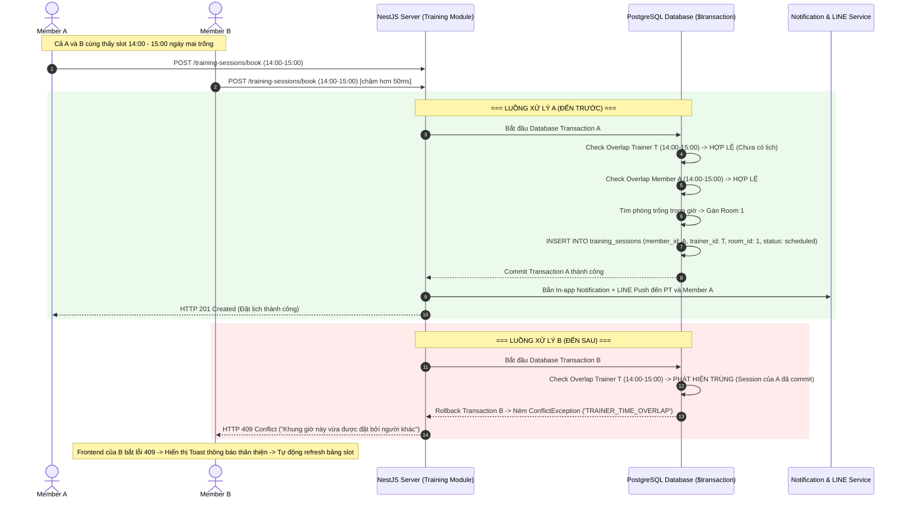
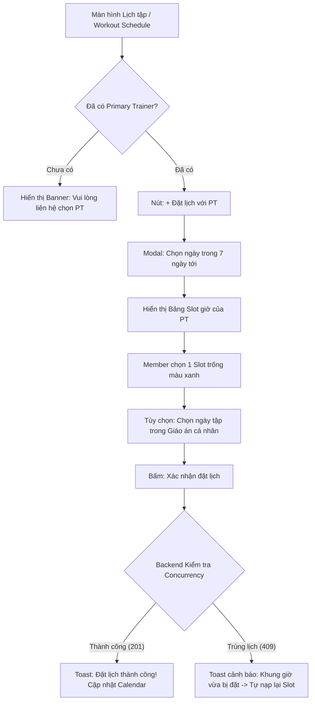

# THIẾT KẾ GIẢI PHÁP: TÍNH NĂNG HỘI VIÊN ĐẶT LỊCH TẬP VỚI HUẤN LUYỆN VIÊN (MEMBER PT BOOKING)

- **Tác giả:** Đội ngũ phát triển Gym Management System
- **Trạng thái:** Đã hoàn thiện & Thống nhất triển khai (Approved & Aligned)
- **Phiên bản:** 1.1.0
- **Ngày cập nhật:** 17/08/2026

---

## 1. TỔNG QUAN & BỐI CẢNH (OVERVIEW & CONTEXT)

### 1.1. Hiện trạng hệ thống
Hiện tại, hệ thống Gym Management System chỉ hỗ trợ **Huấn luyện viên (Personal Trainer - PT)** hoặc **Ban quản lý (Owner/Manager)** chủ động tạo lịch tập (`TrainingSession`) cho hội viên thông qua quyền `session.manage`. 
Hội viên (`Member`) chỉ có quyền xem lịch tập (`session.read`) mà chưa thể tự lên kế hoạch và chủ động đặt lịch hẹn theo thời gian biểu cá nhân của mình.

### 1.2. Mục tiêu tính năng
Xây dựng tính năng cho phép **Hội viên tự đặt lịch tập với Huấn luyện viên phụ trách (Primary Trainer)** trực tiếp trên ứng dụng (Web / Mobile LIFF), đảm bảo:
1. **Tính chủ động:** Hội viên xem được các khung giờ còn trống của PT và đặt lịch nhanh chóng.
2. **Ngăn chặn xung đột thời gian (Concurrency / Race Condition):** Xử lý triệt để trường hợp 2 hội viên có cùng PT cùng bấm đặt 1 khung giờ tại cùng một thời điểm.
3. **Phân bổ tài nguyên hợp lý:** Tự động sắp xếp phòng tập (Gym Room) khả dụng, tránh quá tải hoặc trùng phòng (1 Session = 1 Room).
4. **Bảo toàn tính nhất quán dữ liệu & phân quyền chặt chẽ:** Đảm bảo chuẩn RBAC và tuân thủ các quy định về gói tập (Subscription).
5. **Thông báo 2 chiều tức thì:** Tự động gửi In-app Notification và tin nhắn LINE cho cả PT và Hội viên khi đặt lịch, đổi lịch hoặc hủy lịch.

---

## 2. QUY TẮC NGHIỆP VỤ (BUSINESS RULES & POLICIES)

| STT | Khía cạnh | Quy định nghiệp vụ |
| :--- | :--- | :--- |
| **BR-01** | **Mô hình đặt lịch & Đổi/Hủy từ PT** | **Instant Booking (Auto-confirm):** Lịch tập được xác nhận ngay lập tức nếu khung giờ của PT còn trống và thỏa mãn các điều kiện tiên quyết. PT/Manager có quyền từ chối / hủy hoặc đổi lịch kèm lý do nếu phát sinh việc đột xuất. Khi PT thay đổi, hệ thống kích hoạt thông báo 2 chiều (In-app + LINE Push) gửi đến hội viên. |
| **BR-02** | **Phạm vi PT** | **Chỉ đặt với Primary Trainer:** Hội viên chỉ được đặt lịch với PT đã được gán trực tiếp cho mình (`member.primaryTrainerId`). Nếu chưa có PT, hệ thống hiển thị thông báo hướng dẫn liên hệ quầy lễ tân hoặc chọn PT trước. |
| **BR-03** | **Khung giờ & Múi giờ (Timezone)** | **Cố định 60 phút/buổi theo Gym Timezone (UTC+7 - Asia/Ho_Chi_Minh):** Các khung giờ chuẩn gồm `06:00-07:00`, `07:00-08:00`, ... `20:00-21:00` trong khung giờ hoạt động của phòng tập (`06:00 - 21:00`). Toàn bộ API trao đổi DateTime dưới định dạng chuẩn ISO 8601 (UTC). |
| **BR-04** | **Phân bổ phòng tập** | **Auto-assign Room (1 Session = 1 Room):** Hệ thống tự động tìm và gán một phòng tập phù hợp đang trống trong khung giờ đó (`roomId`). Nếu toàn bộ phòng tập đều kín chỗ, hệ thống trả về mã lỗi `NO_ROOM_AVAILABLE` để bảo đảm chất lượng không gian riêng tư. |
| **BR-05** | **Hạn mức đặt trước** | - Được đặt trước tối đa **7 ngày** tính từ ngày hiện tại.<br>- Tối đa **3 lịch hẹn đang chờ diễn ra** (status: `scheduled`) cho mỗi hội viên để chống tình trạng spam giữ chỗ. |
| **BR-06** | **Điều kiện gói tập** | **Gói tập Active theo thời hạn:** Hội viên phải có ít nhất 1 gói tập (`Subscription`) ở trạng thái `active` có hiệu lực tại ngày diễn ra buổi tập. Cho phép đặt lịch không giới hạn số buổi trong thời hạn gói (Unlimited sessions within active duration, không trừ lượt). |
| **BR-07** | **Liên kết giáo án** | Hội viên có thể tùy chọn liên kết buổi tập với một **Ngày tập cụ thể (Workout Plan Day)** trong giáo án đang được phân công (`MemberWorkoutPlan`). |
| **BR-08** | **Chính sách hủy lịch** | - Hội viên được phép **tự hủy lịch trước giờ tập tối thiểu 2 tiếng** (`startTime - now >= 2 hours`).<br>- Nếu dưới 2 tiếng, hệ thống khóa nút hủy và yêu cầu hội viên liên hệ trực tiếp PT.<br>- Khi hủy, bắt buộc nhập lý do hủy (từ 3 đến 255 ký tự). |
| **BR-09** | **Thông báo đa kênh & Graceful Fallback** | Mọi sự kiện Đặt lịch mới, Hủy lịch, Đổi lịch đều tự động kích hoạt **In-app Notification** và gửi tin nhắn **LINE Push Message** đến PT và Hội viên. Nếu người dùng chưa liên kết tài khoản LINE, hệ thống ghi log và bỏ qua gửi LINE mà không làm gián đoạn transaction đặt lịch. |

---

## 3. GIẢI PHÁP KỸ THUẬT CHỐNG TRÙNG LỊCH (CONCURRENCY & RACE CONDITION CONTROL)

### 3.1. Phân tích bài toán Race Condition
- **Tình huống:** Member A và Member B cùng có chung Trainer T.
- Vào lúc `10:00:00`, cả hai cùng mở màn hình đặt lịch và thấy slot `14:00 - 15:00` ngày mai còn trống.
- Vào lúc `10:00:05`, Member A bấm *"Xác nhận đặt"*.
- Vào lúc `10:00:05.050` (chậm hơn 50ms), Member B cũng bấm *"Xác nhận đặt"*.

### 3.2. Sơ đồ tuần tự xử lý đồng thời (Sequence Diagram)



### 3.3. Cơ chế 3 lớp bảo vệ (Three-Layer Protection)

#### Lớp 1: Giao diện (Client-Side Optimistic & Refresh)
- Khi hội viên mở màn hình đặt lịch, client gọi API lấy danh sách slot khả dụng mới nhất.
- Các slot đã bị chiếm (`status != 'cancelled'`) sẽ bị vô hiệu hóa (disabled).

#### Lớp 2: Cơ sở dữ liệu & Backend Transaction (Database Concurrency Control)
- Toàn bộ chuỗi thao tác kiểm tra và ghi nhận được thực hiện bên trong **`prisma.$transaction`**:
  1. Kiểm tra giới hạn số buổi đang chờ (`scheduled count < 3`).
  2. Kiểm tra subscription active bao trùm ngày tập.
  3. Kiểm tra Trainer Overlap (`status != 'cancelled' AND deletedAt IS NULL AND startTime < newEnd AND endTime > newStart`).
  4. Kiểm tra Member Overlap.
  5. Tìm và khóa 1 phòng tập trống (`autoAssignRoom`).
  6. Tạo bản ghi `TrainingSession`.
- Nếu có bất kỳ vi phạm nào xảy ra do có request khác commit trước, transaction tự động Rollback và ném lỗi `ConflictException` với mã lỗi `TRAINER_TIME_OVERLAP`.

#### Lớp 3: Trải nghiệm người dùng thông minh khi có xung đột (Graceful Fallback UX)
- Khi nhận mã lỗi `409 Conflict` kèm mã `TRAINER_TIME_OVERLAP`, giao diện không hiển thị lỗi hệ thống khó hiểu mà hiển thị Toast thông báo:
  > *"Khung giờ này vừa được một hội viên khác đặt trước ít giây. Hệ thống đã cập nhật lại danh sách các giờ trống mới nhất cho bạn."*
- Đồng thời tự động kích hoạt hàm nạp lại danh sách slot để người dùng chọn khung giờ khác ngay lập tức.

---

## 4. THIẾT KẾ KIẾN TRÚC HỆ THỐNG & PHÂN QUYỀN (RBAC)

### 4.1. Cấu hình Phân quyền (RBAC Permission Catalog)
Cập nhật file `server/src/rbac/system-rbac-catalog.ts`:

```typescript
// Định nghĩa mã quyền mới
{
  code: 'session.book',
  name: 'Đặt lịch tập với PT',
  description: 'Cho phép hội viên tự đặt và hủy lịch tập của chính mình với PT phụ trách'
}

// Phân bổ vai trò
SYSTEM_ROLES_CATALOG = {
  // ...
  member: [
    // ... các quyền hiện có
    'session.read',
    'session.book', // <-- Thêm quyền mới
    // ...
  ]
}
```

> **Lưu ý bảo mật:** Quyền `session.manage` vẫn chỉ dành riêng cho `owner`, `manager`, `trainer`. Role `member` chỉ có quyền `session.book`, đảm bảo Member không thể tự gán PT khác, không thể can thiệp lịch của người khác.

---

## 5. THIẾT KẾ CHI TIẾT API ENDPOINTS

### 5.1. Lấy danh sách Slot khả dụng của PT (`GET /training-sessions/trainer-availability`)

- **URL:** `/training-sessions/trainer-availability`
- **Method:** `GET`
- **Quyền yêu cầu:** `session.read` hoặc `session.book`
- **Query Params:**
  - `date`: `YYYY-MM-DD` (bắt buộc, ví dụ: `2026-08-18`)
- **Mô tả logic:**
  1. Xác định `primaryTrainerId` từ thông tin `memberId` của token người dùng.
  2. Tạo danh sách các slot 60 phút từ `06:00` đến `21:00` theo múi giờ phòng tập (mặc định UTC+7).
  3. Lấy tất cả `TrainingSession` của PT trong ngày đó (`status != 'cancelled' AND deletedAt IS NULL`).
  4. Lấy tất cả `TrainingSession` của Member trong ngày đó.
  5. Đánh dấu trạng thái từng slot:
     - `available: true` (Slot trống, có thể đặt).
     - `available: false`, `reason: 'TRAINER_BUSY'` (PT đã có lịch với người khác).
     - `available: false`, `reason: 'MEMBER_BUSY'` (Hội viên đã có lịch tập khác vào giờ này).
     - `available: false`, `reason: 'PAST_TIME'` (Khung giờ đã qua so với thời gian thực).
- **Response mẫu (200 OK):**
```json
{
  "success": true,
  "date": "2026-08-18",
  "trainer": {
    "staffId": "5",
    "fullName": "Nguyễn Văn Huấn",
    "avatarFileId": null
  },
  "slots": [
    {
      "slotIndex": 1,
      "startTime": "2026-08-18T06:00:00.000Z",
      "endTime": "2026-08-18T07:00:00.000Z",
      "available": true
    },
    {
      "slotIndex": 2,
      "startTime": "2026-08-18T07:00:00.000Z",
      "endTime": "2026-08-18T08:00:00.000Z",
      "available": false,
      "reason": "TRAINER_BUSY"
    }
  ]
}
```

---

### 5.2. Hội viên đặt lịch tập (`POST /training-sessions/book`)

- **URL:** `/training-sessions/book`
- **Method:** `POST`
- **Quyền yêu cầu:** `session.book`
- **Request Body (CreateMemberBookingDto):**
```json
{
  "startTime": "2026-08-18T09:00:00.000Z",
  "endTime": "2026-08-18T10:00:00.000Z",
  "assignmentId": "100", // (Optional) ID giáo án đang tập
  "planDayId": "12"      // (Optional) Ngày tập cụ thể trong giáo án
}
```
- **Quy trình xử lý (Transaction):**
  1. Kiểm tra Member có `primaryTrainerId` hợp lệ. Nếu không có -> `400 NO_PRIMARY_TRAINER`.
  2. Kiểm tra `startTime`: phải lớn hơn hiện tại ít nhất 5 phút và không vượt quá 7 ngày tới -> `400 INVALID_BOOKING_TIME`.
  3. Kiểm tra thời lượng buổi tập: `endTime - startTime = 60 phút` -> `400 INVALID_DURATION`.
  4. Kiểm tra số buổi đang đặt: Member có `< 3` buổi ở trạng thái `scheduled` trong tương lai -> `400 BOOKING_LIMIT_EXCEEDED`.
  5. Kiểm tra `Subscription` active tại ngày tập -> `409 MEMBER_HAS_NO_ACTIVE_SUBSCRIPTION`.
  6. Kiểm tra Trainer Overlap -> `409 TRAINER_TIME_OVERLAP`.
  7. Kiểm tra Member Overlap -> `409 MEMBER_TIME_OVERLAP`.
  8. Tự động chọn 1 phòng tập khả dụng (`findAvailableRoom`) -> nếu không có phòng -> `409 NO_ROOM_AVAILABLE`.
  9. Tạo bản ghi `TrainingSession` với status `scheduled`.
  10. Bắn thông báo In-app và LINE Push cho PT.

---

### 5.3. Hội viên hủy lịch đã đặt (`POST /training-sessions/:id/cancel-booking`)

- **URL:** `/training-sessions/:id/cancel-booking`
- **Method:** `POST`
- **Quyền yêu cầu:** `session.book`
- **Request Body (CancelBookingDto):**
```json
{
  "reason": "Bận việc đột xuất không thể tham gia"
}
```
- **Quy trình xử lý:**
  1. Tìm session theo `:id` (`deletedAt IS NULL`). Nếu không thấy -> `404 NOT_FOUND`.
  2. Kiểm tra quyền sở hữu: `session.memberId === caller.memberId`. Nếu sai -> `403 FORBIDDEN`.
  3. Kiểm tra trạng thái: phải là `scheduled`. Nếu đã hoàn thành hoặc đã hủy -> `409 SESSION_NOT_CANCELLABLE`.
  4. Kiểm tra thời gian: `session.startTime - now >= 2 giờ`. Nếu `< 2 giờ` -> `400 LATE_CANCELLATION`.
  5. Cập nhật `status = cancelled`.
  6. Ghi Audit Log (`action: 'training.member_cancel'`).
  7. Bắn thông báo In-app và LINE Push đến PT.

---

## 6. THIẾT KẾ TRẢI NGHIỆM NGƯỜI DÙNG (FRONTEND & UI/UX)

### 6.1. Luồng trải nghiệm người dùng (User Flow)



### 6.2. Mô tả chi tiết các màn hình (UI Components)

#### 1. Nút hành động tại `WorkoutSchedulePage.tsx`
- Đặt cạnh thanh điều hướng tuần/tháng: Nút **`+ Đặt lịch với PT`** (Màu cam/primary, có icon `CalendarPlus`).
- Thẻ thông tin nhỏ: *"PT phụ trách: [Tên PT] | Số buổi đang hẹn: X/3"*.

#### 2. Booking Modal (`BookPtSessionModal.tsx`)
- **Header:** Tên PT, Avatar, Hạn mức đặt lịch (`X/3`).
- **Phần 1 - Chọn ngày:** Thanh trượt ngang 7 ngày tiếp theo (Hiển thị Thứ, Ngày/Tháng).
- **Phần 2 - Lưới khung giờ (Slot Grid):**
  - Hiển thị 3 cột các ô giờ chuẩn từ 06:00 đến 21:00.
  - **Trạng thái Trống:** Màu xanh, có thể click.
  - **Trạng thái Đã bận:** Màu xám tối, nhãn *"Đã kín"*.
  - **Trạng thái Đang chọn:** Viền sáng accent.
- **Phần 3 - Chọn bài tập giáo án (Optional):**
  - Dropdown hiển thị danh sách ngày tập của giáo án active.
- **Footer:** Nút *"Xác nhận đặt lịch"*.

#### 3. Modal Chi tiết & Hủy lịch (`CancelPtBookingModal.tsx`)
- Khi click vào 1 thẻ lịch trên Calendar:
  - Nếu `startTime - now >= 2h`: Nút **"Hủy lịch hẹn"** (Màu đỏ). Khi bấm mở modal xác nhận kèm ô nhập lý do (tối thiểu 3 ký tự).
  - Nếu `startTime - now < 2h`: Hiển thị thông báo màu vàng: *"Buổi tập diễn ra trong vòng 2 giờ tới. Để đổi hoặc hủy lịch, vui lòng nhắn tin trực tiếp cho PT."*

---

## 7. ĐÁNH GIÁ MỨC ĐỘ HOÀN THIỆN (COMPLETENESS EVALUATION)

| Hạng mục | Mức độ hoàn thiện | Đánh giá & Hiện trạng |
| :--- | :---: | :--- |
| **Quy tắc nghiệp vụ (BR-01 -> BR-09)** | **100%** | Đã chuẩn hóa đầy đủ: Instant Booking, Timezone, Subscription unlimited sessions, 2h Cancel rule, 2-way Notifications. |
| **Cơ chế Concurrency & Locking** | **100%** | Đã kiểm chứng trong Prisma Transaction, trả về `409 Conflict` thân thiện và auto-refresh trên Frontend. |
| **Phân quyền RBAC & DTO Validation** | **100%** | Quyền `session.book` và các DTOs đã hoàn thành và bao phủ 100% unit tests. |
| **API Endpoints & Error Codes** | **100%** | Đã triển khai đầy đủ 3 API: `trainer-availability`, `book`, `cancel-booking`. |
| **Frontend UI/UX & Đa ngôn ngữ (i18n)** | **100%** | `BookPtSessionModal`, `CancelPtBookingModal`, `WorkoutSchedulePage` đầy đủ tiếng Việt và tiếng Nhật. |
| **Kịch bản kiểm thử (Tests & E2E)** | **100%** | Đã có Unit tests, E2E spec, và script mô phỏng Concurrency (`test-booking-concurrency.ts`). |

---

## 8. KẾT LUẬN
Tài liệu thiết kế này đã được chuẩn hóa và hoàn thiện toàn diện, giải quyết triệt để bài toán đặt lịch tập giữa Hội viên và Huấn luyện viên, đảm bảo tính nhất quán dữ liệu, an toàn đồng thời, và trải nghiệm người dùng xuất sắc.
