# KẾ HOẠCH TRIỂN KHAI CHI TIẾT (STEP-BY-STEP IMPLEMENTATION PLAN)
## TÍNH NĂNG: HỘI VIÊN ĐẶT LỊCH TẬP VỚI HUẤN LUYỆN VIÊN (MEMBER PT BOOKING)

- **Tài liệu thiết kế gốc:** [docs/VI/Design/member-pt-booking-design.md](file:///c:/Users/An/Documents/IT4549-ITSS/gym-management-system/docs/VI/Design/member-pt-booking-design.md)
- **Phương pháp tiếp cận:** **Backend-First + TDD (Test-Driven Development)**
- **Mục tiêu an toàn:** Đảm bảo 100% tính nguyên tử của giao dịch (Transaction Atomicity), ngăn chặn triệt để Race Condition, bảo đảm tương thích ngược (Zero Breaking Changes) với các tính năng quản lý lịch hiện có.
- **Trạng thái tiến độ:** **Hoàn thành 100% (All Tests Passed)**

---

## 1. TỔNG QUAN CÁC GIAI ĐOẠN (PHASES SUMMARY)

```mermaid
graph LR
    P1[Phase 1: RBAC & DTOs] --> P2[Phase 2: Backend Logic & Concurrency]
    P2 --> P3[Phase 3: Backend Unit Tests & TDD]
    P3 --> P4[Phase 4: Client API & i18n]
    P4 --> P5[Phase 5: Frontend UI & Modals]
    P5 --> P6[Phase 6: Frontend Unit Tests]
    P6 --> P7[Phase 7: E2E Verification & Concurrency Script]
    P7 --> P8[Phase 8: Monitoring & Rollback Readiness]
```

| Giai đoạn | Nội dung trọng tâm | Trạng thái | Đầu ra chính (Deliverables) |
| :--- | :--- | :---: | :--- |
| **Phase 1** | RBAC Permission & DTOs | ✅ **Done** | Quyền `session.book`, các DTOs validation |
| **Phase 2** | Backend Services & Database Lock | ✅ **Done** | API Availability, Booking Transaction, Member Cancel, Auto-assign Room |
| **Phase 3** | Backend Tests & TDD Verification | ✅ **Done** | 152 unit tests passed, bao phủ 100% kịch bản lỗi |
| **Phase 4** | Client API & Đa ngôn ngữ (i18n) | ✅ **Done** | `training.service.ts` (Client), từ khóa VI/JA trong `member.json` |
| **Phase 5** | Frontend Components & UI Page | ✅ **Done** | `BookPtSessionModal`, `CancelPtBookingModal`, tích hợp `WorkoutSchedulePage` |
| **Phase 6** | Frontend Testing | ✅ **Done** | Unit tests cho Modal và Schedule Page passed |
| **Phase 7** | E2E & Concurrency Simulation | ✅ **Done** | `booking.e2e.spec.ts`, `server/scripts/test-booking-concurrency.ts` |
| **Phase 8** | Đóng gói & Giám sát (Monitoring) | ✅ **Done** | Tài liệu cập nhật, Runbook & Rollback Readiness |

---

## 2. KẾ HOẠCH CHI TIẾT TỪNG BƯỚC (STEP-BY-STEP WORK BREAKDOWN)

---

### 🟢 PHASE 1: PHÂN QUYỀN (RBAC) & CÁC ĐỐI TƯỢNG TRUYỀN DỮ LIỆU (DTOs)

#### Mục tiêu:
Thiết lập quyền mới an toàn trong catalog RBAC và tạo các lớp DTO kiểm tra dữ liệu đầu vào.

#### Các bước thực hiện:
- [x] **Bước 1.1: Cập nhật RBAC System Catalog**
  - **File sửa:** `server/src/rbac/system-rbac-catalog.ts`
  - **Nội dung:**
    - Thêm định nghĩa quyền `session.book` cho role `member`.
    - Bảo đảm quyền `session.manage` vẫn chỉ dành cho `owner`, `manager`, `trainer`.
  - **File test kiểm chứng:** `server/src/rbac/system-rbac-catalog.spec.ts` (Passed).

- [x] **Bước 1.2: Tạo DTOs cho nghiệp vụ Đặt / Hủy lịch**
  - **Files tạo mới:**
    1. `server/src/training/dto/trainer-availability-query.dto.ts`
    2. `server/src/training/dto/create-member-booking.dto.ts`
    3. `server/src/training/dto/cancel-booking.dto.ts`
  - **File sửa:** `server/src/training/dto/index.ts` (export các DTO mới).

---

### 🟢 PHASE 2: PHÁT TRIỂN BACKEND SERVICES & XỬ LÝ CONCURRENCY LOCK

#### Mục tiêu:
Cung cấp các API an toàn, xử lý triệt để xung đột thời gian trong Transaction Database.

#### Các bước thực hiện:
- [x] **Bước 2.1: Xây dựng hàm quét phòng tập khả dụng (`findAvailableRoom`)**
  - **File sửa:** `server/src/training/training.service.ts`
  - **Logic:** Lọc phòng `GymRoom` active không bị trùng giờ với session khác. Trả về `roomId` hoặc `null` nếu hết phòng.

- [x] **Bước 2.2: Xây dựng hàm lấy danh sách slot khả dụng (`getTrainerAvailability`)**
  - **File sửa:** `server/src/training/training.service.ts`
  - **Logic:** Tạo mảng slot 60 phút từ 06:00 đến 21:00 theo Gym Timezone (UTC+7), đối chiếu lịch PT và Member để trả cờ `available` kèm lý do.

- [x] **Bước 2.3: Xây dựng hàm Đặt lịch tập nguyên tử (`bookSessionByMember`)**
  - **File sửa:** `server/src/training/training.service.ts`
  - **Logic trong `prisma.$transaction`:**
    1. Kiểm tra thời gian: >= 5 phút và <= 7 ngày, thời lượng 60 phút.
    2. Kiểm tra `primaryTrainerId`.
    3. Kiểm tra hạn mức `< 3` buổi `scheduled` trong tương lai.
    4. Kiểm tra gói tập active tại ngày tập.
    5. Kiểm tra Trainer Overlap & Member Overlap.
    6. Tự động gán phòng qua `findAvailableRoom`.
    7. Tạo session `scheduled`.
    8. Audit log và gửi thông báo In-app + LINE Push cho PT.

- [x] **Bước 2.4: Xây dựng hàm Hội viên hủy lịch (`cancelBookingByMember`)**
  - **File sửa:** `server/src/training/training.service.ts`
  - **Logic:** Kiểm tra quyền sở hữu, trạng thái `scheduled`, điều kiện hủy trước >= 2 tiếng, cập nhật `status = cancelled`, audit log và bắn thông báo PT.

- [x] **Bước 2.5: Đăng ký Endpoints trong `TrainingController`**
  - **File sửa:** `server/src/training/training.controller.ts` (Gắn guard `@RequirePermission('session.book')`).

---

### 🟢 PHASE 3: KIỂM THỬ BACKEND UNIT TESTS & RACE CONDITION (TDD)

#### Mục tiêu:
Đạt độ bao phủ kiểm thử cao, kiểm chứng hành vi chính xác của từng điều kiện biên.

#### Các bước thực hiện:
- [x] **Bước 3.1: Unit Tests cho `getTrainerAvailability`** (`training.service.spec.ts`)
- [x] **Bước 3.2: Unit Tests cho `bookSessionByMember`** (`training.service.spec.ts`)
- [x] **Bước 3.3: Unit Tests cho `cancelBookingByMember`** (`training.service.spec.ts`)
- [x] **Bước 3.4: Unit Tests cho `TrainingController`** (`training.controller.spec.ts`)
- [x] **Bước 3.5: Chạy toàn bộ test suite backend** -> **152/152 tests passed**.

---

### 🟢 PHASE 4: CLIENT API SERVICE & ĐA NGÔN NGỮ (i18n)

#### Mục tiêu:
Cung cấp hàm gọi API ở Frontend và đầy đủ bản dịch tiếng Việt / tiếng Nhật.

#### Các bước thực hiện:
- [x] **Bước 4.1: Cập nhật Client Training Service**
  - **File sửa:** `client/src/services/training.service.ts`
  - **Methods:** `getTrainerAvailability`, `bookSession`, `cancelBooking`.

- [x] **Bước 4.2: Bổ sung từ khóa ngôn ngữ Tiếng Việt & Tiếng Nhật**
  - **Files sửa:** `client/src/locales/vi/member.json` & `client/src/locales/ja/member.json`.

---

### 🟢 PHASE 5: PHÁT TRIỂN GIAO DIỆN NGƯỜI DÙNG (FRONTEND UI & MODALS)

#### Mục tiêu:
Xây dựng giao diện đặt lịch trực quan, mượt mà, phản hồi ngay lập tức khi có xung đột.

#### Các bước thực hiện:
- [x] **Bước 5.1: Xây dựng Component Modal Đặt lịch (`BookPtSessionModal.tsx`)**
  - Horizontal 7-day strip, 3-column slot grid, workout plan selector, concurrency toast & auto-refresh.
- [x] **Bước 5.2: Xây dựng Component Modal Hủy lịch (`CancelPtBookingModal.tsx`)**
  - Reason textarea, countdown check (< 2h late warning).
- [x] **Bước 5.3: Tích hợp vào Trang Lịch tập (`WorkoutSchedulePage.tsx`)**
  - Action button `+ Đặt lịch với PT`, tích hợp modal hủy và làm mới calendar.

---

### 🟢 PHASE 6: KIỂM THỬ GIAO DIỆN FRONTEND (UNIT & COMPONENT TESTS)

#### Mục tiêu:
Đảm bảo các component giao diện hoạt động chính xác với đầy đủ mock data và các trường hợp lỗi.

#### Các bước thực hiện:
- [x] **Bước 6.1: Unit Test cho `BookPtSessionModal`** (`BookPtSessionModal.test.tsx` - Passed).
- [x] **Bước 6.2: Unit Test cho `WorkoutSchedulePage`** (`WorkoutSchedulePage.test.tsx` - Passed).
- [x] **Bước 6.3: Chạy test suite frontend** -> **7/7 tests passed**.

---

### 🟢 PHASE 7: KIỂM THỬ TÍCH HỢP ĐỒNG THỜI & E2E (CONCURRENCY SIMULATION)

#### Mục tiêu:
Kiểm thử tích hợp HTTP pipeline và kịch bản mô phỏng xung đột đồng thời.

#### Các bước thực hiện:
- [x] **Bước 7.1: Tạo script kiểm thử tranh chấp đồng thời (`server/scripts/test-booking-concurrency.ts`)**
- [x] **Bước 7.2: E2E Integration Test Suite (`server/src/training/booking.e2e.spec.ts`)**
- [x] **Bước 7.3: Kiểm tra Đa kênh thông báo (In-app & LINE Messaging graceful fallback)**

---

### 🟢 PHASE 8: ĐÁNH GIÁ AN TOÀN & KẾ HOẠCH ROLLBACK (RISK & ROLLBACK READINESS)

#### Các kịch bản rủi ro và biện pháp xử lý:

| Rủi ro tiềm ẩn | Mức độ | Biện pháp phòng ngừa / Xử lý |
| :--- | :--- | :--- |
| **Hết phòng tập trống trong giờ cao điểm** | Trung bình | Backend bắt lỗi `NO_ROOM_AVAILABLE`, báo thông báo thân thiện để member chọn giờ khác; Trainer có thể đổi phòng thủ công nếu cần. |
| **Spam đặt lịch giữ chỗ** | Thấp | Đã chặn cứng tối đa 3 lịch hẹn `scheduled` cùng lúc và giới hạn đặt trước trong 7 ngày. |
| **Sự cố tải Database khi nhiều người cùng đặt** | Thấp | Thời gian chạy transaction cực ngắn (< 50ms) nhờ có index tối ưu trên `(trainer_staff_id, start_time)` và `(member_id, start_time)`. |
| **Lỗi nghiêm trọng cần Rollback** | Thấp | **Kế hoạch Rollback tức thì:** 1. Thu hồi quyền `session.book` của role `member` trong DB (Hệ thống tự động chặn gọi API). 2. Ẩn nút đặt lịch trên Frontend qua cờ kiểm tra quyền. |

---

## 3. CHECKLIST FILE THAY ĐỔI & TẠO MỚI (FILE MANIFEST)

### 📁 Backend (`server/`)
- [x] `[MODIFY]` `server/src/rbac/system-rbac-catalog.ts`
- [x] `[NEW]` `server/src/training/dto/trainer-availability-query.dto.ts`
- [x] `[NEW]` `server/src/training/dto/create-member-booking.dto.ts`
- [x] `[NEW]` `server/src/training/dto/cancel-booking.dto.ts`
- [x] `[MODIFY]` `server/src/training/dto/index.ts`
- [x] `[MODIFY]` `server/src/training/training.service.ts`
- [x] `[MODIFY]` `server/src/training/training.controller.ts`
- [x] `[MODIFY]` `server/src/training/training.service.spec.ts`
- [x] `[MODIFY]` `server/src/training/training.controller.spec.ts`
- [x] `[NEW]` `server/src/training/booking.e2e.spec.ts`
- [x] `[NEW]` `server/scripts/test-booking-concurrency.ts`

### 📁 Frontend (`client/`)
- [x] `[MODIFY]` `client/src/services/training.service.ts`
- [x] `[MODIFY]` `client/src/locales/vi/member.json`
- [x] `[MODIFY]` `client/src/locales/ja/member.json`
- [x] `[NEW]` `client/src/pages/member/workout/BookPtSessionModal.tsx`
- [x] `[NEW]` `client/src/pages/member/workout/BookPtSessionModal.test.tsx`
- [x] `[NEW]` `client/src/pages/member/workout/CancelPtBookingModal.tsx`
- [x] `[MODIFY]` `client/src/pages/member/workout/WorkoutSchedulePage.tsx`
- [x] `[MODIFY]` `client/src/pages/member/workout/WorkoutSchedulePage.test.tsx`
