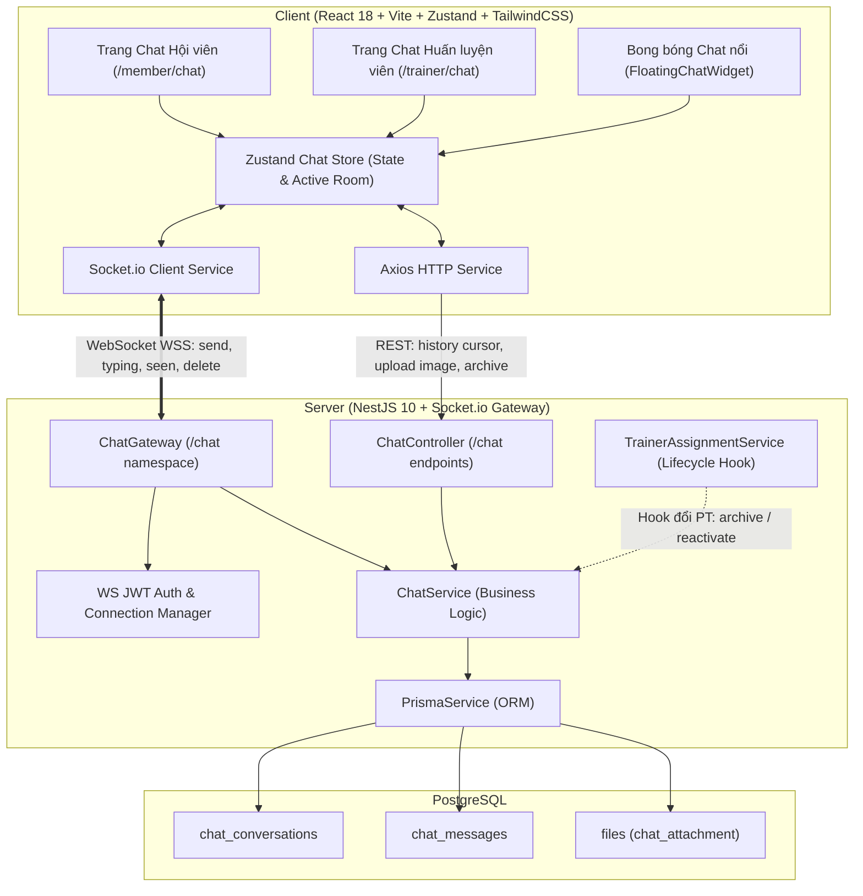
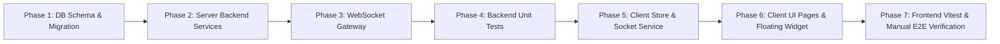

# KẾ HOẠCH TRIỂN KHAI CHI TIẾT (STEP-BY-STEP IMPLEMENTATION PLAN)
## TÍNH NĂNG: CHAT 1-1 THỜI GIAN THỰC GIỮA HỘI VIÊN VÀ HUẤN LUYỆN VIÊN (MEMBER - TRAINER REAL-TIME CHAT)

- **Vị trí lưu trữ:** `docs/VI/Design/member-trainer-chat-implementation-plan.md`
- **Phương pháp tiếp cận:** **Fullstack Modular + WebSocket Event-Driven + TDD (Test-Driven Development)**
- **Mục tiêu chính:** 
  - Tạo kênh giao tiếp 1-1 tức thì (Real-time) giữa Hội viên (Member) và Huấn luyện viên chính (Primary Trainer).
  - Hỗ trợ gửi tin nhắn văn bản, emoji, đính kèm hình ảnh (bữa ăn, form tập, lịch trình).
  - Trải nghiệm người dùng mượt mà với chỉ báo đang nhập (typing indicator), trạng thái đã đọc (seen), thông báo tin mới (toast, badge, sound).
  - Cơ chế thu hồi tin nhắn tức thì (Hard Delete), tôn trọng quyền riêng tư.
  - Tự động đồng bộ vòng đời hội thoại khi Hội viên đổi hoặc hủy Huấn luyện viên chính.
- **Trạng thái:** **Đã hoàn thành thiết kế & sẵn sàng triển khai (Ready for Implementation)**

---

## 1. TỔNG QUAN KIẾN TRÚC & QUYẾT ĐỊNH THIẾT KẾ ĐÃ THỐNG NHẤT



### 1.1 Quyết định Nghiệp vụ & Kỹ thuật cốt lõi:
1. **Phạm vi trao đổi (Eligibility)**:
   - Chỉ cho phép chat 1-1 giữa Member và Huấn luyện viên chính (`Member.primaryTrainerId`).
   - Yêu cầu Member có gói tập còn hạn và gói tập có dịch vụ PT (`package.includesPt = true`).
2. **Kiến trúc truyền tải (Real-time Engine)**:
   - Sử dụng **NestJS WebSockets Gateway (`socket.io`)** và **`socket.io-client`**.
   - Hỗ trợ phòng chat theo `conversationId`, typing indicator tức thời, badge tin chưa đọc và trạng thái đọc tin.
3. **Định dạng tin nhắn & Đính kèm**:
   - Tin nhắn văn bản (Text) + Biểu tượng cảm xúc (Emoji Picker).
   - Đính kèm hình ảnh: Tải qua REST API endpoint `/chat/conversations/:id/upload`, lưu vào bảng `files` với `fileType: chat_attachment`, sau đó broadcast tin nhắn dạng ảnh qua WebSocket.
4. **Quyền riêng tư & Thu hồi tin nhắn (Unsend)**:
   - Cho phép người gửi thu hồi tin nhắn bất kỳ lúc nào.
   - Khi thu hồi: Thực hiện **Hard Delete** (xóa dòng tin khỏi DB), phát sự kiện WebSocket `message_deleted` để xóa tức thì trên màn hình đối phương. Không lưu log/bằng chứng kiểm duyệt.
5. **Vòng đời hội thoại (Conversation Lifecycle)**:
   - Mỗi cặp (Member, Trainer) có tối đa 1 bản ghi `ChatConversation` duy nhất nhờ ràng buộc `@@unique([memberId, trainerStaffId])`.
   - Khi Member đổi PT: Cuộc trò chuyện với PT cũ đổi trạng thái sang `archived` (chỉ đọc, không gửi được tin mới, vẫn xem lại được lịch sử tư vấn bài tập/ăn uống). Hệ thống tự tạo mới/mở cuộc trò chuyện với PT mới ở trạng thái `active`.
   - Khi Member chọn lại đúng PT cũ: Tự động chuyển `archived` $\rightarrow$ `active`, nối tiếp lịch sử chat cũ.
6. **Điểm truy cập UI/UX**:
   - Trang chuyên biệt: `/member/chat` (Full chat view) và `/trainer/chat` (2-column layout: danh sách học viên + khung chat).
   - Nút tắt: Nút "Nhắn tin với HLV" tại Member Dashboard; nút "Nhắn tin" tại Student Detail của Trainer.
   - Khung chat nổi (Floating Chat Widget) xuất hiện ở góc phải màn hình cho phép chat nhanh từ bất kỳ trang nào.
   - Badge số đỏ đếm tin chưa đọc trên Menu Bar + Toast thông báo tin mới + Âm thanh báo nhẹ.

---

## 2. THIẾT KẾ CƠ SỞ DỮ LIỆU (DATABASE SCHEMA)

### 2.1 File mới: `server/prisma/schema/chat.prisma`
```prisma
model ChatConversation {
  conversationId     BigInt             @id @default(autoincrement()) @map("conversation_id")
  memberId           BigInt             @map("member_id")
  trainerStaffId     BigInt             @map("trainer_staff_id")
  status             ConversationStatus @default(active)
  lastMessageContent String?            @map("last_message_content") @db.VarChar(500)
  lastMessageAt      DateTime?          @map("last_message_at") @db.Timestamp(6)
  memberLastReadAt   DateTime?          @map("member_last_read_at") @db.Timestamp(6)
  trainerLastReadAt  DateTime?          @map("trainer_last_read_at") @db.Timestamp(6)
  createdAt          DateTime           @default(now()) @map("created_at") @db.Timestamp(6)
  updatedAt          DateTime           @updatedAt @map("updated_at") @db.Timestamp(6)

  member             Member             @relation(fields: [memberId], references: [memberId])
  trainer            Staff              @relation(fields: [trainerStaffId], references: [staffId])
  messages           ChatMessage[]

  @@unique([memberId, trainerStaffId])
  @@index([memberId, status])
  @@index([trainerStaffId, status])
  @@map("chat_conversations")
}

model ChatMessage {
  messageId        BigInt           @id @default(autoincrement()) @map("message_id")
  conversationId   BigInt           @map("conversation_id")
  senderUserId     BigInt           @map("sender_user_id")
  messageType      MessageType      @default(text) @map("message_type")
  content          String           @db.Text
  attachmentFileId BigInt?          @map("attachment_file_id")
  createdAt        DateTime         @default(now()) @map("created_at") @db.Timestamp(6)

  conversation     ChatConversation @relation(fields: [conversationId], references: [conversationId], onDelete: Cascade)
  senderUser       User             @relation(fields: [senderUserId], references: [userId])
  attachmentFile   File?            @relation("ChatAttachmentFile", fields: [attachmentFileId], references: [fileId], onDelete: SetNull)

  @@index([conversationId, createdAt(sort: Desc)])
  @@map("chat_messages")
}

enum ConversationStatus {
  active
  archived

  @@map("conversation_status")
}

enum MessageType {
  text
  image

  @@map("chat_message_type")
}
```

### 2.2 Cập nhật các Schema hiện tại:
- `server/prisma/schema/common.prisma`: Thêm giá trị `chat_attachment` vào enum `FileType`.
- `server/prisma/schema/common.prisma`: Thêm quan hệ ngược `chatMessages ChatMessage[] @relation("ChatAttachmentFile")` trong model `File`.
- `server/prisma/schema/members.prisma`: Thêm quan hệ `chatConversations ChatConversation[]`.
- `server/prisma/schema/staff.prisma`: Thêm quan hệ `chatConversations ChatConversation[]`.
- `server/prisma/schema/auth.prisma`: Thêm quan hệ `chatMessages ChatMessage[]`.

---

## 3. THIẾT KẾ GIAO THỨC WEBSOCKET & REST API

### 3.1 WebSocket Protocol (`/chat` namespace)

#### Xác thực kết nối:
- Client truyền JWT Access Token qua `auth: { token: 'Bearer <token>' }` hoặc query param.
- Gateway trích xuất `userId`, `role` và gán vào `Socket.data`.

#### Các sự kiện (Socket Events):
| Tên Event | Chiều gửi | Dữ liệu truyền (Payload) | Ý nghĩa / Hành vi |
| :--- | :---: | :--- | :--- |
| `join_conversation` | Client $\rightarrow$ Server | `{ conversationId: string }` | Client yêu cầu join room socket của hội thoại (kiểm tra quyền truy cập). |
| `leave_conversation` | Client $\rightarrow$ Server | `{ conversationId: string }` | Rời room socket khi chuyển hội thoại. |
| `send_message` | Client $\rightarrow$ Server | `{ conversationId: string, content: string }` | Gửi tin nhắn mới. Server lưu DB, broadcast `new_message`. |
| `new_message` | Server $\rightarrow$ Room | `ChatMessageDto` | Phát tin nhắn mới tới cả 2 bên trong phòng. |
| `typing_start` | Client $\rightarrow$ Server | `{ conversationId: string }` | Người dùng bắt đầu gõ phím. Broadcast `user_typing`. |
| `typing_stop` | Client $\rightarrow$ Server | `{ conversationId: string }` | Người dùng dừng gõ. Broadcast `user_stop_typing`. |
| `user_typing` | Server $\rightarrow$ Room | `{ conversationId: string, userId: string, fullName: string }` | Thông báo đối phương đang gõ. |
| `user_stop_typing` | Server $\rightarrow$ Room | `{ conversationId: string, userId: string }` | Thông báo đối phương đã dừng gõ. |
| `mark_seen` | Client $\rightarrow$ Server | `{ conversationId: string }` | Người dùng đã xem tin nhắn. Server cập nhật `lastReadAt`. |
| `messages_seen` | Server $\rightarrow$ Room | `{ conversationId: string, seenByUserId: string, seenAt: string }` | Thông báo cho đối phương biết tin đã được đọc. |
| `delete_message` | Client $\rightarrow$ Server | `{ conversationId: string, messageId: string }` | Yêu cầu thu hồi tin nhắn. |
| `message_deleted` | Server $\rightarrow$ Room | `{ conversationId: string, messageId: string }` | Phát tin nhắn bị thu hồi để 2 bên xóa khỏi UI. |

---

### 3.2 REST Endpoints (`/chat`)

| Method | Endpoint | Quyền | Mô tả |
| :--- | :--- | :---: | :--- |
| `GET` | `/chat/conversations` | Member, Trainer | Lấy danh sách cuộc trò chuyện của người dùng hiện tại (kèm preview tin cuối, badge unread). |
| `GET` | `/chat/conversations/active` | Member | Lấy thông tin cuộc trò chuyện với PT chính hiện tại của Member. |
| `GET` | `/chat/conversations/:id/messages` | Member, Trainer | Lấy lịch sử tin nhắn của cuộc trò chuyện (hỗ trợ phân trang cursor-based hoặc limit/offset). |
| `POST` | `/chat/conversations/:id/upload` | Member, Trainer | Upload hình ảnh đính kèm (multipart/form-data), lưu file và tạo tin nhắn ảnh. |
| `DELETE` | `/chat/messages/:id` | Member, Trainer | Thu hồi tin nhắn (chỉ người gửi mới có quyền gọi). |
| `POST` | `/chat/conversations/:id/read` | Member, Trainer | Đánh dấu đã đọc qua REST. |

---

## 4. TỔNG QUAN CÁC GIAI ĐOẠN TRIỂN KHAI (PHASES SUMMARY)



| Giai đoạn | Trọng tâm | Đầu ra chính (Deliverables) |
| :--- | :--- | :--- |
| **Phase 1** | Database Schema & Migration | Tạo `chat.prisma`, cập nhật quan hệ, chạy `prisma db push` & `prisma:generate`. |
| **Phase 2** | Server Backend Logic & REST | `ChatModule`, `ChatService`, `ChatController`, DTOs, tích hợp hook đổi PT. |
| **Phase 3** | WebSocket Gateway Real-time | `ChatGateway` (xác thực token, xử lý send, typing, seen, delete). |
| **Phase 4** | Backend Unit Tests | `chat.service.spec.ts`, `chat.gateway.spec.ts` phủ toàn bộ kịch bản nghiệp vụ. |
| **Phase 5** | Client Socket & Store | Cài `socket.io-client`, `chat.service.ts`, `chat.store.ts` (Zustand). |
| **Phase 6** | Client UI Components & Pages | `ChatWindow`, `ChatInput`, `FloatingChatWidget`, `/member/chat`, `/trainer/chat`, i18n VI/EN/JA. |
| **Phase 7** | Frontend Tests & E2E Testing | Vitest cho UI components, kiểm thử 2 chiều Member $\leftrightarrow$ Trainer thời gian thực. |

---

## 5. KẾ HOẠCH CHI TIẾT TỪNG BƯỚC (STEP-BY-STEP WORK BREAKDOWN)

---

### 🟢 PHASE 1: DATABASE SCHEMA & MIGRATION

#### Mục tiêu:
Xây dựng cấu trúc lưu trữ hội thoại và tin nhắn, liên kết chặt chẽ với Member, Staff, User và File.

#### Các bước thực hiện:
- [ ] **Bước 1.1: Tạo schema `chat.prisma`**
  - **File tạo:** `server/prisma/schema/chat.prisma`
  - Khai báo model `ChatConversation`, `ChatMessage`, enum `ConversationStatus`, enum `MessageType`.
- [ ] **Bước 1.2: Cập nhật các schema hiện hành**
  - **File sửa:** `server/prisma/schema/common.prisma` (thêm `chat_attachment` vào `FileType`).
  - **File sửa:** `server/prisma/schema/members.prisma` (thêm quan hệ `chatConversations`).
  - **File sửa:** `server/prisma/schema/staff.prisma` (thêm quan hệ `chatConversations`).
  - **File sửa:** `server/prisma/schema/auth.prisma` (thêm quan hệ `chatMessages`).
- [ ] **Bước 1.3: Đồng bộ Database & Sinh Prisma Client**
  - Chạy `npm run prisma:generate` và `npm run prisma:push` tại thư mục `server`.
  - Chạy `npm run prisma:smoke` để đảm bảo không có lỗi kết nối/schema.

---

### 🟢 PHASE 2: PHÁT TRIỂN BACKEND SERVICES & REST API

#### Mục tiêu:
Cung cấp business logic xử lý hội thoại, tin nhắn, phân trang, tải ảnh và đồng bộ vòng đời khi đổi PT.

#### Các bước thực hiện:
- [x] **Bước 2.1: Tạo thư mục module chat và DTOs**
  - **Files tạo:**
    - `server/src/chat/dto/send-message.dto.ts`
    - `server/src/chat/dto/query-messages.dto.ts`
    - `server/src/chat/dto/query-conversations.dto.ts`
    - `server/src/chat/dto/chat-response.dto.ts`
    - `server/src/chat/dto/index.ts`
- [x] **Bước 2.2: Xây dựng `ChatService`**
  - **File tạo:** `server/src/chat/chat.service.ts`
  - Phương thức:
    - `getOrCreateActiveConversation(memberId: bigint, trainerStaffId: bigint)`
    - `archiveConversation(memberId: bigint, trainerStaffId: bigint)`
    - `getConversationsForUser(userId: bigint)`
    - `getMessages(conversationId: bigint, userId: bigint, query: QueryMessagesDto)`
    - `createMessage(conversationId: bigint, senderUserId: bigint, content: string, type: MessageType, fileId?: bigint)`
    - `deleteMessage(messageId: bigint, senderUserId: bigint)` (Hard delete)
    - `markAsRead(conversationId: bigint, userId: bigint)`
    - `uploadAttachmentAndCreateMessage(conversationId: bigint, userId: bigint, file: ChatUploadedFile)`
- [x] **Bước 2.3: Tích hợp vòng đời hội thoại vào `TrainerAssignmentService`**
  - **File sửa:** `server/src/members/trainer-assignment.service.ts`
  - Khi member được gán PT mới hoặc tự gán PT (`assignTrainer`, `selfAssignTrainer`):
    - Nếu có PT cũ khác PT mới: gọi `chatService.archiveConversation(memberId, oldTrainerId)`.
    - Kích hoạt/tạo hội thoại với PT mới: gọi `chatService.getOrCreateActiveConversation(memberId, newTrainerId)`.
    - Nếu hủy PT (`trainerId == null`): gọi `chatService.archiveConversation(memberId, oldTrainerId)`.
- [x] **Bước 2.4: Xây dựng `ChatController`**
  - **File tạo:** `server/src/chat/chat.controller.ts`
  - Đăng ký các route GET / POST / DELETE / Upload với JWT Guard và User Context.
- [x] **Bước 2.5: Đăng ký `ChatModule`**
  - **File tạo:** `server/src/chat/chat.module.ts`
  - Import `ChatModule` vào `server/src/app.module.ts` và `server/src/members/members.module.ts`.
  - Phục vụ static assets `/uploads` trong `server/src/main.ts`.

---

### 🟢 PHASE 3: PHÁT TRIỂN WEBSOCKET GATEWAY (REAL-TIME ENGINE)

#### Mục tiêu:
Cung cấp khả năng giao tiếp thời gian thực hai chiều giữa Hội viên và Huấn luyện viên.

#### Các bước thực hiện:
- [ ] **Bước 3.1: Cài đặt thư viện WebSocket cho Server**
  - Chạy: `npm install @nestjs/websockets @nestjs/platform-socket.io socket.io` tại thư mục `server`.
- [ ] **Bước 3.2: Xây dựng `ChatGateway`**
  - **File tạo:** `server/src/chat/chat.gateway.ts`
  - Namespace: `/chat`
  - Triển khai `OnGatewayConnection`, `OnGatewayDisconnect`.
  - Xác thực JWT trong `handleConnection`, trích xuất `userId` và lưu socket mapping.
  - Xử lý các sự kiện:
    - `@SubscribeMessage('join_conversation')`: Kiểm tra quyền và gọi `client.join(room)`.
    - `@SubscribeMessage('leave_conversation')`: Gọi `client.leave(room)`.
    - `@SubscribeMessage('send_message')`: Lưu qua `ChatService`, broadcast `new_message` tới room.
    - `@SubscribeMessage('typing_start')` & `typing_stop`: Broadcast tới các client khác trong room.
    - `@SubscribeMessage('mark_seen')`: Cập nhật `lastReadAt`, broadcast `messages_seen`.
    - `@SubscribeMessage('delete_message')`: Xóa tin nhắn qua `ChatService`, broadcast `message_deleted`.

---

### 🟢 PHASE 4: KIỂM THỬ BACKEND UNIT TESTS (TDD)

#### Mục tiêu:
Đảm bảo độ tin cậy tuyệt đối cho logic hội thoại, bảo mật quyền truy cập và xử lý sự kiện WebSocket.

#### Các bước thực hiện:
- [ ] **Bước 4.1: Viết Unit Test cho `ChatService`**
  - **File tạo:** `server/src/chat/chat.service.spec.ts`
  - Test cases:
    - Tạo mới và kích hoạt lại hội thoại giữa Member và Trainer.
    - Lấy danh sách hội thoại kèm unread count chính xác.
    - Gửi tin nhắn và cập nhật `lastMessageAt`, `lastMessageContent`.
    - Người gửi thu hồi tin nhắn (Hard Delete thành công); người khác thu hồi bị chặn lỗi `ForbiddenException`.
    - Chuyển trạng thái `archived` khi đổi PT và từ chối gửi tin nhắn trên hội thoại đã archived.
- [ ] **Bước 4.2: Viết Unit Test cho `ChatGateway`**
  - **File tạo:** `server/src/chat/chat.gateway.spec.ts`
  - Test cases:
    - Từ chối kết nối nếu thiếu hoặc sai JWT token.
    - Join room thành công khi user là thành viên hợp lệ của cuộc trò chuyện.
    - Nhận tin nhắn và emit sự kiện `new_message` tới đúng room.
    - Phát hiện typing và emit `user_typing`.
- [ ] **Bước 4.3: Chạy test kiểm thử toàn bộ server**
  - Chạy `npm test src/chat` để đảm bảo 100% test passed.

---

### 🟢 PHASE 5: CLIENT API & ZUSTAND CHAT STORE

#### Mục tiêu:
Xây dựng lớp quản lý kết nối socket và lưu trữ trạng thái chat phản ứng nhanh (reactive state) ở Frontend.

#### Các bước thực hiện:
- [ ] **Bước 5.1: Cài đặt thư viện Socket.io Client**
  - Chạy `npm install socket.io-client` tại thư mục `client`.
- [ ] **Bước 5.2: Xây dựng `chat.service.ts`**
  - **File tạo:** `client/src/services/chat.service.ts`
  - Các hàm gọi REST API: `getConversations`, `getActiveConversation`, `getMessages`, `uploadAttachment`, `deleteMessage`, `markAsRead`.
  - Quản lý instance socket: kết nối, ngắt kết nối, phát và lắng nghe event.
- [ ] **Bước 5.3: Xây dựng `chat.store.ts` (Zustand)**
  - **File tạo:** `client/src/stores/chat.store.ts`
  - State:
    - `conversations`: Danh sách cuộc trò chuyện.
    - `activeConversation`: Cuộc trò chuyện đang mở.
    - `messages`: Danh sách tin nhắn của hội thoại hiện tại.
    - `typingUsers`: Map lưu trạng thái ai đang gõ.
    - `unreadCount`: Tổng số tin chưa đọc trên toàn app.
    - `isFloatingOpen`: Trạng thái mở/đóng widget nổi.
  - Actions: `setActiveConversation`, `fetchMessages`, `sendMessage`, `deleteMessage`, `markSeen`, `handleIncomingMessage`, `handleMessageDeleted`.
- [ ] **Bước 5.4: Bổ sung từ điển đa ngôn ngữ (i18n)**
  - **File sửa:** `client/src/locales/vi/chat.json`, `client/src/locales/en/chat.json`, `client/src/locales/ja/chat.json` (hoặc tích hợp vào `member.json` và `staff.json`).

---

### 🟢 PHASE 6: FRONTEND UI COMPONENTS & CÁC TRANG CHAT

#### Mục tiêu:
Thiết kế giao diện chat thẩm mỹ cao, trực quan, hỗ trợ tương tác mượt mà và responsive trên cả Mobile/Desktop.

#### Các bước thực hiện:
- [ ] **Bước 6.1: Xây dựng `ChatWindow.tsx`**
  - **File tạo:** `client/src/components/chat/ChatWindow.tsx`
  - Hiển thị danh sách bong bóng tin nhắn (Member bên phải, Trainer bên trái hoặc ngược lại tùy vai trò).
  - Định dạng thời gian gửi, trạng thái "Đã gửi" / "Đã xem".
  - Hỗ trợ hiển thị ảnh đính kèm (click để mở modal phóng to).
  - Nút ba chấm trên tin nhắn của mình để "Thu hồi tin nhắn" với modal xác nhận.
  - Hiệu ứng bong bóng ba chấm nhấp nháy khi đối phương đang gõ.
  - Tự động cuộn xuống cuối khi có tin nhắn mới.
- [ ] **Bước 6.2: Xây dựng `ChatInput.tsx`**
  - **File tạo:** `client/src/components/chat/ChatInput.tsx`
  - Ô nhập văn bản hỗ trợ gõ Enter để gửi (Shift+Enter xuống dòng).
  - Nút Emoji Picker.
  - Nút đính kèm ảnh (kèm xem trước ảnh thumbnail và nút xoá ảnh trước khi gửi).
  - Kích hoạt sự kiện `typing_start` khi gõ và debounce `typing_stop` sau 1.5s không gõ.
- [ ] **Bước 6.3: Xây dựng `FloatingChatWidget.tsx`**
  - **File tạo:** `client/src/components/chat/FloatingChatWidget.tsx`
  - Nút tròn nổi ở góc dưới phải màn hình với icon tin nhắn và badge số đỏ unread.
  - Bấm vào mở popup chat nhỏ gọn (380px x 520px).
  - Có nút phóng to để điều hướng sang trang chat toàn màn hình.
- [ ] **Bước 6.4: Xây dựng trang `MemberChatPage.tsx`**
  - **File tạo:** `client/src/pages/member/chat/MemberChatPage.tsx`
  - Giao diện chat toàn màn hình với HLV chính.
  - Sidebar phụ tra cứu danh sách các HLV cũ trong quá khứ (ở chế độ Chỉ đọc).
- [ ] **Bước 6.5: Xây dựng trang `TrainerChatPage.tsx`**
  - **File tạo:** `client/src/pages/trainer/chat/TrainerChatPage.tsx`
  - Bố cục 2 cột tiêu chuẩn:
    - Cột trái: Danh sách học viên phụ trách (kèm avatar, preview tin nhắn cuối, badge số tin chưa đọc, thanh tìm kiếm học viên).
    - Cột phải: Khung chat chi tiết của học viên đang chọn.
- [ ] **Bước 6.6: Tích hợp điểm truy cập và thông báo toàn cục**
  - **File sửa:** `client/src/layouts/MemberLayout.tsx` & `TrainerLayout.tsx`:
    - Thêm link "Tin nhắn" trên Sidebar/Header kèm Badge số tin chưa đọc.
    - Nhúng `FloatingChatWidget`.
    - Lắng nghe sự kiện tin nhắn mới toàn cục: Hiển thị Toast thông báo (Sonner) và phát âm thanh ngắn khi đang ở trang khác.
  - **File sửa:** `client/src/pages/member/DashboardPage.tsx`: Thêm nút "Nhắn tin" ngay trên thẻ PT chính.
  - **File sửa:** `client/src/pages/trainer/students/StudentDetailPage.tsx`: Thêm nút "Nhắn tin" trực tiếp với học viên.

---

### 🟢 PHASE 7: KIỂM THỬ FRONTEND VITEST & XÁC MINH E2E HOÀN THIỆN

#### Mục tiêu:
Xác minh toàn bộ trải nghiệm người dùng và tính ổn định của hệ thống trước khi nghiệm thu.

#### Các bước thực hiện:
- [ ] **Bước 7.1: Viết Unit Tests cho UI Components**
  - **File tạo:** `client/src/components/chat/ChatWindow.test.tsx` (kiểm tra render tin nhắn, trạng thái đã xem, nút thu hồi).
  - **File tạo:** `client/src/components/chat/ChatInput.test.tsx` (kiểm tra submit tin nhắn, chọn ảnh, debounce typing).
  - Chạy `npm test` ở client để đảm bảo các component test đạt 100% pass.
- [ ] **Bước 7.2: Kiểm thử xác minh thời gian thực (Manual E2E Matrix)**
  - Thực hiện trên 2 trình duyệt riêng biệt (1 bên tài khoản Hội viên, 1 bên tài khoản Huấn luyện viên):
    1. **Kiểm tra nhắn tin văn bản tức thì**: Member gửi $\rightarrow$ Trainer nhận ngay lập tức (<100ms) không cần tải lại trang.
    2. **Kiểm tra chỉ báo đang nhập (Typing)**: Member gõ phím $\rightarrow$ Trainer thấy biểu tượng ba chấm nhấp nháy; dừng gõ 1.5s $\rightarrow$ biến mất.
    3. **Kiểm tra đọc tin (Seen status)**: Trainer mở khung chat $\rightarrow$ bên Member hiển thị tick "Đã xem".
    4. **Kiểm tra gửi ảnh**: Tải ảnh bữa ăn/bài tập $\rightarrow$ ảnh hiển thị rõ ràng, click phóng to bình thường.
    5. **Kiểm tra thu hồi tin nhắn**: Bấm "Thu hồi" $\rightarrow$ tin nhắn biến mất lập tức ở cả 2 màn hình; kiểm tra database xác nhận bản ghi đã xóa sạch.
    6. **Kiểm tra đổi Huấn luyện viên**: Member đổi sang PT mới $\rightarrow$ chat với PT cũ chuyển sang lưu trữ (chỉ đọc), mở chat mới với PT mới thành công.
    7. **Kiểm tra In-app Toast & Badge**: Đang ở trang khác (vd: Lịch tập), có tin nhắn mới đến $\rightarrow$ hiện Toast thông báo góc màn hình và cập nhật Badge số đỏ trên menu.
- [ ] **Bước 7.3: Kiểm tra Build & Linting**
  - Chạy `npm run lint` & `npm run build` trên cả `server` và `client` để bảo đảm không có lỗi type hay syntax.
