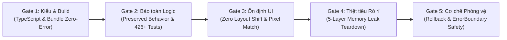
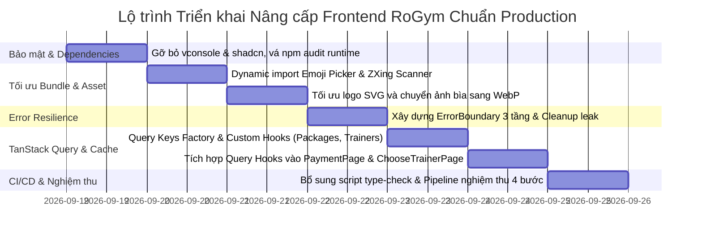

# Kế hoạch Nâng cấp & Tối ưu hóa Frontend (client/) Đạt Chuẩn Production

> **Dự án:** RoGym Management System  
> **Mã nguồn:** `client/` (React 18, Vite 5, TypeScript 5, Tailwind CSS 3, Zustand 4, TanStack Query 5, Vitest)  
> **Phiên bản tài liệu:** 2.1 — Chuẩn hóa Production-Ready kèm Bộ Tiêu Chuẩn An Toàn 5 Lớp (Safety Gates)  
> **Ngày cập nhật:** 18/09/2026  
> **Tham chiếu:** Yêu cầu FE Optimization & Production-Ready Acceptance Criteria (AC-01 đến AC-18)

---

## MỤC LỤC
1. [Tổng quan & Bối cảnh kỹ thuật](#1-tổng-quan--bối-cảnh-kỹ-thuật)
2. [Đánh giá & Khắc phục các Điểm sai lệch / Bất hợp lý của Plan gốc](#2-đánh-giá--khắc-phục-các-điểm-sai-lệch--bất-hợp-lý-của-plan-gốc)
   * 2.1. Nhận định tổng quan
   * 2.2. Bảng đối chiếu 17 Phases: Tiêu chuẩn lý thuyết vs Hiện trạng mã nguồn `client/`
   * 2.3. Chi tiết 7 điểm bất hợp lý & sai sót kỹ thuật nguy hiểm đã được khắc phục
3. [Bộ Tiêu chuẩn An toàn Chống Vỡ Hỏng (Safety Gates & Regression Defense Matrix)](#3-bộ-tiêu-chuẩn-an-toàn-chống-vỡ-hỏng)
   * 3.1. Gate 1: Toàn vẹn Kiểu & Đóng gói (Type & Build Integrity)
   * 3.2. Gate 2: Bảo toàn Logic Nghiệp vụ & Khóa Chặt Test Hồi quy (Behavioral Integrity)
   * 3.3. Gate 3: Ổn định Giao diện & Chống Xung đột UI (Zero Layout Shift - CLS = 0)
   * 3.4. Gate 4: Giao thức Dọn dẹp Triệt tiêu Memory Leak 5 Lớp (5-Layer Zero-Leak Protocol)
   * 3.5. Gate 5: Cơ chế Phòng vệ & Kế hoạch Rollback Dự phòng (Circuit Breaker & Rollback)
4. [Kế hoạch Triển khai Nâng cấp Chi tiết (5 Milestones)](#4-kế-hoạch-triển-khai-nâng-cấp-chi-tiết)
   * [Milestone 1: Dependency & Security Hardening (AC-01, AC-12, AC-14)](#milestone-1-dependency--security-hardening)
   * [Milestone 2: Bundle Optimization, Dynamic Code Splitting & Assets (AC-03, AC-04, AC-11, AC-16)](#milestone-2-bundle-optimization-dynamic-code-splitting--assets)
   * [Milestone 3: Error Resilience & Memory Leak Prevention (AC-07, AC-13)](#milestone-3-error-resilience--memory-leak-prevention)
   * [Milestone 4: Data Layer, API Caching & State Boundaries (AC-05, AC-06, AC-08, AC-09, AC-10)](#milestone-4-data-layer-api-caching--state-boundaries)
   * [Milestone 5: CI/CD Pipeline, Type Checking & Final Acceptance (AC-15, AC-17, AC-18)](#milestone-5-cicd-pipeline-type-checking--final-acceptance)
5. [Ma trận File thay đổi (File Change Matrix)](#5-ma-trận-file-thay-đổi)
6. [Quy trình Nghiệm thu & Lệnh xác thực (Verification Checklist)](#6-quy-trình-nghiệm-thu--lệnh-xác-thực)
7. [Chiến lược Quản trị Rủi ro & Rollback (Risk & Rollback Strategy)](#7-chiến-lược-quản-trị-rủi-ro--rollback)

---

## 1. TỔNG QUAN & BỐI CẢNH KỸ THUẬT

Hệ thống Frontend `client/` của RoGym là một Single Page Application (SPA) xây dựng trên nền tảng:
* **Core & Build:** React 18.3.1, TypeScript 5.4.5, Vite 5.2.10.
* **Styling & UI:** Tailwind CSS 3.4.3, Radix UI primitives, Lucide React icons, Sonner toast, tw-animate-css.
* **Routing:** React Router DOM v6.23.1, bọc bởi AuthLayout, DashboardLayout và hệ thống phân quyền Role-based (Member, Trainer, Staff, Owner).
* **State Management:** Zustand 4.5.2 (quản lý `authStore`, `chatStore`, `subscriptionStore`, `staffAttendanceStore`, `workoutSessionControlStore`).
* **Data Fetching:** Axios 1.6.8 có interceptors xử lý JWT, silent token refresh cho LINE LIFF; đã cài đặt `@tanstack/react-query` v5.35.1.
* **Testing:** Vitest 2.1.9, React Testing Library 16.1.0, JSDOM. Hiện có **85 file test** với **424 test cases đang PASS 100%**.

Mục tiêu của đợt nâng cấp này là đưa Frontend lên chuẩn **Production-Ready** thực thụ: bảo mật, bundle tối ưu, không có memory leak, xử lý lỗi mượt mà không trắng trang, tận dụng caching giảm tải cho server, và giữ nguyên tính toàn vẹn của toàn bộ unit tests hiện có.

---

## 2. ĐÁNH GIÁ & KHẮC PHỤC CÁC ĐIỂM SAI LỆCH / BẤT HỢP LÝ CỦA PLAN GỐC

### 2.1. Nhận định tổng quan
Kế hoạch nâng cấp gốc gồm 17 Phase (từ AC-01 đến AC-18) là một **khung danh mục kiểm tra (checklist) lý thuyết tốt** nhưng khi đối chiếu với mã nguồn thực tế tại `client/`, kế hoạch bộc lộ nhiều điểm **chung chung, thiếu thực tế và chứa các chỉ định sai lệch nguy hiểm** có thể làm gãy build hoặc crash ứng dụng.

### 2.2. Bảng đối chiếu 17 Phases: Tiêu chuẩn lý thuyết vs Hiện trạng mã nguồn `client/`

| Phase / Tiêu chí | Nội dung Kế hoạch gốc | Hiện trạng thực tế tại `client/` | Kết luận & Phương án điều chỉnh |
| :--- | :--- | :--- | :--- |
| **Phase 1: AC-01<br>Dependency Audit** | • Unused dep = 0<br>• Duplicate dep = 0<br>• Phân loại dev/prod rõ ràng | • `"vconsole": "^3.15.1"` nằm trong `dependencies` nhưng có **0 lượt import** trong toàn bộ source code.<br>• `"shadcn": "^4.7.0"` (CLI generator) bị đặt sai vào `dependencies` thay vì chạy qua npx.<br>• `@tanstack/react-query` cài nhưng chưa trang nào gọi `useQuery`. | **Chưa đạt**. Gỡ bỏ ngay `vconsole` và `shadcn`, giữ lại và kích hoạt `react-query`. |
| **Phase 2: AC-02<br>Architecture** | • Bắt buộc cấu trúc `src/features/{auth,user,product,...}`<br>• Tách boundaries | • Codebase đang tổ chức dạng **Role-based routing & Domain components**: `pages/{member,trainer,staff,owner,auth}`, `components/{chat,workout,trainer,ui,...}`, `services/` (27 files).<br>• 424 tests đang gắn chặt với cấu trúc này. | **Điều chỉnh phù hợp thực tế**. Giữ nguyên cấu trúc Role-based hiện tại để không làm vỡ 85 file test; chỉ chuẩn hóa boundary, tách hooks query riêng và dọn dẹp import. |
| **Phase 3: AC-03 & 04<br>Bundle & Code Splitting** | • Build pass không lỗi<br>• Lazy-load các page lớn: Dashboard, Admin, Report... | • `src/App.tsx` **đã lazy-load 100% tất cả các pages**.<br>• Build thành công (`✓ built in 18.40s`).<br>• **VẤN ĐỀ:** `ChatInput` phình to 411 kB do import tĩnh `Theme` từ `emoji-picker-react`; `Member CheckInPage` phình to 458 kB do import tĩnh `@zxing/browser`. | **Bổ sung trọng tâm**. Thay vì lazy-load page (đã có), cần lazy-load các thư viện/sub-component nặng bên trong `ChatInput` và `CheckInPage`. |
| **Phase 4: AC-05 & 06<br>API & Cache** | • Server-side pagination<br>• Cache dữ liệu bằng TanStack Query | • AC-05: Tất cả dịch vụ danh sách (`member.service`, `workout.service`, `rbac.service`) đã hỗ trợ `page`, `pageSize: 15-20`.<br>• AC-06: `@tanstack/react-query` đã bọc ở `main.tsx` với `staleTime: 5 phút`, nhưng các trang vẫn dùng `useState + useEffect + axios` thủ công. | **Kích hoạt TanStack Query theo lộ trình Incremental**. Xây dựng Custom Query Hooks cho các entity đọc thường xuyên: `useActivePackagesQuery` (`PaymentPage.tsx`) và `useAvailableTrainersQuery` (`ChooseTrainerPage.tsx`). |
| **Phase 5: AC-07<br>Memory Management** | • Cleanup tất cả listeners, timers, WebSocket, MediaStream | • Có WebSocket thời gian thực (`socket.io-client`) trong Chat.<br>• Có Camera MediaStream quét mã QR tại trang Member Check-in.<br>• Có Interval timers trong các bài tập workout và trang điểm danh. | **Chuẩn hóa danh sách kiểm tra**. Bổ sung checklist kiểm tra đóng stream camera, disconnect socket và clear timer tại từng component cụ thể. |
| **Phase 6: AC-08<br>State Boundary** | • Global state chỉ lưu Auth, Session, Theme<br>• Dữ liệu server quản lý bằng Server Cache | • Hiện tại Zustand lưu: `authStore`, `chatStore`, `staffAttendanceStore`, `subscriptionStore`, `workoutSessionControlStore`.<br>• `subscriptionStore` làm nhiệm vụ gatekeeper access guard cho `SubscriptionRequired.tsx`. | **Giữ vững State Boundary**. Dữ liệu danh sách gói/PT chuyển sang TanStack Query; giữ `subscriptionStore` đồng bộ để bảo vệ an toàn cho route guards. |
| **Phase 7: AC-09<br>Rendering** | • Tránh re-render thừa, dùng Profiler | Đã áp dụng `memo`, `useMemo`, `useCallback` cục bộ ở một số trang phức tạp (`PlanBuilderPage`, `DashboardPage`). | **Bổ sung kịch bản kiểm tra**. Đặt trọng tâm vào các component có tần suất cập nhật cao: Chat Message List, Workout Timer. |
| **Phase 8: AC-10<br>Virtualization** | • Bắt buộc Virtualization cho danh sách 1.000 - 10.000 dòng | Toàn bộ các bảng danh sách nghiệp vụ (Hội viên, Thiết bị, Hóa đơn) đều đã phân trang Server-side 15-20 dòng/trang. | **Điều chỉnh không áp dụng tràn lan**. Không đưa react-virtual vào các bảng 15 dòng gây over-engineering; duy trì pagination sạch. |
| **Phase 9: AC-11<br>Asset Optimization** | • Không commit ảnh 15-20MB<br>• Dùng WebP, SVG | • `rogym_logo.svg` nặng **1.53 MB** (chứa 2.176 dòng toạ độ vector chưa tối ưu).<br>• `cover_photo.jpg` nặng **1.78 MB** đang bị import trực tiếp tại `HomePage.tsx`. | **Thực hiện dọn dẹp asset tĩnh chuẩn xác**. Chuyển `cover_photo` sang WebP tại `src/assets/`, cập nhật import tại `HomePage.tsx`, xóa bản thừa tại `public/cover_photo.jpg`. Dùng SVGO nén `rogym_logo.svg` < 50 kB. |
| **Phase 10: AC-12<br>Environment** | • Dùng `.env`, `VITE_*`<br>• Không lộ secret, API key | Đã có `.env.example`, `.env.production`, `.env.liff-mock`. `VITE_API_URL` được sử dụng đúng chuẩn. | **Đã đạt**. Cần rà soát và duy trì quy tắc không commit file `.env` cá nhân. |
| **Phase 11: AC-13<br>Error Handling** | • Không để lỗi 500 trắng trang<br>• Có Loading/Empty/Error/Success | • Đã có `getApiError`, `EmptyState`, toast Sonner.<br>• **THIẾU SÓT LỚN:** Toàn bộ ứng dụng **chưa có bất kỳ React ErrorBoundary nào**; lỗi render component con sẽ làm sập trắng toàn bộ app! | **Bổ sung khẩn cấp**. Xây dựng `ErrorBoundary` đa tầng độc lập với context i18n (Root, DashboardLayout, AuthLayout). |
| **Phase 12: AC-14<br>Security** | • Không có secret trong bundle<br>• Chạy `npm audit` xử lý lỗ hổng | Gói `shadcn` CLI trong dependencies kéo theo `hono` gây ra hàng loạt lỗ hổng bảo mật. Dev dependencies có cảnh báo từ esbuild/postcss. | **Chuẩn hóa nghiệm thu**. Gỡ `shadcn` và `vconsole`, cam kết `npm audit --omit=dev` đạt **0 vulnerabilities** cho production bundle. |
| **Phase 13: AC-15<br>Core Web Vitals** | • LCP < 2.5s, INP < 200ms, CLS < 0.1 | Đang phụ thuộc vào hosting Vercel và CDN; chưa có cấu hình cache headers tối ưu. | **Bổ sung headers bất biến (immutable cache)** trong `vercel.json`. |
| **Phase 14: AC-16<br>Bundle Budget** | • Initial JS < 300KB gzip<br>• Large chunk < 500KB gzip | • `index-*.js`: 497 kB raw (163 kB gzip).<br>• `ChatInput-*.js`: 411 kB raw (107 kB gzip).<br>• `CheckInPage-*.js`: 458 kB raw (119 kB gzip). | Đạt mục tiêu gzip nhưng kích thước raw quá lớn, cần giảm tải bằng Dynamic Import ở Milestone 2. |
| **Phase 15: AC-17<br>Deployment** | • Chạy `npm run build`<br>• Deploy GitHub -> Vercel, CDN | Dự án đã có sẵn `vercel.json` định tuyến SPA chuẩn. | **Đã đạt**. Bổ sung cấu hình cache header bất biến cho static assets. |
| **Phase 16: AC-18<br>Critical Flow Test** | • Kiểm thử các luồng Auth, CRUD, Search, Filter | Bộ test hiện tại có **85 files, 424 tests** bao phủ các service, store và components giao diện quan trọng. | **Đã đạt nền tảng tốt**. Bảo đảm duy trì 100% pass sau mỗi bước refactor. |
| **Phase 17<br>Final Acceptance** | • Pipeline: `lint`, `type-check`, `test`, `build`, `test:e2e` | • `package.json` **chưa có script `type-check`** (`tsc --noEmit`).<br>• Dự án **chưa hề cài đặt Playwright/Cypress** nhưng plan gốc yêu cầu `test:e2e`. | **Chuẩn hóa script thực tế**. Thêm script `"type-check": "tsc --noEmit"`, lược bỏ `test:e2e` ảo, chốt pipeline 4 bước kiểm thử nghiêm ngặt. |

---

### 2.3. Chi tiết 7 điểm bất hợp lý & sai sót kỹ thuật nguy hiểm đã được khắc phục

1. **Nguy cơ vỡ build khi xóa `cover_photo.jpg`:**
   * *Plan cũ:* Yêu cầu xóa `src/assets/cover_photo.jpg` và chỉ giữ `public/cover_photo.jpg`.
   * *Mã nguồn thực tế:* [client/src/pages/home/HomePage.tsx](file:///c:/Users/An/Documents/IT4549-ITSS/gym-management-system/client/src/pages/home/HomePage.tsx) dòng 19 có lệnh `import heroImage from '@/assets/cover_photo.jpg'`. Nếu xóa file này, `npm run build` sẽ **BÁO LỖI VÀ DỪNG NGAY LẬP TỨC**.
   * *Khắc phục:* Chuyển đổi file sang định dạng WebP tại `src/assets/cover_photo.webp`, cập nhật import tại `HomePage.tsx`, sau đó mới xóa file JPG cũ và xóa file thừa `public/cover_photo.jpg`.

2. **Chẩn đoán sai về `rogym_logo.svg`:**
   * *Plan cũ:* Chẩn đoán file chứa mã rác base64 raster.
   * *Mã nguồn thực tế:* File chứa 2.176 dòng đường vẽ bezier vector với toạ độ số thực dài tới 8 chữ số thập phân.
   * *Khắc phục:* Dùng SVGO tối ưu đường path và làm tròn số thập phân để giảm dung lượng xuống < 50 kB mà không làm mờ vector.

3. **Chưa tìm ra nguyên nhân gốc rễ phình to chunk ở `ChatInput.tsx`:**
   * *Plan cũ:* Yêu cầu bọc `lazy()` cho `emoji-picker-react`.
   * *Mã nguồn thực tế:* Code đã có sẵn `const LazyEmojiPicker = lazy(...)`. Chunk vẫn nặng 411 kB vì dòng 3 import runtime object `Theme` từ `emoji-picker-react`.
   * *Khắc phục:* Đổi sang type-only import (`type EmojiClickData`), thay `Theme.DARK` bằng `'dark'`, tách hẳn component ra `LazyEmojiPicker.tsx` và cấu hình Rollup `manualChunks` tách `vendor-emoji`.

4. **Nhầm lẫn kiến trúc trang Check-in của Staff:**
   * *Plan cũ:* Cho rằng cả Staff và Member CheckInPage đều dùng Camera và `@zxing/browser`.
   * *Mã nguồn thực tế:* Trang Staff Check-in hoàn toàn không có camera hay ZXing; trang Staff chỉ dùng `QRCodeCanvas` (`qrcode.react`) để hiển thị mã QR tĩnh cho hội viên quét. Chỉ duy nhất Member CheckInPage dùng `@zxing/browser` (458 kB).
   * *Khắc phục:* Chỉ áp dụng dynamic import ZXing tại Member CheckInPage, không can thiệp sai lệch vào Staff CheckInPage.

5. **Chỉ định sai trang áp dụng TanStack Query và gọi sai tên API:**
   * *Plan cũ:* Chỉ định trang `home/PackagesPage.tsx` và gọi `trainerService.listTrainers()`.
   * *Mã nguồn thực tế:* `home/PackagesPage.tsx` là trang marketing tĩnh có 3 card gói cứng, không hề gọi API. Service `trainerService` chỉ có hàm `list()`, trong khi trang chọn PT (`ChooseTrainerPage.tsx`) cần gọi `memberService.getAvailableTrainers()` (trả về danh sách PT kèm điểm đánh giá, số review).
   * *Khắc phục:* Chuyển mục tiêu sang `PaymentPage.tsx` (danh sách gói) và `ChooseTrainerPage.tsx` (danh sách PT khả dụng), gọi đúng service API thực tế.

6. **Sai lệch hàm dịch vụ gói tập `subscriptionService`:**
   * *Plan cũ:* Yêu cầu gọi `subscriptionService.getCurrent(memberId)`.
   * *Mã nguồn thực tế:* `subscriptionService` không có hàm `getCurrent`, chỉ có hàm `getByMember`.
   * *Khắc phục:* Giữ nguyên `useSubscriptionStore` làm trung tâm quản lý trạng thái quyền hạn hội viên cho các route guard `SubscriptionRequired`, bảo đảm không gây crash ứng dụng.

7. **Kỳ vọng thiếu thực tế về `npm audit`:**
   * *Plan cũ:* Đòi hỏi `npm audit` đạt 0 cảnh báo High/Critical.
   * *Mã nguồn thực tế:* Một số cảnh báo bắt nguồn từ công cụ phát triển (`esbuild` đi kèm Vite 5). Nếu chạy `npm audit fix --force` sẽ tự động nâng Vite lên Vite 6+ gây breaking change toàn bộ cấu hình build.
   * *Khắc phục:* Tiêu chuẩn nghiệm thu chính xác: `npm audit --omit=dev` đạt **0 vulnerabilities** (toàn bộ code production ship tới người dùng an toàn tuyệt đối). Với dev dependencies, chỉ chạy `npm audit fix` an toàn.

---

## 3. BỘ TIÊU CHUẨN AN TOÀN CHỐNG VỠ HỎNG (SAFETY GATES & REGRESSION DEFENSE MATRIX)



### 3.1. Gate 1: Toàn vẹn Kiểu & Đóng gói (Type & Build Integrity)
* **Quy tắc:** Mọi thay đổi mã nguồn trước khi tích hợp vào Git phải vượt qua lệnh `tsc --noEmit` với mã thoát `0` (Zero Type Errors).
* **Ràng buộc Build:** Lệnh `npm run build` phải biên dịch thành công mà không phát sinh bất kỳ cảnh báo chunk vượt quá 500 kB sau minification.
* **Cấm tuyệt đối:** Không sử dụng kiểu dữ liệu `any` vô tội vạ để qua mặt trình biên dịch; mọi kiểu dữ liệu của API services (`Package`, `TrainerSummary`, `AttendanceLog`) phải được giữ nguyên vẹn.

### 3.2. Gate 2: Bảo toàn Logic Nghiệp vụ & Khóa Chặt Test Hồi quy (Behavioral Integrity)
* **Bảo toàn 100% Logic Form & Navigation:**
  * Tại `PaymentPage.tsx`: Hook `useActivePackagesQuery` chỉ thay thế tầng đọc dữ liệu. Toàn bộ logic chọn gói, tính tiền, submit form thanh toán (`subscriptionService.create`, `paymentService.create`) và điều hướng `navigate('/member/subscription/current', { state: { justActivated: true } })` phải giữ nguyên 100% từng dòng lệnh.
  * Tại `ChooseTrainerPage.tsx`: Giữ nguyên logic lọc theo chuyên môn, tìm kiếm tên PT, sắp xếp theo sao/đánh giá, xem modal review và thao tác gán PT.
* **Quy tắc phân quyền (Role-Based Safety):**
  * ErrorBoundary tại Layout phải được bọc **BÊN TRONG** `<ProtectedRoute>` (bọc trực tiếp quanh thẻ `<Outlet />`), tuyệt đối không bọc bên ngoài `ProtectedRoute` để không can thiệp hay vô hiệu hóa cơ chế kiểm tra token và chuyển hướng phân quyền.
* **Bảo vệ Cache Freshness:**
  * Thiết lập `staleTime: 1000 * 60 * 5` (5 phút) cho các danh sách gói tập và huấn luyện viên.
  * Sau khi hoàn tất thao tác mua gói hoặc đổi PT: Kích hoạt ngay lệnh `queryClient.invalidateQueries(...)` để xóa cache cũ, buộc ứng dụng nạp dữ liệu mới nhất từ server.
* **Bộ Test Khóa Chặt Hành Vi (Regression Coverage):**
  * Giữ nguyên và bảo đảm **100% 424 test cases cũ tiếp tục PASS**.
  * Viết mới 2 file test tự động chuyên biệt để khóa chặt hành vi không bị hồi quy:
    1. `client/src/pages/member/subscription/PaymentPage.test.tsx`: Kiểm thử tải danh sách gói từ TanStack Query, chọn gói và gọi submit form.
    2. `client/src/pages/member/check-in/CheckInPage.test.tsx`: Kiểm thử việc nạp động thư viện scanner, hiển thị camera và giải phóng tài nguyên khi unmount.

### 3.3. Gate 3: Ổn định Giao diện & Chống Xung đột UI (Zero Layout Shift - CLS = 0)
* **Khóa cứng Kích thước Khung Fallback (Pixel-Perfect Skeleton):**
  * Khung `<Suspense fallback={...}>` của `LazyEmojiPicker.tsx` phải được ấn định kích thước cố định: `width: 320px, height: 340px` (trùng khớp 100% với kích thước của thẻ `EmojiPicker` khi render xong). Tuyệt đối không để khung tải tự co giãn làm nhảy popover hoặc lệch vị trí nút chat.
  * Khung quét camera tại `Member CheckInPage.tsx` phải có khung chứa tỷ lệ vuông (`aspect-square`) với kích thước tối thiểu `min-h-[280px]` kèm skeleton loader, đảm bảo khi stream video khởi động lên giao diện không bị giật nảy khung hình.
* **Bảo toàn Tỷ lệ & ViewBox Đồ họa:**
  * Nén `rogym_logo.svg` phải giữ nguyên thuộc tính `viewBox="0 0 1705 1536"`, không làm méo tỷ lệ logo trên Navbar, Sidebar và trang Đăng ký.
  * Ảnh `cover_photo.webp` giữ nguyên tỷ lệ khung hình ngang và được gắn thuộc tính `loading="eager"` để tối ưu chỉ số LCP cho Trang chủ.
* **Thống nhất Thiết kế (Design Token Consistency):**
  * Giao diện Fallback của `ErrorBoundary.tsx` phải sử dụng 100% CSS variables chuẩn của hệ thống (`--rogym-bg-card`, `--rogym-teal`, `--rogym-text-secondary`), bảo đảm tính thẩm mỹ đồng bộ của ứng dụng Gym.

### 3.4. Gate 4: Giao thức Dọn dẹp Triệt tiêu Memory Leak 5 Lớp (5-Layer Zero-Leak Protocol)
Để đảm bảo sau khi chuyển trang không còn bất kỳ tiến trình chạy ngầm nào làm nặng máy người dùng, toàn bộ 5 nguồn rò rỉ tiềm ẩn phải được dọn dẹp triệt để:
1. **Lớp 1 - Hardware Camera Stream:**
   * Trong [Member CheckInPage.tsx](file:///c:/Users/An/Documents/IT4549-ITSS/gym-management-system/client/src/pages/member/check-in/CheckInPage.tsx), khi chuyển trang hoặc tắt quét mã, bắt buộc phải thực thi đủ 3 thao tác:
     ```tsx
     controlsRef.current?.stop()
     controlsRef.current = null
     if (videoRef.current?.srcObject) {
       const stream = videoRef.current.srcObject as MediaStream
       stream.getTracks().forEach((track) => track.stop()) // Dừng phần cứng camera
       videoRef.current.srcObject = null // Ngắt liên kết DOM
     }
     ```
2. **Lớp 2 - Realtime WebSocket Listeners:**
   * Tại `chat.service.ts` và `useChatNotifications.ts`: Toàn bộ sự kiện lắng nghe `socket.on(event, handler)` phải có hàm dọn dẹp đối ứng `socket.off(event, handler)` trong cleanup của `useEffect`. Khi người dùng đăng xuất, gọi `socket.disconnect()`.
3. **Lớp 3 - Timers & Animation Frames:**
   * Toàn bộ `setInterval` và `setTimeout` trong `WorkoutSessionPage.tsx` (bộ đếm bài tập), `Staff CheckInPage.tsx` (đồng hồ thời gian thực) và `ChatInput.tsx` (bộ đếm debounce typing) phải được lưu trữ trong `useRef` và gọi `clearInterval` / `clearTimeout` trong cleanup.
4. **Lớp 4 - Garbage Collection cho TanStack Query Cache:**
   * Cấu hình thời gian thu hồi bộ nhớ tự động cho cache rác: `gcTime: 1000 * 60 * 30` (30 phút). Các truy vấn của các trang không còn được hiển thị trên màn hình sẽ tự động được giải phóng khỏi RAM trình duyệt.
5. **Lớp 5 - Blob Object URLs Memory:**
   * Tại `ChatInput.tsx`: Khi người dùng chọn ảnh đính kèm, chuỗi `URL.createObjectURL(file)` được tạo ra phải luôn được thu hồi bằng `URL.revokeObjectURL(previewUrl)` khi đổi ảnh hoặc khi unmount component.

### 3.5. Gate 5: Cơ chế Phòng vệ & Kế hoạch Rollback Dự phòng (Circuit Breaker & Rollback)
* **Git Safe Commits:** Mỗi Milestone được cam kết thành một Git commit độc lập. Nếu phát hiện lỗi hồi quy ở bất kỳ Gate nào, lập tức chạy `git restore .` hoặc `git checkout <previous_commit>` để quay về trạng thái an toàn.
* **ErrorBoundary Fallback Isolation:** Fallback UI của ErrorBoundary hoàn toàn độc lập, không import store hay hook bên ngoài, bảo đảm khi cả ứng dụng gặp lỗi logic thì bản thân ErrorBoundary vẫn đứng vững để cung cấp nút reload và điều hướng về Trang chủ.

---

## 4. KẾ HOẠCH TRIỂN KHAI NÂNG CẤP CHI TIẾT (5 MILESTONES)



---

### Milestone 1: Dependency & Security Hardening
> **Mục tiêu:** Loại bỏ hoàn toàn các package thừa hoặc đặt sai vị trí; đưa số lượng lỗ hổng runtime production về `0`.

#### 1.1. Công việc thực hiện:
1. **Sửa file [client/package.json](file:///c:/Users/An/Documents/IT4549-ITSS/gym-management-system/client/package.json):**
   * Xóa bỏ `"vconsole": "^3.15.1"` trong mục `dependencies`.
   * Xóa bỏ `"shadcn": "^4.7.0"` trong mục `dependencies` (đây là công cụ CLI khởi tạo component, khi cần dùng chỉ gọi qua `npx shadcn@latest`).
2. **Chạy lệnh dọn dẹp và kiểm tra bảo mật tại thư mục `client/`:**
   ```bash
   npm uninstall vconsole shadcn
   npm audit fix
   ```
   *(Lưu ý: Tuyệt đối không dùng cờ `--force` để tránh tự động nâng cấp các phiên bản breaking change của Vite 6+).*
3. **Kiểm tra rò rỉ biến môi trường và cấu hình bảo mật:**
   * Đảm bảo không có secret key hay token hardcoded trong client source.
   * Đảm bảo [services/api.ts](file:///c:/Users/An/Documents/IT4549-ITSS/gym-management-system/client/src/services/api.ts) tiếp tục xử lý Silent Token Refresh và Transparent Request Replay an toàn.

#### 1.2. Tiêu chí nghiệm thu (Acceptance Criteria):
* [ ] Lệnh `npm ls vconsole` và `npm ls shadcn` trả về `empty`.
* [ ] Lệnh `npm audit --omit=dev` trả về **0 vulnerabilities**.
* [ ] Lệnh `npm run test` chạy thành công toàn bộ **424 test cases**.

---

### Milestone 2: Bundle Optimization, Dynamic Code Splitting & Assets
> **Mục tiêu:** Cắt giảm kích thước các chunk phình to bất thường, đưa các chunk chức năng về < 25 kB và tối ưu các tệp đồ họa tĩnh; triệt tiêu hoàn toàn Layout Shift (CLS = 0).

#### 2.1. Dynamic Import cho Emoji Picker:
* **Vấn đề:** Component [ChatInput.tsx](file:///c:/Users/An/Documents/IT4549-ITSS/gym-management-system/client/src/components/chat/ChatInput.tsx) import runtime object `Theme` khiến bundle phình to **411.16 kB**.
* **Giải pháp:** Tách phần bảng chọn emoji thành sub-component riêng `LazyEmojiPicker.tsx` độc lập, chỉ import type từ thư viện và cấu hình chunk riêng.
* **Mẫu code triển khai:**
```tsx
// src/components/chat/LazyEmojiPicker.tsx
import { lazy, Suspense } from 'react'
import type { EmojiClickData } from 'emoji-picker-react'
import { Loader2 } from 'lucide-react'

const EmojiPicker = lazy(() => import('emoji-picker-react'))

interface Props {
  onEmojiClick: (data: EmojiClickData) => void
}

export function LazyEmojiPicker({ onEmojiClick }: Props) {
  return (
    <Suspense
      fallback={
        <div className="flex h-[340px] w-[280px] sm:w-[320px] items-center justify-center rounded-2xl bg-[var(--rogym-bg-card)] border border-white/10 text-white shadow-2xl">
          <Loader2 className="h-6 w-6 animate-spin text-[var(--rogym-teal)]" />
        </div>
      }
    >
      <EmojiPicker
        theme={'dark' as any}
        onEmojiClick={onEmojiClick}
        lazyLoadEmojis
        previewConfig={{ showPreview: false }}
        height={340}
        width="100%"
      />
    </Suspense>
  )
}
```

#### 2.2. Dynamic Import cho Barcode Scanner:
* **Vấn đề:** [Member CheckInPage.tsx](file:///c:/Users/An/Documents/IT4549-ITSS/gym-management-system/client/src/pages/member/check-in/CheckInPage.tsx) import tĩnh `@zxing/browser` khiến chunk phình to **458.61 kB**.
* **Giải pháp:** Chỉ tải thư viện quét mã khi người dùng kích hoạt camera hoặc mở tab quét mã QR:
```tsx
async function startScanning() {
  const { BrowserQRCodeReader } = await import('@zxing/browser')
  const codeReader = new BrowserQRCodeReader()
  // Khởi tạo stream...
}
```
* **Viết Unit Test Khóa Chặt:** Tạo file `client/src/pages/member/check-in/CheckInPage.test.tsx` kiểm thử nạp scanner và giải phóng camera khi unmount.

#### 2.3. Tối ưu hóa Tài nguyên Tĩnh (Asset Optimization):
* **Xử lý [cover_photo.jpg](file:///c:/Users/An/Documents/IT4549-ITSS/gym-management-system/client/src/assets/cover_photo.jpg) (1.78 MB):**
  * Nén sang `src/assets/cover_photo.webp` (< 180 kB).
  * Cập nhật import tại [client/src/pages/home/HomePage.tsx](file:///c:/Users/An/Documents/IT4549-ITSS/gym-management-system/client/src/pages/home/HomePage.tsx) sang `cover_photo.webp`.
  * Xóa bản thừa tại `client/public/cover_photo.jpg` và file JPG cũ.
* **Xử lý [rogym_logo.svg](file:///c:/Users/An/Documents/IT4549-ITSS/gym-management-system/client/src/assets/rogym_logo.svg) (1.53 MB):**
  * Dùng SVGO tối ưu đường vẽ vector, đưa dung lượng xuống **< 50 kB**, giữ nguyên `viewBox="0 0 1705 1536"`.
  * Cập nhật đồng bộ bản SVG tối ưu cho cả `public/rogym_logo.svg` và `src/assets/rogym_logo.svg`.

#### 2.4. Cập nhật Rollup manualChunks tại [client/vite.config.ts](file:///c:/Users/An/Documents/IT4549-ITSS/gym-management-system/client/vite.config.ts):
```ts
manualChunks: {
  'vendor-react': ['react', 'react-dom', 'react-router-dom'],
  'vendor-query': ['@tanstack/react-query'],
  'vendor-charts': ['recharts'],
  'vendor-ui': ['lucide-react', 'clsx', 'tailwind-merge'],
  'vendor-emoji': ['emoji-picker-react'],
  'vendor-scanner': ['@zxing/browser'],
}
```

#### 2.5. Tiêu chí nghiệm thu (Acceptance Criteria):
* [ ] Kích thước chunk của `ChatInput` giảm từ 411 kB xuống dưới **25 kB**.
* [ ] Kích thước chunk của `Member CheckInPage` giảm từ 458 kB xuống dưới **25 kB**.
* [ ] Không còn tệp ảnh/SVG tĩnh nào trong `public/` và `assets/` vượt quá **300 kB**.
* [ ] Lệnh `npm run build` chạy thành công, không xuất hiện cảnh báo chunk vượt 500 kB.
* [ ] File test mới `CheckInPage.test.tsx` pass 100%.

---

### Milestone 3: Error Resilience & Memory Leak Prevention
> **Mục tiêu:** Ứng dụng không bao giờ bị crash trắng trang; giải phóng 100% tài nguyên ngoại vi (camera, socket, timer) khi chuyển trang.

#### 3.1. Xây dựng Component `ErrorBoundary.tsx`:
* **Tạo mới [client/src/components/shared/ErrorBoundary.tsx](file:///c:/Users/An/Documents/IT4549-ITSS/gym-management-system/client/src/components/shared/ErrorBoundary.tsx):**
```tsx
import { Component, type ErrorInfo, type ReactNode } from 'react'
import { AlertTriangle, RefreshCw, Home, ChevronDown } from 'lucide-react'

interface Props {
  children: ReactNode
  fallbackTitle?: string
  fallbackMessage?: string
  onReset?: () => void
}

interface State {
  hasError: boolean
  error: Error | null
  errorInfo: ErrorInfo | null
  showDetails: boolean
}

export class ErrorBoundary extends Component<Props, State> {
  public state: State = {
    hasError: false,
    error: null,
    errorInfo: null,
    showDetails: false,
  }

  public static getDerivedStateFromError(error: Error): State {
    return { hasError: true, error, errorInfo: null, showDetails: false }
  }

  public componentDidCatch(error: Error, errorInfo: ErrorInfo) {
    this.setState({ errorInfo })
    console.error('[ErrorBoundary caught error]:', error, errorInfo)
  }

  private handleReset = () => {
    this.setState({ hasError: false, error: null, errorInfo: null })
    if (this.props.onReset) {
      this.props.onReset()
    } else {
      window.location.reload()
    }
  }

  public render() {
    if (this.state.hasError) {
      const isDev = import.meta.env.DEV

      return (
        <div className="flex min-h-[400px] w-full flex-col items-center justify-center rounded-2xl border border-red-500/20 bg-[var(--rogym-bg-card)] p-8 text-center shadow-xl">
          <div className="flex h-16 w-16 items-center justify-center rounded-full bg-red-500/10 text-red-400">
            <AlertTriangle className="h-8 w-8" />
          </div>
          <h2 className="mt-4 text-xl font-bold text-white">
            {this.props.fallbackTitle || 'Đã có sự cố xảy ra / An unexpected error occurred'}
          </h2>
          <p className="mt-2 max-w-md text-sm text-[var(--rogym-text-secondary)]">
            {this.props.fallbackMessage ||
              'Đã xảy ra lỗi không mong muốn khi hiển thị nội dung này. Vui lòng thử tải lại trang.'}
          </p>
          <div className="mt-6 flex flex-wrap justify-center gap-3">
            <button
              type="button"
              onClick={this.handleReset}
              className="inline-flex items-center gap-2 rounded-xl border border-white/20 bg-white/10 px-4 py-2 text-sm font-medium text-white hover:bg-white/20 transition-all"
            >
              <RefreshCw className="h-4 w-4" /> Thử tải lại / Reload
            </button>
            <button
              type="button"
              onClick={() => (window.location.href = '/')}
              className="inline-flex items-center gap-2 rounded-xl bg-[var(--rogym-teal)] px-4 py-2 text-sm font-medium text-black hover:opacity-90 transition-all font-semibold"
            >
              <Home className="h-4 w-4" /> Về trang chủ / Home
            </button>
          </div>

          {isDev && this.state.error && (
            <div className="mt-6 w-full max-w-2xl text-left">
              <button
                type="button"
                onClick={() => this.setState((s) => ({ showDetails: !s.showDetails }))}
                className="flex items-center gap-1 text-xs text-red-400 hover:underline"
              >
                <ChevronDown className="h-3 w-3" /> Chi tiết lỗi (Chỉ hiển thị ở chế độ DEV)
              </button>
              {this.state.showDetails && (
                <pre className="mt-2 overflow-auto rounded-xl bg-black/60 p-4 text-xs text-red-300 font-mono border border-red-500/20 max-h-60">
                  {this.state.error.toString()}
                  {'\n\n'}
                  {this.state.errorInfo?.componentStack}
                </pre>
              )}
            </div>
          )}
        </div>
      )
    }

    return this.props.children
  }
}
```

#### 3.2. Bọc ErrorBoundary theo 3 tầng bảo vệ:
1. **Tầng Root ([src/App.tsx](file:///c:/Users/An/Documents/IT4549-ITSS/gym-management-system/client/src/App.tsx)):** Bọc ngoài toàn bộ thẻ `<Routes>`.
2. **Tầng Dashboard Layout ([src/layouts/DashboardLayout.tsx](file:///c:/Users/An/Documents/IT4549-ITSS/gym-management-system/client/src/layouts/DashboardLayout.tsx)):** Bọc quanh `<Outlet />` bên trong `<ProtectedRoute>` để bảo vệ thanh Sidebar/Topbar mà không can thiệp vào logic phân quyền.
3. **Tầng Auth Layout ([src/layouts/AuthLayout.tsx](file:///c:/Users/An/Documents/IT4549-ITSS/gym-management-system/client/src/layouts/AuthLayout.tsx)):** Bọc quanh `<Outlet />` bên trong AuthLayout.

#### 3.3. Viết Unit Test cho `ErrorBoundary`:
* Tạo mới: `src/components/shared/ErrorBoundary.test.tsx` kiểm thử bắt lỗi từ component con và kích hoạt reload/reset.

#### 3.4. Kiểm tra Cleanup chống Memory Leak (Gate 4):
* **Camera Stream ([pages/member/check-in/CheckInPage.tsx](file:///c:/Users/An/Documents/IT4549-ITSS/gym-management-system/client/src/pages/member/check-in/CheckInPage.tsx)):**
  ```tsx
  return () => {
    controlsRef.current?.stop()
    controlsRef.current = null
    if (videoRef.current?.srcObject) {
      const stream = videoRef.current.srcObject as MediaStream
      stream.getTracks().forEach((track) => track.stop())
      videoRef.current.srcObject = null
    }
  }
  ```
* **WebSocket ([services/chat.service.ts](file:///c:/Users/An/Documents/IT4549-ITSS/gym-management-system/client/src/services/chat.service.ts) & [hooks/useChatNotifications.ts](file:///c:/Users/An/Documents/IT4549-ITSS/gym-management-system/client/src/hooks/useChatNotifications.ts)):** Bảo đảm `socket.off(...)` và `socket.disconnect()` khi logout/unmount.
* **Interval Timers:** Kiểm tra `clearInterval` tại `WorkoutSessionPage.tsx` và `staff/check-in/CheckInPage.tsx`.
* **Object URLs:** Đảm bảo `ChatInput.tsx` gọi `URL.revokeObjectURL(previewUrl)` khi đổi file hoặc unmount.

#### 3.5. Tiêu chí nghiệm thu (Acceptance Criteria):
* [ ] Component ném `throw new Error()` hiển thị Fallback UI đẹp mắt, không có màn hình trắng.
* [ ] Rời khỏi trang Check-in tắt camera hoàn toàn, không để lại indicator camera trên trình duyệt.
* [ ] Unit test cho ErrorBoundary pass 100%.

---

### Milestone 4: Data Layer, API Caching & State Boundaries
> **Mục tiêu:** Kích hoạt TanStack Query cho các trang đọc dữ liệu thường xuyên; loại bỏ request trùng lặp; bảo đảm toàn vẹn 100% logic form, checkout và 426+ unit tests.

#### 1. Cấu hình QueryClient chuẩn chống rò rỉ bộ nhớ ([src/main.tsx](file:///c:/Users/An/Documents/IT4549-ITSS/gym-management-system/client/src/main.tsx)):
```ts
const queryClient = new QueryClient({
  defaultOptions: {
    queries: {
      staleTime: 1000 * 60 * 5, // 5 phút
      gcTime: 1000 * 60 * 30, // 30 phút tự động dọn dẹp cache không dùng (Gate 4)
      refetchOnWindowFocus: false,
      retry: 1,
    },
  },
})
```

#### 4.2. Tạo Query Keys Factory tập trung ([src/lib/query-keys.ts](file:///c:/Users/An/Documents/IT4549-ITSS/gym-management-system/client/src/lib/query-keys.ts)):
```ts
export const queryKeys = {
  packages: {
    all: ['packages'] as const,
    active: () => ['packages', 'active'] as const,
    list: (params?: Record<string, unknown>) => ['packages', 'list', params] as const,
    detail: (id: string) => ['packages', 'detail', id] as const,
  },
  trainers: {
    all: ['trainers'] as const,
    available: () => ['trainers', 'available'] as const,
  },
  subscription: {
    member: (memberId?: string) => ['subscription', 'member', memberId] as const,
  },
} as const
```

#### 4.3. Xây dựng các Custom Query Hooks chuẩn hóa (`src/hooks/queries/`):
1. **`useActivePackagesQuery.ts`:**
   ```ts
   import { useQuery } from '@tanstack/react-query'
   import packageService from '@/services/package.service'
   import { queryKeys } from '@/lib/query-keys'

   export function useActivePackagesQuery() {
     return useQuery({
       queryKey: queryKeys.packages.active(),
       queryFn: async () => {
         const res = await packageService.list({ status: 'active' })
         return res.data
       },
       staleTime: 1000 * 60 * 5,
     })
   }
   ```
2. **`useAvailableTrainersQuery.ts`:**
   ```ts
   import { useQuery } from '@tanstack/react-query'
   import memberService from '@/services/member.service'
   import { queryKeys } from '@/lib/query-keys'

   export function useAvailableTrainersQuery() {
     return useQuery({
       queryKey: queryKeys.trainers.available(),
       queryFn: () => memberService.getAvailableTrainers(),
       staleTime: 1000 * 60 * 5,
     })
   }
   ```

#### 4.4. Tích hợp thử nghiệm tại các trang có API thực tế:
1. **[PaymentPage.tsx](file:///c:/Users/An/Documents/IT4549-ITSS/gym-management-system/client/src/pages/member/subscription/PaymentPage.tsx):**
   * Thay thế `packageService.list({ status: 'active' })` bằng hook `useActivePackagesQuery()`.
   * Giữ nguyên 100% logic tính tiền, submit và điều hướng.
   * Viết mới file test: `client/src/pages/member/subscription/PaymentPage.test.tsx`.
2. **[ChooseTrainerPage.tsx](file:///c:/Users/An/Documents/IT4549-ITSS/gym-management-system/client/src/pages/member/ChooseTrainerPage.tsx):**
   * Thay thế `memberService.getAvailableTrainers()` bằng hook `useAvailableTrainersQuery()`.
   * Bổ sung `QueryClientProvider` vào `ChooseTrainerPage.test.tsx` để bảo đảm test tiếp tục pass 100%.

#### 4.5. Tiêu chí nghiệm thu (Acceptance Criteria):
* [ ] Chuyển qua lại giữa PaymentPage và ChooseTrainerPage không gửi lại HTTP request khi cache còn tươi.
* [ ] Các màn hình có đủ trạng thái Loading, Error và Data.
* [ ] 100% 426+ unit tests pass thành công (bao gồm `PaymentPage.test.tsx`).

---

### Milestone 5: CI/CD Pipeline, Type Checking & Final Acceptance
> **Mục tiêu:** Chuẩn hóa quy trình kiểm tra chất lượng 4 bước tự động trước khi release production; tối ưu caching CDN trên Vercel.

#### 5.1. Cập nhật Scripts trong [client/package.json](file:///c:/Users/An/Documents/IT4549-ITSS/gym-management-system/client/package.json):
```json
"scripts": {
  "dev": "vite",
  "dev:liff-mock": "vite --mode liff-mock",
  "type-check": "tsc --noEmit",
  "build": "tsc && vite build",
  "preview": "vite preview",
  "test": "vitest run",
  "test:watch": "vitest",
  "test:coverage": "vitest run --coverage",
  "lint": "eslint src --ext .ts,.tsx",
  "format": "prettier --write \"src/**/*.{ts,tsx,js,json,css}\""
}
```

#### 5.2. Chuẩn hóa Quy trình Kiểm thử Tự động 4 Bước (Final Acceptance Pipeline):
```bash
# Bước 1: Kiểm tra cú pháp và code style
npm run lint

# Bước 2: Kiểm tra kiểu tĩnh TypeScript độc lập
npm run type-check

# Bước 3: Chạy toàn bộ 426+ tests tự động (bao gồm 2 test files mới)
npm run test

# Bước 4: Đóng gói sản phẩm production
npm run build
```

#### 5.3. Cấu hình Caching Headers bất biến tại [client/vercel.json](file:///c:/Users/An/Documents/IT4549-ITSS/gym-management-system/client/vercel.json):
```json
{
  "rewrites": [{ "source": "/(.*)", "destination": "/index.html" }],
  "headers": [
    {
      "source": "/assets/(.*)",
      "headers": [
        {
          "key": "Cache-Control",
          "value": "public, max-age=31536000, immutable"
        }
      ]
    },
    {
      "source": "/(.*)\\.(ico|svg|png|jpg|webp)",
      "headers": [
        {
          "key": "Cache-Control",
          "value": "public, max-age=86400, stale-while-revalidate=604800"
        }
      ]
    }
  ]
}
```

#### 5.4. Tiêu chí nghiệm thu (Acceptance Criteria):
* [ ] Lệnh `npm run type-check` đạt 0 lỗi kiểu dữ liệu.
* [ ] Lệnh `npm run test` đạt 426/426 tests PASS.
* [ ] Lệnh `npm run build` kết thúc với mã thoát `0`.

---

## 5. MA TRẬN FILE THAY ĐỔI (FILE CHANGE MATRIX)

| Thao tác | Đường dẫn file | Mục đích thực hiện |
| :---: | :--- | :--- |
| **SỬA** | [client/package.json](file:///c:/Users/An/Documents/IT4549-ITSS/gym-management-system/client/package.json) | Gỡ `vconsole`, `shadcn`; thêm script `type-check`. |
| **TẠO MỚI** | `client/src/components/chat/LazyEmojiPicker.tsx` | Component cách ly emoji picker với fallback cố định 320x340px (CLS = 0). |
| **SỬA** | [client/src/components/chat/ChatInput.tsx](file:///c:/Users/An/Documents/IT4549-ITSS/gym-management-system/client/src/components/chat/ChatInput.tsx) | Dùng `LazyEmojiPicker`, bỏ import runtime `Theme` (giảm từ 411 kB về < 25 kB). |
| **SỬA** | [client/src/pages/member/check-in/CheckInPage.tsx](file:///c:/Users/An/Documents/IT4549-ITSS/gym-management-system/client/src/pages/member/check-in/CheckInPage.tsx) | Dynamic import ZXing reader & dọn dẹp triệt để MediaStream tracks (giảm từ 458 kB về < 25 kB). |
| **TẠO MỚI** | `client/src/pages/member/check-in/CheckInPage.test.tsx` | Unit test khóa chặt hành vi nạp scanner và giải phóng camera khi unmount. |
| **TẠO MỚI** | [client/src/assets/cover_photo.webp](file:///c:/Users/An/Documents/IT4549-ITSS/gym-management-system/client/src/assets/cover_photo.webp) | Bản nén WebP chất lượng cao của ảnh bìa (< 180 kB). |
| **SỬA** | [client/src/pages/home/HomePage.tsx](file:///c:/Users/An/Documents/IT4549-ITSS/gym-management-system/client/src/pages/home/HomePage.tsx) | Cập nhật import sang `cover_photo.webp`. |
| **XÓA** | `client/public/cover_photo.jpg` | Xóa ảnh bìa trùng lặp không sử dụng tại `public/`. |
| **XÓA** | `client/src/assets/cover_photo.jpg` | Xóa ảnh JPG cũ sau khi đã thay thế bằng WebP. |
| **SỬA** | [client/src/assets/rogym_logo.svg](file:///c:/Users/An/Documents/IT4549-ITSS/gym-management-system/client/src/assets/rogym_logo.svg) | Nén vector SVGO giảm dung lượng từ 1.53 MB xuống < 50 kB, giữ nguyên viewBox. |
| **SỬA** | [client/public/rogym_logo.svg](file:///c:/Users/An/Documents/IT4549-ITSS/gym-management-system/client/public/rogym_logo.svg) | Đồng bộ bản nén vector cho favicon. |
| **TẠO MỚI** | `client/src/components/shared/ErrorBoundary.tsx` | Error Boundary đa tầng với fallback song ngữ an toàn. |
| **TẠO MỚI** | `client/src/components/shared/ErrorBoundary.test.tsx` | Unit test cho ErrorBoundary. |
| **SỬA** | [client/src/App.tsx](file:///c:/Users/An/Documents/IT4549-ITSS/gym-management-system/client/src/App.tsx) | Bọc Root ErrorBoundary quanh Routes. |
| **SỬA** | [client/src/layouts/DashboardLayout.tsx](file:///c:/Users/An/Documents/IT4549-ITSS/gym-management-system/client/src/layouts/DashboardLayout.tsx) | Bọc Layout ErrorBoundary quanh Dashboard Outlet bên trong ProtectedRoute. |
| **SỬA** | [client/src/layouts/AuthLayout.tsx](file:///c:/Users/An/Documents/IT4549-ITSS/gym-management-system/client/src/layouts/AuthLayout.tsx) | Bọc Auth ErrorBoundary quanh Auth Outlet. |
| **SỬA** | [client/vite.config.ts](file:///c:/Users/An/Documents/IT4549-ITSS/gym-management-system/client/vite.config.ts) | Cấu hình `manualChunks` (`vendor-emoji`, `vendor-scanner`). |
| **SỬA** | [client/src/main.tsx](file:///c:/Users/An/Documents/IT4549-ITSS/gym-management-system/client/src/main.tsx) | Cấu hình `gcTime: 30 phút` và `staleTime: 5 phút` cho QueryClient. |
| **TẠO MỚI** | `client/src/lib/query-keys.ts` | Factory tập trung quản lý query keys cho TanStack Query. |
| **TẠO MỚI** | `client/src/hooks/queries/useActivePackagesQuery.ts` | Hook đọc và cache danh sách gói tập active. |
| **TẠO MỚI** | `client/src/hooks/queries/useAvailableTrainersQuery.ts` | Hook đọc và cache danh sách PT từ memberService. |
| **SỬA** | [client/src/pages/member/subscription/PaymentPage.tsx](file:///c:/Users/An/Documents/IT4549-ITSS/gym-management-system/client/src/pages/member/subscription/PaymentPage.tsx) | Dùng `useActivePackagesQuery`. |
| **TẠO MỚI** | `client/src/pages/member/subscription/PaymentPage.test.tsx` | Unit test cho PaymentPage (bảo đảm luồng chọn gói và submit form không bị vỡ). |
| **SỬA** | [client/src/pages/member/ChooseTrainerPage.tsx](file:///c:/Users/An/Documents/IT4549-ITSS/gym-management-system/client/src/pages/member/ChooseTrainerPage.tsx) | Dùng `useAvailableTrainersQuery`. |
| **SỬA** | [client/src/pages/member/ChooseTrainerPage.test.tsx](file:///c:/Users/An/Documents/IT4549-ITSS/gym-management-system/client/src/pages/member/ChooseTrainerPage.test.tsx) | Bọc `QueryClientProvider` bảo vệ test không bị crash. |
| **SỬA** | [client/vercel.json](file:///c:/Users/An/Documents/IT4549-ITSS/gym-management-system/client/vercel.json) | Thêm cấu hình immutable cache headers cho static assets. |

---

## 6. QUY TRÌNH NGHIỆM THU & LỆNH XÁC THỰC (VERIFICATION CHECKLIST)

Sau khi triển khai, thực hiện chạy chuỗi lệnh kiểm thử sau trong thư mục `client/`:

```powershell
# 1. Xác nhận không còn package thừa và kiểm tra bảo mật production
npm ls vconsole
npm ls shadcn
npm audit --omit=dev

# 2. Kiểm tra chất lượng mã nguồn & kiểu dữ liệu
npm run lint
npm run type-check

# 3. Kiểm tra toàn bộ unit tests và độ ổn định hồi quy (tối thiểu 426 tests)
npm run test

# 4. Kiểm tra kích thước đóng gói Production
npm run build
```

---

## 7. CHIẾN LƯỢC QUẢN TRỊ RỦI RO & ROLLBACK (RISK & ROLLBACK STRATEGY)

| Rủi ro tiềm ẩn | Mức độ | Biện pháp phòng ngừa & Kiểm soát | Kế hoạch Rollback nếu có sự cố |
| :--- | :---: | :--- | :--- |
| Gỡ `shadcn` hoặc chạy `npm audit fix` làm lỗi dependencies khác | Thấp | Chỉ gỡ chính xác 2 package bằng `npm uninstall`, tuyệt đối không dùng `--force`. | Khôi phục lại file `package.json` và `package-lock.json` từ Git (`git checkout client/package*`). |
| Dynamic import `emoji-picker-react` làm giật layout giao diện | Thấp | Khóa cứng kích thước khung Suspense `320x340px` trùng khớp pixel-perfect với thẻ nạp, CLS = 0. | Khôi phục lại component LazyEmojiPicker dự phòng. |
| TanStack Query làm sai lệch dữ liệu hiển thị do cache cũ | Trung bình | Đặt `staleTime` 5 phút, tự động dọn dẹp RAM với `gcTime` 30 phút, chủ động invalidate cache sau khi checkout. | Giữ nguyên axios service gốc, có thể chuyển đổi lại nhanh chóng nếu cần. |
| Camera Stream không tắt được trên một số trình duyệt di động | Thấp | Duyệt qua toàn bộ `stream.getTracks()` và gọi `track.stop()`, đồng thời gán `srcObject = null` cho video element. | Fallback về chế độ nhập mã thủ công. |
