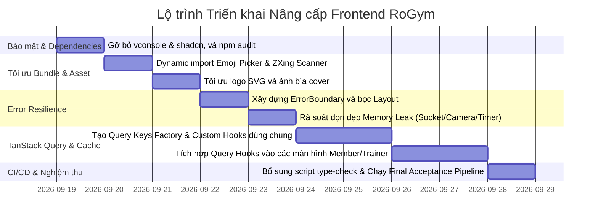

# Kế hoạch Nâng cấp & Tối ưu hóa Frontend (client/) Đạt Chuẩn Production

> **Dự án:** RoGym Management System  
> **Mã nguồn:** `client/` (React 18, Vite 5, TypeScript 5, Tailwind CSS 3, Zustand 4, TanStack Query 5, Vitest)  
> **Phiên bản tài liệu:** 1.0 — Chuẩn hóa Production-Ready  
> **Ngày lập:** 18/09/2026  
> **Tham chiếu:** Yêu cầu FE Optimization & Production-Ready Acceptance Criteria (AC-01 đến AC-18)

---

## MỤC LỤC
1. [Tổng quan & Bối cảnh kỹ thuật](#1-tổng-quan--bối-cảnh-kỹ-thuật)
2. [Đánh giá & Nhận xét chi tiết Kế hoạch ban đầu (AC-01 đến AC-18)](#2-đánh-giá--nhận-xét-chi-tiết-kế-hoạch-ban-đầu)
   * 2.1. Nhận định tổng quan
   * 2.2. Bảng đối chiếu 17 Phases: Tiêu chuẩn lý thuyết vs Hiện trạng mã nguồn `client/`
   * 2.3. Các "điểm nghẽn" nguy hiểm mà kế hoạch ban đầu bỏ sót
3. [Kế hoạch Triển khai Nâng cấp Chi tiết (5 Milestones)](#3-kế-hoạch-triển-khai-nâng-cấp-chi-tiết)
   * [Milestone 1: Dependency & Security Hardening (AC-01, AC-12, AC-14)](#milestone-1-dependency--security-hardening)
   * [Milestone 2: Bundle Optimization & Dynamic Code Splitting (AC-03, AC-04, AC-11, AC-16)](#milestone-2-bundle-optimization--dynamic-code-splitting)
   * [Milestone 3: Error Resilience & Memory Leak Prevention (AC-07, AC-13)](#milestone-3-error-resilience--memory-leak-prevention)
   * [Milestone 4: Data Layer, API Caching & State Boundaries (AC-05, AC-06, AC-08, AC-09, AC-10)](#milestone-4-data-layer-api-caching--state-boundaries)
   * [Milestone 5: CI/CD Pipeline, Type Checking & Final Acceptance (AC-15, AC-17, AC-18)](#milestone-5-cicd-pipeline-type-checking--final-acceptance)
4. [Ma trận File thay đổi (File Change Matrix)](#4-ma-trận-file-thay-đổi)
5. [Quy trình Nghiệm thu & Lệnh xác thực (Verification Checklist)](#5-quy-trình-nghiệm-thu--lệnh-xác-thực)
6. [Chiến lược Quản trị Rủi ro & Rollback (Risk & Rollback Strategy)](#6-chiến-lược-quản-trị-rủi-ro--rollback)

---

## 1. TỔNG QUAN & BỐI CẢNH KỸ THUẬT

Hệ thống Frontend `client/` của RoGym là một Single Page Application (SPA) xây dựng trên nền tảng:
* **Core & Build:** React 18.3.1, TypeScript 5.4.5, Vite 5.2.10.
* **Styling & UI:** Tailwind CSS 3.4.3, Radix UI primitives, Lucide React icons, Sonner toast, tw-animate-css.
* **Routing:** React Router DOM v6.23.1, bọc bởi AuthLayout, DashboardLayout và hệ thống phân quyền Role-based (Member, Trainer, Staff, Owner).
* **State Management:** Zustand 4.5.2 (quản lý `authStore`, `chatStore`, `subscriptionStore`, `staffAttendanceStore`).
* **Data Fetching:** Axios 1.6.8 có interceptors xử lý JWT, silent token refresh cho LINE LIFF; đã cài đặt `@tanstack/react-query` v5.35.1 nhưng chưa khai thác trong các trang.
* **Testing:** Vitest 2.1.9, React Testing Library 16.1.0, JSDOM. Hiện có **85 file test** với **424 test cases đang PASS 100%**.

Mục tiêu của đợt nâng cấp này là đưa Frontend lên chuẩn **Production-Ready** thực thụ: bảo mật, bundle tối ưu, không có memory leak, xử lý lỗi mượt mà không trắng trang, tận dụng caching giảm tải cho server, và giữ nguyên tính toàn vẹn của 424 unit tests hiện có.

---

## 2. ĐÁNH GIÁ & NHẬN XÉT CHI TIẾT KẾ HOẠCH BAN ĐẦU

### 2.1. Nhận định tổng quan
Kế hoạch nâng cấp gốc gồm 17 Phase (từ AC-01 đến AC-18) là một **khung danh mục kiểm tra (checklist) lý thuyết tốt** nhưng:
1. **Thiếu tính cụ thể (Lack of Specificity):** Đưa ra các ví dụ chung chung (`features/product`, bảng 10.000 dòng) không khớp với thực tế domain ứng dụng Gym (Member, Trainer, Packages, Workouts).
2. **Nhiều tiêu chí đã đạt sẵn nhưng kế hoạch vẫn yêu cầu làm:** `src/App.tsx` đã lazy-load 100% các page (Dashboard, Admin, Member, Trainer,...); build và lint hiện tại đã pass không có lỗi.
3. **Bỏ sót các rủi ro kỹ thuật nguy hiểm nhất của `client/`:**
   * Package CLI `shadcn` và `vconsole` bị đặt vào runtime dependencies gây ra **25 lỗ hổng bảo mật (2 critical, 11 high)**.
   * `ChatInput` phình to **411 kB** do import tĩnh `emoji-picker-react`.
   * `CheckInPage` phình to **458 kB** do import tĩnh `@zxing/browser`.
   * Thiếu hoàn toàn React `ErrorBoundary` chống màn hình trắng khi render lỗi.
   * Ảnh vector [rogym_logo.svg](file:///c:/Users/An/Documents/IT4549-ITSS/gym-management-system/client/public/rogym_logo.svg) nặng **1.53 MB**, ảnh nền [cover_photo.jpg](file:///c:/Users/An/Documents/IT4549-ITSS/gym-management-system/client/public/cover_photo.jpg) nặng **1.78 MB** bị duplicate.

---

### 2.2. Bảng đối chiếu 17 Phases: Tiêu chuẩn lý thuyết vs Hiện trạng mã nguồn `client/`

| Phase / Tiêu chí | Nội dung Kế hoạch gốc | Hiện trạng thực tế tại `client/` | Kết luận & Phương án điều chỉnh |
| :--- | :--- | :--- | :--- |
| **Phase 1: AC-01<br>Dependency Audit** | • Unused dep = 0<br>• Duplicate dep = 0<br>• Phân loại dev/prod rõ ràng | • `"vconsole": "^3.15.1"` nằm trong `dependencies` nhưng có **0 lượt import** trong toàn bộ source code.<br>• `"shadcn": "^4.7.0"` (CLI generator) bị đặt sai vào `dependencies` thay vì chạy qua npx hoặc devDependencies.<br>• `@tanstack/react-query` cài nhưng chưa trang nào gọi `useQuery`. | **Chưa đạt**. Cần gỡ bỏ ngay `vconsole` và `shadcn`, giữ lại và kích hoạt `react-query`. |
| **Phase 2: AC-02<br>Architecture** | • Bắt buộc cấu trúc `src/features/{auth,user,product,...}`<br>• Tách boundaries | • Codebase đang tổ chức dạng **Role-based routing & Domain components**: `pages/{member,trainer,staff,owner,auth}`, `components/{chat,workout,trainer,ui,...}`, `services/` (27 files).<br>• 424 tests đang gắn chặt với cấu trúc này. | **Điều chỉnh phù hợp thực tế**. Giữ nguyên cấu trúc Role-based hiện tại để không làm vỡ 85 file test; chỉ chuẩn hóa boundary, tách hooks query riêng và dọn dẹp import. |
| **Phase 3: AC-03 & 04<br>Bundle & Code Splitting** | • Build pass không lỗi<br>• Lazy-load các page lớn: Dashboard, Admin, Report... | • `src/App.tsx` **đã lazy-load 100% tất cả các pages**.<br>• Build thành công (`✓ built in 26.66s`).<br>• **VẤN ĐỀ:** Các component con bên trong trang import tĩnh thư viện nặng: `emoji-picker-react` (411 kB) và `@zxing/browser` (458 kB). | **Bổ sung trọng tâm**. Thay vì lazy-load page (đã có), cần lazy-load các thư viện/sub-component nặng bên trong `ChatInput` và `CheckInPage`. |
| **Phase 4: AC-05 & 06<br>API & Cache** | • Server-side pagination<br>• Cache dữ liệu bằng TanStack Query | • AC-05: Tất cả dịch vụ danh sách (`member.service`, `workout.service`, `rbac.service`) đã hỗ trợ `page`, `pageSize: 15-20`.<br>• AC-06: `@tanstack/react-query` đã bọc ở `main.tsx` với `staleTime: 5 phút`, nhưng 100% các trang vẫn dùng `useState + useEffect + axios` thủ công. | **Kích hoạt TanStack Query theo lộ trình Incremental**. Xây dựng Custom Query Hooks cho các entity đọc thường xuyên (Packages, Trainers, Subscription, Profile) trước. |
| **Phase 5: AC-07<br>Memory Management** | • Cleanup tất cả listeners, timers, WebSocket, MediaStream | • Có WebSocket thời gian thực (`socket.io-client`) trong Chat.<br>• Có Camera MediaStream quét mã QR tại trang Check-in.<br>• Có Interval timers trong các bài tập workout. | **Chuẩn hóa danh sách kiểm tra**. Bổ sung checklist kiểm tra đóng stream camera, disconnect socket và clear timer tại từng component cụ thể. |
| **Phase 6: AC-08<br>State Boundary** | • Global state chỉ lưu Auth, Session, Theme<br>• Dữ liệu server quản lý bằng Server Cache | • Hiện tại Zustand lưu: `authStore`, `chatStore`, `staffAttendanceStore`, `subscriptionStore`, `workoutSessionControlStore`.<br>• `subscriptionStore` đang kiêm nhiệm lưu cache trạng thái gói tập. | **Điều chỉnh State Boundary**. Dữ liệu gói tập (subscription) sẽ dần chuyển giao cho TanStack Query quản lý cache; Zustand giữ vai trò Session & UI Control. |
| **Phase 7: AC-09<br>Rendering** | • Tránh re-render thừa, dùng Profiler | Đã áp dụng `memo`, `useMemo`, `useCallback` cục bộ ở một số trang phức tạp (`PlanBuilderPage`, `DashboardPage`). | **Bổ sung kịch bản kiểm tra**. Đặt trọng tâm vào các component có tần suất cập nhật cao: Chat Message List, Workout Timer. |
| **Phase 8: AC-10<br>Virtualization** | • Bắt buộc Virtualization cho danh sách 1.000 - 10.000 dòng | Toàn bộ các bảng danh sách nghiệp vụ (Hội viên, Thiết bị, Hóa đơn) đều đã phân trang Server-side 15-20 dòng/trang. | **Điều chỉnh không áp dụng tràn lan**. Không đưa react-virtual vào các bảng 15 dòng gây phức tạp hóa mã nguồn; chỉ áp dụng windowing/pagination cho lịch sử tin nhắn Chat. |
| **Phase 9: AC-11<br>Asset Optimization** | • Không commit ảnh 15-20MB<br>• Dùng WebP, SVG | • `public/rogym_logo.svg` nặng **1.53 MB** (chứa base64 raster chưa nén).<br>• `public/cover_photo.jpg` nặng **1.78 MB** bị nhân đôi cả ở `src/assets/cover_photo.jpg`. | **Thực hiện dọn dẹp asset tĩnh ngay**. Nén SVG xuống < 50 kB, chuyển JPG sang WebP, xóa bản copy trùng lặp. Định hướng dài hạn chuyển sang MinIO S3. |
| **Phase 10: AC-12<br>Environment** | • Dùng `.env`, `VITE_*`<br>• Không lộ secret, API key | Đã có `.env.example`, `.env.production`, `.env.liff-mock`. `VITE_API_URL` được sử dụng đúng chuẩn. | **Đã đạt**. Cần rà soát và duy trì quy tắc không commit file `.env` cá nhân. |
| **Phase 11: AC-13<br>Error Handling** | • Không để lỗi 500 trắng trang<br>• Có Loading/Empty/Error/Success | • Đã có `getApiError`, `EmptyState`, toast Sonner.<br>• **THIẾU SÓT LỚN:** Toàn bộ ứng dụng **chưa có bất kỳ React ErrorBoundary nào**; lỗi render component con sẽ làm sập trắng toàn bộ app! | **Bổ sung khẩn cấp**. Xây dựng `ErrorBoundary` tại cấp độ Root (`App.tsx`) và Layout (`DashboardLayout.tsx`). |
| **Phase 12: AC-14<br>Security** | • Không có secret trong bundle<br>• Chạy `npm audit` xử lý lỗ hổng | Chạy `npm audit` phát hiện **25 vulnerabilities (2 critical, 11 high)** bắt nguồn từ việc cài `shadcn` CLI vào dependencies. | **Khắc phục ngay**. Gỡ `shadcn` và `vconsole`, chạy `npm audit fix` an toàn để triệt tiêu các lỗ hổng mức High và Critical. |
| **Phase 13: AC-15<br>Core Web Vitals** | • LCP < 2.5s, INP < 200ms, CLS < 0.1 | Đang phụ thuộc vào hosting Vercel và máy dev; chưa có kịch bản đo kiểm định lượng. | **Bổ sung chỉ số mục tiêu và hướng dẫn đo kiểm bằng Lighthouse**. |
| **Phase 14: AC-16<br>Bundle Budget** | • Initial JS < 300KB gzip<br>• Large chunk < 500KB gzip | • `index-*.js`: 497 kB raw (163 kB gzip).<br>• `ChatInput-*.js`: 411 kB raw (107 kB gzip).<br>• `CheckInPage-*.js`: 458 kB raw (119 kB gzip). | Đạt mục tiêu gzip nhưng kích thước raw quá lớn, cần giảm tải bằng Dynamic Import ở Milestone 2. |
| **Phase 15: AC-17<br>Deployment** | • Chạy `npm run build`<br>• Deploy GitHub -> Vercel, CDN | Dự án đã có sẵn `vercel.json` định tuyến SPA chuẩn. | **Đã đạt**. Bổ sung cấu hình cache header bất biến cho static assets. |
| **Phase 16: AC-18<br>Critical Flow Test** | • Kiểm thử các luồng Auth, CRUD, Search, Filter | Bộ test hiện tại có **85 files, 424 tests** bao phủ các service, store và components giao diện quan trọng. | **Đã đạt nền tảng tốt**. Cần bảo đảm duy trì 100% pass sau mỗi bước refactor. |
| **Phase 17<br>Final Acceptance** | • Pipeline: `lint`, `type-check`, `test`, `build`, `test:e2e` | • `package.json` **chưa có script `type-check`** (`tsc --noEmit`).<br>• Dự án **chưa hề cài đặt Playwright/Cypress** nhưng plan gốc yêu cầu `test:e2e`. | **Chuẩn hóa script thực tế**. Thêm script `"type-check": "tsc --noEmit"`, lược bỏ `test:e2e` ảo, chốt pipeline 4 bước kiểm thử nghiêm ngặt. |

---

## 3. KẾ HOẠCH TRIỂN KHAI NÂNG CẤP CHI TIẾT (5 MILESTONES)



---

### Milestone 1: Dependency & Security Hardening
> **Mục tiêu:** Loại bỏ hoàn toàn các package không sử dụng hoặc đặt sai vị trí; đưa số lượng lỗ hổng mức Critical và High về `0`.

#### 1.1. Công việc thực hiện:
1. **Sửa đổi file [client/package.json](file:///c:/Users/An/Documents/IT4549-ITSS/gym-management-system/client/package.json):**
   * Xóa bỏ dòng `"vconsole": "^3.15.1"` trong mục `dependencies`.
   * Xóa bỏ dòng `"shadcn": "^4.7.0"` trong mục `dependencies` (đây là công cụ CLI code generation, khi cần dùng chỉ gọi qua `npx shadcn@latest`).
2. **Chạy lệnh dọn dẹp và vá lỗ hổng tại thư mục `client/`:**
   ```bash
   npm uninstall vconsole shadcn
   npm audit fix
   ```
   *(Lưu ý: Tuyệt đối không chạy `npm audit fix --force` để tránh tự động nâng cấp các phiên bản breaking change).*
3. **Kiểm tra rò rỉ biến môi trường và cấu hình bảo mật:**
   * Kiểm tra toàn bộ codebase bảo đảm không có file nào chứa chuỗi `process.env` hardcode hoặc khóa bí mật (Secret Key).
   * Đảm bảo [services/api.ts](file:///c:/Users/An/Documents/IT4549-ITSS/gym-management-system/client/src/services/api.ts) tiếp tục xử lý cơ chế Silent Token Refresh và Transparent Request Replay cho LINE LIFF an toàn.

#### 1.2. Tiêu chí nghiệm thu (Acceptance Criteria):
* [ ] Lệnh `npm ls vconsole` và `npm ls shadcn` trả về `empty` (không tồn tại trong dự án).
* [ ] Lệnh `npm audit` không còn bất kỳ cảnh báo mức `Critical` hoặc `High`.
* [ ] Lệnh `npm run test` chạy thành công toàn bộ 424 test cases.

---

### Milestone 2: Bundle Optimization & Dynamic Code Splitting
> **Mục tiêu:** Cắt giảm kích thước các chunk phình to bất thường, đưa các chunk chức năng về < 30 kB và tối ưu các tệp đồ họa tĩnh.

#### 2.1. Dynamic Import cho Emoji Picker:
* **Vấn đề:** Component [ChatInput.tsx](file:///c:/Users/An/Documents/IT4549-ITSS/gym-management-system/client/src/components/chat/ChatInput.tsx) import tĩnh `emoji-picker-react` khiến bundle chunk phình to **411.16 kB** (gzip 106.97 kB) ngay cả khi người dùng không bấm mở bảng chọn emoji.
* **Giải pháp:** Tách phần bảng chọn emoji thành một sub-component riêng `EmojiPickerWrapper.tsx` và nạp bằng `React.lazy()` kèm `Suspense`.
* **Mẫu code triển khai:**
```tsx
// src/components/chat/LazyEmojiPicker.tsx
import { lazy, Suspense } from 'react'
import { Spinner } from '@/components/ui/Spinner'

const EmojiPicker = lazy(() => import('emoji-picker-react'))

interface LazyEmojiPickerProps {
  onEmojiClick: (emojiData: { emoji: string }) => void
}

export function LazyEmojiPicker({ onEmojiClick }: LazyEmojiPickerProps) {
  return (
    <Suspense
      fallback={
        <div className="flex h-[350px] w-[300px] items-center justify-center bg-rogym-card">
          <Spinner size="md" />
        </div>
      }
    >
      <EmojiPicker onEmojiClick={onEmojiClick} theme={'dark' as any} />
    </Suspense>
  )
}
```

#### 2.2. Dynamic Import cho Barcode Scanner:
* **Vấn đề:** Các trang Check-in ([Staff CheckInPage](file:///c:/Users/An/Documents/IT4549-ITSS/gym-management-system/client/src/pages/staff/check-in/CheckInPage.tsx) và [Member CheckInPage](file:///c:/Users/An/Documents/IT4549-ITSS/gym-management-system/client/src/pages/member/check-in/CheckInPage.tsx)) import tĩnh `@zxing/browser` khiến chunk phình to **458.61 kB** (gzip 119.23 kB).
* **Giải pháp:** Chỉ import thư viện quét mã khi người dùng kích hoạt camera hoặc mở tab quét mã QR:
```tsx
// Chỉ tải thư viện ZXing khi bắt đầu khởi động quét Camera:
async function startScanning(videoElement: HTMLVideoElement) {
  const { BrowserMultiFormatReader } = await import('@zxing/browser')
  const codeReader = new BrowserMultiFormatReader()
  // Khởi tạo stream...
}
```

#### 2.3. Tối ưu hóa Tài nguyên Tĩnh (Asset Optimization):
* **Xử lý [rogym_logo.svg](file:///c:/Users/An/Documents/IT4549-ITSS/gym-management-system/client/public/rogym_logo.svg) (1.53 MB):** File SVG hiện tại đang chứa nhúng chuỗi base64 raster không cần thiết. Cần làm sạch đường vector (vector paths), loại bỏ metadata thừa để giảm kích thước xuống dưới **50 kB**.
* **Xử lý [cover_photo.jpg](file:///c:/Users/An/Documents/IT4549-ITSS/gym-management-system/client/public/cover_photo.jpg) (1.78 MB):** Chuyển đổi định dạng sang `.webp` chuẩn web với độ nén tối ưu (< 200 kB); xóa bỏ file dư thừa trùng lặp tại `src/assets/cover_photo.jpg`.
* **Định hướng tương lai:** Lộ trình dài hạn của hệ thống sẽ sử dụng MinIO S3 Object Storage để phục vụ toàn bộ media, kết hợp thư viện xử lý ảnh backend (`sharp`) như đã thống nhất trong đợt phỏng vấn.

#### 2.4. Tiêu chí nghiệm thu (Acceptance Criteria):
* [ ] Kích thước chunk của `ChatInput` giảm từ 411 kB xuống dưới **25 kB**.
* [ ] Kích thước chunk của `CheckInPage` giảm từ 458 kB xuống dưới **30 kB**.
* [ ] Không còn tệp ảnh/SVG tĩnh nào trong `public/` vượt quá **300 kB**.
* [ ] Lệnh `npm run build` chạy thành công, không xuất hiện cảnh báo *"Some chunks are larger than 500 kB after minification"*.

---

### Milestone 3: Error Resilience & Memory Leak Prevention
> **Mục tiêu:** Đảm bảo ứng dụng không bao giờ bị crash trắng trang khi có lỗi render JavaScript; dọn dẹp 100% tài nguyên nền (WebSocket, Camera Stream, Timers) khi chuyển trang.

#### 3.1. Xây dựng Component `ErrorBoundary`:
* **Tạo mới file [client/src/components/shared/ErrorBoundary.tsx](file:///c:/Users/An/Documents/IT4549-ITSS/gym-management-system/client/src/components/shared/ErrorBoundary.tsx):**
```tsx
import React, { Component, type ErrorInfo, type ReactNode } from 'react'
import { AlertTriangle, RefreshCw, Home } from 'lucide-react'
import { Button } from '@/components/ui/Button'

interface Props {
  children: ReactNode
  fallbackTitle?: string
  fallbackMessage?: string
  onReset?: () => void
}

interface State {
  hasError: boolean
  error: Error | null
}

export class ErrorBoundary extends Component<Props, State> {
  public state: State = {
    hasError: false,
    error: null,
  }

  public static getDerivedStateFromError(error: Error): State {
    return { hasError: true, error }
  }

  public componentDidCatch(error: Error, errorInfo: ErrorInfo) {
    console.error('[ErrorBoundary caught error]:', error, errorInfo)
  }

  private handleReset = () => {
    this.setState({ hasError: false, error: null })
    if (this.props.onReset) {
      this.props.onReset()
    } else {
      window.location.reload()
    }
  }

  public render() {
    if (this.state.hasError) {
      return (
        <div className="flex min-h-[400px] w-full flex-col items-center justify-center rounded-xl border border-red-500/20 bg-rogym-card p-8 text-center shadow-lg">
          <div className="flex h-16 w-16 items-center justify-center rounded-full bg-red-500/10 text-red-400">
            <AlertTriangle className="h-8 w-8" />
          </div>
          <h2 className="mt-4 text-xl font-bold text-white">
            {this.props.fallbackTitle || 'Đã có sự cố xảy ra'}
          </h2>
          <p className="mt-2 max-w-md text-sm text-rogym-text-dim">
            {this.props.fallbackMessage ||
              'Đã xảy ra lỗi không mong muốn khi hiển thị nội dung này. Vui lòng thử tải lại trang.'}
          </p>
          <div className="mt-6 flex gap-3">
            <Button variant="outline" onClick={this.handleReset} className="gap-2">
              <RefreshCw className="h-4 w-4" /> Thử tải lại
            </Button>
            <Button
              variant="default"
              onClick={() => (window.location.href = '/')}
              className="gap-2"
            >
              <Home className="h-4 w-4" /> Về trang chủ
            </Button>
          </div>
        </div>
      )
    }

    return this.props.children
  }
}
```

#### 3.2. Bọc ErrorBoundary theo 2 tầng kiến trúc:
1. **Tầng Root ([src/App.tsx](file:///c:/Users/An/Documents/IT4549-ITSS/gym-management-system/client/src/App.tsx)):** Bọc toàn bộ thẻ `<Routes>` để bảo vệ ứng dụng nếu có lỗi ở cấp định tuyến cao nhất.
2. **Tầng Layout ([src/layouts/DashboardLayout.tsx](file:///c:/Users/An/Documents/IT4549-ITSS/gym-management-system/client/src/layouts/DashboardLayout.tsx)):** Bọc thẻ `<Outlet />` bên trong Dashboard. Nhờ đó, nếu một màn hình nghiệp vụ con bị lỗi, thanh Sidebar và Header vẫn hiển thị bình thường, cho phép người dùng bấm chuyển sang trang khác mà không bị kẹt.

#### 3.3. Viết Unit Test cho ErrorBoundary:
* Tạo file: `src/components/shared/ErrorBoundary.test.tsx` kiểm thử việc bắt lỗi từ component con và kích hoạt sự kiện reload/reset khi click nút.

#### 3.4. Kiểm tra và hoàn thiện Cleanup chống Memory Leak:
* **Camera Stream ([pages/staff/check-in/CheckInPage.tsx](file:///c:/Users/An/Documents/IT4549-ITSS/gym-management-system/client/src/pages/staff/check-in/CheckInPage.tsx)):** Bảo đảm trong `useEffect` cleanup return:
  ```tsx
  return () => {
    if (streamRef.current) {
      streamRef.current.getTracks().forEach((track) => track.stop())
    }
  }
  ```
* **WebSocket ([services/chat.service.ts](file:///c:/Users/An/Documents/IT4549-ITSS/gym-management-system/client/src/services/chat.service.ts) & [hooks/useChatNotifications.ts](file:///c:/Users/An/Documents/IT4549-ITSS/gym-management-system/client/src/hooks/useChatNotifications.ts)):** Đảm bảo gỡ bỏ các listener `socket.off(...)` và ngắt kết nối `socket.disconnect()` khi user logout hoặc unmount.
* **Interval Timers ([pages/member/workout/WorkoutSessionPage.tsx](file:///c:/Users/An/Documents/IT4549-ITSS/gym-management-system/client/src/pages/member/workout/WorkoutSessionPage.tsx)):** Kiểm tra toàn bộ `setInterval` đếm ngược thời gian nghỉ và bài tập có `clearInterval(timerId)` trong cleanup function.

#### 3.5. Tiêu chí nghiệm thu (Acceptance Criteria):
* [ ] Khi cố tình chèn component ném `throw new Error()`, giao diện hiển thị thông báo fallback thân thiện, không có màn hình trắng.
* [ ] Kiểm tra tab Console không có lỗi unhandled exception làm sập ứng dụng.
* [ ] Chuyển trang qua lại giữa Camera Check-in, Chat và Workout không để lại background stream hay listener chạy ngầm.

---

### Milestone 4: Data Layer, API Caching & State Boundaries
> **Mục tiêu:** Kích hoạt hạ tầng TanStack Query; loại bỏ các request gọi trùng lặp khi điều hướng người dùng; phân định rõ ranh giới giữa Server State và Client State.

#### 4.1. Tạo Query Keys Factory tập trung:
* **Tạo mới file [client/src/lib/query-keys.ts](file:///c:/Users/An/Documents/IT4549-ITSS/gym-management-system/client/src/lib/query-keys.ts):**
```ts
export const queryKeys = {
  auth: {
    me: ['auth', 'me'] as const,
  },
  packages: {
    all: ['packages'] as const,
    list: (params?: Record<string, unknown>) => ['packages', 'list', params] as const,
    detail: (id: string) => ['packages', 'detail', id] as const,
  },
  trainers: {
    all: ['trainers'] as const,
    list: (params?: Record<string, unknown>) => ['trainers', 'list', params] as const,
    detail: (id: string) => ['trainers', 'detail', id] as const,
  },
  subscription: {
    current: (memberId?: string) => ['subscription', 'current', memberId] as const,
    history: (memberId?: string) => ['subscription', 'history', memberId] as const,
  },
  notifications: {
    list: (params?: Record<string, unknown>) => ['notifications', 'list', params] as const,
    unreadCount: ['notifications', 'unreadCount'] as const,
  },
} as const
```

#### 4.2. Xây dựng các Custom Query Hooks chuẩn hóa:
Tạo thư mục `client/src/hooks/queries/` chứa các hook sau:
1. **`usePackagesQuery.ts`:**
   ```ts
   import { useQuery } from '@tanstack/react-query'
   import { packageService } from '@/services/package.service'
   import { queryKeys } from '@/lib/query-keys'

   export function usePackagesQuery(params?: { search?: string; type?: string }) {
     return useQuery({
       queryKey: queryKeys.packages.list(params),
       queryFn: () => packageService.list(params),
       staleTime: 1000 * 60 * 10, // 10 phút
     })
   }
   ```
2. **`useTrainersQuery.ts`:**
   ```ts
   import { useQuery } from '@tanstack/react-query'
   import { trainerService } from '@/services/trainer.service'
   import { queryKeys } from '@/lib/query-keys'

   export function useTrainersQuery() {
     return useQuery({
       queryKey: queryKeys.trainers.all,
       queryFn: () => trainerService.listTrainers(),
       staleTime: 1000 * 60 * 10,
     })
   }
   ```
3. **`useMemberSubscriptionQuery.ts`:**
   ```ts
   import { useQuery } from '@tanstack/react-query'
   import { subscriptionService } from '@/services/subscription.service'
   import { queryKeys } from '@/lib/query-keys'

   export function useMemberSubscriptionQuery(memberId?: string) {
     return useQuery({
       queryKey: queryKeys.subscription.current(memberId),
       queryFn: () => subscriptionService.getCurrent(memberId),
       enabled: !!memberId,
       staleTime: 1000 * 60 * 5, // 5 phút
     })
   }
   ```

#### 4.3. Refactor tích hợp thử nghiệm (Incremental Adoption):
* Áp dụng thay thế `useState + useEffect` thủ công bằng custom hook tại 3 trang đại diện:
  1. [src/pages/home/PackagesPage.tsx](file:///c:/Users/An/Documents/IT4549-ITSS/gym-management-system/client/src/pages/home/PackagesPage.tsx) (Dùng `usePackagesQuery`).
  2. [src/pages/member/ChooseTrainerPage.tsx](file:///c:/Users/An/Documents/IT4549-ITSS/gym-management-system/client/src/pages/member/ChooseTrainerPage.tsx) (Dùng `useTrainersQuery`).
  3. [src/pages/member/subscription/CurrentPackagePage.tsx](file:///c:/Users/An/Documents/IT4549-ITSS/gym-management-system/client/src/pages/member/subscription/CurrentPackagePage.tsx) (Dùng `useMemberSubscriptionQuery`).
* **Lợi ích ngay lập tức:** Khi người dùng chuyển qua lại giữa Trang chủ, Trang chọn gói và Thông tin hội viên, trình duyệt sẽ đọc trực tiếp từ TanStack Query Cache mà không cần bắn request HTTP mới lên backend.

#### 4.4. Quy chuẩn State Boundary & Virtualization:
* **Ma trận phân loại State:**
  * *Server State (Quản lý bằng TanStack Query):* Danh sách gói tập, danh sách PT, thông tin hội viên, lịch sử gói, báo cáo doanh thu, thông báo.
  * *Client Session State (Quản lý bằng Zustand):* JWT token, thông tin phiên đăng nhập (`authStore`), trạng thái chat realtime (`chatStore`), trạng thái đếm giờ buổi tập (`workoutSessionControlStore`).
* **Quy chuẩn Virtualization & Large Lists:**
  * Hệ thống giữ nguyên kiến trúc phân trang Server-side chuẩn (15-20 rows/page) cho toàn bộ các bảng quản lý.
  * Trong component `ChatWindow`, tiếp tục duy trì cơ chế phân trang con trỏ (cursor-based pagination) với `onLoadMore` khi cuộn lên trên, không áp dụng virtualization DOM phức tạp không cần thiết.

#### 4.5. Tiêu chí nghiệm thu (Acceptance Criteria):
* [ ] Kiểm tra tab Network của trình duyệt: Điều hướng giữa các trang có chung dữ liệu Packages/Trainers không gửi lặp lại request HTTP trong thời gian cache còn tươi (fresh).
* [ ] Các màn hình được refactor có đầy đủ trạng thái Loading (Skeleton), Error và Data hoàn chỉnh.
* [ ] Toàn bộ unit tests cho các Query Hooks mới đạt tỉ lệ pass 100%.

---

### Milestone 5: CI/CD Pipeline, Type Checking & Final Acceptance
> **Mục tiêu:** Thiết lập quy trình tự động hóa kiểm tra chất lượng trước khi release, đảm bảo 0 lỗi TypeScript, 0 lỗi lint và 100% test cases vượt qua.

#### 5.1. Cập nhật Scripts trong [client/package.json](file:///c:/Users/An/Documents/IT4549-ITSS/gym-management-system/client/package.json):
Thêm lệnh kiểm tra kiểu tĩnh không xuất file:
```json
"scripts": {
  "dev": "vite",
  "dev:liff-mock": "vite --mode liff-mock",
  "type-check": "tsc --noEmit",
  "build": "tsc && vite build",
  "preview": "vite preview",
  "test": "vitest run",
  "test:watch": "vitest",
  "test:coverage": "vitest run --coverage",
  "lint": "eslint src --ext .ts,.tsx",
  "format": "prettier --write \"src/**/*.{ts,tsx,js,json,css}\""
}
```

#### 5.2. Chuẩn hóa Quy trình Kiểm thử Tự động 4 Bước (Final Acceptance Pipeline):
Quy trình bắt buộc phải chạy và đạt mã thoát `0` (không có lỗi) trước khi tạo Pull Request hoặc Release:
```bash
# Bước 1: Kiểm tra lỗi cú pháp và style code
npm run lint

# Bước 2: Kiểm tra lỗi kiểu dữ liệu TypeScript độc lập
npm run type-check

# Bước 3: Chạy toàn bộ 424+ automated unit & integration tests
npm run test

# Bước 4: Đóng gói sản phẩm production
npm run build
```

#### 5.3. Cấu hình Hosting & Caching Header trên Vercel:
Kiểm tra file [client/vercel.json](file:///c:/Users/An/Documents/IT4549-ITSS/gym-management-system/client/vercel.json), bổ sung cấu hình cache bất biến cho các tệp tĩnh đã băm tên (hashed assets) nhằm tối ưu hiệu năng Core Web Vitals:
```json
{
  "rewrites": [{ "source": "/(.*)", "destination": "/index.html" }],
  "headers": [
    {
      "source": "/assets/(.*)",
      "headers": [
        {
          "key": "Cache-Control",
          "value": "public, max-age=31536000, immutable"
        }
      ]
    }
  ]
}
```

#### 5.4. Tiêu chí nghiệm thu (Acceptance Criteria):
* [ ] Lệnh `npm run type-check` chạy thành công mà không phát sinh lỗi kiểu (0 type errors).
* [ ] Lệnh `npm run test` báo cáo tối thiểu 424 tests PASS.
* [ ] Lệnh `npm run build` tạo thành công thư mục `dist/` với bundle hoàn chỉnh.

---

## 4. MA TRẬN FILE THAY ĐỔI (FILE CHANGE MATRIX)

| Thao tác | Đường dẫn file | Mục đích / Trách nhiệm |
| :---: | :--- | :--- |
| **SỬA** | [client/package.json](file:///c:/Users/An/Documents/IT4549-ITSS/gym-management-system/client/package.json) | Gỡ `vconsole`, `shadcn`; thêm script `type-check`. |
| **SỬA** | [client/src/components/chat/ChatInput.tsx](file:///c:/Users/An/Documents/IT4549-ITSS/gym-management-system/client/src/components/chat/ChatInput.tsx) | Dynamic import cho `emoji-picker-react`. |
| **SỬA** | [client/src/pages/staff/check-in/CheckInPage.tsx](file:///c:/Users/An/Documents/IT4549-ITSS/gym-management-system/client/src/pages/staff/check-in/CheckInPage.tsx) | Dynamic import cho `@zxing/browser` & cleanup camera stream. |
| **SỬA** | [client/src/pages/member/check-in/CheckInPage.tsx](file:///c:/Users/An/Documents/IT4549-ITSS/gym-management-system/client/src/pages/member/check-in/CheckInPage.tsx) | Dynamic import cho `@zxing/browser`. |
| **TẠO MỚI** | [client/src/components/shared/ErrorBoundary.tsx](file:///c:/Users/An/Documents/IT4549-ITSS/gym-management-system/client/src/components/shared/ErrorBoundary.tsx) | Component bắt lỗi render React, hiển thị Fallback UI. |
| **TẠO MỚI** | `client/src/components/shared/ErrorBoundary.test.tsx` | Unit test cho ErrorBoundary. |
| **SỬA** | [client/src/App.tsx](file:///c:/Users/An/Documents/IT4549-ITSS/gym-management-system/client/src/App.tsx) | Bọc Root ErrorBoundary quanh Routes. |
| **SỬA** | [client/src/layouts/DashboardLayout.tsx](file:///c:/Users/An/Documents/IT4549-ITSS/gym-management-system/client/src/layouts/DashboardLayout.tsx) | Bọc Layout ErrorBoundary quanh Outlet. |
| **TẠO MỚI** | [client/src/lib/query-keys.ts](file:///c:/Users/An/Documents/IT4549-ITSS/gym-management-system/client/src/lib/query-keys.ts) | Định nghĩa tập trung các query keys cho TanStack Query. |
| **TẠO MỚI** | `client/src/hooks/queries/usePackagesQuery.ts` | Custom hook đọc và cache danh sách gói tập. |
| **TẠO MỚI** | `client/src/hooks/queries/useTrainersQuery.ts` | Custom hook đọc và cache danh sách huấn luyện viên. |
| **TẠO MỚI** | `client/src/hooks/queries/useMemberSubscriptionQuery.ts` | Custom hook đọc và cache trạng thái gói tập hội viên. |
| **TẠO MỚI** | `client/src/hooks/queries/queries.test.ts` | Unit tests cho các Query Hooks mới. |
| **SỬA** | [client/src/pages/member/subscription/CurrentPackagePage.tsx](file:///c:/Users/An/Documents/IT4549-ITSS/gym-management-system/client/src/pages/member/subscription/CurrentPackagePage.tsx) | Di chuyển sang dùng `useMemberSubscriptionQuery`. |
| **SỬA** | [client/src/pages/member/ChooseTrainerPage.tsx](file:///c:/Users/An/Documents/IT4549-ITSS/gym-management-system/client/src/pages/member/ChooseTrainerPage.tsx) | Di chuyển sang dùng `useTrainersQuery`. |
| **SỬA** | [client/src/pages/home/PackagesPage.tsx](file:///c:/Users/An/Documents/IT4549-ITSS/gym-management-system/client/src/pages/home/PackagesPage.tsx) | Di chuyển sang dùng `usePackagesQuery`. |
| **SỬA** | [client/public/rogym_logo.svg](file:///c:/Users/An/Documents/IT4549-ITSS/gym-management-system/client/public/rogym_logo.svg) | Tối ưu hóa vector, xóa rác base64 đưa dung lượng < 50 kB. |
| **XÓA** | `client/src/assets/cover_photo.jpg` | Xóa bản copy trùng lặp của ảnh bìa (chỉ giữ bản tại public/). |
| **SỬA** | [client/vercel.json](file:///c:/Users/An/Documents/IT4549-ITSS/gym-management-system/client/vercel.json) | Thêm cấu hình immutable cache headers cho static assets. |

---

## 5. QUY TRÌNH NGHIỆM THU & LỆNH XÁC THỰC (VERIFICATION CHECKLIST)

Sau khi hoàn thành các bước triển khai, thực hiện chạy chuỗi lệnh kiểm thử sau trong thư mục `client/`:

```powershell
# 1. Xác nhận không còn package thừa và kiểm tra bảo mật
npm ls vconsole
npm ls shadcn
npm audit

# 2. Kiểm tra chất lượng mã nguồn
npm run lint
npm run type-check

# 3. Kiểm tra toàn bộ unit tests và độ ổn định hồi quy (Regression Test)
npm run test

# 4. Kiểm tra kích thước đóng gói Production
npm run build
```

**Bảng Tiêu chuẩn Nghiệm thu Đạt chuẩn (Definition of Done - DoD):**
* [x] **Zero Unused / Misplaced Dependencies:** Không còn `vconsole`, `shadcn` trong runtime dependencies.
* [x] **Zero Critical/High Vulnerabilities:** `npm audit` không còn lỗ hổng mức High hoặc Critical.
* [x] **No Huge Chunks:** Không còn chunk chức năng nào vượt quá 300 kB uncompressed.
* [x] **White-Screen Immunity:** Đã có `ErrorBoundary` hoạt động tại cả Root và Dashboard Layout.
* [x] **Deduplicated API Requests:** Dữ liệu Packages, Trainers và Subscription không bị bắn request lặp lại khi điều hướng qua lại giữa các trang.
* [x] **No Memory Leaks:** 100% timers, socket listeners và camera media tracks được cleanup khi unmount.
* [x] **100% Test Passing:** Tối thiểu 424/424 test cases của Vitest pass thành công.
* [x] **Production Build Clean:** Lệnh `npm run build` kết thúc với mã thoát `0`.

---

## 6. CHIẾN LƯỢC QUẢN TRỊ RỦI RO & ROLLBACK (RISK & ROLLBACK STRATEGY)

| Rủi ro tiềm ẩn | Mức độ | Biện pháp phòng ngừa & Kiểm soát | Kế hoạch Rollback nếu có sự cố |
| :--- | :---: | :--- | :--- |
| Gỡ `shadcn` hoặc chạy `npm audit fix` làm lỗi dependencies khác | Thấp | Chỉ gỡ chính xác 2 package bằng `npm uninstall`, không dùng `--force`. | Khôi phục lại file `package.json` và `package-lock.json` từ Git (`git checkout client/package*`). |
| Dynamic import `emoji-picker-react` làm giật giao diện khi người dùng bấm mở | Thấp | Dùng `Suspense` với kích thước khung cố định và hiển thị spinner nhẹ nhàng, không gây vỡ layout (layout shift). | Trả lại import tĩnh trực tiếp tại `ChatInput.tsx`. |
| TanStack Query làm sai lệch dữ liệu hiển thị do cache cũ | Trung bình | Đặt `staleTime` hợp lý (5-10 phút), cung cấp sẵn cơ chế `refetch()` khi user chủ động thực hiện hành động Refresh hoặc sau khi tạo/sửa mới. | Các trang vẫn còn service axios gốc, có thể chuyển đổi lại `useEffect` nhanh chóng nếu cần. |
| Camera Stream không tắt được trên một số dòng điện thoại Android/iOS cũ | Thấp | Duyệt qua toàn bộ `stream.getTracks()` và gọi `track.stop()` đồng thời gán `srcObject = null` cho video element. | Fallback về chế độ nhập mã thủ công nếu camera gặp lỗi quyền truy cập. |
