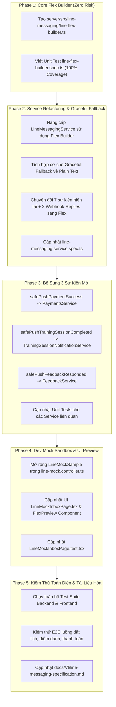

# Kế Hoạch Triển Khai: Nâng Cấp Hệ Thống LINE Flex Message (RoGym)

Tài liệu này xác định chi tiết kế hoạch thực hiện, phân rã công việc thành từng **Phase nhỏ, độc lập, có thể kiểm soát chất lượng và rủi ro**, kèm tiêu chí nghiệm thu (Definition of Done) và phương án bảo vệ tránh ảnh hưởng đến các module khác trong hệ thống RoGym.

---

## 1. Mục Tiêu & Nguyên Tắc Triển Khai

1. **Nâng tầm trải nghiệm người dùng**: Chuyển đổi toàn bộ thông báo LINE từ dạng văn bản đơn giản (Plain Text + Quick Reply) sang **LINE Flex Message (Bubble Card)** trực quan, có nhận diện thương hiệu RoGym, màu sắc trạng thái rõ ràng và nút thao tác sâu (LIFF Deep-link).
2. **Chia nhỏ từng Phase (Phased Rollout)**: Mỗi Phase tập trung vào một phạm vi cụ thể, kiểm thử hoàn tất mới chuyển sang Phase tiếp theo; không làm ồ ạt để dễ dàng cô lập lỗi.
3. **An toàn & Không làm gián đoạn hệ thống (Zero Regression / High Resilience)**:
   - Tất cả các lệnh gửi tin qua LINE đều phải bọc qua mẫu hàm `safePush...` (non-blocking, tự động catch lỗi, không bao giờ làm gián đoạn transaction nghiệp vụ như thanh toán hay đặt lịch).
   - Có cơ chế **Graceful Fallback**: Nếu việc tạo Flex Message gặp ngoại lệ dữ liệu, tự động fallback về dạng Plain Text để đảm bảo người dùng luôn nhận được thông báo.
4. **Hỗ trợ đa ngôn ngữ (i18n)**: Toàn bộ thẻ Flex Message hỗ trợ đầy đủ **Tiếng Việt (`vi`)** và **Tiếng Nhật (`ja`)**.

---

## 2. Phân Rã Các Phase Thực Hiện

> 💡 **Tài liệu chi tiết từng Phase**:
> - 📄 [**Phase 1: Core Flex Builder & Unit Tests**](./line-flex-upgrade/phase-1-core-flex-builder.md)
> - 📄 [**Phase 2: Service Refactoring & Graceful Fallback**](./line-flex-upgrade/phase-2-service-refactoring.md)
> - 📄 [**Phase 3: Bổ Sung 3 Sự Kiện Mới (Payment, Completed, Feedback)**](./line-flex-upgrade/phase-3-missing-events-integration.md)
> - 📄 [**Phase 4: Dev Mock Sandbox & Giao Diện Preview**](./line-flex-upgrade/phase-4-dev-mock-and-ui.md)
> - 📄 [**Phase 5: Kiểm Thử Toàn Diện E2E & Hoàn Thiện Tài Liệu**](./line-flex-upgrade/phase-5-e2e-and-verification.md)



---

## 3. Chi Tiết Từng Phase

---

### 🔹 PHASE 1: Xây Dựng Core Flex Message Builder & Bộ Unit Test Độc Lập
> **Mục tiêu**: Xây dựng module thuần túy (pure domain logic) tạo cấu trúc JSON Flex Bubble Card cho toàn bộ sự kiện mà không chạm vào bất kỳ service hay controller nào đang chạy.

#### 1. Các công việc cần làm:
- [ ] **Task 1.1**: Tạo file `server/src/line-messaging/line-flex-builder.ts`:
  - Định nghĩa interface chuẩn cho từng loại dữ liệu sự kiện (PT Booking, Check-in, Hết hạn gói, Thanh toán, Phản hồi, Welcome).
  - Xây dựng helper `buildFlexBubbleBase({...})` tạo khung Bubble Card RoGym chuẩn (Header với Tag Brand + Status Badge màu sắc; Body chứa bảng 2 cột Key-Value; Footer chứa nút bấm Primary/Secondary).
  - Xây dựng các hàm builder cụ thể:
    - `buildTrainingBookingCreatedFlex(data, locale, liffUrl)`
    - `buildTrainingBookingUpdatedFlex(data, locale, liffUrl)`
    - `buildTrainingBookingCancelledFlex(data, locale, liffUrl)`
    - `buildTrainingReminderFlex(data, locale, liffUrl)`
    - `buildTrainingStartingFlex(data, locale, liffUrl)`
    - `buildTrainingCompletedFlex(data, locale, reviewUrl, historyUrl)`
    - `buildAttendanceCheckinFlex(data, locale, liffUrl)`
    - `buildSubscriptionExpiringFlex(data, locale, renewUrl, detailUrl)`
    - `buildPaymentSuccessFlex(data, locale, liffUrl)`
    - `buildFeedbackRespondedFlex(data, locale, liffUrl)`
    - `buildWelcomeFlex(locale, liffUrl)`
    - `buildHelpAutoReplyFlex(locale, liffUrl)`
  - Đảm bảo `altText` của từng hàm được định dạng chi tiết, thân thiện cho thông báo màn hình khóa điện thoại.
- [ ] **Task 1.2**: Tạo file `server/src/line-messaging/line-flex-builder.spec.ts`:
  - Viết test suite kiểm tra cấu trúc JSON trả về của từng builder function cho cả 2 locale `vi` và `ja`.
  - Kiểm tra các trường hợp biên (chuỗi rỗng, tên bài tập null, số tiền 0,...).

#### 2. Biện pháp đảm bảo an toàn (Safety Measures):
- Phase 1 chỉ tạo file mới, không import hay sửa đổi các file hiện có, hoàn toàn **Zero-risk** đối với toàn bộ hệ thống.

#### 3. Tiêu chí nghiệm thu (DoD Phase 1):
- `line-flex-builder.ts` xuất bản đầy đủ 12 hàm builder theo chuẩn LINE Flex Message v2.
- Lệnh `npm run test -- server/src/line-messaging/line-flex-builder.spec.ts` pass 100% không có cảnh báo.

---

### 🔹 PHASE 2: Nâng Cấp `LineMessagingService` & Cơ Chế Graceful Fallback
> **Mục tiêu**: Tích hợp `LineFlexBuilder` vào `LineMessagingService`, nâng cấp 7 sự kiện hiện tại và 2 webhook replies sang Flex Message, bổ sung cơ chế Fallback an toàn về Plain Text nếu builder gặp lỗi.

#### 1. Các công việc cần làm:
- [ ] **Task 2.1**: Mở rộng type `LineMessage` trong `line-messaging.service.ts` để hỗ trợ cả `type: 'flex'` (với `altText` và `contents: LineFlexContainer`) và `type: 'text'`.
- [ ] **Task 2.2**: Cập nhật các hàm push & reply hiện tại sang dùng `LineFlexBuilder`:
  - `pushTrainingSessionEvent('created' | 'updated' | 'cancelled' | 'reminder' | 'starting', sessionId)`
  - `pushAttendanceCheckin(attendanceId)`
  - `pushSubscriptionExpiringReminder(subscriptionId)`
  - `handleEvent` (sự kiện `follow` và `message`).
- [ ] **Task 2.3**: Xây dựng cơ chế **Graceful Fallback**:
  - Bọc logic tạo Flex Message trong try/catch.
  - Nếu xảy ra lỗi dữ liệu bất thường: ghi log warning (`this.logger.warn(...)`) và tự động fallback gọi hàm tạo tin nhắn Text + Quick Reply truyền thống, đảm bảo người dùng không bị mất thông báo.
- [ ] **Task 2.4**: Cập nhật `server/src/line-messaging/line-messaging.service.spec.ts`:
  - Kiểm tra service gửi tin nhắn định dạng `flex` khi dữ liệu hợp lệ.
  - Kiểm tra nhánh fallback gửi tin nhắn `text` khi builder giả lập throw error.
  - Đảm bảo các cron job (`sendUpcomingSessionReminders`) hoạt động trơn tru.

#### 2. Biện pháp đảm bảo an toàn (Safety Measures):
- Giữ nguyên toàn bộ signature của các hàm public (`safePushTrainingSessionEvent`, `safePushAttendanceCheckin`, `safePushSubscriptionExpiringReminder`).
- Các service bên ngoài (`AttendanceService`, `SubscriptionScheduleService`, `TrainingSessionNotificationService`) không cần thay đổi bất kỳ dòng code nào ở Phase này.

#### 3. Tiêu chí nghiệm thu (DoD Phase 2):
- 7 sự kiện hiện tại và 2 webhook actions gửi đúng định dạng Flex Message.
- Nhánh Fallback hoạt động tin cậy khi có dữ liệu lỗi.
- Lệnh `npm run test -- server/src/line-messaging/line-messaging.service.spec.ts` pass 100%.

---

### 🔹 PHASE 3: Bổ Sung 3 Sự Kiện Mới (`payment.success`, `training.completed`, `feedback.responded`)
> **Mục tiêu**: Mở rộng hệ thống thông báo LINE cho 3 sự kiện quan trọng còn thiếu trong hệ thống nghiệp vụ.

#### 1. Các công việc cần làm:
- [ ] **Task 3.1**: Bổ sung các phương thức push mới vào `LineMessagingService`:
  - `safePushPaymentSuccess(paymentId: bigint): Promise<boolean>`: Truy vấn thông tin thanh toán, gói tập, số tiền, phương thức, mã giao dịch và gửi Flex Card biên lai thanh toán.
  - `safePushTrainingSessionCompleted(sessionId: bigint): Promise<boolean>`: Truy vấn buổi tập hoàn thành, gửi Flex Card tổng kết kèm 2 nút ("Đánh giá PT" và "Xem lịch sử").
  - `safePushFeedbackResponded(feedbackId: bigint): Promise<boolean>`: Truy vấn feedback đã được giải quyết, gửi Flex Card thông báo phản hồi của ban quản lý kèm nút xem chi tiết.
- [ ] **Task 3.2**: Tích hợp gọi `safePush...` vào các nghiệp vụ tương ứng:
  - `server/src/payments/payments.service.ts`: Gọi `this.lineMessaging.safePushPaymentSuccess(payment.paymentId)` sau khi cập nhật trạng thái thanh toán thành công (VNPAY / Tiền mặt).
  - `server/src/training/training-session-notification.service.ts`: Gọi `this.lineMessaging.safePushTrainingSessionCompleted(session.sessionId)` bên trong `notifyCompleted`.
  - `server/src/feedback/feedback.service.ts`: Gọi `this.lineMessaging.safePushFeedbackResponded(feedback.feedbackId)` khi nhân viên/quản lý cập nhật phản hồi feedback.
- [ ] **Task 3.3**: Cập nhật unit tests cho:
  - `server/src/payments/payments.service.spec.ts`
  - `server/src/training/training-session-notification.service.spec.ts`
  - `server/src/feedback/feedback.service.spec.ts`

#### 2. Biện pháp đảm bảo an toàn (Safety Measures):
- Tất cả các lệnh gọi `safePush...` đều được bọc `try/catch` bên trong `LineMessagingService` và trả về `Promise<boolean>`.
- Nếu LINE API bị chậm, timeout hoặc user chưa liên kết LINE, luồng thanh toán / cập nhật feedback / hoàn thành buổi tập vẫn hoàn tất 100% thành công mà không bị rollback.

#### 3. Tiêu chí nghiệm thu (DoD Phase 3):
- Khi kích hoạt thanh toán thành công, hoàn thành buổi tập hoặc phản hồi feedback, nếu user có `lineId`, hệ thống gửi đúng Flex Card tương ứng.
- Toàn bộ test suite của Payments, Feedback, Training pass 100%.

---

### 🔹 PHASE 4: Nâng Cấp Dev Mock Sandbox & Giao Diện Preview Trên Frontend
> **Mục tiêu**: Cung cấp công cụ giả lập và kiểm thử trực quan trên giao diện `/dev/line-mock` để Developer và QA có thể bấm xem thử mọi loại Flex Message mới.

#### 1. Các công việc cần làm:
- [ ] **Task 4.1**: Cập nhật `server/src/line-messaging/line-mock.controller.ts`:
  - Mở rộng enum `LineMockSample`:
    ```ts
    export type LineMockSample =
      | 'flex'
      | 'rich-menu'
      | 'pt-booking-created'
      | 'pt-booking-updated'
      | 'pt-booking-cancelled'
      | 'pt-reminder-30m'
      | 'pt-session-starting'
      | 'pt-training-completed'
      | 'attendance-checkin'
      | 'subscription-expiring'
      | 'payment-success'
      | 'feedback-responded'
      | 'welcome'
      | 'help'
    ```
  - Cập nhật hàm `createMockSample` trong `LineMessagingService` tạo payload mẫu đầy đủ cho tất cả các loại trên.
- [ ] **Task 4.2**: Cập nhật `client/src/pages/dev/LineMockInboxPage.tsx`:
  - Bổ sung nhóm nút bấm Quick Samples phân loại theo chủ đề (Lịch tập PT, Điểm danh, Gói & Thanh toán, Phản hồi, Webhook).
  - Tinh chỉnh component `FlexPreview` để render chuẩn các thuộc tính Flex Message mới (Badge màu sắc, separator, key-value 2 cột, dual buttons).
- [ ] **Task 4.3**: Cập nhật `client/src/pages/dev/LineMockInboxPage.test.tsx` kiểm thử việc bấm các nút sample mới.

#### 2. Biện pháp đảm bảo an toàn (Safety Measures):
- Toàn bộ thay đổi chỉ nằm trong các file phát triển `/dev/line-mock`, không tác động đến các trang nghiệp vụ của người dùng thật.

#### 3. Tiêu chí nghiệm thu (DoD Phase 4):
- Trên trang `/dev/line-mock`, có đầy đủ các nút bấm tạo mẫu cho tất cả các sự kiện.
- Giao diện giả lập điện thoại LINE hiển thị thẻ Flex Card đẹp mắt, đúng định dạng màu sắc và font chữ.
- `npm run test -- client/src/pages/dev/LineMockInboxPage.test.tsx` pass 100%.

---

### 🔹 PHASE 5: Kiểm Thử Toàn Diện, E2E & Cập Nhật Tài Liệu Kỹ Thuật
> **Mục tiêu**: Chạy kiểm thử hồi quy toàn bộ hệ thống, kiểm tra tính toàn vẹn end-to-end và cập nhật tài liệu kỹ thuật đồng bộ.

#### 1. Các công việc cần làm:
- [ ] **Task 5.1**: Chạy toàn bộ test suite của Server và Client:
  - `npm test` trên `server/` (đảm bảo toàn bộ ~100+ spec files đều pass).
  - `npm test` trên `client/` (đảm bảo toàn bộ component test đều pass).
- [ ] **Task 5.2**: Kiểm thử tích hợp End-to-End (Manual & Integration):
  - Kịch bản 1: Hội viên đặt lịch tập PT $\rightarrow$ Kiểm tra outbox LINE nhận Flex Card đặt lịch $\rightarrow$ Bấm nút "Xem chi tiết" mở đúng LIFF deep-link.
  - Kịch bản 2: PT đổi lịch / hủy lịch $\rightarrow$ Kiểm tra outbox LINE nhận Flex Card cập nhật / hủy lịch.
  - Kịch bản 3: Điểm danh QR tại phòng tập $\rightarrow$ Kiểm tra nhận Flex Card check-in.
  - Kịch bản 4: Thanh toán thành công $\rightarrow$ Kiểm tra nhận Flex Card biên lai thanh toán.
  - Kịch bản 5: Chuyển đổi ngôn ngữ hệ thống sang Tiếng Nhật (`LINE_MESSAGE_LOCALE=ja`) $\rightarrow$ Kiểm tra toàn bộ thẻ hiển thị chuẩn tiếng Nhật.
- [ ] **Task 5.3**: Cập nhật tài liệu kỹ thuật [`docs/VI/line-messaging-specification.md`](file:///c:/Users/An/Documents/IT4549-ITSS/gym-management-system/docs/VI/line-messaging-specification.md):
  - Bổ sung cấu trúc JSON Flex Message chi tiết cho từng loại sự kiện.
  - Cập nhật hướng dẫn sử dụng Mock Samples cho Developer.

#### 2. Tiêu chí nghiệm thu (DoD Toàn Bộ Dự Án):
1. **Chất lượng Code**: 100% tests backend và frontend pass, không có bất kỳ regression bug nào.
2. **Trực quan & Thẩm mỹ**: 100% thông báo LINE hiển thị dưới dạng Flex Message Bubble Card đồng nhất theo nhận diện RoGym.
3. **Độ tin cậy (Resilience)**: Hệ thống hoạt động ổn định kể cả khi gặp lỗi kết nối LINE API hoặc dữ liệu thiếu sót (nhờ Graceful Fallback).
4. **Tài liệu**: Tài liệu kỹ thuật `docs/VI/line-messaging-specification.md` và `docs/VI/README.md` được đồng bộ chính xác.
