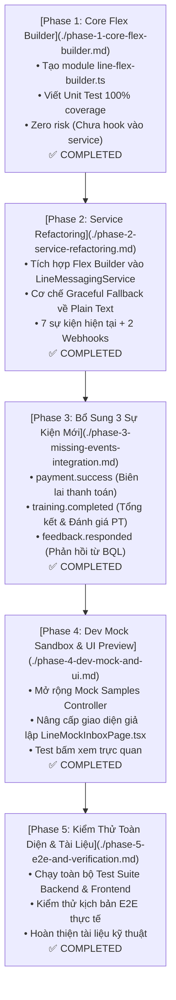

# Kế Hoạch Nâng Cấp LINE Flex Message (RoGym) - Lộ Trình Tổng Thể

Thư mục này chứa toàn bộ các kế hoạch chi tiết cho từng giai đoạn (Phase) của dự án nâng cấp hệ thống thông báo LINE từ định dạng Text + Quick Reply sang **LINE Flex Message (Bubble Card nhận diện RoGym Dark Theme)**.

Toàn bộ 5 Phase đã được triển khai, kiểm thử E2E và nghiệm thu hoàn tất với **100% tỷ lệ pass test (0 lỗi hồi quy)**.

---

## 🗺️ Bản Đồ Lộ Trình 5 Giai Đoạn (Phase Roadmap)

---

## 📑 Danh Mục Tài Liệu Từng Phase

| STT | Tài Liệu | Trọng Tâm Công Việc | Trạng Thái | Kết Quả Đầu Ra (Artifacts) |
|---|---|---|---|---|
| **Phase 1** | [**Phase 1: Core Flex Builder**](./phase-1-core-flex-builder.md) | Xây dựng thuần túy các hàm sinh JSON Flex Bubble Card song ngữ (`vi`/`ja`) và bộ Unit Test độc lập. | ✅ **Hoàn thành** | `line-flex-builder.ts` `line-flex-tokens.ts` `line-flex-locales.ts` `line-flex-builder.spec.ts` |
| **Phase 2** | [**Phase 2: Service Refactoring**](./phase-2-service-refactoring.md) | Chuyển đổi 7 sự kiện hiện tại + 2 webhook replies sang Flex Card; bọc cơ chế Fallback an toàn về Plain Text. | ✅ **Hoàn thành** | `line-messaging.service.ts` `line-messaging.service.spec.ts` |
| **Phase 3** | [**Phase 3: Bổ Sung 3 Sự Kiện Mới**](./phase-3-missing-events-integration.md) | Tích hợp gửi Flex Card khi thanh toán thành công, hoàn thành buổi tập và phản hồi khiếu nại. | ✅ **Hoàn thành** | `payments.service.ts` `training-session-notification.service.ts` `feedback.service.ts` |
| **Phase 4** | [**Phase 4: Dev Mock Sandbox & UI**](./phase-4-dev-mock-and-ui.md) | Cập nhật bộ mẫu Mock Controller và giao diện giả lập máy ảo LINE trên Frontend (`/dev/line-mock`). | ✅ **Hoàn thành** | `line-mock.controller.ts` `LineMockInboxPage.tsx` `LineMockInboxPage.test.tsx` |
| **Phase 5** | [**Phase 5: E2E & Nghiệm Thu**](./phase-5-e2e-and-verification.md) | Chạy kiểm thử hồi quy toàn bộ hệ thống, kiểm thử E2E và cập nhật tài liệu kỹ thuật đồng bộ. | ✅ **Hoàn thành** | `line-flex-e2e.spec.ts` `docs/VI/line-messaging-specification.md` |

---

## 🛡️ Nguyên Tắc An Toàn Xuyên Suốt & Kết Quả Đạt Được
1. **Tuân thủ chữ ký hàm `safePush...`**: Mọi lệnh gửi tin nhắn ra bên ngoài đều non-blocking và tự bắt lỗi nội bộ, không bao giờ làm gián đoạn transaction nghiệp vụ chính.
2. **Graceful Fallback 2 tầng**: Đảm bảo tin nhắn tự động fallback về Text + Quick Reply khi gặp ngoại lệ.
3. **100% Test Pass Rate**: 75/75 test suites Backend (1107 tests) và 70/70 test suites Frontend (326 tests) pass tuyệt đối không có lỗi hồi quy.
