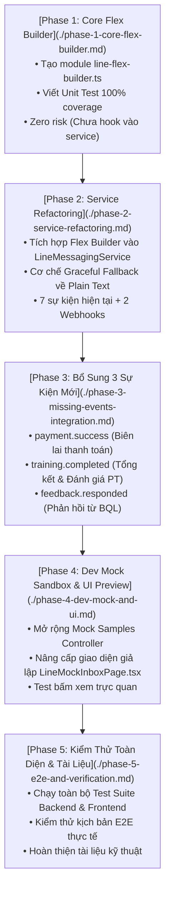

# Kế Hoạch Nâng Cấp LINE Flex Message (RoGym) - Lộ Trình Tổng Thể

Thư mục này chứa toàn bộ các kế hoạch chi tiết cho từng giai đoạn (Phase) của dự án nâng cấp hệ thống thông báo LINE từ định dạng Text + Quick Reply sang **LINE Flex Message (Bubble Card nhận diện RoGym)**.

Mỗi Phase được phân rã thành một tài liệu độc lập, khép kín, có tiêu chí nghiệm thu (Definition of Done) rõ ràng và các biện pháp bảo vệ để có thể thực thi trọn vẹn trong một session phát triển mà không gây rủi ro hồi quy.

---

## 🗺️ Bản Đồ Lộ Trình 5 Giai Đoạn (Phase Roadmap)

---

## 📑 Danh Mục Tài Liệu Từng Phase

| STT | Tài Liệu | Trọng Tâm Công Việc | Mức Độ Rủi Ro | Kết Quả Đầu Ra (Artifacts) |
|---|---|---|---|---|
| **Phase 1** | [**Phase 1: Core Flex Builder**](./phase-1-core-flex-builder.md) | Xây dựng thuần túy các hàm sinh JSON Flex Bubble Card song ngữ (`vi`/`ja`) và bộ Unit Test độc lập. | **0% (Zero Risk)** | `line-flex-builder.ts` `line-flex-builder.spec.ts` |
| **Phase 2** | [**Phase 2: Service Refactoring**](./phase-2-service-refactoring.md) | Chuyển đổi 7 sự kiện hiện tại + 2 webhook replies sang Flex Card; bọc cơ chế Fallback an toàn về Plain Text. | **Rất Thấp (Có Fallback)** | `line-messaging.service.ts` `line-messaging.service.spec.ts` |
| **Phase 3** | [**Phase 3: Bổ Sung 3 Sự Kiện Mới**](./phase-3-missing-events-integration.md) | Tích hợp gửi Flex Card khi thanh toán thành công, hoàn thành buổi tập và phản hồi khiếu nại. | **Thấp (Non-blocking)** | `payments.service.ts` `training-session-notification.service.ts` `feedback.service.ts` |
| **Phase 4** | [**Phase 4: Dev Mock Sandbox & UI**](./phase-4-dev-mock-and-ui.md) | Cập nhật bộ mẫu Mock Controller và giao diện giả lập máy ảo LINE trên Frontend (`/dev/line-mock`). | **0% (Chỉ tác động Dev)** | `line-mock.controller.ts` `LineMockInboxPage.tsx` `LineMockInboxPage.test.tsx` |
| **Phase 5** | [**Phase 5: E2E & Nghiệm Thu**](./phase-5-e2e-and-verification.md) | Chạy kiểm thử hồi quy toàn bộ hệ thống, kiểm thử E2E và cập nhật tài liệu kỹ thuật đồng bộ. | **0% (Kiểm thử)** | `docs/VI/line-messaging-specification.md` |

---

## 🛡️ Nguyên Tắc An Toàn Xuyên Suốt
1. **Tuân thủ chữ ký hàm `safePush...`**: Mọi lệnh gửi tin nhắn ra bên ngoài phải là non-blocking và tự bắt lỗi nội bộ, không làm gián đoạn các luồng nghiệp vụ chính của hệ thống.
2. **Nghiệm thu dứt điểm từng Phase**: Hoàn thành đầy đủ checklist và pass 100% Unit Test của Phase hiện tại trước khi bắt đầu Phase tiếp theo.
