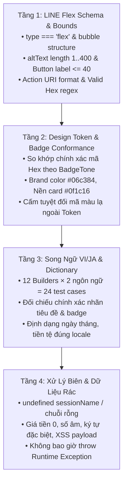

# Phase 1: Xây Dựng Core Flex Message Builder & Bộ Unit Test Độc Lập

> **Mục tiêu phiên làm việc**: Xây dựng module thuần túy (pure domain logic) `server/src/line-messaging/line-flex-tokens.ts` và `server/src/line-messaging/line-flex-builder.ts` định nghĩa và xuất bản các hàm tạo cấu trúc JSON Flex Bubble Card cho toàn bộ 10 loại sự kiện và 2 webhook replies. Toàn bộ màu sắc và Header Badge tuân thủ 100% hệ thống Design Token của dự án (`client/src/styles/tokens.css` và `client/src/components/ui/badge-utils.ts`). Đi kèm bộ Unit Test độc lập `server/src/line-messaging/line-flex-builder.spec.ts` kiểm thử 4 tầng toàn diện đạt 100% Coverage (Statements, Branches, Functions, Lines).
>
> **Mức độ rủi ro**: **0% (Zero Risk)** — Đây là module hoàn toàn mới, chưa được import vào các service đang chạy, không thể gây ảnh hưởng đến hệ thống hiện tại.

---

## 1. Hệ Thống Design Tokens Cho Flex Message & Header Badge

Để đảm bảo đồng bộ hoàn toàn với giao diện Client RoGym (Dark Mode Theme) và tái sử dụng convention sẵn có, Server định nghĩa module `line-flex-tokens.ts` ánh xạ trực tiếp từ `client/src/styles/tokens.css` và `client/src/components/ui/badge-utils.ts`:

### 1.1 Bảng Màu Nền & Văn Bản Cốt Lõi (Core Theme Tokens)
- **Bubble Card Background (`bgCard`)**: `#0f1c16` (tương ứng `--rogym-bg-card`)
- **Brand Accent Green (`brandGreen`)**: `#06c384` (tương ứng `--rogym-green`)
- **Brand Accent Teal (`brandTeal`)**: `#42e09e` (tương ứng `--rogym-teal`)
- **Brand Dark Green (`brandDark`)**: `#00492f` (tương ứng `--rogym-green-dark`, dùng cho chữ trên nền nút Primary)
- **Text Primary (`textPrimary`)**: `#ffffff` (tương ứng `--rogym-text-primary`)
- **Text Secondary (`textSecondary`)**: `#bbcabf` (tương ứng `--rogym-text-secondary`)
- **Text Muted (`textMuted`)**: `#8ab89c` (tương ứng `--rogym-text-muted`)
- **Separator / Border Subtle (`borderSubtle`)**: `#1a2520` (tương ứng `--rogym-bg-elevated`)

### 1.2 Quy Chuẩn Header Badge Theo Tone (`BadgeTone`)

| Tone | Ý Nghĩa Sử Dụng | Màu Chữ (Text Color) | Màu Nền (Background) | Màu Viền/Điểm Nhấn | Tham Chiếu Client |
|---|---|---|---|---|---|
| `success` | Thành công, Xác nhận, Check-in, Hoàn thành | `#42e09e` (Teal) | `#1a3326` (Elevated Green) | `#06c384` (Green) | `TONE_CLASSES.success` |
| `info` | Cập nhật, Đổi lịch, Phản hồi góp ý | `#7dd3fc` (Sky-300) | `#0c2838` (Sky Dark Tint) | `#38bdf8` (Sky-400) | `TONE_CLASSES.info` |
| `warning` | Nhắc nhở giờ tập, Sắp hết hạn gói | `#fcd34d` (Amber-300) | `#2e2107` (Amber Dark Tint) | `#fbbf24` (Amber-400) | `TONE_CLASSES.warning` |
| `danger` | Hủy lịch, Cảnh báo vi phạm | `#ff6b6b` (RoGym Error) | `#2d1212` (Red Dark Tint) | `#f87171` (Red-400) | `TONE_CLASSES.danger` |
| `muted` | Tự động trả lời, Thông tin chung | `#bbcabf` (Text Secondary) | `#1a2520` (Elevated Base) | `#8ab89c` (Text Muted) | `TONE_CLASSES.muted` |

---

## 2. Danh Mục 12 Builder Functions Cần Xây Dựng

Module `line-flex-builder.ts` sẽ xuất bản các hàm sinh đối tượng `{ type: 'flex', altText: string, contents: LineFlexBubble }`:

| STT | Hàm Builder | Sự Kiện Tương Ứng | Header Badge (Tone & Nhãn VI / JA) | Body (Bảng Key-Value) | Footer CTA Buttons |
|---|---|---|---|---|---|
| **1** | `buildTrainingBookingCreatedFlex` | Đặt lịch PT mới (`training.created`) | **Tone `success`**<br>VI: `ĐẶT LỊCH THÀNH CÔNG`<br>JA: `予約完了` | • Bài tập<br>• Thời gian<br>• PT<br>• Phòng tập | `[Xem chi tiết]` (Primary $\rightarrow$ LIFF Sessions) |
| **2** | `buildTrainingBookingUpdatedFlex` | Đổi lịch PT (`training.updated`) | **Tone `info`**<br>VI: `ĐÃ ĐIỀU CHỈNH LỊCH`<br>JA: `予約変更` | • Bài tập<br>• Thời gian mới<br>• PT<br>• Phòng tập mới | `[Xem chi tiết]` (Primary $\rightarrow$ LIFF Sessions) |
| **3** | `buildTrainingBookingCancelledFlex` | Hủy lịch PT (`training.cancelled`) | **Tone `danger`**<br>VI: `LỊCH TẬP ĐÃ HỦY`<br>JA: `予約キャンセル` | • Bài tập<br>• Thời gian hủy<br>• PT phụ trách | `[Xem chi tiết]` (Primary $\rightarrow$ LIFF Sessions) |
| **4** | `buildTrainingReminderFlex` | Nhắc trước 30p (`training.reminder`) | **Tone `warning`**<br>VI: `SẮP ĐẾN GIỜ TẬP (30P)`<br>JA: `まもなく開始 (30分前)` | • Bài tập<br>• Giờ bắt đầu<br>• PT<br>• Phòng tập | `[Xem chi tiết]` (Primary $\rightarrow$ LIFF Sessions) |
| **5** | `buildTrainingStartingFlex` | Đến giờ tập (`training.starting`) | **Tone `success`**<br>VI: `ĐẾN GIỜ TẬP`<br>JA: `セッション開始` | • Bài tập<br>• Giờ bắt đầu<br>• PT<br>• Phòng tập | `[Xem chi tiết]` (Primary $\rightarrow$ LIFF Sessions) |
| **6** | `buildTrainingCompletedFlex` | Hoàn thành buổi tập (`training.completed`) | **Tone `success`**<br>VI: `BUỔI TẬP HOÀN THÀNH`<br>JA: `セッション完了` | • Bài tập<br>• Thời gian tập<br>• PT phụ trách | **2 Nút**:<br>1. `[Đánh giá PT]` (Primary $\rightarrow$ LIFF Review)<br>2. `[Xem lịch sử]` (Secondary Outline $\rightarrow$ LIFF History) |
| **7** | `buildAttendanceCheckinFlex` | Điểm danh (`attendance.checkin`) | **Tone `success`**<br>VI: `CHECK-IN THÀNH CÔNG`<br>JA: `チェックイン完了` | • Thời gian check-in<br>• Chi nhánh/Địa điểm | `[Xem thẻ & lịch sử]` (Primary $\rightarrow$ LIFF Attendance) |
| **8** | `buildSubscriptionExpiringFlex` | Nhắc hết hạn gói (`subscription.expiring_soon`) | **Tone `warning`**<br>VI: `GÓI TẬP SẮP HẾT HẠN`<br>JA: `有効期限間近` | • Tên gói tập<br>• Ngày hết hạn | **2 Nút**:<br>1. `[Gia hạn ngay]` (Primary $\rightarrow$ LIFF Renew)<br>2. `[Xem chi tiết gói]` (Secondary Outline $\rightarrow$ LIFF Sub) |
| **9** | `buildPaymentSuccessFlex` | Thanh toán thành công (`payment.success`) | **Tone `success`**<br>VI: `THANH TOÁN THÀNH CÔNG`<br>JA: `お支払い完了` | • Gói dịch vụ<br>• Số tiền thanh toán<br>• Phương thức<br>• Mã giao dịch | `[Xem chi tiết gói]` (Primary $\rightarrow$ LIFF Sub) |
| **10** | `buildFeedbackRespondedFlex` | Phản hồi góp ý (`feedback.responded`) | **Tone `info`**<br>VI: `ĐÃ CÓ PHẢN HỒI GÓP Ý`<br>JA: `ご意見への返答` | • Tiêu đề góp ý<br>• Thời gian phản hồi | `[Xem phản hồi]` (Primary $\rightarrow$ LIFF Feedback) |
| **11** | `buildWelcomeFlex` | Webhook Welcome (`follow`) | **Tone `success`**<br>VI: `CHÀO MỪNG HỘI VIÊN`<br>JA: `RoGymへようこそ` | • Lời chào gia nhập RoGym<br>• Hướng dẫn sử dụng | `[Mở ứng dụng]` (Primary $\rightarrow$ LIFF /member) |
| **12** | `buildHelpAutoReplyFlex` | Webhook Auto-help (`message`) | **Tone `muted`**<br>VI: `HỖ TRỢ TỰ ĐỘNG`<br>JA: `自動応答サポート` | • Thông báo kênh tự động<br>• Điều hướng vào app | `[Mở ứng dụng]` (Primary $\rightarrow$ LIFF /member) |

---

## 3. Cấu Trúc Khung Flex Bubble Chuẩn RoGym (Dark Theme)

Mỗi Bubble Card được xây dựng với cấu trúc 3 phần khép kín qua hàm nền tảng `buildFlexBubbleBase`:

```
┌────────────────────────────────────────────────────────┐
│ HEADER: [ROGYM #06c384]    [BADGE THEME #1a3326/#42e09e]│
├────────────────────────────────────────────────────────┤
│ BODY:                                                  │
│   Tiêu Đề Chính (Bold, #ffffff, Size xl)                │
│   ───────────────────────────────────────────────────  │
│   • Nhãn 1 (#8ab89c, Flex 3) : Giá trị 1 (#fff, Flex 7)│
│   • Nhãn 2 (#8ab89c, Flex 3) : Giá trị 2 (#fff, Flex 7)│
│   • Nhãn 3 (#8ab89c, Flex 3) : Giá trị 3 (#fff, Flex 7)│
├────────────────────────────────────────────────────────┤
│ FOOTER:                                                │
│   [ Nút Chính (Primary: Nền #06c384, Chữ #00492f) ]    │
│   [ Nút Phụ (Secondary: Viền/Chữ #42e09e) - Tùy chọn] │
└────────────────────────────────────────────────────────┘
```

1. **Bubble Container**:
   - `styles.body.backgroundColor`: `#0f1c16`
   - `styles.header.backgroundColor`: `#0f1c16`
   - `styles.footer.backgroundColor`: `#0f1c16`
2. **Header**:
   - Cột trái: Brand Name `ROGYM` (`color: '#06c384'`, `weight: 'bold'`, `size: 'sm'`).
   - Cột phải: Badge phân loại trạng thái bo tròn góc (`cornerRadius: 'xxl'`), áp dụng chính xác `backgroundColor` và `textColor` từ `FLEX_BADGE_TONES[tone]`.
3. **Body**:
   - Tiêu đề thông điệp (`weight: 'bold'`, `size: 'xl'`, `color: '#ffffff'`, `wrap: true`).
   - Đường phân cách (`type: 'separator'`, `color: '#1a2520'`).
   - Danh sách các hàng Key-Value: Label màu `#8ab89c` (`flex: 3`), Value màu `#ffffff` (`flex: 7`, `weight: 'bold'`, `wrap: true`).
4. **Footer**:
   - Nút Primary: `style: 'primary'`, `color: '#06c384'` (nền xanh thương hiệu), chữ tương phản cao `#00492f` (đậm).
   - Nút Secondary (nếu có): `style: 'secondary'`, viền mỏng và chữ màu `#42e09e`.

---

## 4. Chi Tiết Các Công Việc Cần Thực Hiện

### Task 1.1: Tạo file cấu hình `server/src/line-messaging/line-flex-tokens.ts`
1. Khai báo các hằng số màu sắc chuẩn RoGym `FLEX_THEME`.
2. Khai báo cấu trúc định nghĩa Badge `FLEX_BADGE_TONES` hỗ trợ 5 tone (`success`, `info`, `warning`, `danger`, `muted`).
3. Xuất bản type an toàn `BadgeTone` và `FlexColorToken`.

### Task 1.2: Tạo file mã nguồn `server/src/line-messaging/line-flex-builder.ts`
1. Định nghĩa các kiểu dữ liệu nội bộ chuẩn LINE Messaging API:
   - `LineFlexMessage`: `{ type: 'flex'; altText: string; contents: LineFlexBubble }`
   - `LineFlexBubble`, `LineFlexBox`, `LineFlexText`, `LineFlexButton`, `LineFlexSeparator`.
   - `LineMessageLocale`: `'vi' | 'ja'`.
2. Xây dựng các hàm pure helper tái sử dụng cao:
   - `createFlexBadge(tone: BadgeTone, label: string): LineFlexBox`
   - `createKeyValueRow(label: string, value: string): LineFlexBox`
   - `createFlexButton(label: string, uri: string, style: 'primary' | 'secondary'): LineFlexButton`
   - `buildFlexBubbleBase(params): LineFlexMessage`
3. Hiện thực toàn bộ 12 hàm builder chi tiết với bộ từ điển bản dịch song ngữ `vi` và `ja`.
4. Chuẩn hóa format ngày tháng (`vi-VN` / `ja-JP`) và tiền tệ (VND / JPY) đúng ngữ cảnh từng ngôn ngữ.
5. Đảm bảo `altText` tóm tắt súc tích, không vượt quá 400 ký tự (giới hạn của LINE) để hiển thị trọn vẹn trên màn hình khóa điện thoại.

### Task 1.3: Xây dựng bộ test suite `server/src/line-messaging/line-flex-builder.spec.ts`
Thực hiện kiểm thử 4 tầng toàn diện (không bỏ qua hoặc hợp lý hóa bất kỳ điều kiện biên nào).

---

## 5. Quy Trình Kiểm Thử 4 Tầng & Tiêu Chí Nghiệm Thu Khắt Khe

### 5.1 Quy Trình Kiểm Thử 4 Tầng (Comprehensive Test Strategy)



1. **Tầng 1 — Kiểm thử cấu trúc & giới hạn LINE Flex Schema**:
   - Khẳng định 100% output trả về đúng cấu trúc `{ type: 'flex', altText: string, contents: { type: 'bubble', ... } }`.
   - `altText` không rỗng và không vượt quá 400 ký tự.
   - Nhãn nút bấm CTA không vượt quá 40 ký tự (giới hạn của LINE Action Label).
   - Mọi URL hành động phải hợp lệ (`https://...` hoặc đường dẫn LIFF `/liff?...`).
   - Mọi giá trị màu sắc trong cây JSON phải khớp định dạng Hex chuẩn (`^#([0-9a-fA-F]{6}|[0-9a-fA-F]{8})$`).
   - Độ sâu lồng ghép Box không vượt quá giới hạn LINE API (depth $\le 10$).

2. **Tầng 2 — Kiểm thử tính nhất quán của Design Token & Badge Tone**:
   - Khẳng định toàn bộ 12 hàm builder sử dụng đúng tone màu được chỉ định trong bảng mục 2.
   - Kiểm tra mã màu `backgroundColor` và `textColor` của Header Badge phải khớp 1:1 với hằng số `FLEX_BADGE_TONES`.
   - Khẳng định Brand Header dùng đúng `#06c384` và nền card dùng đúng `#0f1c16`.
   - Cấm hoàn toàn việc hardcode các mã màu tuỳ tiện ngoài hệ thống token.

3. **Tầng 3 — Kiểm thử song ngữ toàn diện (Bilingual Dictionary & Formatting)**:
   - Chạy 24 ca kiểm thử (12 hàm $\times$ 2 locales `vi`/`ja`), kiểm tra chuẩn xác từng từ khóa, tiêu đề, nhãn nút bấm.
   - Kiểm tra định dạng thời gian: `locale: 'vi'` hiển thị dạng tiếng Việt; `locale: 'ja'` hiển thị dạng tiếng Nhật.
   - Kiểm tra định dạng tiền tệ: tiếng Việt format `đ` / `VND`; tiếng Nhật format `¥` / `JPY`.

4. **Tầng 4 — Kiểm thử điều kiện biên, dữ liệu khuyết thiếu & an toàn runtime**:
   - `sessionName` là `undefined` hoặc chuỗi rỗng: Builder tự động xử lý mượt mà, không sinh ra `undefined` trên giao diện và không vỡ layout.
   - Dữ liệu tiền thanh toán bằng 0 hoặc số âm: Xử lý an toàn.
   - Dữ liệu chứa ký tự đặc biệt, emoji hoặc chuỗi mã độc XSS (`<script>`, SQL fragments): Hiển thị nguyên vẹn dưới dạng text thuần túy trong JSON, không gây lỗi parser.
   - Tuyệt đối không bao giờ throw Unhandled Exception khi nhận bất kỳ đầu vào dị thường nào.

### 5.2 Lệnh Thực Thi Kiểm Thử

```bash
# Chạy unit test riêng cho Flex Builder
npm run test -- server/src/line-messaging/line-flex-builder.spec.ts

# Chạy kiểm tra độ bao phủ (Coverage)
npm run test:cov -- --collectCoverageFrom="src/line-messaging/line-flex-builder.ts" --collectCoverageFrom="src/line-messaging/line-flex-tokens.ts"
```

### 5.3 Tiêu Chí Nghiệm Thu (Definition of Done - DoD Khắt Khe)

- [ ] File `server/src/line-messaging/line-flex-tokens.ts` được tạo mới, chứa đầy đủ các hằng số màu sắc và Tone Badge đồng bộ với `client/src/styles`.
- [ ] File `server/src/line-messaging/line-flex-builder.ts` được tạo mới, xuất bản đủ 12 hàm builder và các helper primitives.
- [ ] 100% Header Badge trong 12 builders sử dụng đúng mã màu từ `line-flex-tokens.ts` (không có màu lạ).
- [ ] Toàn bộ 12 hàm đều hỗ trợ chuẩn xác cả 2 ngôn ngữ `vi` và `ja`.
- [ ] Test suite `line-flex-builder.spec.ts` bao phủ trọn vẹn 4 tầng kiểm thử, chạy pass 100% không có lỗi hoặc cảnh báo.
- [ ] Chỉ số Code Coverage đạt **100%** trên toàn bộ các tiêu chí: **Statements (100%)**, **Branches (100%)**, **Functions (100%)**, **Lines (100%)**.
- [ ] Không làm thay đổi bất kỳ file service nào đang chạy (Zero Regression Risk cho Phase 1).
