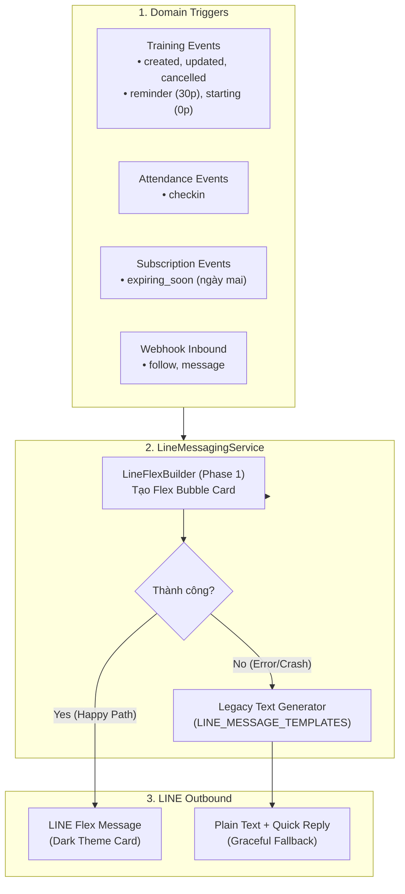
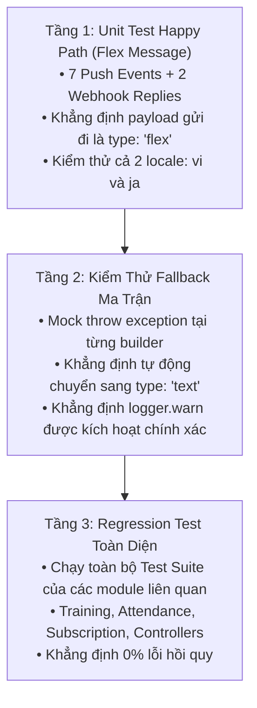

# Phase 2: Nâng Cấp Service & Cơ Chế Graceful Fallback

> **Mục tiêu phiên làm việc**: Tích hợp các hàm builder từ `line-flex-builder.ts` (đã hoàn thiện và kiểm thử ở Phase 1) vào `server/src/line-messaging/line-messaging.service.ts`. Chuyển đổi toàn bộ 7 sự kiện hiện tại và 2 webhook replies sang định dạng LINE Flex Message (RoGym Dark Theme), đồng thời thiết lập cơ chế **Graceful Fallback 2 tầng** an toàn tuyệt đối để tự động giáng cấp về tin nhắn Plain Text + Quick Reply nếu xảy ra bất kỳ lỗi bất thường nào.
>
> **Mức độ rủi ro**: **Rất Thấp (Zero Breaking Changes)** — Giữ nguyên 100% chữ ký các hàm public `safePush...`, không làm thay đổi luồng gọi từ các module bên ngoài.

---

## 1. Phạm Vi Các Sự Kiện Được Nâng Cấp Ở Phase 2

Phase 2 tập trung chuyển đổi 7 sự kiện thông báo đang chạy và 2 webhook replies:



### 1.1 Chi Tiết 7 Sự Kiện & 2 Webhooks

| STT | Sự Kiện | Hàm Service Nội Bộ | Hàm Builder Được Gọi | Nút CTA (LIFF Destination) |
|---|---|---|---|---|
| **1** | `training.created` | `pushTrainingSessionEvent('created')` | `buildTrainingBookingCreatedFlex` | `/member/workout/sessions?sessionId={id}` |
| **2** | `training.updated` | `pushTrainingSessionEvent('updated')` | `buildTrainingBookingUpdatedFlex` | `/member/workout/sessions?sessionId={id}` |
| **3** | `training.cancelled` | `pushTrainingSessionEvent('cancelled')` | `buildTrainingBookingCancelledFlex` | `/member/workout/sessions` |
| **4** | `training.reminder` | `pushTrainingSessionEvent('reminder')` | `buildTrainingReminderFlex` | `/member/workout/sessions?sessionId={id}` |
| **5** | `training.starting` | `pushTrainingSessionEvent('starting')` | `buildTrainingStartingFlex` | `/member/workout/sessions?sessionId={id}` |
| **6** | `attendance.checkin` | `pushAttendanceCheckin(attendanceId)` | `buildAttendanceCheckinFlex` | `/member/attendance` |
| **7** | `subscription.expiring_soon` | `pushSubscriptionExpiringReminder(id)` | `buildSubscriptionExpiringFlex` | Primary: `/member/subscription/current`<br>Secondary: `/member/profile` |
| **8** | `follow` (Webhook) | `handleEvent(event)` | `buildWelcomeFlex` | `/member` |
| **9** | `message` (Webhook) | `handleEvent(event)` | `buildHelpAutoReplyFlex` | `/member` |

---

## 2. Chi Tiết Các Công Việc Cần Thực Hiện

### Task 2.1: Cập nhật Type & Khai Báo Import
Trong `server/src/line-messaging/line-messaging.service.ts`:
1. Import các hàm builder và types từ `./line-flex-builder`:
   ```ts
   import {
     buildTrainingBookingCreatedFlex,
     buildTrainingBookingUpdatedFlex,
     buildTrainingBookingCancelledFlex,
     buildTrainingReminderFlex,
     buildTrainingStartingFlex,
     buildAttendanceCheckinFlex,
     buildSubscriptionExpiringFlex,
     buildWelcomeFlex,
     buildHelpAutoReplyFlex,
     LineFlexMessage,
     LineMessageLocale,
   } from './line-flex-builder'
   ```
2. Mở rộng kiểu dữ liệu `LineMessage`:
   ```ts
   type LineMessage =
     | {
         type: 'text'
         text: string
         quickReply?: {
           items: Array<{
             type: 'action'
             action: {
               type: 'uri'
               label: string
               uri: string
             }
           }>
         }
       }
     | LineFlexMessage
   ```

### Task 2.2: Thiết Kế Cơ Chế Graceful Fallback 2 Tầng
Để đảm bảo hội viên **luôn nhận được tin nhắn** ngay cả khi hệ sinh thái dữ liệu có biến động hoặc hàm builder gặp lỗi không lường trước:
1. Giữ nguyên `LINE_MESSAGE_TEMPLATES` và các hàm `buildTrainingText`, `withLiffButton` làm hạ tầng fallback an toàn.
2. Thiết lập quy chuẩn bọc `try/catch` khi gọi builder cho từng sự kiện:
   ```ts
   private async pushTrainingSessionEvent(kind: TrainingLineEvent, sessionId: bigint) {
     if (!this.canPushMessages()) return false
     const session = await this.prisma.trainingSession.findFirst({ ... })
     if (!session?.member.user.lineId) return false
     if (kind === 'reminder' && session.status !== TrainingSessionStatus.scheduled) return false

     const locale = this.getLocale()
     let message: LineMessage

     try {
       // Happy Path: Tạo Flex Card chuẩn nhận diện RoGym
       message = this.buildTrainingFlexMessage(kind, session, locale)
     } catch (error) {
       // Fallback Path: Tự động giáng cấp về Plain Text + Quick Reply
       this.logger.warn(
         `Flex builder failed for training.${kind} (sessionId=${sessionId.toString()}): ${this.describeError(error)}, falling back to text`
       )
       message = this.buildTrainingLegacyTextMessage(kind, session, locale)
     }

     return this.pushMessage(session.member.user.lineId, [message])
   }
   ```

### Task 2.3: Nâng Cấp Hàm Trích Xuất LIFF URL & Mẫu Mock Outbox
1. **Nâng cấp `findLiffUrl`**:
   - Quét tìm `action.uri` đệ quy hoặc theo cấu trúc từ cả `quickReply.items` (tin nhắn Text) lẫn các button trong `contents.footer` hoặc `contents.body` (tin nhắn Flex).
   - Đảm bảo Dev Mock Outbox và Simulator trên giao diện Web (`/dev/line-mock`) luôn bắt được liên kết mở app chính xác.
2. **Tái cấu trúc `createMockSample`**:
   - Chuyển toàn bộ các mẫu mock `flex`, `pt-booking-created`, `pt-reminder-30m`, `pt-session-cancelled` sang gọi trực tiếp các hàm builder từ `line-flex-builder.ts`.
   - Loại bỏ hoàn toàn các đoạn khai báo bubble dummy hardcoded cũ.

### Task 2.4: Bảo Vệ & Giữ Vững Hợp Đồng Public Service (Public Contracts)
- Các hàm public: `safePushTrainingSessionEvent`, `safePushAttendanceCheckin`, `safePushSubscriptionExpiringReminder`, `safeAssignRichMenu`, `safeUnsend` giữ nguyên 100% signature và return type `Promise<boolean>`.
- Đảm bảo toàn bộ các caller (`training-session-notification.service.ts`, `attendance.service.ts`, `subscription-schedule.service.ts`) hoạt động trong suốt mà không cần sửa đổi.

---

## 3. Quy Trình Kiểm Thử 3 Tầng & Tiêu Chí Nghiệm Thu Khắt Khe

### 3.1 Quy Trình Kiểm Thử 3 Tầng



1. **Tầng 1 — Unit Test Độc Lập Cho `LineMessagingService` (Happy Path)**:
   - Kiểm thử 5 sự kiện PT (`created`, `updated`, `cancelled`, `reminder`, `starting`): Payload gửi vào `postLine` phải là `type: 'flex'`, chứa đúng `altText`, đúng đường dẫn LIFF và nội dung tương ứng.
   - Kiểm thử sự kiện điểm danh `attendance.checkin`: Gửi Flex Card check-in với link `/member/attendance`.
   - Kiểm thử sự kiện `subscription.expiring_soon`: Gửi Flex Card nhắc hết hạn kèm 2 nút CTA (Gia hạn & Xem hồ sơ).
   - Kiểm thử 2 Webhook events (`follow` và `message`): Trả lời đúng Flex Card Welcome và Auto-help.
   - Kiểm thử song ngữ: Kiểm tra output Flex Card khi `LINE_MESSAGE_LOCALE='vi'` và `LINE_MESSAGE_LOCALE='ja'`.

2. **Tầng 2 — Kiểm Thử Ma Trận Graceful Fallback (Failure Resilience)**:
   - Sử dụng `jest.spyOn` hoặc mock ném lỗi (Error/Exception) tại các hàm `buildTrainingBookingCreatedFlex`, `buildAttendanceCheckinFlex`,...
   - Khẳng định:
     1. Hàm service **không ném exception ra ngoài** (`safePush...` vẫn trả về kết quả an toàn).
     2. Tin nhắn gửi đi được tự động giáng cấp thành `type: 'text'` kèm `quickReply`.
     3. `Logger.warn` được ghi nhận với đúng thông tin định danh sự kiện và lỗi nguyên nhân.

3. **Tầng 3 — Kiểm Thử Hồi Quy Toàn Hệ Thống (Cross-Service Integration)**:
   - Chạy test suite của toàn bộ các service phụ thuộc để khẳng định luồng gọi thực tế không bị ảnh hưởng.

### 3.2 Lệnh Thực Thi Kiểm Thử

```bash
# 1. Chạy Unit Test trọng tâm cho LineMessagingService
npm run test -- server/src/line-messaging/line-messaging.service.spec.ts

# 2. Chạy toàn bộ test suite của các module gọi ngoài liên quan
npm run test -- server/src/training/training-session-notification.service.spec.ts
npm run test -- server/src/training/member-pt-booking.integration.spec.ts
npm run test -- server/src/training/attendance.service.spec.ts
npm run test -- server/src/membership/schedule/subscription-schedule.service.spec.ts
npm run test -- server/src/line-messaging/line-messaging.controller.spec.ts
npm run test -- server/src/line-messaging/line-mock.controller.spec.ts
```

### 3.3 Tiêu Chí Nghiệm Thu (Definition of Done - DoD Khắt Khe)

- [ ] Toàn bộ 7 sự kiện hiện tại (`training.created/updated/cancelled/reminder/starting`, `attendance.checkin`, `subscription.expiring_soon`) gửi thành công dưới dạng Flex Message khi dữ liệu hợp lệ.
- [ ] 2 sự kiện Webhook `follow` và `message` phản hồi người dùng bằng Flex Card chuẩn xác.
- [ ] Cơ chế Graceful Fallback hoạt động ổn định trên 100% các sự kiện: Tự động chuyển sang tin nhắn Text khi Flex Builder gặp sự cố mà không làm rơi tin nhắn.
- [ ] Hàm `findLiffUrl` trích xuất chính xác URL từ cả Flex Button lẫn Text QuickReply.
- [ ] Hàm `createMockSample` được tái cấu trúc sạch sẽ, sử dụng trực tiếp `LineFlexBuilder`.
- [ ] `server/src/line-messaging/line-messaging.service.spec.ts` pass 100% toàn bộ các kịch bản Happy Path và Fallback.
- [ ] 100% các test suite liên quan trong hệ thống chạy thành công, không phát sinh bất kỳ lỗi hồi quy nào.
