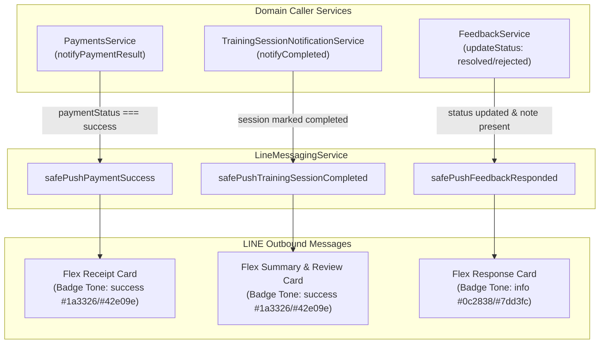
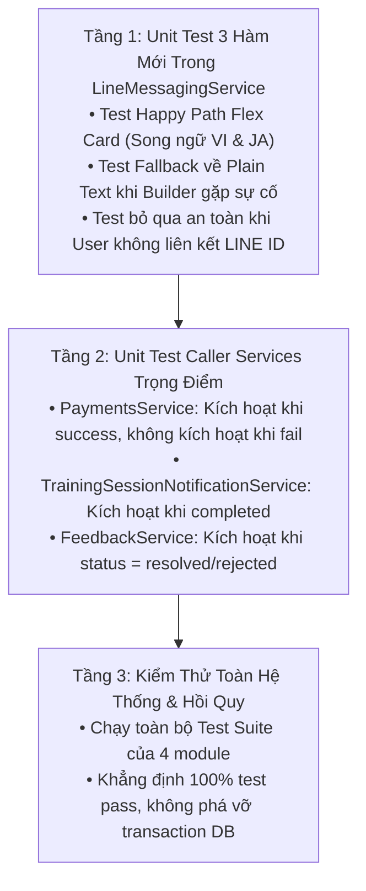

# Phase 3: Bổ Sung 3 Sự Kiện Mới Vào Hệ Thống LINE

> **Mục tiêu phiên làm việc**: Mở rộng hệ thống thông báo LINE để gửi Flex Card chuẩn nhận diện RoGym cho 3 sự kiện nghiệp vụ quan trọng còn thiếu:
> 1. `payment.success`: Biên lai xác nhận thanh toán gói tập thành công.
> 2. `training.completed`: Tổng kết buổi tập và nút đánh giá PT.
> 3. `feedback.responded`: Thông báo ban quản lý đã giải quyết và phản hồi khiếu nại/góp ý.
>
> Toàn bộ 3 sự kiện đều áp dụng Design Token chuẩn (`BadgeTone: success/info`), có cơ chế **Graceful Fallback 2 tầng** tự động giáng cấp về Text, và tuân thủ chặt chẽ pattern `safePush...` (non-blocking, catch error nội bộ, không throw lỗi làm gián đoạn transaction cơ sở dữ liệu).
>
> **Mức độ rủi ro**: **Thấp (Non-blocking)** — Mọi lệnh gửi tin nhắn đều được bọc trong `try/catch` độc lập với luồng ghi DB chính.

---

## 1. Chi Tiết 3 Sự Kiện Mới Cần Tích Hợp



### 1.1 Bảng Đặc Tả Chi Tiết 3 Sự Kiện

| STT | Tên Sự Kiện | Caller Service & Trigger | Dữ Liệu Cần Truy Vấn | Header Badge & Quy Chuẩn Giao Diện | Nút CTA (LIFF Destination) |
|---|---|---|---|---|---|
| **1** | **Thanh toán thành công** (`payment.success`) | `PaymentsService`<br>(`notifyPaymentResult` khi `isSuccess=true`) | • Số tiền thanh toán<br>• Phương thức (VNPAY/Tiền mặt)<br>• Mã GD / Payment Code<br>• Tên gói tập / Subscription | **Thẻ Biên Lai (Tone `success`)**:<br>• Nền Card `#0f1c16`<br>• Badge: `#1a3326` / `#42e09e`<br>• VI: `THANH TOÁN THÀNH CÔNG`<br>• JA: `お支払い完了` | `[Xem chi tiết gói]` (Primary $\rightarrow$ `/member/subscription/current`) |
| **2** | **Hoàn thành buổi tập** (`training.completed`) | `TrainingSessionNotificationService`<br>(`notifyCompleted`) | • Tên bài tập / Plan day<br>• Huấn luyện viên phụ trách<br>• Phòng tập<br>• Thời gian hoàn thành | **Thẻ Tổng Kết (Tone `success`)**:<br>• Nền Card `#0f1c16`<br>• Badge: `#1a3326` / `#42e09e`<br>• VI: `BUỔI TẬP HOÀN THÀNH`<br>• JA: `セッション完了` | **2 Nút Bấm**:<br>1. `[Đánh giá PT]` (Primary $\rightarrow$ `/member/feedback/new`)<br>2. `[Xem lịch sử tập]` (Secondary Outline $\rightarrow$ `/member/workout/sessions`) |
| **3** | **Phản hồi góp ý** (`feedback.responded`) | `FeedbackService`<br>(`updateStatus` khi `resolved`/`rejected`) | • Tiêu đề góp ý của hội viên<br>• Nội dung phản hồi của Admin<br>• Thời gian phản hồi | **Thẻ Phản Hồi (Tone `info`)**:<br>• Nền Card `#0f1c16`<br>• Badge: `#0c2838` / `#7dd3fc`<br>• VI: `ĐÃ CÓ PHẢN HỒI GÓP Ý`<br>• JA: `ご意見への返答` | `[Xem phản hồi]` (Primary $\rightarrow$ `/member/feedback`) |

---

## 2. Chi Tiết Các Công Việc Cần Thực Hiện

### Task 3.1: Viết 3 hàm Push & Fallback mới trong `LineMessagingService`

1. **`safePushPaymentSuccess(paymentId: bigint): Promise<boolean>`**:
   - Truy vấn `payment` theo `paymentId`, bao gồm `subscription.package`, `member.user`.
   - Nếu `user.lineId` không tồn tại $\rightarrow$ return `false` (không gọi LINE API).
   - Happy Path: Gọi `buildPaymentSuccessFlex(...)` từ `line-flex-builder.ts` với định dạng tiền tệ và ngày giờ theo locale.
   - Fallback Path: Bọc `try/catch`, nếu có lỗi thì fallback về tin nhắn Plain Text: `Thanh toan thanh cong ...` kèm QuickReply xem chi tiết gói.

2. **`safePushTrainingSessionCompleted(sessionId: bigint): Promise<boolean>`**:
   - Truy vấn `trainingSession` theo `sessionId`, bao gồm `member.user`, `trainer.user`, `room`, `planDay`.
   - Nếu `user.lineId` không tồn tại $\rightarrow$ return `false`.
   - Happy Path: Gọi `buildTrainingCompletedFlex(...)` tạo Flex Card 2 nút CTA (Đánh giá PT & Xem lịch sử).
   - Fallback Path: Bọc `try/catch`, tự động giáng cấp về Plain Text nếu lỗi.

3. **`safePushFeedbackResponded(feedbackId: bigint): Promise<boolean>`**:
   - Truy vấn `feedback` theo `feedbackId`, bao gồm `member.user`, `handledByStaff.user`.
   - Nếu `user.lineId` không tồn tại $\rightarrow$ return `false`.
   - Happy Path: Gọi `buildFeedbackRespondedFlex(...)` tạo Flex Card với Tone `info`.
   - Fallback Path: Bọc `try/catch`, tự động giáng cấp về Plain Text nếu lỗi.

### Task 3.2: Cập nhật Cấu Hình Module & Dependency Injection

1. **`PaymentsModule` (`server/src/payments/payments.module.ts`)**:
   - Thêm `LineMessagingModule` vào mảng `imports`.
2. **`FeedbackModule` (`server/src/feedback/feedback.module.ts`)**:
   - Thêm `LineMessagingModule` vào mảng `imports`.
3. **`TrainingModule` (`server/src/training/training.module.ts`)**:
   - Đảm bảo `LineMessagingModule` đã được import và `TrainingSessionNotificationService` đã inject `LineMessagingService`.

### Task 3.3: Hook Lệnh Gọi Vào 3 Service Nghiệp Vụ

1. **Trong `PaymentsService` (`server/src/payments/payments.service.ts`)**:
   - Inject `LineMessagingService`.
   - Trong hàm `notifyPaymentResult(args)`: Khi `isSuccess === true`, gọi non-blocking:
     ```ts
     await this.lineMessaging.safePushPaymentSuccess(args.paymentId)
     ```
2. **Trong `TrainingSessionNotificationService` (`server/src/training/training-session-notification.service.ts`)**:
   - Trong hàm `notifyCompleted(session: SessionRow)`:
     ```ts
     await this.notifications.safeNotifyUser(...)
     await this.lineMessaging.safePushTrainingSessionCompleted(session.sessionId)
     ```
3. **Trong `FeedbackService` (`server/src/feedback/feedback.service.ts`)**:
   - Inject `LineMessagingService`.
   - Trong hàm `updateStatus`: Khi status chuyển sang `resolved` hoặc `rejected` có `resolutionNote`:
     ```ts
     await this.notifications.safeNotifyUser(...)
     await this.lineMessaging.safePushFeedbackResponded(updated.feedbackId)
     ```

---

## 3. Quy Trình Kiểm Thử 3 Tầng & Tiêu Chí Nghiệm Thu Khắt Khe

### 3.1 Quy Trình Kiểm Thử 3 Tầng



1. **Tầng 1 — Unit Test Độc Lập Cho 3 Hàm Mới trong `line-messaging.service.spec.ts`**:
   - `safePushPaymentSuccess`:
     - Test Happy Path: Tạo Flex Receipt Card với Badge Tone `success`, hiển thị đúng số tiền, phương thức, tên gói tập, mã giao dịch trên cả `vi` và `ja`.
     - Test Fallback: Mock builder lỗi $\rightarrow$ kiểm tra tự động fallback sang `type: 'text'` và ghi `logger.warn`.
     - Test Member không có `lineId` $\rightarrow$ trả về `false`, không gọi `postLine`.
   - `safePushTrainingSessionCompleted`:
     - Test Happy Path: Tạo Flex Card tổng kết có 2 nút bấm (`Đánh giá PT` & `Xem lịch sử`), kiểm thử cả 2 locale.
     - Test Fallback: Giáng cấp về Text an toàn.
     - Test Member không có `lineId` $\rightarrow$ trả về `false`.
   - `safePushFeedbackResponded`:
     - Test Happy Path: Tạo Flex Card phản hồi với Badge Tone `info` (Sky Blue), nội dung tiêu đề và thời gian.
     - Test Fallback: Giáng cấp về Text an toàn.
     - Test Member không có `lineId` $\rightarrow$ trả về `false`.

2. **Tầng 2 — Unit Test Tại Các Caller Services (Trigger Accuracy)**:
   - `payments.service.spec.ts`: Khẳng định `safePushPaymentSuccess` được gọi khi thanh toán `status: 'success'` và **không được gọi** khi thanh toán thất bại.
   - `training-session-notification.service.spec.ts`: Khẳng định `safePushTrainingSessionCompleted` được gọi chính xác khi đánh dấu buổi tập hoàn thành.
   - `feedback.service.spec.ts`: Khẳng định `safePushFeedbackResponded` được gọi khi phản hồi góp ý.

3. **Tầng 3 — Kiểm Thử Hồi Quy Toàn Diện**:
   - Khẳng định tất cả các flow thanh toán, hoàn thành buổi tập và cập nhật feedback đều hoạt động ổn định và pass 100% unit tests.

### 3.2 Lệnh Thực Thi Kiểm Thử

```bash
# 1. Chạy Unit Test cho 3 hàm mới trong LineMessagingService
npm run test -- server/src/line-messaging/line-messaging.service.spec.ts

# 2. Chạy Unit Test của 3 Caller Services
npm run test -- server/src/payments/payments.service.spec.ts
npm run test -- server/src/training/training-session-notification.service.spec.ts
npm run test -- server/src/feedback/feedback.service.spec.ts
```

### 3.3 Tiêu Chí Nghiệm Thu (Definition of Done - DoD Khắt Khe)

- [ ] Cả 3 hàm `safePushPaymentSuccess`, `safePushTrainingSessionCompleted`, `safePushFeedbackResponded` được cài đặt đầy đủ với cơ chế Graceful Fallback 2 tầng.
- [ ] 100% Header Badge của 3 sự kiện mới sử dụng đúng Design Token (`success` cho Payment & Training Completed, `info` cho Feedback Responded).
- [ ] Các Caller Services (`PaymentsService`, `TrainingSessionNotificationService`, `FeedbackService`) đã hook lệnh gọi và bọc non-blocking an toàn.
- [ ] `PaymentsModule` và `FeedbackModule` đã import `LineMessagingModule` hợp lệ.
- [ ] Toàn bộ test suite trong 4 file kiểm thử (`line-messaging.service.spec.ts`, `payments.service.spec.ts`, `training-session-notification.service.spec.ts`, `feedback.service.spec.ts`) chạy pass 100%.
- [ ] Không có bất kỳ lỗi hồi quy hay gián đoạn transaction cơ sở dữ liệu nào.
