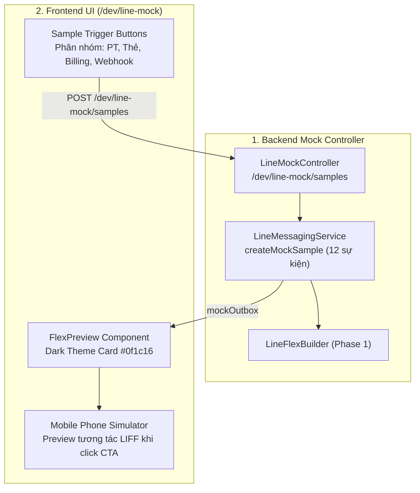

# Phase 4: Nâng Cấp Dev Mock Sandbox & Giao Diện Preview Trên Frontend

> **Mục tiêu phiên làm việc**: Cung cấp công cụ kiểm thử trực quan trên giao diện phát triển `/dev/line-mock`, cho phép lập trình viên và kiểm thử viên (QA) có thể bấm trigger tạo mẫu giả lập và xem trực tiếp tất cả 12 loại Flex Bubble Card chuẩn nhận diện RoGym (Dark Theme) trên màn hình điện thoại ảo LINE. Toàn bộ style và màu sắc được đồng bộ 100% với hệ thống Design Token của dự án (`client/src/styles/tokens.css` và `client/src/components/ui/badge-utils.ts`).
>
> **Mức độ rủi ro**: **0% (Zero Risk)** — Toàn bộ thay đổi chỉ nằm trong các file phát triển `/dev/line-mock`, không ảnh hưởng tới mã nguồn hay giao diện chạy Production của hội viên và nhân viên.

---

## 1. Các Hạng Mục Nâng Cấp



1. **Backend Controller (`line-mock.controller.ts` & `line-messaging.service.ts`)**:
   - Mở rộng danh mục các sự kiện mẫu (Mock Samples) hỗ trợ đủ 12 loại Flex Cards song ngữ `vi`/`ja`.
2. **Frontend UI (`LineMockInboxPage.tsx`)**:
   - Thêm cụm nút bấm tạo mẫu (Sample Triggers) phân chia theo 4 nhóm chức năng rõ ràng.
   - Nâng cấp component `FlexPreview` & `FlexComponent` để render chuẩn xác màu nền Dark Card (`#0f1c16`), Brand Tag `ROGYM` (`#06c384`), Badge Tones (`success`, `info`, `warning`, `danger`, `muted`) theo đúng Design Token.
   - Hỗ trợ layout nút bấm linh hoạt (1 nút Primary hoặc 2 nút: Primary + Secondary Outline), cho phép click trực tiếp để nạp URL tương ứng vào Mobile Phone Simulator.
3. **Frontend Test (`LineMockInboxPage.test.tsx`)**:
   - Cập nhật test suite để kiểm thử render và trigger các nhóm mẫu mới.

---

## 2. Chi Tiết Các Công Việc Cần Thực Hiện

### Task 4.1: Mở rộng Mock Samples trong Backend
Trong `server/src/line-messaging/line-mock.controller.ts` và `server/src/line-messaging/line-messaging.service.ts`:

1. **Cập nhật type `LineMockSample`**:
   ```ts
   export type LineMockSample =
     | 'flex'
     | 'rich-menu'
     | 'pt-booking-created'
     | 'pt-booking-updated'
     | 'pt-booking-cancelled'
     | 'pt-reminder-30m'
     | 'pt-session-starting'
     | 'pt-training-completed'
     | 'attendance-checkin'
     | 'subscription-expiring'
     | 'payment-success'
     | 'feedback-responded'
     | 'welcome'
     | 'help'
   ```

2. **Cập nhật hàm `createMockSample(type, locale)`**:
   - Gọi trực tiếp các hàm builder từ `line-flex-builder.ts` với dữ liệu mock phong phú (tên PT, phòng tập, gói tập, số tiền, ngày giờ):
     - `pt-booking-created` $\rightarrow$ `buildTrainingBookingCreatedFlex`
     - `pt-booking-updated` $\rightarrow$ `buildTrainingBookingUpdatedFlex`
     - `pt-booking-cancelled` $\rightarrow$ `buildTrainingBookingCancelledFlex`
     - `pt-reminder-30m` $\rightarrow$ `buildTrainingReminderFlex`
     - `pt-session-starting` $\rightarrow$ `buildTrainingStartingFlex`
     - `pt-training-completed` $\rightarrow$ `buildTrainingCompletedFlex`
     - `attendance-checkin` $\rightarrow$ `buildAttendanceCheckinFlex`
     - `subscription-expiring` $\rightarrow$ `buildSubscriptionExpiringFlex`
     - `payment-success` $\rightarrow$ `buildPaymentSuccessFlex`
     - `feedback-responded` $\rightarrow$ `buildFeedbackRespondedFlex`
     - `welcome` $\rightarrow$ `buildWelcomeFlex`
     - `help` $\rightarrow$ `buildHelpAutoReplyFlex`

### Task 4.2: Nâng cấp Giao diện Simulator trên Frontend (`LineMockInboxPage.tsx`)

1. **Thêm cụm nút Quick Sample Triggers theo 4 nhóm**:
   - **Nhóm 1 — Lịch Tập PT**: `[Đặt lịch mới]`, `[Đổi lịch]`, `[Hủy lịch]`, `[Nhắc 30p]`, `[Tới giờ tập]`, `[Hoàn thành buổi tập]`.
   - **Nhóm 2 — Điểm Danh & Thẻ**: `[Check-in QR]`, `[Gói sắp hết hạn]`.
   - **Nhóm 3 — Thanh Toán & Góp Ý**: `[Biên lai thanh toán]`, `[Phản hồi góp ý]`.
   - **Nhóm 4 — Webhook OA**: `[Chào mừng (Follow)]`, `[Trợ giúp tự động (Message)]`.

2. **Cải tiến `FlexPreview` & `FlexComponent`**:
   - **Bubble Background**: Áp dụng màu nền Dark Card `#0f1c16` (`--rogym-bg-card`) và viền mỏng `#1a2520`.
   - **Header Box**:
     - Cột trái: Brand text `ROGYM` `#06c384` (bold, sm).
     - Cột phải: Header Badge hiển thị đúng màu nền (`backgroundColor`), màu chữ (`textColor`), viền và bo góc tròn mềm mại (`rounded-full` / `rounded-md`).
   - **Body Box**:
     - Tiêu đề tin nhắn: chữ trắng `#ffffff`, size `xl`, `font-bold`.
     - Đường kẻ separator: mỏng `#1a2520`.
     - Key-Value rows: Label màu xám `#8ab89c` (`flex: 3`), Value màu trắng `#ffffff` (`flex: 7`, `font-bold`, wrap).
   - **Footer Buttons**:
     - Nút Primary: Nền `#06c384`, chữ đen đậm `#00492f`, hover bóng mờ.
     - Nút Secondary (nếu có): Viền outline `#42e09e`, chữ `#42e09e`, hover nền `#42e09e/10`.
     - Tương tác click: Khi bấm vào bất kỳ Action Button nào trên thẻ Flex $\rightarrow$ Nạp URL vào Mobile Phone Simulator ở cột bên phải.

### Task 4.3: Cập nhật Test Suite Frontend & Controller

1. **`client/src/pages/dev/LineMockInboxPage.test.tsx`**:
   - Kiểm thử việc hiển thị đầy đủ các nút trigger mẫu.
   - Giả lập bấm nút và khẳng định API `POST /dev/line-mock/samples` được gọi với đúng `type` và `locale`.
   - Kiểm thử render thẻ Flex Bubble với cấu trúc 3 phần (header badge, body key-value, footer button).
2. **`server/src/line-messaging/line-mock.controller.spec.ts`**:
   - Kiểm thử endpoint `/dev/line-mock/samples` với toàn bộ 12 loại sample trên cả 2 ngôn ngữ `vi` và `ja`.

---

## 3. Quy Trình Kiểm Thử & Tiêu Chí Nghiệm Thu Khắt Khe (DoD Phase 4)

### 3.1 Lệnh Thực Thi Kiểm Thử

```bash
# 1. Chạy Unit Test Backend Mock Controller
npm run test -- server/src/line-messaging/line-mock.controller.spec.ts

# 2. Chạy Test Suite Frontend LineMockInboxPage
cd client && npm test -- src/pages/dev/LineMockInboxPage.test.tsx --run
```

### 3.2 Tiêu Chí Nghiệm Thu (Definition of Done - DoD Khắt Khe)

- [ ] Backend xuất bản đủ 12 loại mock samples song ngữ qua endpoint `POST /dev/line-mock/samples`.
- [ ] Giao diện `/dev/line-mock` hiển thị 4 nhóm nút bấm trực quan, có nhãn rõ ràng cho từng sự kiện.
- [ ] Khung `FlexPreview` render sắc nét 100% Flex Cards chuẩn Dark Theme RoGym: Nền `#0f1c16`, Brand `#06c384`, Badge màu sắc tương phản cao, đúng các Tone (`success`, `info`, `warning`, `danger`, `muted`).
- [ ] Bấm nút Action trên thẻ Flex trong phòng chat giả lập nạp đúng đường dẫn tương ứng vào Mobile Phone Simulator bên cạnh.
- [ ] 100% các file unit test liên quan ở Frontend và Backend chạy thành công không có warning hay failure.
