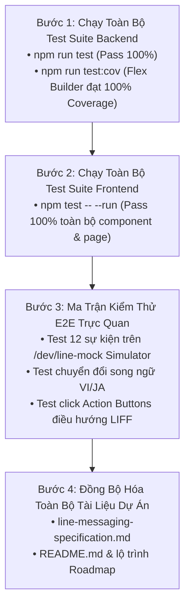

# Phase 5: Kiểm Thử Toàn Diện, E2E & Hoàn Thiện Tài Liệu

> **Mục tiêu phiên làm việc**: Thực hiện kiểm thử tích hợp toàn diện (End-to-End), chạy toàn bộ test suite của Backend và Frontend để đảm bảo 0% lỗi hồi quy (regression bugs), kiểm tra tính toàn vẹn của hệ thống Design Tokens và cơ chế Graceful Fallback, đồng thời cập nhật đồng bộ toàn bộ tài liệu kỹ thuật của dự án.
>
> **Mức độ rủi ro**: **0% (Zero Risk)** — Giai đoạn nghiệm thu chất lượng, kiểm định toàn diện và hoàn thiện tài liệu.

---

## 1. Ma Trận Kịch Bản Kiểm Thử Tích Hợp End-to-End (E2E Test Scenarios)

Tất cả 12 sự kiện được kiểm tra trên giao diện mô phỏng `/dev/line-mock` và kiểm thử luồng nghiệp vụ thực tế với các tiêu chí nhận diện thương hiệu RoGym Dark Theme:

| STT | Kịch Bản Nghiệp Vụ | Thao Tác Nghiệp Vụ Thực Tế | Kết Quả Kỳ Vọng Trên LINE Outbox | Quy Chuẩn Header Badge & Giao Diện |
|---|---|---|---|---|
| **1** | **Đặt lịch tập PT mới** | Hội viên/PT tạo lịch tập mới trên app | Nhận Flex Card thông báo đặt lịch thành công, hiển thị đầy đủ tên bài tập, thời gian, PT, phòng tập. Bấm nút mở LIFF `/member/workout/sessions?sessionId=...`. | **Tone `success`**:<br>• Nền Badge `#1a3326`<br>• Chữ `#42e09e`<br>• Nhãn VI: `ĐẶT LỊCH THÀNH CÔNG`<br>• Nhãn JA: `予約完了` |
| **2** | **Cập nhật lịch tập PT** | PT điều chỉnh giờ tập hoặc phòng tập | Nhận Flex Card đổi lịch với thời gian/phòng tập mới được cập nhật rõ ràng. | **Tone `info`**:<br>• Nền Badge `#0c2838`<br>• Chữ `#7dd3fc`<br>• Nhãn VI: `ĐÃ ĐIỀU CHỈNH LỊCH`<br>• Nhãn JA: `予約変更` |
| **3** | **Hủy lịch tập PT** | Hội viên hoặc PT hủy lịch tập | Nhận Flex Card thông báo lịch tập đã hủy. | **Tone `danger`**:<br>• Nền Badge `#2d1212`<br>• Chữ `#ff6b6b`<br>• Nhãn VI: `LỊCH TẬP ĐÃ HỦY`<br>• Nhãn JA: `予約キャンセル` |
| **4** | **Cron nhắc trước 30p** | Cron job quét lịch tập trước 30 phút | Nhận Flex Card nhắc nhở chuẩn bị giờ tập. | **Tone `warning`**:<br>• Nền Badge `#2e2107`<br>• Chữ `#fcd34d`<br>• Nhãn VI: `SẮP ĐẾN GIỜ TẬP (30P)`<br>• Nhãn JA: `まもなく開始 (30分前)` |
| **5** | **Cron đến giờ tập (0p)** | Cron job quét lịch tập đúng giờ bắt đầu | Nhận Flex Card thông báo đến giờ tập. | **Tone `success`**:<br>• Nền Badge `#1a3326`<br>• Chữ `#42e09e`<br>• Nhãn VI: `ĐẾN GIỜ TẬP`<br>• Nhãn JA: `セッション開始` |
| **6** | **Hoàn thành buổi tập** | PT đánh dấu hoàn thành buổi tập | Nhận Flex Card tổng kết kèm **2 nút Action**:<br>1. `[Đánh giá PT]` (Primary $\rightarrow$ `/member/feedback/new`)<br>2. `[Xem lịch sử]` (Secondary $\rightarrow$ `/member/workout/sessions`) | **Tone `success`**:<br>• Nền Badge `#1a3326`<br>• Chữ `#42e09e`<br>• Nhãn VI: `BUỔI TẬP HOÀN THÀNH`<br>• Nhãn JA: `セッション完了` |
| **7** | **Điểm danh check-in** | Hội viên quét mã QR tại quầy lễ tân | Nhận Flex Card check-in thành công kèm thời gian và chi nhánh. | **Tone `success`**:<br>• Nền Badge `#1a3326`<br>• Chữ `#42e09e`<br>• Nhãn VI: `CHECK-IN THÀNH CÔNG`<br>• Nhãn JA: `チェックイン完了` |
| **8** | **Gói tập sắp hết hạn** | Cron 08:00 AM quét gói hết hạn ngày mai | Nhận Flex Card nhắc hết hạn kèm **2 nút Action**:<br>1. `[Gia hạn ngay]` (Primary $\rightarrow$ `/member/subscription/current`)<br>2. `[Xem chi tiết]` (Secondary $\rightarrow$ `/member/profile`) | **Tone `warning`**:<br>• Nền Badge `#2e2107`<br>• Chữ `#fcd34d`<br>• Nhãn VI: `GÓI TẬP SẮP HẾT HẠN`<br>• Nhãn JA: `有効期限間近` |
| **9** | **Thanh toán thành công** | Mua gói tập mới qua VNPAY hoặc Tiền mặt | Nhận Flex Card biên lai thanh toán với số tiền đã định dạng (VND/JPY), phương thức, mã GD và tên gói dịch vụ. | **Tone `success`**:<br>• Nền Badge `#1a3326`<br>• Chữ `#42e09e`<br>• Nhãn VI: `THANH TOÁN THÀNH CÔNG`<br>• Nhãn JA: `お支払い完了` |
| **10** | **Phản hồi góp ý** | Admin phản hồi ý kiến của hội viên | Nhận Flex Card phản hồi với tiêu đề và thời gian giải quyết. | **Tone `info`**:<br>• Nền Badge `#0c2838`<br>• Chữ `#7dd3fc`<br>• Nhãn VI: `ĐÃ CÓ PHẢN HỒI GÓP Ý`<br>• Nhãn JA: `ご意見への返答` |
| **11** | **Webhook Follow** | Người dùng mới kết bạn với RoGym OA | Nhận Flex Card chào mừng hội viên kèm nút mở app `/member`. | **Tone `success`**:<br>• Nền Badge `#1a3326`<br>• Chữ `#42e09e`<br>• Nhãn VI: `CHÀO MỪNG HỘI VIÊN`<br>• Nhãn JA: `RoGymへようこそ` |
| **12** | **Webhook Auto-help** | Người dùng nhắn tin vào kênh OA | Nhận Flex Card hướng dẫn kênh tự động kèm nút mở app. | **Tone `muted`**:<br>• Nền Badge `#1a2520`<br>• Chữ `#bbcabf`<br>• Nhãn VI: `HỖ TRỢ TỰ ĐỘNG`<br>• Nhãn JA: `自動応答サポート` |
| **13** | **Kiểm thử Song ngữ** | Đổi `.env` sang `LINE_MESSAGE_LOCALE=ja` | Toàn bộ 12 thẻ chuyển sang ngôn ngữ tiếng Nhật chuẩn ngữ pháp, ngày giờ `ja-JP`, tiền tệ `¥ / JPY`. | 100% tiếng Nhật chuẩn xác. |
| **14** | **Kiểm thử Fallback** | Ép lỗi dữ liệu hoặc giả lập lỗi builder | Tự động chuyển sang tin nhắn Plain Text + Quick Reply mà không bị crash hay rớt thông báo. | Fallback thành công. |

---

## 2. Quy Trình Kiểm Thử Toàn Diện 4 Bước



### 2.1 Lệnh Thực Thi Kiểm Thử Tự Động

```bash
# 1. Chạy toàn bộ Test Suite Backend và kiểm tra Coverage
cd server
npm run test
npm run test:cov -- --collectCoverageFrom="src/line-messaging/line-flex-builder.ts" --collectCoverageFrom="src/line-messaging/line-flex-tokens.ts"

# 2. Chạy toàn bộ Test Suite Frontend
cd ../client
npm test -- --run
```

---

## 3. Danh Mục Tài Liệu Cần Cập Nhật Đồng Bộ

1. **`docs/VI/line-messaging-specification.md`**:
   - Cập nhật định nghĩa và cấu trúc JSON Flex Message chuẩn cho toàn bộ 10 sự kiện và 2 webhook replies.
   - Bổ sung bảng ánh xạ Design Token màu sắc và Header Badge chuẩn RoGym Dark Theme.
   - Mô tả chi tiết cơ chế Graceful Fallback 2 tầng.
2. **`docs/VI/line-flex-message-upgrade-plan.md`**:
   - Cập nhật tiến độ hoàn thành của tất cả 5 Phase.
3. **`docs/VI/line-flex-upgrade/README.md`**:
   - Khẳng định lộ trình đã được thực thi và nghiệm thu hoàn chỉnh.
4. **`docs/VI/README.md`**:
   - Kiểm tra và đảm bảo mọi liên kết markdown trỏ chính xác tới tài liệu đặc tả mới.

---

## 4. Tiêu Chí Nghiệm Thu Toàn Dự Án (Final Definition of Done - DoD Khắt Khe)

- [ ] **100% Test Pass Rate**: Toàn bộ unit tests và integration tests ở cả Backend và Frontend chạy thành công 100% không có cảnh báo hay lỗi thất bại.
- [ ] **100% Code Coverage**: `line-flex-builder.ts` và `line-flex-tokens.ts` đạt độ bao phủ tuyệt đối 100% trên cả 4 tiêu chí (Statements, Branches, Functions, Lines).
- [ ] **Đồng bộ Design Tokens tuyệt đối**: 100% Flex Cards tuân thủ Dark Theme RoGym (`#0f1c16` bg, `#06c384` brand, đúng Tone Badges `success`, `info`, `warning`, `danger`, `muted`).
- [ ] **Độ tin cậy & Khả năng chịu lỗi cao**: Cơ chế Graceful Fallback 2 tầng hoạt động hoàn hảo khi nhận dữ liệu khuyết thiếu hoặc gặp sự cố runtime.
- [ ] **Song ngữ toàn diện**: Hỗ trợ chuẩn xác 100% cả 2 ngôn ngữ `vi` và `ja` cho toàn bộ 12 sự kiện.
- [ ] **Tài liệu hoàn chỉnh**: Toàn bộ hệ thống tài liệu kỹ thuật trong `docs/VI/` được cập nhật đồng bộ, chính xác và đầy đủ.
