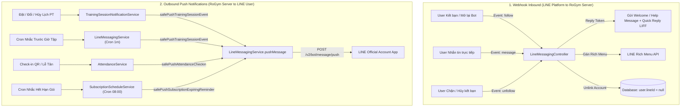

# Đặc Tả Hệ Thống LINE Messaging API (RoGym)

Tài liệu này tổng hợp và đặc tả toàn bộ luồng tích hợp, kiến trúc gửi tin nhắn, danh mục các sự kiện kích hoạt (triggers), cấu trúc dữ liệu đính kèm (payloads) và các hành vi tương tác của hệ thống **LINE Messaging API** trong dự án RoGym Gym Management System.

---

## 1. Tổng Quan Kiến Trúc & Luồng Tương Tác

Hệ thống LINE Messaging trong RoGym được quản trị tập trung tại `server/src/line-messaging/line-messaging.service.ts` và tích hợp với các module nghiệp vụ như **Training (Lịch tập PT)**, **Attendance (Điểm danh)**, **Membership (Gói tập)**, **Notifications (Thông báo)**.



### 1.1. Điều kiện hệ thống gửi tin nhắn LINE
Để hệ thống thực hiện gửi tin nhắn thành công tới người dùng:
1. **Liên kết tài khoản**: Người dùng đã hoàn tất liên kết tài khoản LINE và có `user.lineId != null` trong bảng `User`.
2. **Cấu hình môi trường**: Biến `LINE_MESSAGING_ENABLED=true`, đã thiết lập `LINE_CHANNEL_ACCESS_TOKEN`, `LINE_LIFF_URL` (hoặc đang bật `LINE_MOCK_ENABLED=true`).
3. **Đa ngôn ngữ**: Hệ thống tự động định dạng nội dung theo biến `LINE_MESSAGE_LOCALE` (`vi` hoặc `ja`).

---

## 2. Bảng Ma Trận Sự Kiện & Dữ Liệu Gửi Tin Nhắn

| STT | Tên Sự Kiện | Phương Thức | Trigger (Điều kiện kích hoạt) | Đối Tượng Nhận | Nội Dung & Dữ Liệu Đính Kèm | Nút Thao Tác Nhanh (Action / Quick Reply) |
|---|---|---|---|---|---|---|
| **1** | **Follow Bot (Kết bạn mới / Bỏ chặn)** | `replyMessage` | Webhook nhận event `follow` khi user thêm Bot làm bạn | LINE User vừa follow | • Lời chào mừng gia nhập RoGym.<br>• Tự động kích hoạt gán **LINE Rich Menu** 4 ô chức năng. | `[Mở ứng dụng]` / `[アプリを開く]`<br>→ LIFF URL `/member` |
| **2** | **Tin nhắn tự động (Chat Bot)** | `replyMessage` | Webhook nhận event `message` (user nhắn tin văn bản trực tiếp cho Bot) | LINE User nhắn tin | • Thông báo RoGym là kênh tự động, không nhận chat 1-1, điều hướng vào app hội viên. | `[Mở ứng dụng]` / `[アプリを開く]`<br>→ LIFF URL `/member` |
| **3** | **Hủy kết bạn (Unfollow / Block)** | *Không gửi tin* | Webhook nhận event `unfollow` khi user block Bot | Hệ thống xử lý ngầm | • Cập nhật Database: `user.lineId = null` cho tài khoản liên kết.<br>• Không gửi tin (vì user đã chặn). | *Không có* |
| **4** | **Đặt lịch tập PT mới (`training.created`)** | `pushMessage` | Hội viên hoặc PT đặt thành công buổi tập PT mới | Hội viên có `lineId` | • Tên buổi tập / bài tập (`sessionName`)<br>• Thời gian bắt đầu tập (`when`)<br>• Tên PT phụ trách (`trainerName`)<br>• Phòng tập (`roomName`) | `[Xem chi tiết]` / `[詳細を見る]`<br>→ LIFF URL `/member/workout/sessions?sessionId={id}` |
| **5** | **Cập nhật lịch tập PT (`training.updated`)** | `pushMessage` | Thay đổi giờ tập, đổi phòng tập hoặc đổi PT phụ trách | Hội viên có `lineId` | • Thông báo điều chỉnh lịch tập<br>• Tên bài tập mới<br>• Thời gian tập mới<br>• PT mới<br>• Phòng tập mới | `[Xem chi tiết]` / `[詳細を見る]`<br>→ LIFF URL `/member/workout/sessions?sessionId={id}` |
| **6** | **Hủy lịch tập PT (`training.cancelled`)** | `pushMessage` | Hội viên, PT hoặc Quản lý hủy buổi tập đã lên lịch | Hội viên có `lineId` | • Tên bài tập / buổi tập<br>• Tên PT phụ trách<br>• Thời gian buổi tập bị hủy | `[Xem chi tiết]` / `[詳細を見る]`<br>→ LIFF URL `/member/workout/sessions?sessionId={id}` |
| **7** | **Nhắc lịch tập trước giờ G (`training.reminder`)** | `pushMessage` | Cron job chạy **mỗi 1 phút**, quét các buổi tập trạng thái `scheduled` bắt đầu sau **30 phút** (cấu hình qua `LINE_REMINDER_MINUTES`) | Hội viên có `lineId` | • Thông báo số phút còn lại (30 phút)<br>• Tên bài tập<br>• Thời gian bắt đầu<br>• Tên PT & Phòng tập | `[Xem chi tiết]` / `[詳細を見る]`<br>→ LIFF URL `/member/workout/sessions?sessionId={id}` |
| **8** | **Đến giờ tập (`training.starting`)** | `pushMessage` | Cron job chạy **mỗi 1 phút**, quét các buổi tập `scheduled` bắt đầu ngay phút hiện tại (0 phút) | Hội viên có `lineId` | • Thông báo đã đến giờ bắt đầu buổi tập<br>• Tên bài tập<br>• Tên PT & Phòng tập | `[Xem chi tiết]` / `[詳細を見る]`<br>→ LIFF URL `/member/workout/sessions?sessionId={id}` |
| **9** | **Check-in điểm danh (`attendance.checkin`)** | `pushMessage` | 1. Hội viên quét mã QR tại phòng tập.<br>2. Lễ tân check-in thủ công trên hệ thống. | Hội viên có `lineId` | • Thông báo xác nhận điểm danh check-in thành công tại RoGym | `[Xem chi tiết]` / `[詳細を見る]`<br>→ LIFF URL `/member/attendance` |
| **10** | **Nhắc hết hạn gói tập (`subscription.expiring_soon`)** | `pushMessage` | Cron job chạy lúc **08:00 AM** mỗi ngày, quét các gói tập có ngày kết thúc là ngày mai | Hội viên có `lineId` | • Tên gói tập (Gói hội viên / Gói PT)<br>• Ngày hết hạn chính xác | `[Gia hạn ngay]` / `[今すぐ更新]`<br>→ LIFF URL `/member/subscription/current` |

---

## 3. Chi Tiết Nội Dung Mẫu Tin Nhắn (Templates) Theo Ngôn Ngữ

### 3.1. Nhóm Lịch Tập PT (Personal Training)

#### A. Đặt lịch mới thành công (`training.created`)
* **Tiếng Việt (`vi`)**:
  ```text
  Bạn đã đặt lịch tập thành công.
  Nội dung: Cardio & Core Hiit
  Thời gian: 09:00 25/08/2026
  PT: Nguyễn Văn Huấn
  Phòng: Phòng Cardio 01
  [Quick Reply: Xem chi tiết -> LIFF]
  ```
* **Tiếng Nhật (`ja`)**:
  ```text
  トレーニング予約が完了しました。
  内容: Cardio & Core Hiit
  日時: 2026/08/25 09:00
  PT: Nguyễn Văn Huấn
  ルーム: Phòng Cardio 01
  [Quick Reply: 詳細を見る -> LIFF]
  ```

#### B. Cập nhật lịch tập (`training.updated`)
* **Tiếng Việt (`vi`)**:
  ```text
  Lịch tập của bạn đã được cập nhật.
  Nội dung mới: Cardio & Core Hiit
  Thời gian mới: 10:30 25/08/2026
  PT: Trần Đình Trọng
  Phòng: Phòng Tạ 02
  [Quick Reply: Xem chi tiết -> LIFF]
  ```
* **Tiếng Nhật (`ja`)**:
  ```text
  トレーニング予約が更新されました。
  新しい内容: Cardio & Core Hiit
  新しい日時: 2026/08/25 10:30
  PT: Trần Đình Trọng
  ルーム: Phòng Tạ 02
  [Quick Reply: 詳細を見る -> LIFF]
  ```

#### C. Hủy lịch tập (`training.cancelled`)
* **Tiếng Việt (`vi`)**:
  ```text
  Lịch tập "Cardio & Core Hiit" với PT Nguyễn Văn Huấn vào 09:00 25/08/2026 đã bị hủy.
  [Quick Reply: Xem chi tiết -> LIFF]
  ```
* **Tiếng Nhật (`ja`)**:
  ```text
  PT Nguyễn Văn Huấn との 2026/08/25 09:00 のトレーニング予約（Cardio & Core Hiit）はキャンセルされました。
  [Quick Reply: 詳細を見る -> LIFF]
  ```

#### D. Nhắc nhở trước 30 phút (`training.reminder`)
* **Tiếng Việt (`vi`)**:
  ```text
  Buổi tập của bạn sẽ bắt đầu sau 30 phút.
  Nội dung: Cardio & Core Hiit
  Thời gian: 09:00 25/08/2026
  PT: Nguyễn Văn Huấn
  Phòng: Phòng Cardio 01
  [Quick Reply: Xem chi tiết -> LIFF]
  ```
* **Tiếng Nhật (`ja`)**:
  ```text
  トレーニング開始まであと30分です。
  内容: Cardio & Core Hiit
  日時: 2026/08/25 09:00
  PT: Nguyễn Văn Huấn
  ルーム: Phòng Cardio 01
  [Quick Reply: 詳細を見る -> LIFF]
  ```

#### E. Đến giờ bắt đầu tập (`training.starting`)
* **Tiếng Việt (`vi`)**:
  ```text
  Đến giờ tập của bạn.
  Nội dung: Cardio & Core Hiit
  Thời gian: 09:00 25/08/2026
  PT: Nguyễn Văn Huấn
  Phòng: Phòng Cardio 01
  [Quick Reply: Xem chi tiết -> LIFF]
  ```
* **Tiếng Nhật (`ja`)**:
  ```text
  トレーニングの時間です。
  内容: Cardio & Core Hiit
  日時: 2026/08/25 09:00
  PT: Nguyễn Văn Huấn
  ルーム: Phòng Cardio 01
  [Quick Reply: 詳細を見る -> LIFF]
  ```

---

### 3.2. Nhóm Điểm Danh (Attendance)
* **Tiếng Việt (`vi`)**:
  ```text
  Bạn đã check-in thành công tại RoGym.
  [Quick Reply: Xem chi tiết -> LIFF /member/attendance]
  ```
* **Tiếng Nhật (`ja`)**:
  ```text
  RoGymでのチェックインが完了しました。
  [Quick Reply: 詳細を見る -> LIFF /member/attendance]
  ```

---

### 3.3. Nhóm Gói Tập (Membership Subscription)
* **Tiếng Việt (`vi`)**:
  ```text
  Gói tập Gói VIP 12 Tháng của bạn sẽ hết hạn vào ngày mai (24/08/2026). Vui lòng gia hạn để tiếp tục sử dụng dịch vụ tại RoGym.
  [Quick Reply: Gia hạn ngay -> LIFF /member/subscription/current]
  ```
* **Tiếng Nhật (`ja`)**:
  ```text
  ご利用中のプラン「Gói VIP 12 Tháng」は明日（2026/08/24）に有効期限が切れます。継続してご利用いただくには更新手続きをお願いいたします。
  [Quick Reply: 今すぐ更新 -> LIFF /member/subscription/current]
  ```

---

### 3.4. Nhóm Webhook & Welcome
* **Follow Bot (`vi`)**:
  ```text
  Chào mừng bạn đến với RoGym. Bấm nút bên dưới để mở ứng dụng hội viên.
  [Quick Reply: Mở ứng dụng -> LIFF /member]
  ```
* **Auto Help Reply (`vi`)**:
  ```text
  Xin chào! RoGym không hỗ trợ trả lời tin nhắn trực tiếp. Bấm nút bên dưới để mở ứng dụng hội viên.
  [Quick Reply: Mở ứng dụng -> LIFF /member]
  ```

---

## 4. Các Tính Năng Bổ Trợ Khác

### 4.1. Tự động gán LINE Rich Menu
Khi hội viên kết bạn với Bot hoặc kích hoạt liên kết LINE, hệ thống gọi LINE API gán menu cố định:
- **Tên Menu**: `RoGym Member Menu`
- **Kích thước**: 2500 x 843 px (Chia 4 ô đều nhau, chiều rộng 625px mỗi ô):
  1. **Ô 1 (Lịch tập)**: `[LIFF] /member/workout/sessions`
  2. **Ô 2 (Đặt lịch)**: `[LIFF] /member/workout/sessions?book=1`
  3. **Ô 3 (Check-in)**: `[LIFF] /member/attendance`
  4. **Ô 4 (Hồ sơ)**: `[LIFF] /member/profile`

### 4.2. Thu hồi tin nhắn (`unsend`)
Hệ thống cung cấp phương thức `safeUnsend(messageId)` gọi `POST https://api.line.me/v2/bot/message/unsend` cho phép thu hồi tin nhắn đã gửi nhầm trong vòng 24 giờ.

### 4.3. Chế độ LINE Mock & Dev Sandbox
Khi `LINE_MOCK_ENABLED=true`:
- Hệ thống không gọi ra server LINE bên ngoài. Toàn bộ tin nhắn push, reply, gán menu, unsend được ghi nhận vào `mockOutbox` trong bộ nhớ.
- Cung cấp REST endpoints kiểm thử tại `/api/v1/dev/line-mock`:
  - `GET /api/v1/dev/line-mock/messages`: Đọc danh sách tin đã gửi.
  - `DELETE /api/v1/dev/line-mock/messages`: Xóa hộp thư mock.
  - `POST /api/v1/dev/line-mock/events`: Giả lập sự kiện follow / unfollow.
  - `POST /api/v1/dev/line-mock/samples`: Tạo tin mẫu (Flex message, Rich Menu, Lịch tập).

---

## 5. Danh Mục Cấu Hình Môi Trường (.env)

| Tên biến | Kiểu dữ liệu | Bắt buộc | Mô tả |
|---|---|---|---|
| `LINE_MESSAGING_ENABLED` | `boolean` (`true`/`false`) | Không | Bật/tắt tính năng gửi tin nhắn qua LINE Messaging API thật. |
| `LINE_CHANNEL_ACCESS_TOKEN` | `string` | Có (nếu bật gửi thật) | Channel Access Token (Long-lived) từ LINE Developers Console. |
| `LINE_CHANNEL_SECRET` | `string` | Có (nếu bật gửi thật) | Channel Secret dùng để xác thực chữ ký Webhook HMAC-SHA256. |
| `LINE_LIFF_URL` | `string` | Có (nếu bật gửi thật) | Đường dẫn gốc của LIFF App (VD: `https://liff.line.me/200xxxxxxx-xxxxxxx`). |
| `LINE_RICH_MENU_ID` | `string` | Không | ID của Rich Menu mặc định đã tạo trên LINE Official Account. |
| `LINE_REMINDER_MINUTES` | `number` | Không (Mặc định: `30`) | Số phút nhắc nhở trước khi buổi tập PT bắt đầu. |
| `LINE_MESSAGE_LOCALE` | `string` (`vi` / `ja`) | Không (Mặc định: `vi`) | Ngôn ngữ mặc định cho các mẫu tin nhắn hệ thống. |
| `LINE_MOCK_ENABLED` | `boolean` (`true`/`false`) | Không | Bật chế độ giả lập lưu tin nhắn nội bộ phục vụ môi trường Dev & Test. |

---

## 6. Lộ Trình Nâng Cấp Kế Tiếp (Flex Message Upgrade)

Dựa trên kế hoạch cải tiến hệ thống thông báo, các bước nâng cấp tiếp theo bao gồm:
1. **Module hóa Builder**: Tách logic sinh card thành module riêng `server/src/line-messaging/line-flex-builder.ts`.
2. **Chuẩn hóa Giao diện Card (Bubble Flex Message)**:
   - **Header**: Logo RoGym + Badge phân loại trạng thái có màu nhận diện (Xanh lá - Thành công / Cam - Nhắc nhở / Đỏ - Hủy).
   - **Body**: Bảng Key-Value rõ ràng (Thời gian, Huấn luyện viên, Phòng tập, Chi phí).
   - **Footer**: Nút bấm Primary Style (Màu xanh thương hiệu) deep-link trực tiếp vào màn hình tương ứng trên LIFF.
3. **Mở rộng thêm các sự kiện quan trọng**:
   - `payment.success`: Biên lai xác nhận thanh toán gói tập.
   - `training.completed`: Tổng kết buổi tập và nút đánh giá PT.
   - `feedback.responded`: Thông báo ban quản lý đã phản hồi góp ý.
