# Đặc Tả Hệ Thống LINE Messaging API (RoGym)

Tài liệu này tổng hợp và đặc tả toàn bộ luồng tích hợp, kiến trúc gửi tin nhắn, danh mục 12 sự kiện kích hoạt (triggers), cấu trúc dữ liệu thẻ **LINE Flex Message (Bubble Card RoGym Dark Theme)**, hệ thống Design Tokens màu sắc, cơ chế phòng vệ **Graceful Fallback 2 tầng**, và công cụ **Dev Mock Sandbox** trong dự án RoGym Gym Management System.

---

## 1. Tổng Quan Kiến Trúc & Luồng Tương Tác

Hệ thống LINE Messaging trong RoGym được quản trị tập trung tại `server/src/line-messaging/line-messaging.service.ts` kết hợp với module thuần túy `server/src/line-messaging/line-flex-builder.ts`, tích hợp cùng các nghiệp vụ **Training (Lịch tập PT)**, **Attendance (Điểm danh)**, **Membership (Gói tập)**, **Payments (Thanh toán)**, **Feedback (Góp ý)** và **Notifications (Thông báo)**.

```mermaid
flowchart TD
    subgraph Inbound ["1. Webhook Inbound (LINE Platform -> RoGym Server)"]
        A1["User Kết bạn / Mở lại Bot"] -->|Event: follow| W1["LineMessagingController"]
        A2["User Nhắn tin trực tiếp"] -->|Event: message| W1
        A3["User Chặn / Hủy kết bạn"] -->|Event: unfollow| W1
        W1 -->|Reply Token| R1["LineFlexBuilder.buildWelcomeFlex / buildHelpAutoReplyFlex"]
        R1 -->|Flex Message Reply| L0["LINE Official Account App"]
        W1 -->|Gán Rich Menu| R2["LINE Rich Menu API (4 Vùng)"]
        W1 -->|Unlink Account| DB[("Database: user.lineId = null")]
    end

    subgraph Outbound ["2. Outbound Push Notifications (RoGym Server -> LINE User)"]
        T1["Đặt / Đổi / Hủy Lịch PT"] --> S1["TrainingSessionNotificationService"]
        T2["Cron Nhắc 30p / Đến Giờ Tập"] --> S2["LineMessagingService (Cron 1m)"]
        T3["Hoàn Thành Buổi Tập PT"] --> S1
        T4["Check-in QR / Lễ Tân"] --> S3["AttendanceService"]
        T5["Cron Nhắc Hết Hạn Gói"] --> S4["SubscriptionScheduleService (Cron 08:00)"]
        T6["Thanh Toán Thành Công"] --> S5["PaymentsService"]
        T7["Phản Hồi Góp Ý"] --> S6["FeedbackService"]

        S1 -->|safePushTrainingSessionEvent / Completed| P1["LineMessagingService"]
        S2 -->|safePushTrainingSessionEvent| P1
        S3 -->|safePushAttendanceCheckin| P1
        S4 -->|safePushSubscriptionExpiringReminder| P1
        S5 -->|safePushPaymentSuccess| P1
        S6 -->|safePushFeedbackResponded| P1

        P1 -->|1. Build Card| FB["LineFlexBuilder (Pure Domain Logic)"]
        FB -->|Flex JSON Structure| P2["POST /v2/bot/message/push"]
        FB -.->|Gặp Lỗi / Exception| FBB["Graceful Fallback: Plain Text + Quick Reply"]
        FBB --> P2
        P2 --> L1["LINE Mobile App Hội Viên"]
    end
```



### 1.1. Điều kiện hệ thống gửi tin nhắn LINE
Để hệ thống thực hiện gửi tin nhắn thành công tới người dùng:
1. **Liên kết tài khoản**: Người dùng đã hoàn tất liên kết tài khoản LINE và có `user.lineId != null` trong bảng `User`.
2. **Cấu hình môi trường**: Biến `LINE_MESSAGING_ENABLED=true`, đã thiết lập `LINE_CHANNEL_ACCESS_TOKEN`, `LINE_LIFF_URL` (hoặc đang bật `LINE_MOCK_ENABLED=true`).
3. **Đa ngôn ngữ**: Hệ thống tự động định dạng nội dung theo biến `LINE_MESSAGE_LOCALE` (`vi` hoặc `ja`).

---

## 2. Bảng Ma Trận 12 Sự Kiện & Dữ Liệu Gửi Tin Nhắn

| STT | Tên Sự Kiện | Phương Thức | Trigger (Điều kiện kích hoạt) | Đối Tượng Nhận | Cấu Trúc Flex Bubble & Header Badge | Nút Thao Tác Nhanh (Action Buttons / CTA) |
|---|---|---|---|---|---|---|
| **1** | **Follow Bot (Kết bạn mới / Bỏ chặn)** | `replyMessage` | Webhook nhận event `follow` khi user thêm Bot làm bạn | LINE User vừa follow | **Tone `success`** (`#1a3326` / `#42e09e`)<br>• Tiêu đề: `CHÀO MỪNG HỘI VIÊN` / `RoGymへようこそ`<br>• Hướng dẫn mở ứng dụng và trải nghiệm. | `[Mở ứng dụng]` / `[アプリを開く]`<br>→ LIFF URL `/member` |
| **2** | **Tin nhắn tự động (Auto-help)** | `replyMessage` | Webhook nhận event `message` (user nhắn tin văn bản trực tiếp cho Bot) | LINE User nhắn tin | **Tone `muted`** (`#1a2520` / `#bbcabf`)<br>• Tiêu đề: `HỖ TRỢ TỰ ĐỘNG` / `自動応答サポート`<br>• Hướng dẫn truy cập tính năng tự phục vụ. | `[Mở ứng dụng]` / `[アプリを開く]`<br>→ LIFF URL `/member` |
| **3** | **Hủy kết bạn (Unfollow / Block)** | *Không gửi tin* | Webhook nhận event `unfollow` khi user block Bot | Hệ thống xử lý ngầm | • Cập nhật Database: `user.lineId = null` cho tài khoản liên kết.<br>• Không gửi tin (vì user đã chặn). | *Không có* |
| **4** | **Đặt lịch tập PT mới (`training.created`)** | `pushMessage` | Hội viên hoặc PT đặt thành công buổi tập PT mới | Hội viên có `lineId` | **Tone `success`** (`#1a3326` / `#42e09e`)<br>• Tiêu đề: `ĐẶT LỊCH THÀNH CÔNG` / `予約完了`<br>• Rows: Buổi tập, Thời gian, PT, Phòng tập | `[Xem chi tiết]` / `[詳細を見る]`<br>→ LIFF URL `/member/workout/sessions?sessionId={id}` |
| **5** | **Cập nhật lịch tập PT (`training.updated`)** | `pushMessage` | Thay đổi giờ tập, đổi phòng tập hoặc đổi PT phụ trách | Hội viên có `lineId` | **Tone `info`** (`#0c2838` / `#7dd3fc`)<br>• Tiêu đề: `ĐÃ ĐIỀU CHỈNH LỊCH` / `予約変更`<br>• Rows: Buổi tập, Thời gian mới, PT, Phòng tập | `[Xem chi tiết]` / `[詳細を見る]`<br>→ LIFF URL `/member/workout/sessions?sessionId={id}` |
| **6** | **Hủy lịch tập PT (`training.cancelled`)** | `pushMessage` | Hội viên, PT hoặc Quản lý hủy buổi tập đã lên lịch | Hội viên có `lineId` | **Tone `danger`** (`#2d1212` / `#ff6b6b`)<br>• Tiêu đề: `LỊCH TẬP ĐÃ HỦY` / `予約キャンセル`<br>• Rows: Buổi tập, Thời gian đã hủy, PT | `[Xem chi tiết]` / `[詳細を見る]`<br>→ LIFF URL `/member/workout/sessions` |
| **7** | **Nhắc lịch tập trước 30p (`training.reminder`)** | `pushMessage` | Cron job chạy **mỗi 1 phút**, quét các buổi tập trạng thái `scheduled` bắt đầu sau **30 phút** | Hội viên có `lineId` | **Tone `warning`** (`#2e2107` / `#fcd34d`)<br>• Tiêu đề: `SẮP ĐẾN GIỜ TẬP (30P)` / `まもなく開始 (30分前)`<br>• Rows: Buổi tập, Bắt đầu lúc, PT, Phòng | `[Xem chi tiết]` / `[詳細を見る]`<br>→ LIFF URL `/member/workout/sessions?sessionId={id}` |
| **8** | **Đến giờ tập (`training.starting`)** | `pushMessage` | Cron job chạy **mỗi 1 phút**, quét các buổi tập `scheduled` bắt đầu ngay phút hiện tại (0 phút) | Hội viên có `lineId` | **Tone `success`** (`#1a3326` / `#42e09e`)<br>• Tiêu đề: `ĐẾN GIỜ TẬP` / `セッション開始`<br>• Rows: Buổi tập, Giờ bắt đầu, PT, Phòng | `[Xem chi tiết]` / `[詳細を見る]`<br>→ LIFF URL `/member/workout/sessions?sessionId={id}` |
| **9** | **Hoàn thành buổi tập PT (`training.completed`)** | `pushMessage` | PT hoặc Quản lý đánh dấu buổi tập hoàn thành | Hội viên có `lineId` | **Tone `success`** (`#1a3326` / `#42e09e`)<br>• Tiêu đề: `BUỔI TẬP HOÀN THÀNH` / `セッション完了`<br>• Rows: Buổi tập, Thời gian hoàn thành, PT | **2 Nút Action**:<br>1. `[Đánh giá PT]` (Primary $\rightarrow$ `/member/feedback/send`)<br>2. `[Xem lịch sử]` (Secondary $\rightarrow$ `/member/workout/sessions`) |
| **10** | **Check-in điểm danh (`attendance.checkin`)** | `pushMessage` | 1. Hội viên quét mã QR tại phòng tập.<br>2. Lễ tân check-in thủ công trên hệ thống. | Hội viên có `lineId` | **Tone `success`** (`#1a3326` / `#42e09e`)<br>• Tiêu đề: `CHECK-IN THÀNH CÔNG` / `チェックイン完了`<br>• Rows: Thời gian vào, Chi nhánh | `[Xem chi tiết]` / `[詳細を見る]`<br>→ LIFF URL `/member/attendance` |
| **11** | **Nhắc hết hạn gói tập (`subscription.expiring_soon`)** | `pushMessage` | Cron job chạy lúc **08:00 AM** mỗi ngày, quét các gói tập hết hạn vào ngày mai | Hội viên có `lineId` | **Tone `warning`** (`#2e2107` / `#fcd34d`)<br>• Tiêu đề: `GÓI TẬP SẮP HẾT HẠN` / `有効期限間近`<br>• Rows: Tên gói tập, Ngày hết hạn | **2 Nút Action**:<br>1. `[Gia hạn ngay]` (Primary $\rightarrow$ `/member/subscription/current`)<br>2. `[Xem chi tiết gói]` (Secondary $\rightarrow$ `/member/profile`) |
| **12** | **Thanh toán thành công (`payment.success`)** | `pushMessage` | Thanh toán gói tập thành công qua VNPAY hoặc Tiền mặt | Hội viên có `lineId` | **Tone `success`** (`#1a3326` / `#42e09e`)<br>• Tiêu đề: `THANH TOÁN THÀNH CÔNG` / `お支払い完了`<br>• Rows: Gói dịch vụ, Số tiền, Phương thức, Mã GD | `[Xem chi tiết gói]` / `[プラン詳細を見る]`<br>→ LIFF URL `/member/subscription/current` |
| **13** | **Phản hồi góp ý (`feedback.responded`)** | `pushMessage` | Quản lý / Lễ tân phản hồi góp ý của hội viên | Hội viên có `lineId` | **Tone `info`** (`#0c2838` / `#7dd3fc`)<br>• Tiêu đề: `ĐÃ CÓ PHẢN HỒI GÓP Ý` / `ご意見への返答`<br>• Rows: Tiêu đề góp ý, Người phản hồi, Thời gian | `[Xem phản hồi]` / `[返答を見る]`<br>→ LIFF URL `/member/feedback` |

---

## 3. Hệ Thống Design Tokens & Bảng Mã Màu RoGym Dark Theme

Toàn bộ thẻ Flex Message Bubble Card được quản trị tập trung tại `server/src/line-messaging/line-flex-tokens.ts`:

### 3.1. Màu nền & Viền Thẻ (Theme Tokens)
| Token Key | Giá Trị Màu HEX | Mục Đích Sử Dụng |
|---|---|---|
| `brandPrimary` | `#06c384` | Màu xanh thương hiệu RoGym, nút Primary, nhãn logo ROGYM |
| `brandSecondary` | `#42e09e` | Màu xanh sáng nhấn nhá, viền nút Secondary |
| `cardBg` | `#0f1c16` | Màu nền tối chủ đạo của toàn bộ Bubble Card (Header, Body, Footer) |
| `cardBorder` | `#1a2520` | Màu viền thẻ, đường kẻ phân cách separator giữa các phân đoạn |
| `textPrimary` | `#ffffff` | Màu chữ trắng tương phản cao cho tiêu đề, giá trị quan trọng |
| `textSecondary` | `#8ab89c` | Màu chữ xanh nhạt mềm mại cho các nhãn cột bên trái (Key) |
| `textMuted` | `#4d6b57` | Màu chữ phụ, chú thích nhỏ |

### 3.2. Bảng Ánh Xạ Status Badges Theo 5 Tone Chuẩn
| Tone | Background Badge | Chữ (Text) | Ý Nghĩa Nghiệp Vụ | Sự Kiện Áp Dụng |
|---|---|---|---|---|
| **`success`** | `#1a3326` | `#42e09e` | Thành công, khởi đầu, tích cực | Đặt lịch mới, Đến giờ tập, Hoàn thành buổi tập, Check-in, Thanh toán, Chào mừng |
| **`info`** | `#0c2838` | `#7dd3fc` | Cập nhật, thay đổi, phản hồi | Cập nhật lịch tập, Phản hồi góp ý |
| **`warning`** | `#2e2107` | `#fcd34d` | Cảnh báo thời gian, sắp tới hạn | Nhắc lịch 30p, Gói tập sắp hết hạn |
| **`danger`** | `#2d1212` | `#ff6b6b` | Hủy bỏ, cảnh báo nguy hiểm | Hủy lịch tập PT |
| **`muted`** | `#1a2520` | `#bbcabf` | Trung tính, hỗ trợ tự động | Hướng dẫn tự động (Auto Help Message) |

---

## 4. Cơ Chế Phòng Vệ 2 Tầng (Graceful Fallback)

Để đảm bảo hệ thống không bao giờ bị gián đoạn transaction nghiệp vụ (Zero Blocking) khi gặp sự cố dữ liệu hoặc lỗi mạng:

1. **Tầng 1 — Non-blocking Wrappers (`safePush...`)**:
   - Tất cả các phương thức gọi từ service bên ngoài (`safePushTrainingSessionEvent`, `safePushAttendanceCheckin`, `safePushSubscriptionExpiringReminder`, `safePushPaymentSuccess`, `safePushTrainingSessionCompleted`, `safePushFeedbackResponded`) đều được bọc `try/catch` nội bộ và trả về `Promise<boolean>`.
   - Nếu LINE API bị timeout, gián đoạn mạng hoặc user chưa liên kết LINE, nghiệp vụ chính (Thanh toán, Đặt lịch, Điểm danh) vẫn tiếp tục thành công 100%.
2. **Tầng 2 — Tự Động Fallback Về Plain Text Khi Lỗi Builder**:
   - Bên trong logic gửi tin, nếu quá trình biên dịch JSON Flex Message gặp dữ liệu bất thường hoặc throw exception:
     - Hệ thống ghi log cảnh báo: `[LineMessagingService] Flex builder failed for {event}, falling back to text`.
     - Tự động chuyển đổi sang mẫu tin nhắn dạng văn bản (Plain Text + Quick Reply) truyền thống tương ứng để người dùng vẫn nhận được thông báo quan trọng.

---

## 5. Cấu Trúc JSON Flex Bubble Card Chuẩn (Tham Chiếu)

Mỗi Flex Message bao gồm 3 phần chính:
```json
{
  "type": "flex",
  "altText": "Xác nhận đặt lịch tập PT: Cardio & HIIT Buổi 1 lúc 09:00 25/08/2026",
  "contents": {
    "type": "bubble",
    "size": "mega",
    "styles": {
      "header": { "backgroundColor": "#0f1c16" },
      "body": { "backgroundColor": "#0f1c16" },
      "footer": { "backgroundColor": "#0f1c16" }
    },
    "header": {
      "type": "box",
      "layout": "horizontal",
      "contents": [
        { "type": "text", "text": "ROGYM", "weight": "bold", "color": "#06c384", "size": "sm" },
        {
          "type": "box",
          "layout": "horizontal",
          "backgroundColor": "#1a3326",
          "cornerRadius": "md",
          "paddingAll": "xs",
          "contents": [
            { "type": "text", "text": "ĐẶT LỊCH THÀNH CÔNG", "color": "#42e09e", "size": "xxs", "weight": "bold" }
          ]
        }
      ]
    },
    "body": {
      "type": "box",
      "layout": "vertical",
      "contents": [
        { "type": "text", "text": "Xác nhận đặt lịch tập PT", "weight": "bold", "size": "xl", "color": "#ffffff" },
        { "type": "separator", "color": "#1a2520" },
        {
          "type": "box",
          "layout": "horizontal",
          "contents": [
            { "type": "text", "text": "Nội dung", "color": "#8ab89c", "flex": 3 },
            { "type": "text", "text": "Cardio & HIIT Buổi 1", "color": "#ffffff", "weight": "bold", "flex": 7 }
          ]
        }
      ]
    },
    "footer": {
      "type": "box",
      "layout": "vertical",
      "contents": [
        {
          "type": "button",
          "style": "primary",
          "color": "#06c384",
          "action": {
            "type": "uri",
            "label": "Xem chi tiết",
            "uri": "https://liff.line.me/test-liff?liff.state=?redirect=/member/workout/sessions?sessionId=101"
          }
        }
      ]
    }
  }
}
```

---

## 6. Các Tính Năng Bổ Trợ Khác

### 6.1. Tự động gán LINE Rich Menu
Khi hội viên kết bạn với Bot hoặc kích hoạt liên kết LINE, hệ thống gọi LINE API gán menu cố định:
- **Tên Menu**: `RoGym Member Menu`
- **Kích thước**: 2500 x 843 px (Chia 4 ô đều nhau, chiều rộng 625px mỗi ô):
  1. **Ô 1 (Lịch tập)**: `[LIFF] /member/workout/sessions`
  2. **Ô 2 (Đặt lịch)**: `[LIFF] /member/workout/sessions?book=1`
  3. **Ô 3 (Check-in)**: `[LIFF] /member/attendance`
  4. **Ô 4 (Hồ sơ)**: `[LIFF] /member/profile`

### 6.2. Thu hồi tin nhắn (`unsend`)
Hệ thống cung cấp phương thức `safeUnsend(messageId)` gọi `POST https://api.line.me/v2/bot/message/unsend` cho phép thu hồi tin nhắn đã gửi nhầm trong vòng 24 giờ.

### 6.3. Chế độ LINE Mock & Dev Sandbox
Khi `LINE_MOCK_ENABLED=true`:
- Hệ thống không gọi ra server LINE bên ngoài. Toàn bộ tin nhắn push, reply, gán menu, unsend được ghi nhận vào `mockOutbox` trong bộ nhớ.
- Cung cấp REST endpoints kiểm thử tại `/api/v1/dev/line-mock`:
  - `GET /api/v1/dev/line-mock/messages`: Đọc danh sách tin đã gửi.
  - `DELETE /api/v1/dev/line-mock/messages`: Xóa hộp thư mock.
  - `POST /api/v1/dev/line-mock/events`: Giả lập sự kiện follow / unfollow.
  - `POST /api/v1/dev/line-mock/samples`: Tạo tin mẫu hỗ trợ đầy đủ 14 loại sample song ngữ `vi`/`ja`.

---

## 7. Danh Mục Cấu Hình Môi Trường (.env)

| Tên biến | Kiểu dữ liệu | Bắt buộc | Mặc định | Mô tả |
|---|---|---|---|---|
| `LINE_MESSAGING_ENABLED` | `boolean` | Không | `false` | Bật/tắt tính năng gửi tin nhắn qua LINE Messaging API thật. |
| `LINE_CHANNEL_ACCESS_TOKEN` | `string` | Có (nếu bật gửi thật) | - | Channel Access Token (Long-lived) từ LINE Developers Console. |
| `LINE_CHANNEL_SECRET` | `string` | Có (nếu bật gửi thật) | - | Channel Secret dùng để xác thực chữ ký Webhook HMAC-SHA256. |
| `LINE_LIFF_URL` | `string` | Có (nếu bật gửi thật) | - | Đường dẫn gốc của LIFF App (VD: `https://liff.line.me/200xxxxxxx-xxxxxxx`). |
| `LINE_RICH_MENU_ID` | `string` | Không | - | ID của Rich Menu mặc định đã tạo trên LINE Official Account. |
| `LINE_REMINDER_MINUTES` | `number` | Không | `30` | Số phút nhắc nhở trước khi buổi tập PT bắt đầu. |
| `LINE_MESSAGE_LOCALE` | `string` (`vi` / `ja`) | Không | `vi` | Ngôn ngữ mặc định cho các mẫu tin nhắn hệ thống. |
| `LINE_MOCK_ENABLED` | `boolean` | Không | `false` | Bật chế độ giả lập lưu tin nhắn nội bộ phục vụ môi trường Dev & Test. |
