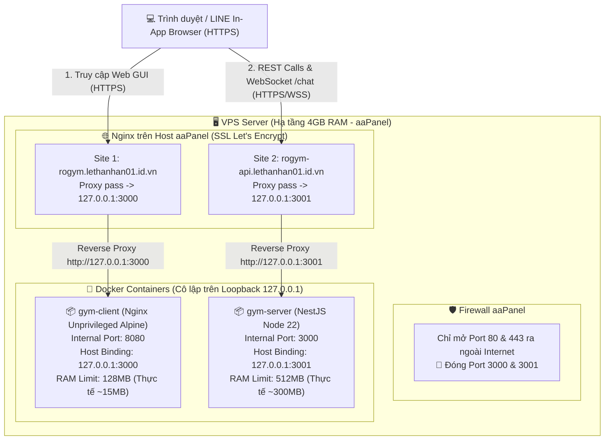

# Kế Hoạch Triển Khai Container Hóa Frontend RoGym (Docker, Compose & CI/CD)

Tài liệu này đặc tả chi tiết kế hoạch kỹ thuật, kiến trúc vận hành và lộ trình triển khai Docker hóa cho ứng dụng **Frontend (React 18 + Vite)** của hệ thống **RoGym (Gym Management System)**, đảm bảo tiêu chuẩn an ninh cao, kích thước siêu nhẹ, và đồng bộ vận hành 1:1 với backend NestJS trên hạ tầng VPS aaPanel.

---

## 📑 Mục Lục
1. [Mục Tiêu & Tiêu Chuẩn Kỹ Thuật](#1-mục-tiêu--tiêu-chuẩn-kỹ-thuật)
2. [Kiến Trúc Triển Khai & Mạng (Architecture & Topology)](#2-kiến-trúc-triển-khai--mạng-architecture--topology)
3. [Đặc Tả Chi Tiết 7 Thành Phần Cốt Lõi](#3-đặc-tả-chi-tiết-7-thành-phần-cốt-lõi)
   - [3.1 client/.dockerignore](#31-clientdockerignore)
   - [3.2 client/nginx.conf](#32-clientnginxconf)
   - [3.3 client/Dockerfile](#33-clientdockerfile)
   - [3.4 client/docker-compose.yml](#34-clientdocker-composeyml)
   - [3.5 client/.env.docker.example](#35-clientenvdockerexample)
   - [3.6 client/deploy.sh](#36-clientdeploysh)
   - [3.7 Tích hợp CI/CD .github/workflows/ci.yml](#37-tích-hợp-cicd-githubworkflowsciyml)
4. [Cấu Hình Host Nginx Trên aaPanel (Reverse Proxy)](#4-cấu-hình-host-nginx-trên-aapanel-reverse-proxy)
5. [Lộ Trình Triển Khai Từng Bước (Implementation Roadmap)](#5-lộ-trình-triển-khai-từng-bước-implementation-roadmap)
6. [Ma Trận Kiểm Thử & Nghiệm Thu (Verification Matrix)](#6-ma-trận-kiểm-thử--nghiệm-thu-verification-matrix)
7. [Kế Hoạch Dự Phòng & Rollback (Disaster Recovery Runbook)](#7-kế-hoạch-dự-phòng--rollback-disaster-recovery-runbook)

---

## 1. Mục Tiêu & Tiêu Chuẩn Kỹ Thuật

### 1.1 Mục Tiêu Chính
*   Chuyển đổi Frontend từ Vercel sang môi trường tự lưu trữ (self-hosted) bằng Docker trên VPS aaPanel.
*   Thiết kế độc lập, đối xứng cấu trúc với backend (`server/`), cho phép triển khai, nâng cấp và rollback độc lập không gây downtime chéo.
*   Tối ưu hóa tài nguyên phần cứng cho VPS 4GB RAM (chạy song song cả Nginx host, NestJS server, PostgreSQL/Supabase proxy, và Frontend).

### 1.2 Tiêu Chuẩn Một Dockerfile Tốt (Được Áp Dụng)
| Trụ cột | Yêu cầu kỹ thuật | Giải pháp áp dụng cho Frontend Vite |
| :--- | :--- | :--- |
| **Layer Caching** | Tối đa hóa tái sử dụng cache khi mã nguồn thay đổi | Tách biệt `COPY package*.json` -> `RUN --mount=type=cache,target=/root/.npm npm ci` trước khi copy `src/`. |
| **Multi-Stage Build** | Không rò rỉ mã nguồn gốc và công cụ build vào runtime | **Stage 1 (builder)**: Node 22 biên dịch `dist/`<br/>**Stage 2 (runner)**: Nginx Alpine phục vụ file tĩnh. |
| **Kích thước Image** | Dưới 50MB, kéo về trong vài giây | Sử dụng `nginxinc/nginx-unprivileged:1.27-alpine-slim` (~25MB - 35MB). |
| **Bảo mật tối đa** | Non-root, chặn leo thang đặc quyền | Chạy hoàn toàn dưới quyền `nginx` (UID 101), lắng nghe cổng không đặc quyền `8080`. |
| **Độ tin cậy & Vận hành** | Không lỗi định tuyến 404, cập nhật tức thì | SPA fallback `try_files`, cache 1 năm cho assets băm tên (`/assets/`), `no-cache` cho `index.html`. |
| **Khả năng quan sát** | Liveness probe phát hiện hỏng hóc | `HEALTHCHECK` định kỳ gọi `/healthz` trả về HTTP 200. |

---

## 2. Kiến Trúc Triển Khai & Mạng (Architecture & Topology)



### Bảng Phân Bổ Cổng & Tài Nguyên

| Dịch vụ | Tên Container | Cổng Container | Cổng Host Loopback | Domain Công Khai | Giới hạn RAM | Giới hạn CPU |
| :--- | :--- | :--- | :--- | :--- | :--- | :--- |
| **Frontend Web** | `gym-client` | `8080` | `127.0.0.1:3000` | `rogym.lethanhan01.id.vn` | `128M` (res: `32M`) | `0.50` (res: `0.10`) |
| **Backend API** | `gym-server` | `3000` | `127.0.0.1:3001` | `rogym-api.lethanhan01.id.vn` | `512M` (res: `256M`) | `0.75` (res: `0.25`) |

---

## 3. Đặc Tả Chi Tiết 7 Thành Phần Cốt Lõi

### 3.1 `client/.dockerignore`
Ngăn chặn toàn bộ các tệp không cần thiết gửi vào Docker build context, giảm context từ >500MB xuống dưới vài MB.

```dockerignore
# Dependency directories
node_modules
.pnp
.pnp.js

# Build and production artifacts
dist
build
coverage

# Environment and sensitive credential files
.env*
!.env.example

# Git and IDE metadata
.git
.gitignore
.gitattributes
.idea
.vscode
*.suo
*.ntvs*
*.njsproj
*.sln
*.sw?

# Testing, reports, and documentation
**/*.test.ts
**/*.test.tsx
**/*.spec.ts
**/*.spec.tsx
__tests__
*.md
!README.md
LICENSE

# Temporary files and logs
npm-debug.log*
yarn-debug.log*
yarn-error.log*
.DS_Store
Thumbs.db
```

---

### 3.2 `client/nginx.conf`
Cấu hình máy chủ web Nginx tối ưu cho React SPA và tương thích với quyền unprivileged (non-root):

```nginx
pid /tmp/nginx.pid;

events {
    worker_connections 1024;
}

http {
    include       /etc/nginx/mime.types;
    default_type  application/octet-stream;

    # Ghi log ra stdout/stderr theo chuẩn 12-Factor App
    log_format main '$remote_addr - $remote_user [$time_local] "$request" '
                    '$status $body_bytes_sent "$http_referer" '
                    '"$http_user_agent" "$http_x_forwarded_for"';

    access_log /dev/stdout main;
    error_log  /dev/stderr warn;

    sendfile        on;
    tcp_nopush      on;
    tcp_nodelay     on;
    keepalive_timeout 65;

    # Bảo mật: Ẩn thông tin phiên bản Nginx
    server_tokens off;

    # Nén Gzip tiết kiệm băng thông
    gzip on;
    gzip_vary on;
    gzip_proxied any;
    gzip_comp_level 6;
    gzip_types
        text/plain
        text/css
        text/xml
        application/json
        application/javascript
        application/rss+xml
        application/atom+xml
        image/svg+xml;

    server {
        listen 8080;
        server_name localhost;

        root /usr/share/nginx/html;
        index index.html;

        # Endpoint kiểm tra sức khỏe container (Healthcheck probe)
        location = /healthz {
            access_log off;
            add_header Content-Type text/plain;
            return 200 "healthy\n";
        }

        # Cấu hình Cache Control tối ưu cho static assets (Vite sinh ra content-hash)
        location /assets/ {
            expires 1y;
            add_header Cache-Control "public, max-age=31536000, immutable";
            access_log off;
        }

        # Favicon, robots, icons tĩnh
        location ~* \.(?:ico|png|jpg|jpeg|gif|svg|webp|woff2?|ttf|eot)$ {
            expires 30d;
            add_header Cache-Control "public, max-age=2592000";
            access_log off;
        }

        # Đảm bảo index.html KHÔNG BAO GIỜ bị cache để người dùng nhận code mới ngay lập tức
        location = /index.html {
            expires -1;
            add_header Cache-Control "no-store, no-cache, must-revalidate, proxy-revalidate, max-age=0";
        }

        # Hỗ trợ Client-side Routing (React Router SPA fallback)
        location / {
            try_files $uri $uri/ /index.html;
            
            # Security Headers (Đảm bảo tương thích hiển thị trong LINE In-App Browser & LIFF)
            add_header X-Content-Type-Options "nosniff" always;
            add_header X-XSS-Protection "1; mode=block" always;
            add_header Referrer-Policy "strict-origin-when-cross-origin" always;
            add_header Content-Security-Policy "frame-ancestors 'self' https://*.line.me https://*.line-apps.com;" always;
        }

        # Ngăn chặn truy cập file ẩn (.git, .env)
        location ~ /\. {
            deny all;
            access_log off;
            log_not_found off;
        }
    }
}
```

---

### 3.3 `client/Dockerfile`
Multi-stage Dockerfile chuẩn xác, sử dụng BuildKit cache mount và user không đặc quyền:

```dockerfile
# ==============================================================================
# CONFIGURATION & GLOBAL ARGS
# ==============================================================================
ARG NODE_VERSION=22-bookworm-slim
ARG NGINX_VERSION=1.27-alpine-slim

# ==============================================================================
# STAGE 1: BUILDER & ASSET COMPILATION (builder)
# ==============================================================================
FROM node:${NODE_VERSION} AS builder

WORKDIR /app

# Khai báo các biến build-time cho Vite (bắt đầu bằng VITE_)
ARG VITE_API_URL=https://rogym-api.lethanhan01.id.vn
ARG VITE_WS_URL=https://rogym-api.lethanhan01.id.vn
ARG VITE_LIFF_ID=2010144670-0RJwlyfv
ARG VITE_LIFF_MOCK=false

# Đưa biến ARG vào môi trường ENV của quá trình build
ENV VITE_API_URL=${VITE_API_URL}
ENV VITE_WS_URL=${VITE_WS_URL}
ENV VITE_LIFF_ID=${VITE_LIFF_ID}
ENV VITE_LIFF_MOCK=${VITE_LIFF_MOCK}
ENV NODE_ENV=production

# Tối ưu Cache Layer: Cài đặt npm dependencies trước
COPY package*.json ./
RUN --mount=type=cache,target=/root/.npm,sharing=locked \
    npm ci --include=dev

# Copy mã nguồn dự án và cấu hình build
COPY tsconfig*.json vite.config.ts postcss.config.js tailwind.config.js index.html ./
COPY public ./public/
COPY src ./src/

# Thực thi kiểm tra type và biên dịch bundle Vite ra thư mục dist/
RUN npm run build

# ==============================================================================
# STAGE 2: PRODUCTION STATIC RUNNER (runner)
# ==============================================================================
FROM nginxinc/nginx-unprivileged:${NGINX_VERSION} AS runner

WORKDIR /usr/share/nginx/html

# Xóa cấu hình mặc định và nội dung mẫu của Nginx
USER root
RUN rm -rf /etc/nginx/conf.d/* /etc/nginx/nginx.conf /usr/share/nginx/html/*

# Copy cấu hình Nginx unprivileged đã tinh chỉnh
COPY nginx.conf /etc/nginx/nginx.conf

# Copy thành phẩm tĩnh từ stage builder
COPY --from=builder /app/dist /usr/share/nginx/html

# Phân quyền chặt chẽ cho user non-root (UID 101: nginx)
RUN chown -R 101:101 /usr/share/nginx/html /etc/nginx /var/cache/nginx /var/log/nginx /tmp && \
    chmod -R 755 /usr/share/nginx/html

# Chuyển hoàn toàn sang user không đặc quyền
USER 101

# Lắng nghe trên cổng unprivileged
EXPOSE 8080

# Thăm dò sức khỏe định kỳ (Healthcheck probe)
HEALTHCHECK --interval=30s --timeout=5s --start-period=10s --retries=3 \
  CMD wget -qO- http://127.0.0.1:8080/healthz || exit 1

# Khởi chạy Nginx ở chế độ foreground
CMD ["nginx", "-g", "daemon off;"]
```

---

### 3.4 `client/docker-compose.yml`
Quản lý container cục bộ trên VPS, ghim tài nguyên và log rotation:

```yaml
services:
  gym-client:
    image: ${CLIENT_IMAGE:-ghcr.io/lethanhan01/gym-management-system/client:latest}
    build:
      context: .
      dockerfile: Dockerfile
      target: runner
      args:
        VITE_API_URL: ${VITE_API_URL:-https://rogym-api.lethanhan01.id.vn}
        VITE_WS_URL: ${VITE_WS_URL:-https://rogym-api.lethanhan01.id.vn}
        VITE_LIFF_ID: ${VITE_LIFF_ID:-2010144670-0RJwlyfv}
        VITE_LIFF_MOCK: ${VITE_LIFF_MOCK:-false}
    container_name: gym-client
    restart: unless-stopped

    # Chỉ bind vào cổng nội bộ loopback 127.0.0.1 trên VPS để Nginx Host làm reverse proxy
    ports:
      - "127.0.0.1:${HOST_PORT:-3000}:8080"

    # Giới hạn tài nguyên bảo vệ VPS 4GB
    deploy:
      resources:
        limits:
          cpus: "0.50"
          memory: 128M
        reservations:
          cpus: "0.10"
          memory: 32M

    # Cơ chế xoay vòng log, tránh đầy ổ đĩa VPS
    logging:
      driver: "json-file"
      options:
        max-size: "10m"
        max-file: "3"

    # Thăm dò sức khỏe container
    healthcheck:
      test: ["CMD-SHELL", "wget -qO- http://127.0.0.1:8080/healthz || exit 1"]
      interval: 30s
      timeout: 5s
      retries: 3
      start_period: 10s
```

---

### 3.5 `client/.env.docker.example`
File mẫu dùng khi cần tùy chỉnh tham số môi trường trên VPS hoặc máy dev:

```bash
# Cổng loopback gán trên VPS Host (Reverse proxy trỏ vào cổng này)
HOST_PORT=3000

# Docker Image từ GitHub Container Registry
CLIENT_IMAGE=ghcr.io/lethanhan01/gym-management-system/client:latest

# Biến Build-time (Chỉ dùng khi build local qua docker compose build)
VITE_API_URL=https://rogym-api.lethanhan01.id.vn
VITE_WS_URL=https://rogym-api.lethanhan01.id.vn
VITE_LIFF_ID=2010144670-0RJwlyfv
VITE_LIFF_MOCK=false
```

---

### 3.6 `client/deploy.sh`
Script tự động hóa quy trình deploy trên VPS, kiểm tra liveness và tự động phục hồi phiên bản trước nếu gặp sự cố:

```bash
#!/usr/bin/env bash
set -euo pipefail

echo "=================================================="
echo "🚀 BẮT ĐẦU QUY TRÌNH DEPLOY GYM-CLIENT TRÊN VPS"
echo "=================================================="

# 1. Kiểm tra hoặc khởi tạo file .env nếu chưa có
if [[ ! -f .env ]]; then
  if [[ -f .env.docker.example ]]; then
    echo "⚠️ Chưa có file .env, tự động tạo từ .env.docker.example..."
    cp .env.docker.example .env
  else
    echo "ℹ️ Không có file .env, sử dụng các biến cấu hình mặc định."
  fi
fi

DEPLOY_MODE="${DEPLOY_MODE:-pull}"
TARGET_IMAGE="${CLIENT_IMAGE:-ghcr.io/lethanhan01/gym-management-system/client:latest}"

echo "⚙️ Chế độ deploy: $DEPLOY_MODE"
echo "🎯 Target image: $TARGET_IMAGE"

# Lưu lại Image ID hiện tại để phục vụ rollback nếu cần
PREV_IMAGE_ID=$(docker inspect --format='{{.Image}}' gym-client 2>/dev/null || true)
if [[ -n "$PREV_IMAGE_ID" ]]; then
  echo "📸 Đã ghi nhận image hiện tại để rollback nếu cần: $PREV_IMAGE_ID"
fi

# Hàm thực hiện Rollback khi phát hiện sự cố
rollback() {
  echo ""
  echo "🚨 PHÁT HIỆN SỰ CỐ TRONG QUÁ TRÌNH DEPLOY CLIENT!"
  if [[ -n "$PREV_IMAGE_ID" ]]; then
    echo "⏪ Đang tiến hành tự động Rollback về image trước đó: $PREV_IMAGE_ID..."
    docker tag "$PREV_IMAGE_ID" "$TARGET_IMAGE" || true
    docker compose up -d --force-recreate gym-client
    echo "⚠️ Đã khôi phục container gym-client về phiên bản trước!"
  else
    echo "⚠️ Không tìm thấy phiên bản container trước đó để rollback."
  fi
  exit 1
}

# 2. Kéo (Pull) hoặc Build container
if [[ "$DEPLOY_MODE" == "pull" ]]; then
  echo "📥 Đang kéo image mới nhất từ GitHub Container Registry..."
  if ! docker compose pull gym-client; then
    echo "❌ Kéo image thất bại!"
    rollback
  fi
elif [[ "$DEPLOY_MODE" == "build" ]]; then
  echo "🔨 Đang tiến hành build image cục bộ..."
  if ! docker compose build gym-client; then
    echo "❌ Build image thất bại!"
    rollback
  fi
fi

# 3. Tái khởi động container với image mới
echo "🔄 Đang tái khởi động container gym-client..."
if ! docker compose up -d --force-recreate gym-client; then
  echo "❌ Khởi động container thất bại!"
  rollback
fi

# 4. Kiểm tra sức khỏe (Health Verification Probe)
echo "⏳ Đang xác minh tính ổn định của container qua endpoint /healthz..."
MAX_ATTEMPTS=15
ATTEMPT=1
SUCCESS=false

# Lấy cổng host đang cấu hình
HOST_PORT=$(grep -E '^HOST_PORT=' .env 2>/dev/null | cut -d'=' -f2 || echo "3000")
HOST_PORT="${HOST_PORT:-3000}"

while [[ $ATTEMPT -le $MAX_ATTEMPTS ]]; do
  # Kiểm tra phản hồi HTTP từ cổng loopback 127.0.0.1
  STATUS_CODE=$(curl -s -o /dev/null -w "%{http_code}" "http://127.0.0.1:${HOST_PORT}/healthz" || true)

  if [[ "$STATUS_CODE" == "200" ]]; then
    echo "✅ Container gym-client đã phản hồi HTTP 200 (Lần thử $ATTEMPT/$MAX_ATTEMPTS)"
    SUCCESS=true
    break
  fi

  echo "⏳ Chờ container khởi động... (Lần thử $ATTEMPT/$MAX_ATTEMPTS, mã trả về: $STATUS_CODE)"
  sleep 2
  ATTEMPT=$((ATTEMPT + 1))
done

if [[ "$SUCCESS" == "false" ]]; then
  echo "❌ Container không vượt qua bài kiểm tra sức khỏe sau 30 giây!"
  echo "📜 50 dòng log gần nhất của container:"
  docker compose logs --tail=50 gym-client
  rollback
fi

# 5. Dọn dẹp các Docker image dangling cũ để tiết kiệm ổ cứng VPS
echo "🧹 Đang dọn dẹp các Docker image không sử dụng..."
docker image prune -f || true

echo "=================================================="
echo "🎉 DEPLOY FRONTEND GYM-CLIENT THÀNH CÔNG!"
echo "=================================================="
```

---

### 3.7 Tích hợp CI/CD `.github/workflows/ci.yml`
Bổ sung 2 job mới vào pipeline GitHub Actions hiện tại (chạy song song và độc lập với job của backend):

```yaml
  client-docker:
    name: Client (Docker build & push)
    runs-on: ubuntu-latest
    needs: [client]
    permissions:
      contents: read
      packages: write

    steps:
      - name: Checkout source
        uses: actions/checkout@11bd71901bbe5b1630ceea73d27597364c9af683 # v4.2.2

      - name: Set up Docker Buildx
        uses: docker/setup-buildx-action@8d2750c68a42422c14e847fe6c8ac0403b4cbd6f # v3.12.0

      - name: Log in to GitHub Container Registry
        uses: docker/login-action@c94ce9fb468520275223c153574b00df6fe4bcc9 # v3.7.0
        with:
          registry: ghcr.io
          username: ${{ github.actor }}
          password: ${{ secrets.GITHUB_TOKEN }}

      - name: Extract Docker metadata
        id: meta
        uses: docker/metadata-action@c299e40c65443455700f0fdfc63efafe5b349051 # v5.10.0
        with:
          images: ghcr.io/${{ github.repository }}/client
          tags: |
            type=ref,event=branch
            type=sha,format=short
            type=semver,pattern={{version}}
            type=raw,value=latest,enable={{is_default_branch}}

      - name: Build and push Docker image
        uses: docker/build-push-action@ca052bb54ab0790a636c9b5f226502c73d547a25 # v5.4.0
        with:
          context: client
          file: client/Dockerfile
          push: ${{ github.event_name != 'pull_request' && (github.ref == 'refs/heads/main' || startsWith(github.ref, 'refs/tags/v')) }}
          tags: ${{ steps.meta.outputs.tags }}
          labels: ${{ steps.meta.outputs.labels }}
          build-args: |
            VITE_API_URL=${{ vars.VITE_API_URL || 'https://rogym-api.lethanhan01.id.vn' }}
            VITE_WS_URL=${{ vars.VITE_WS_URL || 'https://rogym-api.lethanhan01.id.vn' }}
            VITE_LIFF_ID=${{ vars.VITE_LIFF_ID || '2010144670-0RJwlyfv' }}
            VITE_LIFF_MOCK=false
          cache-from: type=gha
          cache-to: type=gha,mode=max

  deploy-client:
    name: Client (Deploy to VPS via Self-hosted Runner)
    runs-on: [self-hosted]
    needs: [client-docker]
    if: >-
      github.event_name != 'pull_request' &&
      (github.ref == 'refs/heads/main' || startsWith(github.ref, 'refs/tags/v') || github.event_name == 'workflow_dispatch')
    permissions:
      contents: read
      packages: read

    steps:
      - name: Checkout source
        uses: actions/checkout@11bd71901bbe5b1630ceea73d27597364c9af683 # v4.2.2

      - name: Log in to GitHub Container Registry
        uses: docker/login-action@c94ce9fb468520275223c153574b00df6fe4bcc9 # v3.7.0
        with:
          registry: ghcr.io
          username: ${{ github.actor }}
          password: ${{ secrets.GITHUB_TOKEN }}

      - name: Deploy to VPS
        shell: bash
        env:
          CONFIGURED_CLIENT_DEPLOY_PATH: ${{ vars.VPS_CLIENT_DEPLOY_PATH }}
          CONFIGURED_DEPLOY_PATH: ${{ vars.VPS_DEPLOY_PATH }}
          CLIENT_IMAGE: ghcr.io/${{ github.repository }}/client
        run: |
          set -euo pipefail

          # 1. Xác định thư mục deploy cho client trên VPS
          DEPLOY_DIR="${CONFIGURED_CLIENT_DEPLOY_PATH:-}"
          if [[ -z "$DEPLOY_DIR" ]]; then
            if [[ -n "$CONFIGURED_DEPLOY_PATH" ]]; then
              PARENT_DIR=$(dirname "$CONFIGURED_DEPLOY_PATH")
              DEPLOY_DIR="${PARENT_DIR}/client"
            elif [[ -f "$HOME/gym-management-system/client/docker-compose.yml" ]]; then
              DEPLOY_DIR="$HOME/gym-management-system/client"
            else
              DEPLOY_DIR="/opt/gym-management-system/client"
            fi
          fi

          echo "📂 Thư mục deploy mục tiêu trên VPS: $DEPLOY_DIR"
          mkdir -p "$DEPLOY_DIR"
          cd "$DEPLOY_DIR"

          # 2. Đồng bộ các file cấu hình mới nhất
          cp "$GITHUB_WORKSPACE/client/docker-compose.yml" ./docker-compose.yml
          cp "$GITHUB_WORKSPACE/client/deploy.sh" ./deploy.sh
          cp "$GITHUB_WORKSPACE/client/.env.docker.example" ./.env.docker.example
          chmod +x ./deploy.sh

          # 3. Kích hoạt quy trình deploy an toàn
          export CLIENT_IMAGE="${CLIENT_IMAGE}:latest"
          export DEPLOY_MODE=pull

          bash ./deploy.sh
```

---

## 4. Cấu Hình Host Nginx Trên aaPanel (Reverse Proxy)

Trên giao diện web **aaPanel** -> **Website** -> Thêm site mới với domain `rogym.lethanhan01.id.vn`:
1. **SSL**: Chọn Let's Encrypt và bật *Force HTTPS*.
2. **Reverse Proxy (URL Rewrite/Proxy Pass)**:
   * **Proxy Name**: `gym-client-proxy`
   * **Target URL**: `http://127.0.0.1:3000`
   * **Sent Host**: `$host`

Đoạn cấu hình block Nginx được aaPanel tự động tạo (hoặc tùy chỉnh bằng tay):

```nginx
# Cấu hình Reverse Proxy từ rogym.lethanhan01.id.vn sang container gym-client
location ^~ / {
    proxy_pass http://127.0.0.1:3000;
    proxy_set_header Host $host;
    proxy_set_header X-Real-IP $remote_addr;
    proxy_set_header X-Forwarded-For $proxy_add_x_forwarded_for;
    proxy_set_header X-Forwarded-Proto $scheme;
    proxy_set_header X-Forwarded-Host $host;
    proxy_set_header X-Forwarded-Port $server_port;

    # Hỗ trợ truyền mượt mà các stream
    proxy_http_version 1.1;
    proxy_connect_timeout 60s;
    proxy_read_timeout 60s;
    proxy_send_timeout 60s;
}
```

---

## 5. Lộ Trình Triển Khai Từng Bước (Implementation Roadmap)

```mermaid
gantt
    title Lộ trình triển khai Docker hóa Frontend
    dateFormat  X
    axisFormat %d

    section Giai đoạn 1: Chuẩn bị file
    Tạo .dockerignore & nginx.conf         :active, 0, 1
    Tạo Dockerfile đa tầng (Multi-stage)    :active, 1, 2

    section Giai đoạn 2: Compose & Script
    Tạo docker-compose.yml & .env.example   :2, 3
    Viết deploy.sh với auto-rollback        :3, 4

    section Giai đoạn 3: CI/CD & Test
    Build thử nghiệm Docker local           :4, 5
    Cập nhật .github/workflows/ci.yml       :5, 6

    section Giai đoạn 4: Vận hành VPS
    Tạo thư mục & phân bổ cổng trên VPS    :6, 7
    Cấu hình aaPanel Nginx Reverse Proxy    :7, 8
    Kiểm tra nghiệm thu toàn diện           :8, 9
```



### Bước 1: Khởi tạo các tệp cấu hình tại thư mục `client/`
1. Tạo `client/.dockerignore`
2. Tạo `client/nginx.conf`
3. Tạo `client/Dockerfile`
4. Tạo `client/docker-compose.yml`
5. Tạo `client/.env.docker.example`
6. Tạo `client/deploy.sh` (và cấp quyền `chmod +x`)

### Bước 2: Kiểm thử Build & Runtime tại Local
1. Chạy lệnh build kiểm thử:
   ```bash
   cd client
   docker build -t rogym-client:test .
   ```
2. Kiểm tra kích thước image thành phẩm (kỳ vọng: **< 40MB**):
   ```bash
   docker images rogym-client:test
   ```
3. Chạy container thử nghiệm:
   ```bash
   docker run --rm -p 3000:8080 rogym-client:test
   ```
4. Kiểm tra sức khỏe: `curl http://127.0.0.1:3000/healthz` -> Trả về `healthy`.
5. Truy cập `http://localhost:3000` trên trình duyệt: Thử F5 tại đường dẫn con (ví dụ `/login`, `/members`) để đảm bảo không dính lỗi 404 Nginx.

### Bước 3: Cập nhật Pipeline CI/CD GitHub Actions
1. Mở file [.github/workflows/ci.yml](file:///c:/Users/An/Documents/IT4549-ITSS/gym-management-system/.github/workflows/ci.yml).
2. Thêm hai job `client-docker` và `deploy-client` như đã đặc tả ở mục 3.7.
3. Cấu hình biến GitHub Repo:
   * `VITE_API_URL` (nếu khác giá trị mặc định)
   * `VPS_CLIENT_DEPLOY_PATH` (ví dụ: `/home/ubuntu/gym-management-system/client`)

### Bước 4: Thiết lập trên VPS aaPanel
1. Khởi tạo thư mục trên VPS:
   ```bash
   mkdir -p /home/ubuntu/gym-management-system/client
   ```
2. Thêm site `rogym.lethanhan01.id.vn` trên aaPanel, cấp SSL Let's Encrypt và cấu hình Reverse Proxy trỏ về `127.0.0.1:3000`.

---

## 6. Ma Trận Kiểm Thử & Nghiệm Thu (Verification Matrix)

| STT | Hạng mục kiểm tra | Phương pháp kiểm tra | Tiêu chuẩn đạt |
| :---: | :--- | :--- | :--- |
| 1 | **Image Size** | `docker images | grep gym-client` | Dung lượng **< 40MB** |
| 2 | **User Permission** | `docker exec gym-client whoami` | Trả về `nginx` (UID 101), **không phải root** |
| 3 | **Port Exposure** | `netstat -tlpn | grep 3000` trên VPS | Chỉ lắng nghe trên `127.0.0.1:3000`, không mở `0.0.0.0:3000` |
| 4 | **Healthcheck** | `docker inspect --format='{{.State.Health.Status}}' gym-client` | Trả về `healthy` |
| 5 | **SPA Routing** | Truy cập `https://rogym.lethanhan01.id.vn/login` rồi bấm F5 | Tải lại trang đăng nhập bình thường, **không bị 404** |
| 6 | **Static Asset Caching** | Mở DevTools Network Tab -> Kiểm tra file `.js`/`.css` | Header có `Cache-Control: public, max-age=31536000, immutable` |
| 7 | **Index.html Caching** | Mở DevTools Network Tab -> Kiểm tra `index.html` | Header có `Cache-Control: no-store, no-cache...` |
| 8 | **RAM Footprint** | `docker stats gym-client --no-stream` | Bộ nhớ tiêu thụ thực tế **< 20MB** |
| 9 | **Auto Rollback** | Thử deploy 1 tag lỗi | Script tự rollback về `PREV_IMAGE_ID` và khôi phục dịch vụ |

---

## 7. Kế Hoạch Dự Phòng & Rollback (Disaster Recovery Runbook)

### 7.1 Kịch Bản 1: Deploy Bị Lỗi Nhưng Không Rollback Tự Động Được
Nếu script bị ngắt giữa chừng, thực hiện thủ công trên VPS:

```bash
cd /home/ubuntu/gym-management-system/client

# Xem danh sách các image trước đó
docker images ghcr.io/lethanhan01/gym-management-system/client

# Gán tag latest cho image ID cũ hoạt động tốt (ví dụ image ID: abc1234)
docker tag abc1234 ghcr.io/lethanhan01/gym-management-system/client:latest

# Tái khởi động lại container ngay lập tức
docker compose up -d --force-recreate gym-client
```

### 7.2 Kịch Bản 2: Kiểm Tra Log Khi Container Không Khởi Động Được
```bash
# Xem 100 dòng log gần nhất
docker compose logs --tail=100 gym-client

# Kiểm tra cấu hình Nginx bên trong container có lỗi cú pháp không
docker run --rm ghcr.io/lethanhan01/gym-management-system/client:latest nginx -t
```

---

> [!NOTE]
> Tài liệu này được lưu trữ tại `docs/operations/FRONTEND-DOCKER-DEPLOYMENT-PLAN.md` và đóng vai trò làm quy chuẩn kỹ thuật (Single Source of Truth) cho việc triển khai và bảo trì Frontend của hệ thống RoGym.
