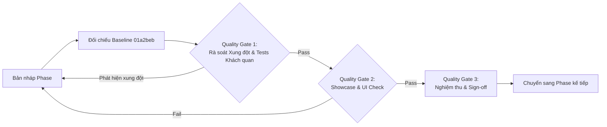

# RoGym Design System - Lộ trình Nâng cấp & Chuẩn hóa Toàn diện

> **Trạng thái Baseline Commit**: `01a2bebb6da0d7f15b0295557a731e2417023f37`  
> **CẢNH BÁO QUAN TRỌNG**: Các Phase 1 đến 5 hiện tại **CHỈ LÀ BẢN NHÁP (DRAFT / PROTOTYPE)**. Mã nguồn còn tiềm ẩn rất nhiều lỗ hổng, sai lệch và lỗi gây xung đột với UI hiện tại. Một số Unit Test hiện tại đang bị viết theo hướng hợp lý hóa mã nháp nên chưa phản ánh được lỗi hồi quy. **BẮT BUỘC** phải rà soát, kiểm thử đối chiếu toàn diện với UI gốc tại commit `01a2bebb6da0d7f15b0295557a731e2417023f37` trước khi nghiệm thu từng Phase.

---

## 1. Nguyên tắc Cốt lõi (Guiding Principles)

1. **Non-Breaking Evolution (Tuyệt đối không gây xung đột / hồi quy UI cũ)**:
   - Tất cả các nâng cấp component phải đảm bảo không làm thay đổi hay gãy layout, kiểu dáng, sự kiện tương tác và hành vi vốn có tại commit baseline `01a2bebb6da0d7f15b0295557a731e2417023f37`.
   - Tránh việc viết test chỉ để "làm xanh" mã nháp (test rationalization). Test phải kiểm chứng được tính tương thích thực tế với giao diện và luồng nghiệp vụ gốc.

2. **Single Source of Truth (Nguồn chân lý duy nhất)**:
   - Các biến CSS Custom Properties tại `client/src/styles/tokens.css` quản lý toàn bộ hệ thống màu sắc, khoảng cách, bo góc và hiệu ứng.
   - Thư mục `client/src/components/ui/` là nơi định nghĩa duy nhất cho toàn bộ primitive & composite components.

3. **Domain Dynamic Theming (`--rogym-tone`)**:
   - Hệ thống hỗ trợ chuyển đổi màu chủ đạo linh hoạt theo role/domain qua class hoặc thuộc tính style:
     - **Green (`--rogym-green`)**: Mặc định cho Member, Thể thao, Năng động.
     - **Teal (`--rogym-teal`)**: Dành cho Trainer, Chuyên môn, Coaching.
     - **Amber / Orange (`--rogym-warning`)**: Dành cho Owner, Báo cáo, Quản trị.
     - **Indigo / Purple / Slate**: Dành cho Staff, Lễ tân, Vận hành.

4. **Accessibility (A11y) & Usability chuẩn WAI-ARIA**:
   - Mọi overlay (Modal, Dropdown, Tooltip, Sheet, Popover) phải hỗ trợ phím `ESC`, click outside, Focus Trap và Screen Reader attributes đầy đủ mà không chặn sự kiện của các thành phần con/ngoài ngoài ý muốn.

---

## 2. Quy trình Kiểm soát Chất lượng & Chống Hồi quy (Anti-Regression Protocol)

Đối với **mỗi Phase**, quy trình bắt buộc phải tuân thủ 4 bước nghiêm ngặt:

### Bước 1: Baseline Comparison & Conflict Detection
- So sánh chi tiết diff với baseline `01a2bebb6da0d7f15b0295557a731e2417023f37`.
- Rà soát các thay đổi trong `Modal`, `FormField`, các facade `TrainerUI`, `OwnerUI`, `StaffUI`, `MemberUI` để đảm bảo không làm mất style hay props cũ.
- Loại bỏ các test "hợp lý hóa lỗi" (rationalized tests), bổ sung test case mô phỏng đúng hành vi nguyên bản của UI cũ.

### Bước 2: Automated Quality Gate (Kiểm thử Tự động)
- Chạy toàn bộ test suite client: `npm run test` (Phải Pass 100%, kiểm thử khách quan).
- Kiểm tra Linter: `npm run lint` (Không có lỗi cú pháp / import).
- Kiểm tra Type & Build: `npm run build` (TypeScript biên dịch thành công, bundle không lỗi).

### Bước 3: Visual & Interactive Quality Gate (Kiểm thử Trực quan)
- Truy cập trang Interactive Showcase: `http://localhost:5173/dev/ui-showcase`.
- Kiểm tra trạng thái component: Hover, Active, Focus, Disabled, Loading, Error.
- Kiểm tra Responsive: Desktop (1440px), Tablet (768px), Mobile (375px).
- Kiểm tra chuyển đổi theme `--rogym-tone`.

### Bước 4: Verification Report & User Sign-off (Báo cáo & Phê duyệt)
- Cập nhật Walkthrough / Báo cáo kết quả chi tiết của Phase.
- **DỪNG LẠI** và nhận xác nhận nghiệm thu chính thức từ người dùng trước khi triển khai Phase tiếp theo.

---

## 3. Danh mục Phân chia Kế hoạch theo Từng Phase

| Phase | File Kế hoạch | Phạm vi Xử lý | Trạng thái Thực tế |
| :--- | :--- | :--- | :--- |
| **Phase 1** | [`01-phase-primitives-overlays.md`](file:///c:/Users/An/Documents/IT4549-ITSS/gym-management-system/docs/superpowers/plans/01-phase-primitives-overlays.md) | Primitives & Overlays: `Modal`/`Dialog`, `DropdownMenu`, `Tooltip`, `Popover`, `Sheet` | **Đã rà soát & khắc phục chống hồi quy** (Đã nghiệm thu) |
| **Phase 2** | [`02-phase-forms.md`](file:///c:/Users/An/Documents/IT4549-ITSS/gym-management-system/docs/superpowers/plans/02-phase-forms.md) | Form Controls & Advanced Inputs: `FormField`, `Combobox`, `RadioGroup`, `Chip`/`TagInput`, `TimeSlotPicker`, `FileUpload`, `SubmitButton` | **Đã rà soát & khắc phục chống hồi quy** (Đã nghiệm thu) |
| **Phase 3** | [`03-phase-data-navigation.md`](file:///c:/Users/An/Documents/IT4549-ITSS/gym-management-system/docs/superpowers/plans/03-phase-data-navigation.md) | Data Display, Navigation & Feedback: `EmptyState`, `Separator`, `SegmentedControl`, `Breadcrumb`, `BackButton`, `FilterBar`, `Toast` | **Đã rà soát & khắc phục chống hồi quy** (Đã nghiệm thu) |
| **Phase 4** | [`04-phase-facade-cleanup.md`](file:///c:/Users/An/Documents/IT4549-ITSS/gym-management-system/docs/superpowers/plans/04-phase-facade-cleanup.md) | Kiến trúc & Barrel Export: Chuẩn hóa `ui/index.ts`, Refactor `TrainerUI`, `OwnerUI`, `StaffUI`, `MemberUI` thành facade re-exports | **Đã rà soát & nghiệm thu** |
| **Phase 5** | [`05-phase-showcase-docs.md`](file:///c:/Users/An/Documents/IT4549-ITSS/gym-management-system/docs/superpowers/plans/05-phase-showcase-docs.md) | Showcase, Tài liệu & Tests: `/dev/ui-showcase`, `DESIGN_SYSTEM.md`, Bộ Unit Test hoàn chỉnh | **Đã rà soát & nghiệm thu** |
| **Phase 6** | [`06-phase-domain-integration.md`](file:///c:/Users/An/Documents/IT4549-ITSS/gym-management-system/docs/superpowers/plans/06-phase-domain-integration.md) | Tích hợp Domain Pages: 6.1 Owner, 6.2 Trainer, 6.3 Staff, 6.4 Member | **Sẵn sàng triển khai** |

---

## 4. Bảng Theo dõi Tiến độ Tổng thể

- [x] **Phase 1**: Nền tảng Primitives & Nâng cấp Overlays *(Đã nghiệm thu)*
- [x] **Phase 2**: Chuẩn hóa Form Controls & Bổ sung Advanced Inputs *(Đã nghiệm thu)*
- [x] **Phase 3**: Bổ sung Data Display, Navigation & Feedback *(Đã nghiệm thu)*
- [x] **Phase 4**: Hợp nhất Kiến trúc & Tương thích ngược Facades *(Đã nghiệm thu)*
- [x] **Phase 5**: Trang Interactive UI Showcase, Tài liệu & Unit Tests *(Đã nghiệm thu)*
- [ ] **Phase 6**: Tích hợp & Nâng cấp các Trang Nghiệp vụ (Domain Pages) *(Sẵn sàng triển khai)*

