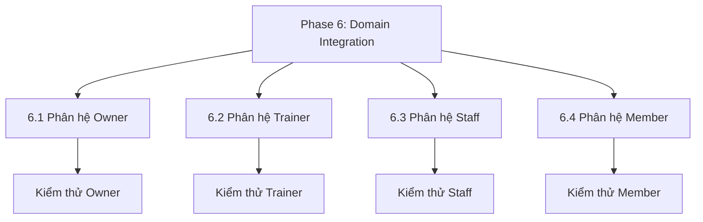

# Phase 6: Tích hợp & Nâng cấp các Trang Nghiệp vụ (Domain Pages)

> **Phase**: 6 / 6  
> **Trọng tâm**: Từng bước tích hợp các component mới của RoGym Design System vào các trang thực tế theo từng phân hệ (Owner, Trainer, Staff, Member). Nâng cao trải nghiệm người dùng, thay thế code lặp lại nhưng tuyệt đối bảo toàn 100% bố cục và luồng nghiệp vụ hiện tại.  
> **Commit Baseline**: `01a2bebb6da0d7f15b0295557a731e2417023f37`  
> **Trạng thái**: **CHƯA BẮT ĐẦU (Tạm hoãn)** - Chỉ được triển khai sau khi đã rà soát, đối chiếu và khắc phục toàn bộ xung đột hồi quy của Phase 1-5 với commit Baseline `01a2beb`.

---

## 1. Nguyên tắc Thực hiện Tích hợp Domain

1. **Zero Visual Regression**: Không làm lệch layout, không làm đổi font chữ hoặc màu sắc vốn có của trang.
2. **Modular Rollout theo Role**: Chia nhỏ thành 4 giai đoạn độc lập theo từng nhóm người dùng (Owner -> Trainer -> Staff -> Member).
3. **Phần tử Ưu tiên Tích hợp**:
   - Thay thế các menu 3 chấm thủ công bằng `DropdownMenu`.
   - Thay thế các đoạn JSX trạng thái rỗng bằng `EmptyState`.
   - Thay thế các thẻ select đơn điệu bằng `Combobox` (ở các trường chọn học viên, thiết bị, gói tập).
   - Chuẩn hóa lưới chọn ca bằng `TimeSlotPicker`.
   - Thay thế các nút quay lại rời rạc bằng `Breadcrumb` & `BackButton`.

---

## 2. Lộ trình Triển khai Chi tiết theo Từng Phân hệ



### 2.1. Tiểu mục 6.1: Phân hệ Owner (`client/src/pages/owner/*`)
- [ ] **Trang Dashboard & Báo cáo Doanh thu**:
  - Tích hợp `StatCard` và `SegmentedControl` (chọn mốc Ngày / Tuần / Tháng / Năm).
  - Tích hợp `EmptyState` khi chưa có dữ liệu giao dịch trong kỳ.
- [ ] **Trang Quản lý Gói tập & Thiết bị**:
  - Thay thế cột Thao tác (Actions) trong bảng bằng `DropdownMenu` (Sửa, Đổi trạng thái, Xóa).
  - Áp dụng `Combobox` và `RadioGroup` trong modal tạo mới/chỉnh sửa gói tập.
- [ ] **Kiểm thử Tiểu mục 6.1**:
  - Chạy `npm run test` và kiểm tra trực tiếp giao diện Owner.

---

### 2.2. Tiểu mục 6.2: Phân hệ Trainer (`client/src/pages/trainer/*`)
- [ ] **Trang Quản lý Lịch dạy & Ca tập (`TrainerSchedulePage`)**:
  - Tích hợp `TimeSlotPicker` chuẩn hóa cho việc cấu hình lịch rảnh/bận của Trainer.
  - Sử dụng `StatusBadge` đồng bộ trạng thái buổi tập (Đã đặt, Đang diễn ra, Đã hoàn thành, Đã hủy).
- [ ] **Trang Quản lý Học viên & Buổi tập (`TrainerClientsPage`, `TrainerSessionsPage`)**:
  - Tích hợp `Combobox` tìm kiếm học viên theo tên/SĐT.
  - Sử dụng `Chip` / `TagInput` cho nhóm cơ trọng tâm trong buổi tập.
- [ ] **Kiểm thử Tiểu mục 6.2**:
  - Chạy `npm run test` và kiểm tra trực tiếp giao diện Trainer.

---

### 2.3. Tiểu mục 6.3: Phân hệ Staff (`client/src/pages/staff/*`)
- [ ] **Trang Check-in & Quản lý Hội viên (`StaffCheckInPage`, `StaffMembersPage`)**:
  - Sử dụng `Combobox` tìm kiếm nhanh hội viên bằng mã code / SĐT.
  - Tích hợp `DropdownMenu` trong danh sách check-in.
  - Tích hợp `EmptyState` trong bảng check-in khi chưa có lượt vào trong ngày.
- [ ] **Trang Quản lý Ca trực (`StaffShiftsPage`)**:
  - Sử dụng `FilterBar` để lọc theo ngày và trạng thái ca.
- [ ] **Kiểm thử Tiểu mục 6.3**:
  - Chạy `npm run test` và kiểm tra trực tiếp giao diện Staff.

---

### 2.4. Tiểu mục 6.4: Phân hệ Member (`client/src/pages/member/*`)
- [ ] **Trang Đặt lịch PT (`BookPtSessionModal`, `WorkoutSchedulePage`)**:
  - Tích hợp `TimeSlotPicker` chọn ca tập với PT mượt mà, trực quan.
  - Sử dụng `RadioGroup` dạng Card để chọn gói tập / phương thức xác nhận.
- [ ] **Trang Tạo Buổi tập Cá nhân (`CreateWorkoutSessionPage`, `CreateWorkoutDaySessionPage`)**:
  - Tích hợp `Combobox` chọn bài tập và `Chip` gắn nhãn nhóm cơ.
  - Sử dụng `BackButton` và `Breadcrumb` điều hướng luồng bài tập.
- [ ] **Trang Thông tin Cá nhân & Đổi Avatar (`ProfilePage`)**:
  - Tích hợp `FileUpload` / Avatar upload xem trước thumbnail và báo lỗi dung lượng.
- [ ] **Kiểm thử Tiểu mục 6.4**:
  - Chạy toàn bộ test suite của Member (`MemberProfilePage.test.tsx`, `WorkoutSchedulePage.test.tsx`, `BookPtSessionModal.test.tsx`).

---

## 3. Phase Quality Gate & Tiêu chí Nghiệm thu

### Quality Gate 1: Automated Tests & Build
```bash
# 1. Chạy toàn bộ test suite client
npm run test

# 2. Kiểm tra Lint và TypeScript build
npm run lint
npm run build
```
- [ ] 100% tests pass (Toàn bộ trang của cả 4 role pass).
- [ ] TypeScript build thành công hoàn toàn không có type mismatch.

### Quality Gate 2: End-to-End Visual & Interaction Verification
- [ ] Mở và kiểm tra trực tiếp cả 4 luồng người dùng trên trình duyệt:
  - **Owner**: Tạo gói tập, lọc doanh thu, xem bảng thiết bị.
  - **Trainer**: Xem lịch dạy, mở modal chi tiết buổi tập, gắn thẻ nhóm cơ.
  - **Staff**: Tìm kiếm hội viên check-in, xem bảng lịch sử.
  - **Member**: Xem lịch tập cá nhân, đặt lịch PT qua TimeSlotPicker, cập nhật profile.
- [ ] Xác nhận giao diện hiển thị mượt mà, không vỡ layout, hoạt động trơn tru trên cả Desktop và Mobile/LIFF (375px).

### Quality Gate 3: Final Sign-off & Bàn giao Toàn diện
- [ ] Cập nhật tài liệu `DESIGN_SYSTEM.md` lần cuối.
- [ ] Tạo Walkthrough tổng kết hoàn thành toàn bộ 6 Phase của RoGym Design System.
- [ ] Bàn giao và xin nghiệm thu cuối cùng từ người dùng.
